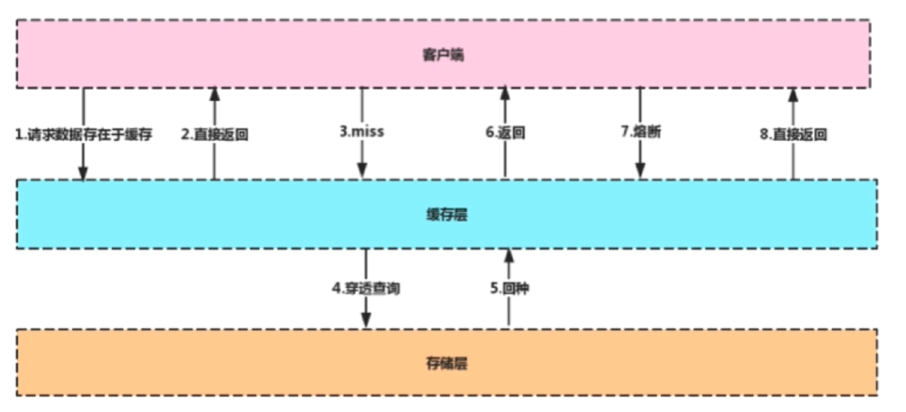
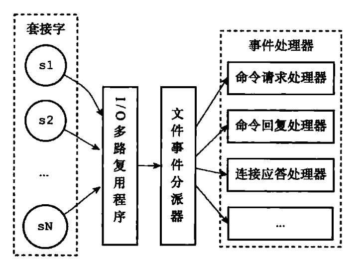
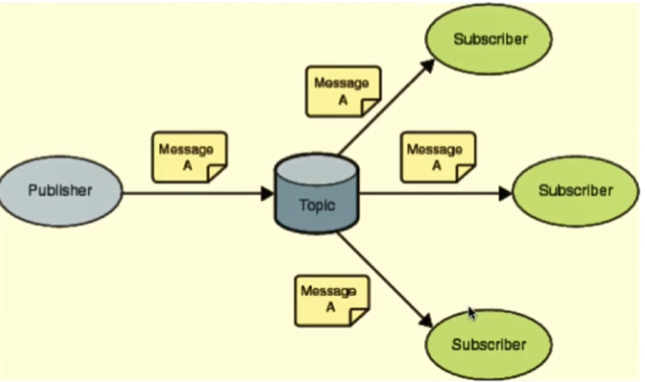

## Redis基础

Redis(Remote Dictionary Server) 是一个使用 C 语言编写的，开源的高性能非关系型（NoSQL）的键值对数据库。

与传统数据库不同的是 redis 的数据是存在**内存**中的，所以读写速度非常快，因此 redis 被广泛应用于**缓存**方向。另外，redis 也经常用来做**分布式锁**。redis 提供了多种数据类型来支持不同的业务场景。除此之外，redis 支持**事务 、持久化、分片、多种集群方案、LUA脚本、LRU驱动事件。**



说明：这里的熔断是指存储层挂掉的时候，让客户端请求直接打在缓存上，不管有没有获取到数据都直接返回，这样能在有损的情况下对外提供服务。


分布式缓存使用的比较多的主要是 [Memcached](https://baike.baidu.com/item/memcached/1625373?fr=aladdin) 和 Redis。

Memcached 是分布式缓存最开始兴起的那会，比较常用的。后来，随着 Redis 的发展，大家慢慢都转而使用更加强大的 Redis 了。

分布式缓存主要解决的是单机缓存的容量受服务器限制并且无法保存通用的信息。因为，本地缓存只在当前服务里有效，比如如果你部署了两个相同的服务，他们两者之间的缓存数据是无法共同的。


### Redis和Memcached的区别


共同点 

- 都是基于内存的数据库，一般都用来当做缓存使用。
- 都有过期策略。
- 两者的性能都非常高。

**区别**

- **Redis 支持更丰富的数据类型**（支持更复杂的应用场景）。Redis 不仅仅支持简单的 k/v 类型的数据，同时还提供 list，set，zset，hash 等数据结构的存储。Memcached 只支持最简单的 k/v 数据类型。
- **Redis 支持数据的持久化**，可以将内存中的数据保持在磁盘中，重启的时候可以再次加载进行使用，而 Memecache 把数据全部存在内存之中。
- Redis 有灾难恢复机制。 因为可以把缓存中的数据持久化到磁盘上。
- **Redis支持主从同步**，Memcached 不支持。
- **Redis支持集群与分片。**Memcached 没有原生的集群模式，需要依靠客户端来实现往集群中分片写入数据；但是 Redis 目前是原生支持 cluster 模式的。
- Memcached 是多线程，非阻塞 IO 复用的网络模型；**Redis 使用单线程的多路 IO 复用模型。** （Redis 6.0 引入了多线程 IO ）
- Redis 在服务器内存使用完之后，可以将不用的数据放到磁盘上。但是，Memcached 在服务器内存使用完之后，就会直接报异常。
- Redis 支持**发布订阅模型**、Lua 脚本、事务等功能，而 Memcached 不支持。并且，Redis 支持更多的编程语言。
- Memcached过期数据的删除策略只用了惰性删除，而 Redis 同时使用了惰性删除与定期删除。

相信看了上面的对比之后，我们已经没有什么理由可以选择使用 Memcached 来作为自己项目的分布式缓存了。


### Redis为什么这么快

> 10万+QPS

内存、数据结构、单线程(和nginx很像)、epoll、VM

**1、完全基于内存**，绝大部分请求是纯粹的内存操作，非常快速。数据存在内存中，类似于 HashMap，HashMap 的优势就是查找和操作的时间复杂度都是O(1)；

**2、数据结构简单**，对数据操作也简单，没有关系型数据库中数据的关联，Redis中的数据结构是专门进行设计的。

**3、采用单线程**，避免了不必要的上下文切换和竞争条件，减少了CPU的消耗。并且不用去考虑各种锁的问题，不存在加锁释放锁操作，没有因为可能出现死锁而导致的性能消耗。

**4、使用多路 I/O 复用模型，非阻塞 IO；**

5、使用底层模型不同，它们之间底层实现方式以及与客户端之间通信的应用协议不一样，Redis 直接自己构建了 VM 机制 ，因为一般的系统调用系统函数的话，会浪费一定的时间去移动和请求；


### Redis单线程模型

> https://www.javazhiyin.com/22943.html
>
> TODO I/O多路复用学习之后，再重新看和总结慕课redis第一节

**Redis 基于 Reactor 模式来设计开发了自己的一套高效的事件处理模型 （Netty 的线程模型也基于 Reactor 模式**，Reactor 模式不愧是高性能 IO 的基石），这套事件处理模型对应的是 Redis 中的**文件事件处理器（file event handler）**。一直在强调的单线程，**只是文件事件处理器处理网络请求的时候只有一个线程来处理**，Redis进行持久化的时候会以子进程或者子线程的方式执行。

**既然是单线程，那怎么监听大量的客户端连接呢？**

**Redis 基于 Reactor 模式开发了自己的网络事件处理器**：这个处理器被称为**文件事件处理器**（file event handler）。

- 文件事件处理器使用 **I/O 多路复用（multiplexing）**程序来同时监听多个套接字， 并根据套接字目前执行的任务来为套接字关联不同的事件处理器。
- 当被监听的套接字准备好执行**连接应答（accept）、读取（read）、写入（write）、关闭（close）**等操作时， 与操作相对应的**文件事件**就会产生， 这时文件事件处理器就会调用套接字之前关联好的事件处理器来处理这些事件。
- **虽然文件事件处理器以单线程方式运行， 但通过使用 I/O 多路复用程序来监听多个套接字**， 文件事件处理器既实现了高性能的网络通信模型， 又让 Redis 不需要额外创建多余的线程来监听客户端的大量连接，降低了资源的消耗（和 NIO 中的 Selector 组件很像），保持了 Redis 内部单线程设计的简单性。



可以看出，文件事件处理器（file event handler）主要是包含 4 个部分：

- 多个 socket（客户端连接）
- IO 多路复用程序（支持多个客户端连接的关键）
- 文件事件分派器（将 socket 关联到相应的事件处理器）
- 事件处理器（连接应答处理器、命令请求处理器、命令回复处理器）


### 多路 I/O 复用模型 Todo

**这里“多路”指的是多个网络连接，“复用”指的是复用同一个线程。**

多路I/O复用模型是利用 select、poll、epoll 可以**同时监察多个流的 I/O 事件的能力**，在**空闲**的时候，会把当前线程**阻塞**掉，当有一个或多个流有 I/O 事件时，就从**阻塞态中唤醒**，于是程序就会**轮询**一遍所有的流（**epoll 是只轮询那些真正发出了事件的流**），并且只**依次顺序的处理就绪的流**，这种做法就避免了大量的无用操作。

采用多路 I/O 复用技术可以让单个线程高效的处理多个连接请求（尽量减少网络 IO 的时间消耗），且 Redis 在内存中操作数据的速度非常快，也就是说内存内的操作不会成为影响Redis性能的瓶颈，主要由以上几点造就了 Redis 具有很高的吞吐量。


### Redis为什么要采用单线程模型

- 实际上瓶颈在于网络，实际测试发现QPS峰值的时候CPU也没有跑满，CPU不是性能瓶颈。

- 想利用多核也可以在一个机器上启动多个Redis实例。

**Redis的瓶颈最有可能是机器内存的大小或者网络带宽。单线程--够用且简单。单线程容易实现，而且CPU不会成为瓶颈，那就顺理成章地采用单线程的方案了**

**1）不需要各种锁的性能消耗**

list，hash等复杂的结构，这些结构有可能会进行很细粒度的操作，比如在很长的列表后面添加一个元素，在hash当中添加或者删除一个对象。这些操作可能就需要加非常多的锁，导致的结果是同步开销大大增加。

总之，在单线程的情况下，就不用去考虑各种锁的问题，不存在加锁释放锁操作，没有因为可能出现死锁而导致的性能消耗。

**2）CPU消耗**

**采用单线程，避免了不必要的上下文切换和竞争条件，也不存在多进程或者多线程导致的切换而消耗 CPU**。

**3）集群方案**

更应该考虑的是集群方案


#### 单线程处理不过来怎么办？/单核浪费吗

首先要明确的是redis虽然是单线程，但不是固定绑定在某个核上的。如果top -H发现cpu的利用率不高，可以配置conf文件来启动多实例。

**在同一个多核的服务器中，可以启动多个实例，组成master-master或者master-slave的形式，耗时的读命令可以完全在slave进行。**

也可以当做多个实例，只要客户端能分清哪些key放在哪个Redis进程上就可以了。


### 拓展：几种常见线程模型

**1、单进程多线程模型：MySQL、Memcached**、Oracle（Windows版本）；

2、多进程模型：Oracle（Linux版本）；

3、Nginx有两类进程，**一类称为Master进程(相当于管理进程)，另一类称为Worker进程（实际工作进程）。**启动方式有两种：

（1）单进程启动：此时系统中仅有一个进程，该进程既充当Master进程的角色，也充当Worker进程的角色。

（2）多进程启动：此时系统有且仅有一个Master进程，至少有一个Worker进程工作。

（3）Master进程主要进行一些全局性的初始化工作和管理Worker的工作；事件处理是在Worker中进行的。   平滑重启


## Redis数据结构

> Java客户端一般使用Jedis，Go一般使用go-redis。但实际工作中也要会redis的命令，可能会直接查询。

Redis的单个操作是原子性的（单线程模型），不用考虑线程安全问题。像这种incr的加操作，不用使用者同步或者加锁。

Redis都是按string类型存入数据的。

除了常用的五种，还有用于计数的HyperLogLog，支持存储地理位置信息的Geo。**Todo，抽个把小时了解。**

### 1. String

> 常用命令: set,get,decr,incr,mget 等。

String数据结构是简单的key-value类型，value其实不仅可以是String，也可以是数字。 常规key-value缓存应用； 常规计数：微博数，粉丝数，库存数等。

最常用：

```sh
127.0.0.1:6379> set name "redis" #设置 key-value 类型的值
OK
127.0.0.1:6379> get name # 根据 key 获得对应的 value
"redis"
127.0.0.1:6379> exists key  # 判断某个 key 是否存在
(integer) 1
127.0.0.1:6379> strlen key # 返回 key 所储存的字符串值的长度。
(integer) 5
127.0.0.1:6379> del key # 删除某个 key 对应的值
(integer) 1
127.0.0.1:6379> get key
(nil)
```

批量设置 :

```sh
127.0.0.1:6379> mset key1 value1 key2 value2 # 批量设置 key-value 类型的值
OK
127.0.0.1:6379> mget key1 key2 # 批量获取多个 key 对应的 value
1) "value1"
2) "value2"
```

计数器：

字符串的内容为整数的时候可以使用

```sh
127.0.0.1:6379> set number 1
OK
127.0.0.1:6379> incr number # 将 key 中储存的数字值增一
(integer) 2
127.0.0.1:6379> get number
"2"
127.0.0.1:6379> decr number # 将 key 中储存的数字值减一
(integer) 1
127.0.0.1:6379> get number
"1"
```

过期：

```sh
127.0.0.1:6379> expire key  60 # 数据在 60s 后过期
(integer) 1
127.0.0.1:6379> setex key 60 value # 数据在 60s 后过期 (setex:[set] + [ex]pire)
OK
127.0.0.1:6379> ttl key # 查看数据还有多久过期
(integer) 56
```


### 2. Hash

> 常用命令： hset,hmset,hget,hdel,del;   hexists,hgetall,hkeys,hvals
>
> 应用场景: 系统中对象数据的存储。Json格式

hash 是一个 string 类型的 field 和 value 的映射表，**hash 特别适合用于存储对象，每个对象有field，有getter和setter。**

```sh
127.0.0.1:6379> hmset lilei name "lilei" description "dev" age 24
OK
127.0.0.1:6379> hget lilei age # 获取存储在哈希表中指定字段的值。
"24"
127.0.0.1:6379> hset lieli age 23 # 修改某个字段对应的值
127.0.0.1:6379> hexists lieli name # 查看 key 对应的 value中指定的字段是否存在。
(integer) 1

hdel lilei age  //只删除field name
del lilei //删除这个对象的所有hashtable 都没了
```

批量：

```sh
127.0.0.1:6379> hgetall lilei # 获取在哈希表中指定 key 的所有字段和值
1) "name"
2) "lilei"
3) "description"
4) "dev"
5) "age"
6) "23"
127.0.0.1:6379> hkeys userInfoKey # 获取 key 列表
1) "name"
2) "age"
3) "description "
127.0.0.1:6379> hvals userInfoKey # 获取 value 列表
1) "guide"
2) "dev"
3) "24"
```


### 3. List

> 常用命令: lpush,rpush,lpop,rpop,lrange等

list 就是链表，Redis list 的应用场景非常多，也是Redis最重要的数据结构之一，比如微博的关注列表，粉丝列表，消息列表等功能都可以用Redis的 list 结构来实现。

Redis list 的实现为一个双向链表，即可以支持反向查找和遍历，更方便操作，不过带来了部分额外的内存开销。**添加删除操作就叫push和pop，显然可以实现Stack的功能，后入先出，因此可以实现最新消息排行榜等。**

另外可以通过 lrange 命令，就是从某个元素开始读取多少个元素，可以基于 list 实现分页查询，这个很棒的一个功能，基于 redis 实现简单的高性能分页，可以做类似微博那种下拉不断分页的东西（一页一页的往下走），性能高。

```sh
lpush list_key 1 2 3  #顺序是3，2，1  依次放到左边
lrange list_key 0 10   #从左往右，从0开始，取出10个。 顺序是3 2 1 
lrange key 0 -1    #全部显示 
lpop key              删除链表的最左边元素并返回
rpop key              删除链表的最右边元素并返回
del key               删除链表
llen myList
```


### 4. Set

> 常用命令： sadd, smembers, spop,srem,sunion 等

通过哈希实现，添加查找删除都是O(1)，不允许重复。**无序存储**

当你需要存储一个列表数据，又不希望出现重复数据时，set是一个很好的选择，并且set提供了判断某个成员是否在一个set集合内的重要接口，这个也是list所不能提供的。可以基于 set 轻易实现**交集、并集、差集的操作。**

比如：在微博应用中，可以将一个用户所有的关注人存在一个集合中，将其所有粉丝存在一个集合。Redis可以非常方便的实现如**共同关注、共同粉丝、共同喜好**等功能。这个过程也就是求交集的过程，具体命令如下：

```sh
127.0.0.1:6379> sadd mySet value1 value2 # 添加元素进去，返回结果代表成功个数
(integer) 2   
127.0.0.1:6379> sadd mySet value1 # 不允许有重复元素
(integer) 0
127.0.0.1:6379> smembers mySet # 查看 set 中所有的元素
1) "value1"
2) "value2"
srem key value  删除(remove)key集合中的某个value
```

```sh
127.0.0.1:6379> scard mySet # 查看 set 的长度
(integer) 2
127.0.0.1:6379> sismember mySet value1 # 检查某个元素是否存在set 中，只能接收单个元素
(integer) 1
127.0.0.1:6379> sadd mySet2 value2 value3
(integer) 2
# 获取 mySet 和 mySet2 的交集并存放在 mySet3 中
127.0.0.1:6379> sinterstore mySet3 mySet mySet2 
(integer) 1
127.0.0.1:6379> smembers mySet3
1) "value2"
```


### 5. Sorted Set

> 常用命令： zadd,zrange,zrem,zcard等

和set相比，sorted set增加了一个权重参数score，使得集合中的元素能够**按score进行有序排列。**成员是唯一的，分数是可以重复的

举例： 在直播系统中，实时排行信息包含直播间在线用户列表，各种礼物排行榜，弹幕消息（可以理解为按消息维度的消息排行榜）等信息，适合使用 Redis 中的 Sorted Set 结构进行存储。

还可以作为带权重的队列，比如普通消息的score为2，重要消息的score为1，工作线程可以按照score的大小获取任务，让重要的任务优先执行。

```sh
存储：zadd key score value   
> zadd myzset 1 mkx
> zadd myzset 2 ccs

zrangebyscore myzset 0 10 #按照顺序获取  从0开始 获取10个 分数越小排名越靠前 
1) "mkx"
2) "ccs"

zrange myzset 0 10  #不按照顺序获取

zrem key value   #删除某个value
```


## Redis应用

### 如何从海量数据中查询某一前缀的key

**面试中遇到数据问题，要摸清数据规模，即问清楚边界。**比如面试官可能问如何从redis中找出某类固定前缀的key。

**1. 数据量很小，或者非线上业务，可以使用keys指令**

`KEYS pattern` 查找所有符合给定模式的pattern的key。

```sh
>dbsize #redis中key的数量
(integer) 20000000
>keys k1* #返回所有以k1开头的key
```

keys的缺点，一次性返回所有匹配的key，数据量大的时候，会使服务卡顿，对内存的消耗和redis的服务器都是隐患。

**2. 推荐方法** **Scan命令**

`Scan cursor [MATCH PATTERN] [COUNT count]`

- cursor是游标，需要基于上一次调用scan命令返回的cursor延续之前的迭代过程

- 以0作为游标开始一次新的迭代，直到命令返回游标0完成一次遍历

- 并不保证每次执行都会返回给定count数量的元素，且不能保证重复。可以放入Set排除重复

- 由于是分批次获取的，scan指令整体时间会比keys时间长，但不会影响服务。

```shell
>scan 0 match k1* count 10
1) "1153456"  #返回的游标cursor，需要再次传入游标
2) 1) "k1793229"
   2) "k1223278"
   3) "k1969079"
>>scan k1153456 match k1* count 10
1) "3354820"  #游标不一定是递增的，有可能返回重复的数据
2) 1) "k1436657"
   2) "k1776585"
  3) "k1082438"
  4) "k1345342"
```


### Redis做分布式锁

对于秒杀，抢单这样的逻辑，是涉及到并发竞争资源的，需要做好线程的同步。

> synchronized或者reentrantLock只能锁住同一台服务器的不同线程，在实际工作中，往往要使用**多台机器-集群部署代码**，在这种场景下**怎么实现线程安全呢？**
>
> 这边服务加锁，那边的服务也得阻塞——分布式锁。当两个服务没办法协调的时候，就需要引入第三方。

可能的方法：

文件系统（同一个目录下，相同的文件名只能有一个）——可行但效率很低

#### setnx key value

Redis方式一：

```java
boolean b = setnx key value;
if(b){
//执行业务
}
delete key;
```

这种方式有大问题，如果在删除锁之前程序挂掉，会造成死锁-即redis中的锁永远无法释放，别的服务器的实例中的线程永远也没办法获得锁。


Redis方式二：

```java
boolean b = setnx key value expire key 10s;
if(b){
    //执行业务
}
delete key;
```

让key自动过期，这一条命令是**原子操作**的，因此只要能设置成key，就能设置成功自动过期时间。

> 原子性操作也可以用lua脚本实现，从 2.6版本 起, Redis 开始支持 Lua 脚本 让开发者自己扩展 Redis。Redis 允许将 Lua 脚本传到 Redis 服务器中执行, 脚本内可以调用大部分 Redis 命令, 且 Redis 保证脚本的**原子性。但redis现在支持这种原子命令，没必要使用脚本，可以做了解。**[**https://www.cnblogs.com/barrywxx/p/8563284.html**](https://www.cnblogs.com/barrywxx/p/8563284.html)

对应redis命令：

```sh
set key value [ex seconds] [px milliseconds] [nx|xx] 
#ex 过期时间单位是秒 ps 过期时间单位是毫秒
#nx 键不存在才操作 xx键存在才操作
#命令成功返回OK，不成功返回nil
```


**方式二中仍存在一些问题**

问题1：10s的时间够不够？如果时间过短，还没执行完业务逻辑就已经释放了锁。又引起了新的问题！也就是说**在程序执行期间，锁不能过期。**

**解决办法：看门狗watch dog**，我计划用1min，还剩30s的时候你看到我还没出来，就给我续期1min，这样循环，直到我出来。

可以用开源的Redission实现，相当于Jedis，Java连接Redis的开源工具。tryAcquireAsync()方法中的scheduleExpirationRenewal(threadId)这个方法。[博客1](https://blog.csdn.net/asd051377305/article/details/108384490)

>  <font color=red>**其实还是存在问题：虽然小概率。**</font>看门狗是Java程序，依赖于JVM实现，GC的时候stop the world，看门狗也停下来了，如果GC stop the world的时间过长，看门狗没有续期，这个线程的程序执行期间，锁过期了！这种问题只要用JVM+Reids就没办法解决

问题2：如果时间过长，其他程序在10s之后获取到了key，等这个线程执行完业务逻辑的时候，出来delete key，把这个key又删掉了。

解决办法：Redis可不止存了key啊，还有对应的value没有利用到。应该加一个判断，**getKey里面的value是自己设置的value，才可以删除。**


**问题3：Redis实例挂掉怎么办？**

**为了防止Redis的单点故障，给Redis做集群，一主二从三哨兵。**

**但集群有一个潜在问题**：**Redis主从同步是异步的，**如果没有同步成功的时候，Reids的master挂掉，线程1还没有释放锁，这时候线程2去slave尝试获取锁，锁数据没同步过来，**线程2也获取到了锁！**


怎么解决这个问题？

问题是由于主从同步复制是异步的，那么就不复制。不用集群，**直接用多台独立的Redis！**

#### RedLock

**为了解决Redis的单点故障，用RedLock** 单数个数的Redis实例，**所有线程都顺序加锁，**当Setnx成功的数量大于一半的时候，就加锁成功。获取锁失败的（没有超过一半），把刚才加的锁全部删掉。

注意：**当RedLock中多个实例中的一个出故障之后，要延迟启动**，不要着急立刻恢复。比如有5台机器，线程1获取到1-3的锁，获取到锁。这时候挂掉第3台，如果立即恢复起来，线程1还没有执行结束，但第3台的数据没了，没有线程1的锁。线程2获取锁时，获取到了3，4，5的锁，也获取到了锁，又出现了多个线程同时获取到锁的问题。因此至少要等获取到锁的线程任务执行完毕再恢复Redis服务器。


### 使用Redis做异步队列

方法1：使用List作为队列，RPUSH生产消息，LPOP消费消息。

缺点：LPOP没有等待队列中有值就进行了消费。 有可能消费不到

弥补措施：通过在应用层引入Sleep机制，调用LPOP重试。

方法2：

#### BLPOP key [key..] timeout 

**没有消息时，阻塞，直到队列有消息或者超时**

```sh
#客户端1——消费者
#等待testQueue 30s，在此期间如果有值会返回，没有值超时以后返回
blpop testQueue 30 

#客户端2在客户端1等待期内生产一条消息
rpush testQueue aaa

#客户端1立即返回消息
1) "testQueue"
2) "aaa"
(10.09s)
```

缺点：只能供一个消费者消费，一个消费者消费之后消息就没了，其他消费者不能消费。更推荐的方式：pub/sub 主题订阅模式


#### pub/sub 主题订阅模式



- 发送者(pub)发送消息，订阅者(sub)接收消息
- 订阅者可以订阅任意数量的频道topic

```sh
#客户端1订阅频道  频道不需要预先创建，直接订阅即可
subscribe myTopic

#客户端2订阅频道  
subscribe myTopic

#客户端3订阅另一个频道
subscribe anotherTopic

#客户端4在myTopic频道发布消息
publish myTopic "hello"

#订阅myTopic的客户端1和客户端2都收到了如下消息，没有订阅的客户端3没有收到
1) "message"
2) "myTopic"
3) "hello"

#客户端4在anotherTopic频道发布消息
publish anotherTopic "i love you"

#定于anotherTopic的客户端3收到如下消息，没有订阅的客户端1和2没有收到
1) "message"
2) "anotherTopic"
3) "i love you"
```

缺点：消息的发布是无状态的，无法保证消息一定能接收到。对于发布者来说，消息即发即失。如果某个消费者在消息发布时候下线，重新上线之后是收不到消息的。更推荐用专业的消息队列。


## redis 持久化机制

怎么保证 redis 挂掉之后再重启数据可以进行恢复

很多时候我们需要持久化数据也就是将内存中的数据写入到硬盘里面，大部分原因是为了之后重用数据（比如重启机器、机器故障之后恢复数据），或者是为了防止系统故障而将数据备份到一个远程位置。

Redis不同于Memcached的很重一点就是，Redis支持持久化，而且支持两种不同的持久化操作。**Redis的一种持久化方式叫快照（snapshotting，RDB(Redis DataBase)），另一种方式是只追加文件（append-only file,AOF）**。

**对比**

- AOF文件比RDB更新频率高，优先使用AOF还原数据
- AOF比RDB更安全也更大
- RDB性能比AOF好,RDB 恢复数据集的速度也要比AOF恢复的速度要快
- 如果两个都配了优先加载AOF

### RDB 快照（snapshotting）持久化

**多长时间以后，至少有多少个key发生变化，自动触发BGSAVE持久化。**

RDB是Redis默认的持久化方式。**按照一定的时间将内存的数据以快照的形式保存到硬盘中**，对应产生的数据文件为dump.rdb。通过配置文件中的save参数来定义快照的周期。

Redis创建快照之后，可以对快照进行备份，可以将快照复制到其他服务器从而**创建具有相同数据的服务器副本**（Redis主从结构，主要用来提高Redis性能），还可以将快照留在原地以便重启服务器的时候使用。

在redis.conf配置文件中默认有如下配置：

```shell
#在900秒(15分钟)之后，如果至少有1个key发生变化，Redis就会自动触发BGSAVE命令创建快照。
save 900 1      

#在300秒(5分钟)之后，如果至少有10个key发生变化，Redis就会自动触发BGSAVE命令创建快照。
save 300 10     

#在60秒(1分钟)之后，如果至少有10000个key发生变化，Redis就会自动触发BGSAVE命令创建快照。
save 60 10000   
#如果想禁用RBD配置，只需要在这里加上  save ""


#当备份进程出错的时候，主进程停止接受新的写入操作——保护持久化的一致性 
#如果有完善的监控系统，可以设置no，否则请开启
stop-writes-on-bgsave-error yes

#在备份的时候，压缩rdb文件之后，才做保存。
#不建议选这个 redis本身就是cpu密集型服务器，如果开启压缩，会带来更多的CPU消耗 相比硬盘成本，CPU更值钱
rdbcompression yes
```


## Redis清除策略

**Redis key清除**

如果集中过期，由于清除大量的key很耗时，会出现短暂的卡顿现象。

解决方法：在设置key的过期时间的时候，给每个key加上随机值。