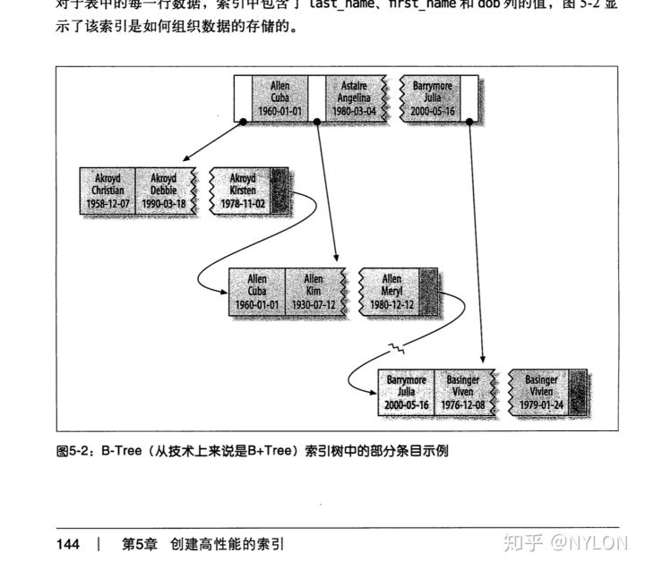

## 索引

什么是索引?

索引是一种用于快速查询和检索数据的数据结构。**通常在涉及到文件的管理的应用都会有索引，比如数据库，操作系统文件管理，对象存储。**常见的索引结构有: B树， B+树和Hash。

索引的作用就相当于目录的作用。

**为什么要使用索引/索引的优点**

建立索引的目的是：希望通过索引进行数据查找，减少随机 IO，增加查询性能 ，索引能过滤出越少的数据，则从磁盘中读入的数据也就越少。

**索引是数据库优化的重要方法**    是帮助MySQL高效获取数据的数据结构

1. **可以大大加快数据的检索速度（大大减少的检索的行数——二分查找）, 这也是创建索引的最主要的原因。**
2. **通过创建唯一性索引，可以保证数据库表中每一行数据的唯一性。**
3. **将随机 I/O 变为顺序 I/O**（B+Tree 索引是有序的，会将相邻的数据都存储在一起）。
4. **帮助服务器避免进行排序和分组，以及避免创建临时表**（B+Tree 索引是有序的，可以用于 ORDER BY 和 GROUP BY 操作。临时表主要是在排序和分组过程中创建，不需要排序和分组，也就不需要创建临时表）。
5. 可以加速表和表之间的连接，特别是在实现数据的参考完整性方面特别有意义。

**索引这么多优点，为什么不对表中的每一个列创建一个索引呢？/索引的缺点**

**时/空两个角度**

1. **创建索引和维护索引需要耗费许多时间**：当对表中的数据进行增删改的时候，如果数据有索引，那么索引也需要动态的修改，会降低SQL执行效率。
2. **占用物理存储空间** ：索引需要使用物理文件存储，也会耗费一定空间。

不超过5个一般

**索引的数据结构 B+树**

两个瓶颈：时间复杂度，I/O次数

二叉搜索树、红黑树 O(logN) 

缺点1：二叉搜索树最坏情况下可能变成链表式的 O(N)

缺点2：即使是红黑树，出度是2，大量数据时，树太高了，每一层都需要一次I/O，I/O次数太多

**B树和B+树区别**

- B 树的所有节点既存放键(key)也存放数据(data)；而 B+树只有叶子节点存放key和data，其他内节点只存放key。 **一次I/O(页)可以读取更多的索引信息**
- B+树的叶子节点有一条链指针指向下一个叶子节点。 **非常有利于范围查询 随机I/O变顺序I/O** 
- B 树的检索的过程相当于对范围内的每个节点的关键字做二分查找，可能还没有到达叶子节点，检索就结束了。而 B+树的检索效率就很稳定了，任何查找都是从根节点到叶子节点的过程，叶子节点的顺序检索很明显。 **B+树查询效率更稳定**
- B+树非叶子节点的子树个数与这个节点的关键字数量相同。B树根比叶子小1。 B+树能存放更多数据

**Hash 索引和 B+树索引优劣分析**

Hash 索引指的就是 Hash 表，最大的优点就是能够在很短的时间内，根据Hash函数定位到数据所在的位置，这是 B+树所不能比的。

Hash索引**不支持范围查询**，只能精确查找(= in)。

排序场景下需要进行排序运算。

不能用部分索引，对于组合索引，hash会把组合键合并后一起计算。

Hash冲突问题-这种情况下效率页不高。

**BitMap位图索引**

目前比较少的数据库支持位图索引，Oracle支持。

适用于只有几种固定数量的关键字，如性别、婚姻状况、行政区等等。每位代表某一行，0和1表示是或否。这一行的数据是男是女。[例子](https://www.cnblogs.com/yedu/p/9198724.html)

缺点：锁的粒度太大。新增或修改一个数据时，在同一个位图的数据都得锁定。只适合静态数据，而不适合索引频繁更新的列

**什么样的信息能成为索引**

主键、唯一键以及普通键

**聚簇索引**

也称为聚集索引、密集索引。**索引结构和数据一起存放的索引**

**InnoDB主键索引是聚簇索引，**索引结构和数据一起存放。InnoDB其他索引是辅助索引（非聚簇索引、二级索引、稀疏索引）**，**叶子节点存储的数据是主键。在使用辅助索引进行查找时，需要进行回表：先查找到主键值，然后再到主索引中进行查找。

**MyISAM使用的是非聚簇索引**，数据存放的是地址。索引和数据分开存，.myd存放数据，.myi存放索引。InnoDB索引和数据都在.idb文件。

**聚簇索引的优点**

数据访问更快。定位到索引的节点，就相当于定位到了数据。

**聚簇索引的缺点**

- 依赖于有序的数据 ：因为 B+树是多路平衡树，如果索引的数据不是有序的，那么就需要在插入时排序，如果数据是整型还好，否则类似于字符串或 UUID 这种又长又难比较的数据，插入或查找的速度肯定比较慢。  主键一般是默认自增int主键。
- 更新代价大 ： 如果对索引列的数据被修改时，那么对应的索引也将会被修改， 而且况聚集索引的叶子节点还存放着数据，修改代价肯定是较大的， 所以对于主键索引来说，主键一般都是不可被修改的。

**非聚集索引的优点**

更新代价比聚集索引要小 。非聚集索引的更新代价就没有聚集索引那么大了，非聚集索引的叶子节点是不存放数据的

**非聚集索引的缺点**

- 跟聚集索引一样，非聚集索引也依赖于有序的数据
- 可能会二次查询(回表) :这应该是非聚集索引最大的缺点了。 当查到索引对应的指针或主键后，可能还需要根据指针或主键再到数据文件或表中查询。

非聚集索引不一定回表查询。

试想一种情况，用户准备使用 SQL 查询用户名，而用户名字段正好建立了索引。

 SELECT name FROM table WHERE name='guang19';

那么这个索引的 key 本身就是 name，查到对应的 name 直接返回就行了，无需回表查询，这种情况就称为覆盖索引。

覆盖索引就是索引包含所有需要查询的字段的值。

具有以下优点：

- 索引通常远小于数据行的大小，只读取索引能大大减少数据访问量。
- 一些存储引擎（例如 MyISAM）在内存中只缓存索引，而数据依赖于操作系统来缓存。因此，只访问索引可以不使用系统调用（通常比较费时）。
- 对于 InnoDB 引擎，若辅助索引能够覆盖查询，则无需访问主索引。

**索引调优**

**如何定位并优化慢查询SQL**

1. 根据慢查询日志定位慢查询SQL
2. 使用explain等工具分析SQL
3. 修改SQL让SQL尽量走索引

**根据慢日志定位慢SQL**

**先定位哪些语句执行较慢，再具体分析这些语句**

\#查询所有和query有关的变量 show variables like '%quer%'; #查询本次会话的慢查询条数，关闭客户端会清零 show status like 'slow_queries';  会用到的几个： slow_query_log OFF  #慢查询日志，默认关闭 long_query_time 10.000000 #多长时间的查询算慢查询而被记录 10s太久，可以设置低一些 slow_query_log_file 路径  #慢查询日志存放位置 log_queries_not_using_indexes OFF #记录没有用到索引的查询

修改方式：

\1. 永久有效：修改配置文件  在 my.ini 增加几行:  主要是慢查询的定义时间，以及慢查询log日志记录

\2. 重启MySQL后失效

set global slow_query_log = on; set global long_query_time = 1; #需要重新连接客户端

**使用explain等工具分析查询SQL**

直接在要分析的查询语句前面加explain。不会真正去执行这个慢查询语句，而是很快地做一些分析。

**关键字段**

**type**

表示MySQL找到需要的数据行的所需要的方式

system>const>eq_ref>ref>range>index>ALL

index和ALL表明本次查询是全表扫描，出现这两个值都需要优化。

**extra**

执行情况的描述和说明

**两种极有可能需要优化的方式：**

Using filesort 无法利用索引完成排序

Using temporary 对查询结果排序时使用临时表，常见于排序order by和分组查询group by---将排序结果存到临时表中，方便后续的select where from操作

**比较好的**

Using index 这条语句使用的索引

**possible_keys**

表示查询时，可能使用的**索引**

**key**

表示MySQL实际决定使用的键（索引），必然包含在possible_keys中

key_len

索引字段的长度

rows

估算的找到所需的记录所需要读取的行数

**修改SQL让SQL尽量走索引**

修改查询语句走索引或者加这个查询语句用到的索引

\#添加索引， idx_name是给索引起的名字，可以和索引字段名字不一样 alter table table_name add index idx_name(name); 

题外话：

下面这句统计行数的查询会走哪个索引呢？主键索引还是非聚簇索引呢？

select count(id) from talbe_name;

explain一下发现走的并不是主键索引，MySQL的查询优化器做了分析优化，走的其他索引。可能原因是聚簇索引的叶子节点包含所有数据内容，非聚簇索引只包含索引和主键，能读入内存的数据更多。

查询优化器不一定准，可以用**force index**去走各种索引，尝试看看哪种索引查询效率更好。

可以强制走主键索引：

select count(id) from talbe_name force index (primary);

执行一下会发现走主键索引耗费时间更多。

**联合索引的最左匹配原则**

字节面试后端实习问到几次，美团Java一面也问到了。

这非常重要、非常重要、非常重要（重要的事情说三遍）的知识点。对于**联合索引**，**MySQL会一直向右匹配直到遇到范围查询（>,<,BETWEEN,LIKE）就停止匹配。**

比如a = 3 and b = 4 and c > 5 and d = 6; 如果建立(a,b,c,d)顺序的联合索引，这条语句d用不到索引。如果建立的是(a, b, d, c)的索引，就都可以用到。a,b,d的顺序可以任意调整。

**=和in可以乱序，MySQL的查询优化器会把语句优化成索引可以识别的形式。**

建立联合索引：直接括号括住多个字段即可

ALTER TABLE table_name ADD INDEX index_name(col1, col2, col3)

如User表的name和city加联合索引就是(name,city)，而最左前缀原则指的是，**如果查询的时候查询条件精确匹配索引的左边连续一列或几列**，则此列就可以被用到。

如下列语句，explain一下查询语句就可以看到有没有用索引，用的是哪个索引：

\#可以命中索引 select * from user where name=xx and city=xx;  #可以命中索引 查询优化器帮忙排序 select * from user where city=xx and name=xx;  #可以命中索引 select * from user where name=xx;  #！无法命中索引 select * from user where city=xx;       

**原因：联合索引的B+树会先对最左边的字段进行排序，然后再对第二个字段排序...因此直接对后面的字段进行条件判断是用不到索引的。**可以看成分级的目录，上层先按照最左边的key排序，下层再按照右边的key排序。



**索引是越多越好吗**

- 数据量小的表不需要建立索引，建立索引会增加额外开销

- - 两页的书没必要目录

- 时间：数据变更需要维护索引，更多的索引意味着更多的维护成本

- 空间：更多的索引意味着更多的存储空间

- - 100页的书有50页的目录

**尽量把查询最频繁的，****区分度最高的放前面。****查询的时候也尽量以这个字段为第一条件。**ORDER BY子句也遵循此规则。

区分度的公式是 COUNT(DISTINCT col) / COUNT(*)。表示字段不重复的比率，比率越大，扫描的记录数就越少。可以直接二分找到

SELECT COUNT(DISTINCT staff_id)/COUNT(*) AS staff_id_selectivity, COUNT(DISTINCT customer_id)/COUNT(*) AS customer_id_selectivity, COUNT(*) FROM payment; 结果：   staff_id_selectivity: 0.0001 customer_id_selectivity: 0.0373               COUNT(*): 16049

**锁**

按锁的粒度划分：行级锁以及表级锁。

按锁级别划分：共享锁和排他锁。

按加锁方式划分：自动锁和显式锁。

自动锁有：意向锁、MyISAM的表锁、update、insert、delete的时候加的锁

显式锁有：lock ... in share mode、select ... for update

按使用方式划分：乐观锁和悲观锁

**表级锁和行级锁**

- 表级锁：MySQL中锁定**粒度最大**的一种锁，对当前操作的整张表加锁。**MyISAM和InnoDB引擎都支持表级锁。**
- 行级锁： MySQL中锁定**粒度最小**的一种锁，只针对当前操作的行进行加锁。 **InnoDB支持行锁，MyISAM不支持。**

应该尽量只锁定需要修改的那部分数据，而不是所有的资源。锁定的数据量越少，发生锁争用的可能就越小，系统的并发程度就越高。

但是加锁需要消耗资源，锁的各种操作（包括获取锁、释放锁、以及检查锁状态）都会增加系统开销。(表级锁只需要表头部直接加锁，行级锁还要扫描到某行的头部对齐上锁)。因此封锁粒度越小，系统开销就越大。

**在选择封锁粒度时，需要在锁开销和并发程度之间做一个权衡。**

**读锁和写锁--共享锁和排他锁**

读锁-共享锁，写锁-互斥锁

只有读锁与读锁之间可以兼容，其他两两之间都不兼容

举例说明：详细在剑指Java面试/3-10 锁模块之MyISAM与InooDB关于锁方面的区别 (19:00)

**MyISAM锁**

- **MyISAM引擎用的是表锁，不支持行级锁。**

对于MyISAM表，多个会话同时操作时，**任意操作都会隐式地给整张表上锁**，其他客户端的同时操作都会被阻塞，如果一个写，其他既不能读也不能写；如果一个读，其他只能读不能写。

写操作：insert/update/delete

update table_name_myisam set 字段 = value where id between 1 and 2000;

在这两千条记录被更新完之前，其他会话对这个表的任何操作都会被阻塞，哪怕是读第3000行。

给MyISAM显式加锁：

\#某个客户端给MyISAM的table加上读锁，其他客户端只能读，写操作会被阻塞 lock tables table_name_myisam read; #某个客户端给MyISAM的table加上写锁，其他客户端的所有操作都会被阻塞，直到锁释放 lock tables table_name_myisam write; #释放锁 unlock tables;

也可以对读操作加**排他锁**

select * table_name_myisam where id between 1 and 2000 for update;

**这样的读操作加排他锁select for update之后，在执行完之前，其他读、写操作都会被阻塞。**

**InnoDB锁**

- InnoDB默认使用行锁，也支持表锁。
- **InnoDB的SQL没有用到索引的时候用的是表级锁，用到索引的时候用的是行级锁以及Gap锁(走普通非唯一锁时用到)。**

MySQL的InnoDB引擎支持事务，默认自动提交

show variables like 'autocommit'; #关闭自动提交 只针对当前session set autocommit = 0; 关闭自动提交以后，输入SQL语句，再输入commit才会提交并释放锁 也可以不修改，显示开启事务 begin transaction ...SQL commit 

InnoDB是非阻塞select，如下面的语句，会话1和会话2都关闭自动提交，先执行会话1读操作，再执行会话2写操作，在会话1**commit之前不会释放锁**，会话2对同一行的写操作应该被阻塞。**但实际上没有！实际上select并没有给这一行上锁，是非阻塞的。**

\#会话1  select * from table_name_innodb where id = 3; #会话2 update table_name_innodb set 字段 = value where id = 3;

**InnoDB是非阻塞select，****需要显示地加共享锁 lock in share mode****，才可以阻止读的时候同时写。**

\#会话1 显示给select加共享锁 select * from table_name_innodb where id = 3 lock in share mode;

此时会话2的更新语句被阻塞，在会话1commit之后，释放读锁，update语句才会加上写的排他锁，然后执行成功。不会阻塞同样的共享锁。

InnoDB是行级锁，在上面的例子里，如果会话2修改的是别的行，不会被阻塞：

update table_name_innodb set 字段 = value where id = 4;

**MyISAM和InnoDB的区别**

**MyISAM的适合场景**

频繁执行全表count语句。select count(*) from table 

MyISAM用一个变量保存了表的行数。InnoDB需要扫描统计

对数据进行增删改的频率不高，查询非常频繁的时候

增删改涉及锁表操作，每次都是表锁，并发性能很差

没有事务

**InnoDB适合的场景**

数据增删改查都频繁

可靠性要求比较高，要求支持事务的系统

**MySQL中的乐观锁**

MySQL大部分锁是悲观锁，依靠数据库提供的锁机制实现排他锁。

MySQL乐观锁有两种实现方式：版本号、时间戳

**版本号**

数据库表中保存一个version字段，更新表字段时，先检查version，再更新。更新成功的话，version+1。如下：

session 1 select version from test_innodb where id = 2;  #得到此时id为2这一行version值为1 session 2 select version from test_innodb where id = 2;  #得到此时id为2这一行version值为1 session 1 update test_innodb set money = 123, version = 0 + 1     where version = 0 and id = 2; #注意这里where的条件里有version = 0 #session 1执行成功，返回影响行数为1。 session 2 update test_innodb set money = 345, version = 0 + 1     where version = 0 and id = 2; #session 2执行失败，返回影响行数为0。 session 2 更新失败，然后交由程序进行更新失败的业务逻辑的处理


## 事务

### 数据库事务的四大特性

ACID

**1. 原子性（Atomicity）**

事务被视为不可分割的最小单元，**事务的所有操作要么全部提交成功，要么全部失败回滚。**

回滚可以用回滚日志（Undo Log）来实现，回滚日志记录着事务所执行的修改操作，在回滚时反向执行这些修改操作即可。

**2. 一致性（Consistency）**

执行事务后，数据库从一个正确的状态变化到另一个正确的状态

数据库在事务执行前后都保持一致性状态。在一致性状态下，所有事务对同一个数据的读取结果都是相同的。

**3. 隔离性（Isolation）**

一个事务所做的修改在最终提交以前，对其它事务是不可见的。

**4. 持久性（Durability）**

一旦事务提交，则其所做的修改将会永远保存到数据库中。即使系统发生崩溃，事务执行的结果也不能丢失。

系统发生崩溃可以用重做日志（Redo Log）进行恢复，从而实现持久性。与回滚日志记录数据的逻辑修改不同，重做日志记录的是数据页的物理修改。


事务相关SQL

```sql
#查看当前数据库的隔离级别  默认是REPEATABLE-READ
select @@tx_isolation;  

#修改数据库的隔离级别
set session transaction isolation level read uncommitted;
set session transaction isolation level read committed;
set session transaction isolation level repeatable read;
set session transaction isolation level serializable;

#开启事务 这种操作不需要关闭自动提交事务，显式开启一个事务
start transaction;

...各种操作

#回滚
rollback;

#提交事务  start transaction之后需要显式commit
commit;
```


### 并发事务会带来哪些问题

| 隔离级别         | 脏读 | 不可重复读 | 幻影读 |
| ---------------- | ---- | ---------- | ------ |
| READ-UNCOMMITTED | √    | √          | √      |
| READ-COMMITTED   | ×    | √          | √      |
| REPEATABLE-READ  | ×    | ×          | √      |
| SERIALIZABLE     | ×    | ×          | ×      |

事务隔离级别越高，安全性越高，串行化执行越严重，降低了数据库的并发度，需要根据业务需要去设置默认的隔离级别。Oracle默认为RC，MySQL默认为RR。

在典型的应用程序中，多个事务并发运行，经常会操作相同的数据来完成各自的任务（多个用户对同一数据进行操作）。并发虽然是必须的，但可能会导致以下的问题。


#### 丢失修改

丢失修改指一个事务的更新操作被另外一个事务的更新操作替换。一般在现实生活中常会遇到，例如：T1 和 T2 两个事务都对一个数据进行修改，T1 先修改并提交生效，T2 随后修改，T2 的修改覆盖了 T1 的修改。

**类似于多线程对共享变量的修改，因为数据库都会默认给更新加锁，所以这个问题很容易地被解决了。**


#### 脏读

**一个事务读取到了另一个事务未提交的数据，可以设置读取已提交（READ-COMMITTED）的隔离级别来避免。**

例如：T1 修改一个数据但未提交，T2 随后读取这个数据。如果 T1 撤销了这次修改，那么 T2 读取的数据是脏数据。


#### 不可重复读

**多次读取同一数据，结果不一致。使用REPEATABLE-READ(可重复读)隔离级别，能避免不可重复读的问题。**

例如：T2 读取一个数据，T1 对该数据做了修改。如果 T2 再次读取这个数据，此时读取的结果和第一次读取的结果不同。

RR：同一事务内多次读取的结果和其他事务的修改没关系。

值得注意的是，读取的时候没关系，会不会影响修改呢？

比如小张账户中的余额是20，事务1读取一遍是20，事务2修改成100，在关闭事务1之前，事务1读取还是20，事务1去做更新操作，加100的话，结果是120不就错了么，应该是200啊。实际上，在用以下SQL语句操作时，事务1中读取的值是20，但加100，数据库中的结果是200（**注意set的时候等号右边也要用balance，而不是用20**）。在事务1commit之前，事务1读取是120，commit之后，事务1读取是200。

`update account_innodb set balance = balance + 100 where name = '小张';`


#### 幻读

幻读本质上也属于不可重复读的情况，T1 读取某个范围的若干行，T2 在这个范围内**插入或删除行**，T1 再次读取这个范围的数据，此时读取的结果和和第一次读取的结果不同。


#### 不可重复读和幻读区别

不可重复读的重点是修改比如多次读取一条记录发现其中某些列的值被修改，幻读的重点在于新增或者删除比如多次读取一条记录发现记录增多或减少了。


## MySQL锁的原理

> MySQL InnoDB依靠多版本并发控制MVCC实现提交读和可重复读。

预备知识：当前读和快照读

当前读是对记录会加锁的操作，以下语句都是当前读：

```sql
select ... lock in share mode;  #这种是共享锁，其余都是排他锁
```

```sql
select ... for update
update  #增删改都属于当前读，因为在增删改之前都会先当前读来读取最新值，然后再增删改。
insert
delete
```

快照读是不加锁的非阻塞读

```sql
select
```

​	注意：在事务隔离级别不为串行化的情况下，select不加锁才成立。串行化情况下，也退化成当前读，即`select ... lock in share mode; `模式。


### InnoDB在RR隔离级别下就能解决幻读问题

理论情况下，MySQL RR隔离级别下应该是下面的场景，出现幻读。

```SQL
#session 1
start transaction;

#session 2 
start transaction;

#session 1 当前读，读取acount_innodb表的全部行
select * from acount_innodb lock in share mode;

#当前总共有3行，session 1读到了3行，id从1到3.
#session 2插入1行，上面事务1读取了整个表，这一行在事务1的操作范围内。
insert into account_innodb values(4,"newman",500);

#session 1更新所有余额为500 update操作也是当前读
update account_innodb set balance = 500;
#发现返回影响范围是4行，4行更新成功，出现了幻觉！ 
```

但是实际情况是insert操作被锁住了，需要等待session 1提交后才能插入。此时对于session1来讲，新增的数据行并没有出现，也就是**说InnoDB在RR级别下，就避免了幻读。**

要复现上面例子中的幻读问题，需要将innoDB的隔离级别降到RC隔离级别(读取已提交)。

在Serializable隔离级别下，对所有操作都会加锁，不需要加显式的锁，就可以解决幻读。如下：

```sql
set session transaction isolation level serializable;
#session 1
start transaction;

#session 2 
start transaction;

#session 1  Serializable隔离级别，不需要加锁！！！
select * from acount_innodb;

#session 2 下面的insert操作被阻塞，需要等待session1 commit之后才能执行成功，避免了幻读
insert into account_innodb values(4,"newman",500);
```


### 多版本并发控制MVCC 

多版本并发控制（Multi-Version Concurrency Control, MVCC）是 MySQL 的 InnoDB 存储引擎实现**实现提交读和可重复读这两种隔离级别**的具体方式。

**MVCC 的多版本指的是多个版本的快照，快照存储在 Undo 日志中，**该日志通过回滚指针 ROLL_PTR 把一个数据行的所有快照连接起来。

**核心：写操作更新最新的版本快照，而读操作可能会读到旧版本的快照。避免了加锁操作，开销更低。**

对于读操作SELECT，**会访问版本链中的记录，只能读到在此事务开始前已经提交的记录**，并且能保证每次读取结果都相同（可重复读级别下，前后两次读之间提交的事务所做的修改也不能被看到），实现了提交读和可重复读。所有的事务每次修改都会记录在版本链中，SELECT去版本链中拿记录，这就**实现了读-读，读-写，写-读的并发执行**，提升了系统的性能。注意不能同时对一条记录写，在版本链中还是得有先后顺序。


## 架构

### 如何设计一个数据

数据库的开发和我们做的大型项目一样，架构堪称经典，很有借鉴意义。

主要包括程序实例和存储（文件系统）两个部分。

程序实例包括：存储管理、缓存机制、SQL解析、日志管理、权限划分、容灾机制、索引管理、锁管理。

思考每一部分是怎么提出来的，有什么作用，能解决什么样的问题。常看D:\计算机\慕课\剑指Java面试\3-1 数据库架构.mp4

存储管理：类似操作系统的文件系统管理，存储的最小单位是块\页 


### 一条 SQL 语句在 MySQL 中如何执行的