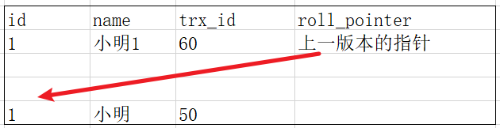

MySQL 是一种**关系型数据库**，在Java企业级开发中非常常用，因为 MySQL 是开源免费的，并且方便扩展。阿里巴巴数据库系统也大量用到了 MySQL，因此它的稳定性是有保障的。MySQL是开放源代码的，因此任何人都可以在 GPL(General Public License) 的许可下下载并根据个性化的需要对其进行修改。MySQL的默认端口号是**3306**。


# 索引

## 索引基础

什么是索引?

**索引是一种用于快速查询和检索数据的数据结构。通常在涉及到文件的管理的应用都会有索引，比如数据库，操作系统文件管理，对象存储。**常见的索引结构有: B树， B+树和Hash。

索引的作用就相当于目录的作用。打个比方: 我们在查字典的时候，如果没有目录，那我们就只能一页一页的去找我们需要查的那个字，速度很慢。如果有目录了，我们只需要先去目录里查找字的位置，然后直接翻到那一页就行了。

### 索引的优点

**为什么要使用索引？**

建立索引的目的是：希望通过索引进行数据查找，减少随机 IO，增加查询性能 ，索引能过滤出越少的数据，则从磁盘中读入的数据也就越少。

**索引是数据库优化的重要方法**    是帮助MySQL高效获取数据的数据结构

1. **可以大大加快数据的检索速度（大大减少的检索的行数——二分查找）, 这也是创建索引的最主要的原因。**
2. **通过创建唯一性索引，可以保证数据库表中每一行数据的唯一性。**
3. **将随机 I/O 变为顺序 I/O**（B+Tree 索引是有序的，会将相邻的数据都存储在一起）。
4. **帮助服务器避免进行排序和分组，以及避免创建临时表**（B+Tree 索引是有序的，可以用于 ORDER BY 和 GROUP BY 操作。临时表主要是在排序和分组过程中创建，不需要排序和分组，也就不需要创建临时表）。
5. 可以加速表和表之间的连接，特别是在实现数据的参考完整性方面特别有意义。

### 索引的缺点

**索引这么多优点，为什么不对表中的每一个列创建一个索引呢？**

**时/空两个角度**

1. **创建索引和维护索引需要耗费许多时间**：创建索引和维护索引要耗费时间，这种时间随着数据量的增加而增加。 当对表中的数据进行增删改的时候，如果数据有索引，那么索引也需要动态的修改，会降低SQL执行效率。
2. **占用物理存储空间** ：索引需要使用物理文件存储，也会耗费一定空间。

不超过5个一般

### 使用索引一定能提高查询性能吗?

大多数情况下，索引查询都是比全表扫描要快的。但是如果数据库的数据量不大，那么使用索引也不一定能够带来很大提升。

索引的使用条件

- 对于非常小的表、大部分情况下简单的全表扫描比建立索引更高效；
- 对于中到大型的表，索引就非常有效；
- 但是对于特大型的表，建立和维护索引的代价将会随之增长。这种情况下，需要用到一种技术可以直接区分出需要查询的一组数据，而不是一条记录一条记录地匹配，例如可以使用分区技术。

### 什么时候使用索引？

1. **被频繁查询的字段**
2. 在经常使用在**WHERE**子句中的列上面创建索引，加快条件的判断速度。
3. 在经常需要**排序**的列上创建索引，因为索引已经排序，这样查询可以利用索引的排序，加快排序查询时间；
4. 对于中到大型表索引都是非常有效的，但是特大型表的话维护开销会很大，不适合建索引
5. 在经常用在**连接**的列上，这些列主要是一些外键，可以加快连接的速度；
6. **在使用 limit offset 查询缓慢时，可以借助索引来提高性能**


## MySQL索引的底层数据结构

MySQL索引使用的数据结构主要有**B+Tree索引** 和 **哈希索引** 。对于哈希索引来说，底层的数据结构就是哈希表，因此在绝大多数需求为单条记录查询的时候，可以选择哈希索引，查询性能最快；其余大部分场景，建议选择B+Tree索引。

### B+树索引

**优化过程：从二叉树到红黑树到B树到B+树**

B Tree 指的是 Balance Tree，也就是平衡树。平衡树是一颗查找树，并且所有叶子节点位于同一层。

#### B+树和B树的区别

**B+树关键字存储在叶子结点，B+树带有顺序访问指针，B+树效率更稳定。**

B+树非叶子节点是索引部分，所有关键字存储在叶子节点，这样单次IO可以取更多的key索引。

且叶子节点本身根据关键字自小而大顺序连接——**范围查询时随机IO变为顺序IO**。磁盘顺序读取不需要进行磁盘寻道，并且只需要很短的磁盘旋转时间，速度会非常快。提高区间访问的性能，比如下面这种，找到区间的开始，然后顺序遍历即可，不需要一个一个查询。`SELECT * FROM tb1 WHERE id < 500;`

B 树的检索的过程相当于对范围内的每个节点的关键字做二分查找，可能还没有到达叶子节点，检索就结束了。而 B+树的检索效率就很稳定了，任何查找都是从根节点到叶子节点的过程，叶子节点的顺序检索很明显。

#### B+树如何提高I/O性能

叶子节点本身根据关键字自小而大顺序连接——**范围查询时随机IO变为顺序IO**。按顺序访问范围数据是很快的，这有两个原因。第一，顺序 I/O 不需要多次磁盘寻道，所以比随机I/O要快很多（特别是对机械硬盘）。第二，如果服务器能够按需要顺序读取数据，那么就不再需要额外的排序操作，并且GROUPBY查询也无须再做排序和将行按组进行聚合计算了。

每次新建节点时，直接申请一页的空间（一页多条记录），这样保证结点的大小设为内存中的一页=16KB，这样每个结点只需要一次I/O就可以完全载入。并且可以利用**预读特性**，相邻的节点也能够被预先载入。

渐进复杂度为O(h)=O(logdN)。一般实际应用中，出度d(树中各个节点的最多寸几个node)是非常大的数字，通常超过100，因此h非常小，通常不超过3。出度大时，逻辑上很近的节点（父子）物理上也比较进，可以**利用局部性。**

#### 为什么InnoDB推荐使用整形的自增主键做索引？

比较，空间，插入分裂调整得少，在后面append就行了

**1.整形的比较更简单。 B+树，元素Comparable**

2.整形占用的**空间**更小。

3.InnoDB数据文件本身是一棵B+Tree，非单调的主键会造成在**插入**新记录时数据文件为了维持B+Tree的特性而频繁的分裂调整，十分低效，而使用自增字段作为主键则是一个很好的选择。

### Hash索引

> 基于hash表结构实现的索引，mysql中只有MEMORY/HEAP和NDB存储引擎支持;
>
> **InnoDB**使用**B+树索引比较多**，对于哈希索引，**InnoDB是自适应哈希索引**的（hash索引的创建由InnoDB存储引擎引擎自动优化创建，我们干预不了）！

哈希索引就是采用一定的**哈希算法**，把键值换算成新的哈希值，检索时不需要类似B+树那样从根节点到叶子节点逐级查找，只需一次哈希算法即可**立刻定位到相应的位置，速度非常快**。

#### Hash索引的缺点

**最大的缺点：Hash 索引不支持顺序和范围查询**

由于hash索引是比较其hash值，**只支持精确查找，无法用于顺序查找和范围查找，无法进行排序和分组**。

比如下面这种，B+直接遍历，Hash得每个都算一遍。

```text
SELECT * FROM tb1 WHERE id < 500;
```

B+树是有序的，在这种范围查询中，优势非常大，直接遍历比 500 小的叶子节点就够了。Hash得每个都算一遍。

**不支持最左匹配原则**

复合索引会合并一起计算hash值

**哈希冲突**

在有大量重复键值情况下，哈希索引的效率也是极低的。


**InnoDB**使用**B+树索引比较多**，对于哈希索引，**InnoDB是自适应哈希索引**的（hash索引的创建由InnoDB存储引擎引擎自动优化创建，我们干预不了）！

当二级索引被频繁的访问时，便会自动创建自适应哈希索引;

通过命令`SHOW ENGINE INNODB STATUS`可查看自适应hash索引的使用情况;

通过命令`SHOW VARIABLES LIKE '%ap%hash_index' `查看是否打开自适应hash索引。


## MySQL索引的分类

**Mysql常见索引有：**主键索引、唯一索引、普通索引、全文索引、联合索引（多列索引）

```SQL
PRIMARY KEY（主键索引） 
ALTER TABLE `table_name` ADD PRIMARY KEY ( `col` )​

UNIQUE(唯一索引)   
ALTER TABLE `table_name` ADD UNIQUE (`col`)​

INDEX(普通索引)   
ALTER TABLE `table_name` ADD INDEX index_name (`col`)​

FULLTEXT(全文索引)    
ALTER TABLE `table_name` ADD FULLTEXT ( `col` )​

联合索引       
ALTER TABLE `table_name` ADD INDEX index_name (`col1`, `col2`, `col3` )
```

### 主键索引(Primary Key)

数据表的主键列使用的就是主键索引。

**一张数据表有只能有一个主键，并且主键不能为 null，不能重复。**

在 mysql 的 InnoDB 的表中，当没有显示的指定表的主键时，InnoDB 会自动先检查表中是否有唯一索引的字段，如果有，则选择该字段为默认的主键，否则 InnoDB 将会自动创建一个 6Byte 的自增主键。

#### 为什么不建议使用过长的字段作为主键？

因为所有InnoDB的辅助索引data域存储相应记录主键的值，过长的主索引会令辅助索引变得过大。**字段长度越小，一页能存储的数据量越大，IO 性能也就越好**


### 二级索引(辅助索引)

**二级索引又称为辅助索引，是因为二级索引的叶子节点存储的数据是主键。也就是说，通过二级索引，可以定位主键的位置。**

唯一索引，普通索引，前缀索引，全文索引等索引属于二级索引。

#### 唯一索引(Unique Key)

唯一索引也是一种约束。**唯一索引的属性列不能出现重复的数据，但是允许数据为 NULL，一张表允许创建多个唯一索引。** 建立唯一索引的目的大部分时候都是为了该属性列的数据的唯一性，而不是为了查询效率。

#### 普通索引(Index)

**普通索引的唯一作用就是为了快速查询数据，一张表允许创建多个普通索引，并允许数据重复和 NULL。**

#### 前缀索引(Prefix)

**前缀索引只适用于字符串类型的数据。**前缀索引是对文本的前几个字符创建索引，相比普通索引建立的数据更小，因为只取前几个字符。

对于 BLOB、TEXT 和 VARCHAR 类型的列，必须使用前缀索引，只索引开始的部分字符。

前缀长度的选取需要根据索引选择性来确定。

考虑在字符串类型的字段上使用前缀索引代替普通索引：前缀索引仅限于字符串类型，较普通索引会占用更小的空间。https://www.jianshu.com/p/fc80445044cc

以字符串字段的前几个字符作为索引，要适当选择数量。

```SQL
alter table x_test add index(x_name(1))
alter table x_test add index(x_name(4));
alter table x_test add index(x_name(7));
```

#### 全文索引(Full Text)

全文索引主要是为了检索大文本数据中的关键字的信息，是目前搜索引擎数据库使用的一种技术。

针对较大的数据，生成全文索引很耗时耗空间。将存储于数据库中的整本书或整篇文章中任意内容信息查找出来，如大量级的文字中如like %关键字%，查找条件使用 MATCH AGAINST，而不是普通的WHERE。全文索引使用倒排索引实现，它记录着关键词到其所在文档的映射。

InnoDB 存储引擎在 MySQL 5.6.4 版本中也开始支持全文索引。

#### 空间数据索引(R-Tree)

MyISAM 存储引擎支持空间数据索引，可以用于地理数据存储。空间数据索引会从**所有维度来索引数据**，可以有效地使用任意维度来进行组合查询。 必须使用 GIS 相关的函数来维护数据。


## 聚簇索引和非聚簇索引

**聚集索引即索引结构和数据一起存放的索引。**

**InnoDB主键是聚簇索引，辅助索引(二级索引)记录主键而非地址。MyISAM非聚簇索引，索引存放data的地址**

- **InnoDB:** 其数据文件本身就是索引文件`.ibd`，树的叶节点data域保存了完整的数据记录。这个索引的key是数据表的主键，因此InnoDB表数据文件本身就是主索引。这被称为“聚簇索引（或聚集索引）”。而其余的索引都作为辅助索引，辅助索引的data域存储相应记录主键的值而不是地址，这也是和MyISAM不同的地方。在根据主索引搜索时，直接找到key所在的节点即可取出数据；在根据辅助索引查找时，则需要先取出主键的值，再走一遍主索引（需要回表）。

- **MyISAM:** 一个索引文件`.myi`，一个数据文件`.myd`。B+Tree叶节点的data域存放的是数据记录的地址。在索引检索的时候，首先按照B+Tree搜索算法搜索索引，如果指定的Key存在，则取出其 data 域的值，然后以 data 域的值为地址读取相应的数据记录。这被称为“非聚簇索引”。

  

### 聚簇索引的优缺点分析

**优点**

- 数据访问更快。定位到索引的节点，就相当于定位到了数据。比MyISAM的非聚簇索引要快。
- **把相关数据保存在一起，实现了缓冲管理，减少IO次数**。实现了缓冲管理，不仅能缓冲索引也能缓冲数据，并且会自动创建散列索引以加快数据的获取 。MyIsam只缓存索引，数据的缓存是利用操作系统缓冲区来实现的，可能引发过多的系统调用且效率不佳。
  - 如：实现电子邮箱时，可以根据用户ID来聚集数据，这样只需要从磁盘读取少量的数据页就能获取某个用户全部邮件，如果没有使用聚集索引，则每封邮件都可能导致一次磁盘IO。

**缺点**

- **更新聚集索引列的代价更高，索引+数据在一起，肯定比只有索引+地址代价高**。所以对于主键索引来说，主键一般都是不可被修改的。

  - 基于聚集索引的表在插入新行，或者主键被更新导致需要移动行的时候，可能面临页分裂的问题：当行的主键值要求必须将这一行插入到某个已满的页中时，存储引擎会将该页分裂成两个页面来容纳该行，这就是一次页分裂操作，页分裂会导致表占用更多的磁盘空间。

- **聚集索引可能导致全表扫描变慢，尤其是行比较稀疏，或者由于页分裂导致数据存储不连续的时候。**

- **依赖于有序的数据：主键是Comparable的。**因为B+树是多路平衡树，如果索引的数据不是有序的，那么就需要在插入时排序，如果数据是整型还好，否则类似于字符串或UUID这种又长又难比较的数据，插入或查找的速度肯定比较慢。


### 非聚簇索引的优缺点分析

**优点**

**更新代价比聚集索引要小** 。非聚集索引的更新代价就没有聚集索引那么大了，非聚集索引的叶子节点是不存放数据的

**缺点**

1. 跟聚集索引一样，非聚集索引也依赖于有序的数据
2. **可能会二次查询(回表)** :这应该是非聚集索引最大的缺点了。 当查到索引对应的指针或主键后，可能还需要根据指针或主键再到数据文件或表中查询。


### 什么是覆盖索引

更多请见：https://www.jianshu.com/p/8991cbca3854

如果一个索引包含（或者说覆盖）所有需要查询的字段的值，不需要再回表，称为“覆盖索引”。InnoDB的主键天然是覆盖索引，其余二级索引需要不同情况具体分析。

#### 覆盖索引的好处？

- 索引通常远小于数据行的大小，只读取索引能大大减少数据访问量。
- 一些存储引擎（例如 MyISAM）在内存中只缓存索引，而数据依赖于操作系统来缓存。因此，只访问索引可以不使用系统调用（通常比较费时）。
- 对于 InnoDB 引擎，若辅助索引能够覆盖查询，则无需访问主索引。

#### 可以适当扩展索引，利用覆盖索引来提高查询效率

**举例说明**

InnoDB原表为：user(PK id, name, sex)；

```sql
select count(name) from user;
```

不能利用索引覆盖。

添加索引：

```sql
alter table user add key(name); 
```

之后由于查询的字段name是索引，再次查询的时候就能够利用索引覆盖提效。


再比如，分页查询。原表为：user(PK id, index name, sex)；

```sql
select id,name,sex ... order by name limit 500,100;
```

order by name，name是普通索引，查询sex信息需要回表。将单列索引(name)升级为联合索引(name, sex)，也可以避免回表。


### 非聚集索引一定回表查询吗

**不一定，如果是覆盖索引，不需要回表。**

InnoDB的主键天然是覆盖索引，其余二级索引需要不同情况具体分析。

- 如果是InnoDB，并且查的刚好是二级索引字段和主键，不需要回表。如果还查询了其他字段，需要回表。
- 如果是MyISAM，查的刚好是索引本身，不需要回表。查任何其他的都需要回表。


## 最左匹配原则

> **最左前缀匹配原则**，MySQL会一直向右匹配直到遇到范围查询（>,<,BETWEEN,LIKE）就停止匹配。

MySQL中的索引可以以一定顺序引用多列，这种索引叫作联合索引。如User表的name和city加联合索引就是(name,city)，而最左前缀原则指的是，如果查询时会一直向右匹配直到遇到范围查询（>,<,BETWEEN,LIKE）就停止匹配。

```                                                                                       
select * from user where name=xx and city=xx ; ／／可以命中索引
select * from user where name=xx ; // 可以命中索引
select * from user where city=xx ; // 无法命中索引            
```

这里需要注意的是，查询的时候如果两个条件都用上了，但是顺序不同，如 `city= xx and name ＝xx`，那么现在的查询引擎会自动优化为匹配联合索引的顺序，这样是能够命中索引的。

由于最左前缀原则，在创建联合索引时，索引字段的顺序应该将区分度最高，查询最频繁的字段放在最左边，ORDER BY子句也遵循此规则。最好explain一下select。


### 避免冗余索引

**冗余索引指的是索引的功能相同，能够命中A就肯定能命中B，那么就是冗余索引如（name,city ）和（name ）这两个索引就是冗余索引**，能够命中后者的查询肯定是能够命中前者的，在大多数情况下，都应该尽量扩展已有的索引而不是创建新索引。

MySQL 5.7 版本后，可以通过查询 sys 库的 `schema_redundant_indexes` 表来查看冗余索引   


## 索引使用的注意事项

### 避免冗余索引

### 索引不是越多越好

索引并不是越多越好！索引可以提高效率同样可以降低效率。**限制每张表上的索引数量,建议单张表索引不超过 5 个**

索引可以增加查询效率，但同样也会降低插入和更新的效率，甚至有些情况下会降低查询效率。

因为 MySQL 优化器在选择如何优化查询时，会根据统一信息，对每一个可以用到的索引来进行评估，以生成出一个最好的执行计划，如果同时有很多个索引都可以用于查询，就会增加 MySQL 优化器生成执行计划的时间，同样会降低查询性能。

并且如果数据库的数据量不大，那么使用索引也不一定能够带来很大提升。

### 选择合适的字段

#### 不为null的字段

**索引字段的数据应该尽量不为NULL**，因为对于数据为NULL的字段，数据库较难优化。建议使用0,1,true,false这样语义较为清晰的短值或短字符作为替代NULL。

**将某一列设置为default null，where 是可以走索引，另外索引列是否设置 null 是不影响性能的。** 但是，还是不建议列上允许为空。最好限制not null，因为null需要更多的存储空间并且null值无法参与某些运算。

《高性能MySQL》第四章如是说：And, in case you’re wondering, allowing NULL values in the index really doesn’t impact performance  。NULL 值的索引查找流程参考：https://juejin.im/post/5d5defc2518825591523a1db ,相关阅读：[MySQL中IS NULL、IS NOT NULL、!=不能用索引？胡扯！](https://juejin.im/post/5d5defc2518825591523a1db) 。

#### 被频繁查询的字段

我们创建索引的字段应该是查询操作非常频繁的字段，也就是经常被用作where条件查询的字段。

#### 经常排序的字段

在经常需要排序的列上创建索引，因为索引已经排序，这样查询可以利用索引的排序，加快排序查询时间。

#### 被经常频繁用于连接的字段

经常用于连接的字段可能是一些外键列，对于外键列并不一定要建立外键，只是说该列涉及到表与表的关系。对于频繁被连接查询的字段，可以考虑建立索引，提高多表连接查询的效率。

#### 尽量选择区分度高的列作为索引

#### 尽可能的扩展索引，不要频繁新建立索引。

比如表中已经有了a的索引，现在要加（a,b）的索引，那么只需要修改原来的索引即可。


### 不合适作为索引的字段

#### 被频繁更新的字段应该慎重建立索引

虽然索引能带来查询上的效率，但是维护索引的成本也是不小的。
如果一个字段不被经常查询，反而被经常修改，那么就更不应该在这种字段上建立索引了。

#### 尽可能的考虑建立联合索引而不是单列索引

**节约磁盘空间，提升修改效率**

因为索引是需要占用磁盘空间的，可以简单理解为每个索引都对应着一颗 B+树。如果一个表的字段过多，索引过多，那么当这个表的数据达到一个体量后，索引占用的空间也是很多的，且修改索引时，耗费的时间也是较多的。如果是联合索引，多个字段在一个索引上，那么将会节约很大磁盘空间，且修改数据的操作效率也会提升。

#### 考虑在字符串类型的字段上使用前缀索引代替普通索引

前缀索引仅限于字符串类型，较普通索引会占用更小的空间，所以可以考虑使用前缀索引带替普通索引。

#### 删除长期未使用的索引

不用的索引的存在会造成不必要的性能损耗 MySQL 5.7 可以通过查询 sys 库的 **schema_unused_indexes** 视图来查询哪些索引从未被使用

#### 查询时索引要干净——避免where子句中对字段施加函数

**在进行查询时，索引列不能是表达式的一部分，也不能是函数的参数（因此要避免 where 子句中对字段施加函数），否则无法使用索引。**

例如下面的查询不能使用 actor_id 列的索引：

```sql
SELECT actor_id FROM sakila.actor WHERE actor_id + 1 = 5;
```

### 联合索引如何选择索引列的顺序

- 区分度最高的放在联合索引的最左侧（区分度=列中不同值的数量/列的总行数）
- 尽量把字段长度小的列放在联合索引的最左侧（因为字段长度越小，一页能存储的数据量越大，IO 性能也就越好）
- 使用最频繁的列放到联合索引的左侧（这样可以比较少的建立一些索引）

### InnoDB使用与业务无关的自增主键作为主键

**在使用 InnoDB 时使用与业务无关的自增主键作为主键**，即使用逻辑主键，而不要使用业务主键。


## 索引io是什么io模型，为什么？

==**网络io采用阻塞模型，磁盘I/O有B+索引将随机I/O变为顺序I/O。**==

**阻塞模型：每个连接都会生成一个对应的线程，用线程池来管理。**

**大量的查找和排序，花费在cpu 和内存占用，而不是网络等待上，所以，非阻塞 io 没有优势。**

**mysql的B+索引将随机 IO 变为顺序 IO**

**IO类型**

IO有四种类型：连续读，随机读，随机写和连续写，连续读写的IO size通常比较大(128KB-1MB)，主要衡量吞吐量，而随机读写的IO size比较小(小于8KB)，主要衡量IOPS和响应时间。数据库中的全表扫描是连续读IO，索引访问则是典型的随机读IO，日志文件是连续写IO，而数据文件则是随机写IO。

**选择更精细的数据类型，更短长度的字段：**

　　由于MySQL数据库是基于行(Row)存储的数据库，而数据库操作 IO 的时候是以 page(block)的方式，也就是说，如果我们**每条记录所占用的空间量减小，就会使每个page中可存放的数据行数增大，那么每次IO 可访问的行数也就增多了。**反过来说，处理相同行数的数据，需要访问的page 就会减少，也就是IO 操作次数降低，直接提升性能。此外，由于我们的内存是有限的，增加每个page中存放的数据行数，就等于增加每个内存块的缓存数据量，同时还会提升内存换中数据命中的几率，也就是缓存命中率。


# 存储引擎

MyISAM是MySQL的默认数据库引擎（5.5版之前）。虽然性能极佳，而且提供了大量的特性，包括全文索引、压缩、空间函数等，但MyISAM不支持事务和行级锁，而且最大的缺陷就是崩溃后无法安全恢复。因此，5.5版本之后，MySQL引入了InnoDB（事务性数据库引擎），MySQL 5.5版本后默认的存储引擎为InnoDB。

大多数时候我们使用的都是 InnoDB 存储引擎，但是在某些情况下使用 MyISAM 也是合适的比如读密集的情况下。（如果你不介意 MyISAM 崩溃恢复问题的话）。

```sql
#查看MySQL提供的所有存储引擎 
show engines;

#我们也可以通过下面的命令查看默认的存储引擎。
show variables like '%storage_engine%';

#查看表的存储引擎，表的Engines项为表的引擎
show table status like "table_name" ;
```

### MyISAM和InnoDB的区别

- **事务：InnoDB 是事务型的，支持提交、回滚和紧急恢复功能来保护数据安全。**
- **并发：MyISAM 只支持表级锁，并发性差，而 InnoDB 还支持行级锁。**
- **索引：InnoDB 支持外键(B+树存主键的值)**  
- **数据存储：InnoDB是聚簇索引，MyISAM不是。**辅助索引也不同----InnoDB的辅助索引data域存储相应记录主键的值而不是地址。
- **是否支持MVCC：仅 InnoDB 支持。**应对高并发事务, MVCC比单纯的加锁更高效；MVCC只在 READ COMMITTED 和 REPEATABLE READ 两个隔离级别下工作；MVCC可以使用乐观(optimistic)锁和悲观(pessimistic)锁来实现；各数据库中MVCC实现并不统一。
- **备份：InnoDB 支持在线热备份。** 热备份是系统处于正常运转状态下的备份，MySQL的其他存储引擎不支持热备份，要获取一致性视图需要停止对所有表的写入，而在读写混合场景中，停止写入可能也意味着停止读取。
- **崩溃恢复：宕机后，InnoDB崩溃修复能力更强，而且恢复的速度也更快。**
- 其它特性：MyISAM提供全文索引、压缩、空间函数。

MySQL高性能》上面有一句话这样写到:

> 不要轻易相信“MyISAM比InnoDB快”之类的经验之谈，这个结论往往不是绝对的。在很多我们已知场景中，InnoDB的速度都可以让MyISAM望尘莫及，尤其是用到了聚簇索引，或者需要访问的数据都可以放入内存的应用。

一般情况下我们选择 InnoDB 都是没有问题的，但是某些情况下你并不在乎可扩展能力和并发能力，也不需要事务支持，也不在乎崩溃后的安全恢复问题的话，选择MyISAM也是一个不错的选择。但是一般情况下，我们都是需要考虑到这些问题的。


### 如何选取存储引擎

**MyISAM的适合场景**

- 频繁执行全表count语句。select count(*) from table 
  - MyISAM用一个变量保存了表的行数。InnoDB需要扫描统计

- 对数据进行增删改的频率不高，查询非常频繁的时候
  - 增删改涉及锁表操作，每次都是表锁，并发性能很差

- 没有事务

**InnoDB适合的场景**

- 数据增删改查都频繁

- 可靠性要求比较高，要求支持事务的系统


如果只是临时存放数据，数据量不大，并且不需要较高的数据安全性，可以选择将数据保存在内存中的Memory引擎，MySQL中使用该引擎作为临时表，存放查询的中间结果

如果只有INSERT和SELECT操作，可以选择Archive，Archive支持高并发的插入操作，但是本身不是事务安全的。Archive非常适合存储归档数据，如**记录日志信息可以使用Archive。**


《MySQL高性能》上面有一句话这样写到：

不要轻易相信“MyISAM比InnoDB快”之类的经验之谈，这个结论往往不是绝对的。在很多我们已知场景中，InnoDB的速度都可以让MyISAM望尘莫及，尤其是用到了聚簇索引，或者需要访问的数据都可以放入内存的应用。

一般情况下我们选择 InnoDB 都是没有问题的，但是某些情况下你并不在乎可扩展能力和并发能力，也不需要事务支持，也不在乎崩溃后的安全恢复问题的话，选择MyISAM也是一个不错的选择。但是一般情况下，我们都是需要考虑到这些问题的。


# 事务

> 只有Innodb支持事务

## 事务的四大特性

**1. 原子性（Atomicity）**

事务被视为不可分割的最小单元，**事务的所有操作要么全部提交成功，要么全部失败回滚。**

**回滚可以用回滚日志（Undo Log）来实现，**回滚日志记录着事务所执行的修改操作，在回滚时反向执行这些修改操作即可。

**2. 一致性（Consistency）**

**所有事务对同一个数据的读取结果都是相同的。**

**3. 隔离性（Isolation）**

**一个事务所做的修改在最终提交以前，对其它事务是不可见的。**

**4. 持久性（Durability）**

一旦事务提交，则其所做的修改将会永远保存到数据库中。即使系统发生崩溃，事务执行的结果也不能丢失。

**系统发生奔溃可以用重做日志（Redo Log）进行恢复**，从而实现持久性。与回滚日志记录数据的逻辑修改不同，重做日志记录的是数据页的物理修改。


### 分布式柔性事务

分布式的事务没办法保证每个时刻都满足ACID一致性，满足BASE条件即可

- **B**asically **A**valiable
- **S**oft-state
- **E**ventually Consistency  最终一致性

比如秒杀项目中的库存是在内存中减库存，异步同步到数据库，保证了最终的一致性即可，中间状态称为Soft-state，是可以接受的。


## 并发事务会带来哪些问题

在典型的应用程序中，多个事务并发运行，经常会操作相同的数据来完成各自的任务（多个用户对同一数据进行操作）。并发虽然是必须的，但可能会导致以下的问题。

#### 丢失修改

一个事务的更新操作被另外一个事务的更新操作替换。一般在现实生活中常会遇到，例如：T1 和 T2 两个事务都对一个数据进行修改，T1 先修改并提交生效，T2 随后修改，T2 的修改覆盖了 T1 的修改。

**类似于多线程对共享变量的修改，因为数据库都会默认给更新加锁，所以这个问题很容易地被解决了。**

#### 脏读

**一个事务读取到了另一个事务未提交的数据。**

例如：T1 修改一个数据但未提交，T2 随后读取这个数据。如果 T1 撤销了这次修改，那么 T2 读取的数据是脏数据。

#### 不可重复读

**多次读取同一数据，结果不一致。**

例如：T2 读取一个数据，T1 对该数据做了修改。如果 T2 再次读取这个数据，此时读取的结果和第一次读取的结果不同。

值得注意的是，读取的时候没关系，会不会影响修改呢？

比如小张账户中的余额是20，事务1读取一遍是20，事务2修改成100，在关闭事务1之前，事务1读取还是20，事务1去做更新操作，加100的话，结果是120不就错了么，应该是200啊。实际上，在用以下SQL语句操作时，事务1中读取的值是20，但加100，数据库中的结果是200（**注意set的时候等号右边也要用balance，而不是用20**）。在事务1commit之前，事务1读取是120，commit之后，事务1读取是200。

`update account_innodb set balance = balance + 100 where name = '小张';`

通过后面的锁原理分析，就知道为什么读取和修改不一样了，读取是读取MVCC多版本快照，修改是修改最新的。

#### 幻读

幻读本质上也属于不可重复读的情况，T1 读取某个范围的若干行，T2 在这个范围内**插入或删除行**，T1 再次读取这个范围的数据，此时读取的结果和和第一次读取的结果不同。


#### 不可重复读和幻读区别

**不可重复读的重点是修改值，幻读的重点在于新增或者删除行**

不可重复读的重点是修改，比如多次读取**同一条记录**发现其中某些列的值被修改。

幻读的重点在于新增或者删除，比如多次读取发现记录增多或减少了。


## 事务的隔离级别

> 产生并发不一致性问题的主要原因是破坏了事务的隔离性，解决方法是通过**并发控制**来保证隔离性。数据库管理系统提供了事务的隔离级别，让用户以一种轻松的方式处理并发一致性问题。

**SQL 标准定义了四个隔离级别：**

- **READ-UNCOMMITTED(读取未提交)：** 最低的隔离级别，允许读取尚未提交的数据变更，**可能会导致脏读、幻读或不可重复读**。
- **READ-COMMITTED(读取已提交)：** 允许读取并发事务已经提交的数据，**可以阻止脏读，但是幻读或不可重复读仍有可能发生**。
- **REPEATABLE-READ(可重复读)：**  **对同一字段的多次读取结果都是一致的**，除非数据是被本身事务自己所修改，**可以阻止脏读和不可重复读，但幻读仍有可能发生**。
- **SERIALIZABLE(可串行化)：** 最高的隔离级别，完全服从ACID的隔离级别。所有的事务依次逐个执行，这样事务之间就完全不可能产生干扰，也就是说，**该级别可以防止脏读、不可重复读以及幻读**。

| 隔离级别         | 脏读 | 不可重复读 | 幻影读 |
| ---------------- | ---- | ---------- | ------ |
| READ-UNCOMMITTED | √    | √          | √      |
| READ-COMMITTED   | ×    | √          | √      |
| REPEATABLE-READ  | ×    | ×          | √      |
| SERIALIZABLE     | ×    | ×          | ×      |

MySQL InnoDB 存储引擎的默认支持的隔离级别是 **REPEATABLE-READ（可重复读）**。可以通过`SELECT @@tx_isolation;`命令来查看。

这里需要注意的是：InnoDB 存储引擎在默认 REPEATABLE-READ 事务隔离级别下使用的是Next-Key Lock 锁算法，因此可以避免幻读的产生，**已经可以完全保证事务的隔离性要求，达到了 SQL标准的 SERIALIZABLE(可串行化) 隔离级别。**因为隔离级别越低，事务请求的锁越少，所以大部分数据库系统的隔离级别都是 **READ-COMMITTED(读取提交内容)** ，比如Oracle默认隔离级别为RC。但是你要知道的是InnoDB 存储引擎默认使用 **REPEAaTABLE-READ（可重读）** 并不会有任何性能损失。

Spring默认是RC级别。InnoDB 存储引擎在**分布式事务**的情况下一般会用到 **SERIALIZABLE(可串行化)** 隔离级别。


补充内容：**串行化可能带来的问题：死锁**

指定顺序

先调用tx方法

tx方法获取行id="123456"的读锁，**进入睡眠，注意这里不会释放锁**

接着调用updateAccount方法

updateAccount获取id="123456"行的写锁，但是由于读锁被占用，因此阻塞

tx方法睡眠5秒后，也开始update操作，同样需要获取写锁，结果发现updateAccount方法也要获取写锁

结果就是updateAccount方法等tx方法写锁，tx方法中间又在等updateAccount方法的写锁，循环等待，出现死锁。


## 事务相关SQL

MySQL InnoDB 默认采用自动提交模式。也就是说，如果不显式使用`START TRANSACTION`语句来开始一个事务，那么每个查询操作都会被当做一个事务并自动提交。

```sql
show variables like 'autocommit';

#关闭自动提交 只会关闭当前session的 
set autocommit = 0;
关闭自动提交以后，每次输入SQL语句，再输入commit才会提交并释放锁 

#也可以不修改，显示开启事务
#开启事务 这种操作不需要关闭自动提交事务，显式开启一个事务 下面两种都可以
start transaction; 
begin;

...各种操作

#回滚
rollback;

#提交事务  start transaction之后需要显式commit
commit;

#在事务中创建一个保存点，一个事务中可以有多个 SAVEPOINT
savepoint idenrifier
#删除一个事务的保存点；
RELEASE SAVEPOINT identifier 
#把事务回滚到标记点
ROLLBACK TO identifier 
```

隔离级别

```sql
#查看当前数据库的隔离级别  默认是REPEATABLE-READ
select @@tx_isolation;  

#修改数据库的隔离级别
set session transaction isolation level read uncommitted;
set session transaction isolation level read committed;
set session transaction isolation level repeatable read;
set session transaction isolation level serializable;
```


# MySQL锁

### 锁的分类

- 按锁的粒度划分：行级锁以及表级锁。
- 按锁级别划分：共享锁和排他锁。
- 按加锁方式划分：自动锁和显式锁。
  - 自动锁有：意向锁、MyISAM的表锁、update、insert、delete的时候加的锁
  - 显式锁有：lock ... in share mode、select ... for update

- 按使用方式划分：乐观锁和悲观锁


### 表级锁和行级锁

MySQL 中提供了两种封锁粒度：行级锁以及表级锁。**MyISAM只支持表锁，InnoDB支持行级锁(row-level locking)和表级锁，默认为行级锁。**

- 表级锁： MySQL中锁定 **粒度最大** 的一种锁，对当前操作的整张表加锁，实现简单，资源消耗也比较少，加锁快，不会出现死锁。其锁定粒度最大，触发锁冲突的概率最高，并发度最低，MyISAM和 InnoDB引擎都支持表级锁。
- 行级锁： MySQL中锁定 **粒度最小** 的一种锁，只针对当前操作的行进行加锁。 行级锁能大大减少数据库操作的冲突。其加锁粒度最小，并发度高，但加锁的开销也最大，加锁慢，会出现死锁。

应该尽量只锁定需要修改的那部分数据，而不是所有的资源。锁定的数据量越少，发生锁争用的可能就越小，系统的并发程度就越高。但是加锁需要消耗资源，锁的各种操作（包括获取锁、释放锁、以及检查锁状态）都会增加系统开销，封锁粒度越小，系统开销就越大。因此在选择封锁粒度时，**需要在锁开销和并发程度之间做一个权衡。**


### 共享锁和排他锁

读锁-共享锁，写锁-互斥锁

只有读锁与读锁之间可以兼容，其他两两之间都不兼容。

​	读：select

​	写：update/delete/insert


#### MyISAM锁举例

> **MyISAM引擎用的是表锁，不支持行级锁。**

对于MyISAM表，多个会话同时操作时，**任意操作都会隐式地给整张表上锁**，读操作是共享锁，写操作是排他锁。

```sql
#在这两千条记录被更新完之前，其他会话对这个表的读/写操作都会被阻塞，哪怕是读第3000行。
update table_name_myisam set 字段 = value where id between 1 and 2000;

#普通操作和显式加锁的效果相同，也可以显式加锁。
#因为任何操作都会隐式加锁，作用和直接的select/update/insert/delete操作是一样的
#某个客户端给MyISAM的table加上读锁，其他客户端只能读，写操作会被阻塞，直到锁释放
lock tables table_name_myisam read;

#某个客户端给MyISAM的table加上写锁，其他客户端的所有操作都会被阻塞，直到锁释放
lock tables table_name_myisam write;

#释放锁
unlock tables;
```


**可以对读操作加排他锁**

```sql
select * table_name_myisam where id between 1 and 2000 for update;
```

**这样的读操作加排他锁select for update之后，在执行完之前，对这张表的其他读、写操作都会被阻塞。**


#### InnoDB锁举例

> **InnoDB默认使用行锁，也支持表锁。**

**事务中开启的锁，在事务提交后才会释放。**

**InnoDB默认是非阻塞select，select操作不会影响写操作。**因此下面的两句操作，虽然都是对第三行的并发操作，但不会互相影响，都能执行成功。

```sql
#会话1
start transaction;

#会话2
start transaction;

#会话1
select * from table_name_innodb where id = 3;

#会话2
update table_name_innodb set name = 'java' where id = 3;
```

可以给select操作加上共享锁`lock in share mode`

```sql
#把上面会话1的读操作换成下面的lock in share mode
select * from table_name_innodb where id = 3 lock in share mode;
```

把上面会话1的读操作换成上面的lock in share mode，此时会话2的更新语句被阻塞，**在会话1commit之后，释放读锁，update语句才能加上写的排他锁，然后执行成功。**

lock in share mode是共享锁，不会阻塞读操作。


InnoDB是行级锁，在上面的例子里，如果上面的操作中会话2修改的是别的行，不会被阻塞。

```sql
#会话2修改id = 4的，不会和id=3的共享锁冲突，两者互不影响。
update table_name_innodb set 字段 = value where id = 4;
```


**同样，可以对读操作加排他锁**

```sql
select * from table_name_innodb where id = 3 for update;
```

这样的读操作加排他锁select for update之后，在执行完之前，对这一行的其他读、写操作都会被阻塞。


**InnoDB的行级锁是基于索引实现的。因此<font color=red>InnoDB的SQL没有用到索引的时候用的是表级锁，用到索引的时候用的是行级锁以及Gap锁(走普通非唯一锁时用到)。</font>**

此外，InnoDB的行级锁是针对索引加的锁，不针对数据记录，因此即使访问不同行的记录，如果使用了相同的索引键仍然会出现锁冲突。

在通过`SELECT ...LOCK IN SHARE MODE;`或`SELECT ...FOR UPDATE;`使用锁的时候，如果表没有定义任何索引，那么InnoDB会创建一个隐藏的聚簇索引并使用这个索引来加记录锁。


## MySQL锁原理

> MySQL InnoDB依靠多版本并发控制MVCC实现提交读和可重复读。

#### 当前读和快照读

当前读是对记录会加锁的操作，以下语句都是当前读：

```sql
select ... lock in share mode;  #这种是共享锁，其余都是排他锁
```

```sql
select ... for update  #排他锁
update  #增删改都属于当前读，因为在增删改之前都会先当前读来读取最新值，然后再增删改。
insert
delete
```

快照读是不加锁的非阻塞读

```sql
select
```

​	注意：在事务隔离级别不为串行化的情况下，select不加锁才成立。串行化情况下，也退化成当前读，即`select ... lock in share mode; `模式。

### InnoDB在RR隔离级别下的当前读就能解决幻读问题

理论情况下，MySQL RR隔离级别下应该是下面的场景，出现幻读。

```SQL
#session 1
start transaction;

#session 2 
start transaction;

#session 1 当前读，读取acount_innodb表的全部行
select * from acount_innodb lock in share mode;

#当前总共有3行，session 1读到了3行，id从1到3.
#session 2插入1行，上面事务1读取了整个表，这一行在事务1的操作范围内。
insert into account_innodb values(4,"newman",500);

#session 1更新所有余额为500 update操作也是当前读
update account_innodb set balance = 500;
#发现返回影响范围是4行，4行更新成功，出现了幻觉！ 
```

但是实际情况是insert操作被锁住了，需要等待session 1提交后才能插入。此时对于session1来讲，新增的数据行并没有出现，也就是**说InnoDB在RR级别下的当前读就可以避免幻读。原因是MVCC+next key锁**

要复现上面例子中的幻读问题，需要将innoDB的隔离级别降到RC隔离级别(读取已提交)。

在Serializable隔离级别下，对所有操作都会加锁，不需要加显式的锁，就可以解决幻读。如下：

```sql
set session transaction isolation level serializable;
#session 1
start transaction;

#session 2 
start transaction;

#session 1  Serializable隔离级别，不需要加锁！！！
select * from acount_innodb;

#session 2 下面的insert操作被阻塞，需要等待session1 commit之后才能执行成功，避免了幻读
insert into account_innodb values(4,"newman",500);
```


### MVCC实现RC，RR隔离级别

多版本并发控制（Multi-Version Concurrency Control, MVCC）是 MySQL 的 InnoDB 存储引擎实现**实现提交读和可重复读这两种隔离级别**的具体方式。

**核心：写操作更新最新的版本快照，而读操作去读旧版本快照，没有互斥关系，这一点和 CopyOnWrite 类似，避免了加锁操作，开销更低。**

对于读操作SELECT，会访问版本链中的记录，从最新的开始依次访问。如果是可重复读，只能读到在此事务开始前已经提交的记录；如果是提交读，只能读到已提交的结果。实现了提交读和可重复读。

**MVCC实现了RR、RC级别下的快照读——非阻塞读。** 所有的事务每次修改都会记录在版本链中，SELECT去版本链中拿记录，这就**实现了读-读，读-写，写-读的并发执行**，提升了系统的性能。


#### 版本号

系统版本号 SYS_ID：是一个递增的数字，每开始一个新的事务，系统版本号就会自动递增。

事务版本号 TRX_ID ：事务开始时的系统版本号。每次进行修改操作的时候，都会记录下所在事务的这个TRX_ID。

**SELECT  读取版本号小于或等于当前事务版本号。**只读取已提交的

INSERT：将当前系统的版本号保存至行的版本号   

DELETE 可以看成是一个特殊的 UPDATE，还会额外将 DEL 字段设置为 1

UPDATE：新插入一条记录，并以当前系统的版本号作为新行的创建版本号，Roll_pointer指针会指向上一版本。


#### Undo日志

**MVCC 的多版本指的是多个版本的快照，快照存储在 Undo 日志中，**在 MVCC 中事务的修改操作（DELETE、INSERT、UPDATE）会为数据行新增一个版本快照。Undo日志通过回滚指针 ROLL_PTR 把一个数据行的所有快照连接起来。

快照中除了记录事务版本号 TRX_ID 和操作之外，还记录了一个 bit 的 DEL 字段，用于标记是否被删除。

```sql
#当前事务版本号是50
insert id = 1, name = '小明1';   

#事务60进行修改
update table set name = '小明1' where id = 1  
```

此时在undo日志中就存在版本链：



#### ReadView

MVCC 维护了一个 ReadView 结构，主要包含了当前系统未提交的事务列表 TRX_IDs {TRX_ID_1, TRX_ID_2, ...}，还有该列表的最小值 TRX_ID_MIN 和 TRX_ID_MAX。

在进行 SELECT 操作时，根据数据行快照的 TRX_ID 与 TRX_ID_MIN 和 TRX_ID_MAX 之间的关系，从而判断数据行快照是否可以使用：

- TRX_ID < TRX_ID_MIN，表示该数据行快照是在当前所有未提交事务之前进行更改的，因此可以使用。
- TRX_ID > TRX_ID_MAX，表示该数据行快照是在事务启动之后被更改的，因此不可使用。
- TRX_ID_MIN <= TRX_ID <= TRX_ID_MAX，需要根据隔离级别再进行判断：
  - **提交读：如果 TRX_ID 在 TRX_IDs 列表中，表示该数据行快照对应的事务还未提交，则该快照不可使用。**否则表示已经提交，可以使用。
  - **可重复读：都不可以使用。**因为如果可以使用的话，那么其它事务也可以读到这个数据行快照并进行修改，那么当前事务再去读这个数据行得到的值就会发生改变，也就是出现了不可重复读问题。

在数据行快照不可使用的情况下，需要沿着 Undo Log 的回滚指针 ROLL_PTR 找到下一个快照，再进行上面的判断。

简要来说：对于读操作SELECT，会访问版本链中的记录，从最新的开始依次访问。如果是可重复读，只能读到在此事务开始前已经提交的记录；如果是提交读，只能读到已提交的结果。


举例说明：假设当前列表里的事务id为[80，90，100]。

- 要访问的记录版本的事务id为50，比当前列表的TRX_ID_MIN80都小。说明这条记录在列表中所有事务开启之前就提交了，所以对当前活动的事务来说是可访问的。
- 要访问的记录版本的事务id为110，比事务列表的TRX_ID_MAX100都大，那说明这个条记录是在ReadView生成之后才发生的，所以不能被访问。
- 要访问的记录版本的事务id为80，在min与max之间，且在当前的列表中。说明当前事务还未提交，不能被访问。
- 如果要访问的记录版本是85，在min与max之间，但不在列表中，说明已提交。需要根据隔离级别判断
  - 如果是提交读，可以读。
  - 如果是可重复读，不能读。


**已提交读和可重复读的区别就在于它们生成ReadView的策略不同。已提交读隔离级别下的事务在每次查询的开始都会生成一个独立的ReadView，而可重复读隔离级别则在第一次读的时候生成一个ReadView，之后的读都复用之前的ReadView。**

举个例子 ，在已提交读隔离级别下：

提交上面例子中的50，60事务。此时有一个事务id为100的事务，修改了name,使得的name等于小明2，但是事务还没提交。则此时的版本链是：


若此时另一个事务A发起了select 语句要查询id为1的记录，此时生成的ReadView 列表只有[100]。开始从版本链一条一条比较，首先找最近的一条，发现trx_id是100,也就是name为小明2的那条记录，发现在列表内，所以不能访问。这时候通过指针继续找下一条，name为小明1的记录，发现trx_id是60，小于列表中的最小id，所以可以访问，直接读取，结果为小明1。

如果这时候我们把事务id为100的事务提交了，并且新建了一个事务id为110也修改id为1的记录，并且不提交事务110。

```sql
110 BEGIN; 
UPDATE TABLE SET name = '小明3' WHERE id = 1;
```

 这时候版本链就是：


这时候还是事务A又执行了一次查询,要查询id为1的记录。**关键的地方来了**

如果是**已提交读隔离级别，会重新创建一个ReadView**，活动事务列表中的值就变了，变成了[110]。通过trx_id对比版本链查找到合适的结果就是小明2。

如果是**可重复读隔离级别，这时候ReadView还是第一次select时候生成的ReadView，**也就是列表的值还是[100]。所以select的结果是小明1。所以第二次select结果和第一次一样，这样才能实现可重复读。


### Next-key Lock解决幻读问题

> **Next-key Lock会用到RR级别如下场景：**
>
> **使用主键索引，部分命中，会对主键索引加Next-key Lock。**
>
> **使用唯一索引，部分命中，会对主键索引和唯一索引加Next-key Lock。**
>
> **使用非唯一索引、普通索引，无论是否命中，都会对当前读的区间范围内加Next-key Lock。**
>
> **不适用索引，无论是否命中，都会对所有区间加Next-key Lock。类似表锁，但是代价比表锁大得多！！！**

由两部分组成，行锁+Gap锁。在RR和Serializable级别下都会开启，解决了幻读。

**Record Locks**
锁定一个记录上的索引，而不是记录本身。如果表没有设置索引，InnoDB 会自动在主键上创建隐藏的聚簇索引，因此 Record Locks 依然可以使用。


**Gap Locks**

锁定索引之间的间隙，但是不包含索引本身。例如当一个事务执行下面两个当前读语句，其它事务就不能table_a.id插入 15。

```sql
SELECT * FROM table_a WHERE id BETWEEN 10 and 20 FOR UPDATE;
SELECT * FROM table_a WHERE id BETWEEN 10 and 20 lock in share mode;
```

有两种方式显式关闭gap锁：

A. 将事务隔离级别设置为RC 

B. 将参数innodb_locks_unsafe_for_binlog设置为1


**Next-Key Locks**
它是 Record Locks 和 Gap Locks 的结合，不仅锁定一个记录上的索引，也锁定索引之间的间隙。它锁定一个前开后闭区间，例如一个索引包含以下值：10, 11, 13, and 20，那么就会按照如下划分区间：

```sql
(-∞, 10]
(10, 11]
(11, 13]
(13, 20]
(20, +∞)
```


**对于主键索引或者唯一索引：**

- 如果精确查询where条件全部命中，RC/RR都只会加记录锁。

- 如果精确查询或范围查询where条件部分命中或全部不命中，RR会加Next-key Lock。RC只会对命中记录加记录锁。

  唯一索引不但会锁唯一索引，还会锁主键。不然锁住唯一索引，另一个事务从主键索引把数据改了。

**如果是非唯一索引的当前读：**

- RR无论是否命中，都会加Next-key Lock锁定当前读所在的区间。

  如果不锁定区间，因为是非唯一索引，还可以往区间里面插入，会发生幻读。

举例说明：

存在如下表：name是primary key，id是普通索引。

```sql
name id
cc   6
b    9
d    9
f    11

delete from tb1 where id=9;
```

delete走的是非唯一索引，会把(6, 11]区间锁住，其他事务要插入数据，7，8，9，10，11都插不进去，5和12能插入进去。

考虑到主键索引，('a', 6)是能插入进去的，('e', 9)是插入不进去的。主键索引叶子结点按照首字母顺序排列a在区间外，e在区间内。

**如果不走索引，会对所有的Gap上锁，相当于锁表。**而且这会比锁表代价还大！！！


**如何关闭gap锁？**

当然是将事务隔离级别设置为RC了~

还有一种方式是将参数innodb_locks_unsafe_for_binlog设置为1


# 架构

## 如何设计一个数据

数据库的开发和我们做的大型项目一样，架构堪称经典，很有借鉴意义。

主要包括程序实例和存储（文件系统）两个部分。

程序实例包括：存储管理、缓存机制、SQL解析、日志管理、权限划分、容灾机制、索引管理、锁管理。

思考每一部分是怎么提出来的，有什么作用，能解决什么样的问题。常看D:\计算机\慕课\剑指Java面试\3-1 数据库架构.mp4

存储管理：类似操作系统的文件系统管理，存储的最小单位是块\页 


## 一条 SQL 语句在 MySQL 中如何执行的


## Redo Log、Undo Log、Bin Log

MySQL Innodb中跟数据持久性、一致性有关的日志，有以下几种：

- Bin Log:是mysql服务层产生的日志，常用来进行**数据恢复、数据库复制**，常见的mysql主从架构，就是采用slave同步master的binlog实现的**（二进制语句）**
- Redo Log: **Innodb特有。**记录了数据操作在物理层面的修改**（某个页做了什么修改）**，mysql中使用了大量缓存，修改操作时会直接修改内存，而不是立刻修改磁盘，事务进行中时会不断的产生redo log，**在事务提交时进行一次flush操作**，保存到磁盘中。**当数据库或主机失效重启时，会根据redo log进行数据的恢复**，如果redo log中有事务提交，则进行事务提交修改数据。
- Undo Log: **回滚的反向操作+MVCC**  除了记录redo log外，当进行数据修改时还会记录undo log，undo log用于数据的撤回操作，它记录了修改的反向操作，比如，插入对应删除，修改对应修改为原来的数据，通过undo log可以实现事务回滚，并且可以根据undo log回溯到某个特定的版本的数据，实现MVCC


==**一条更新语句的流程：执行更新，redo prepare，记录bin，redo commit**==

### Bin Log和Redo Log的关联

执行器和 InnoDB 引擎在执行这个 update 语句时的内部流程。

1. 执行器先找引擎取 ID=2 这一行。
2. 执行器拿到引擎给的行数据，把这个值加上 1，比如原来是 N，现在就是 N+1，得到新的一行数据，再调用引擎接口写入这行新数据。
3. 引擎将这行新数据更新到内存（InnoDB Buffer Pool）中，同时将这个更新操作记录到 redo log 里面，此时 **redo log 处于 prepare 状态。**然后告知执行器执行完成了，随时可以提交事务。
4. **提交事务，执行器生成这个操作的 binlog，并把 binlog 写入磁盘。**
5. 执行器调用引擎的提交事务接口，引擎把刚刚写入的 **redo log 改成提交（commit）状态，更新完成。**

**数据恢复： 要么redo完整（bin命令一定完整）  要么redoprepare+bin完整**


### redo log 和 binlog 区别

1. redo log的写入条件有三个：1.master thread 每秒执行会将redo log buffer刷入redo log；2.事务提交的时候写入；3.redo log buffer可用空间少于一定程度会将redo log buffer写入redo log；也就是说：**事务开始后，redo log就开始不断的写入；**

   **binlog只有在事务提交时才写入；**

2. **redo log 是 InnoDB 引擎特有的**；binlog 是 MySQL 的 Server 层实现的，所有引擎都可以使用。

3. redo log 是物理日志，记录的是在某个数据页上做了什么修改；binlog 是逻辑日志，记录的是这个**语句的原始逻辑。**

4. redo log 是循环写的，空间固定会用完；binlog 是可以追加写入的。追加写是指 binlog 文件写到一定大小后会切换到下一个，并不会覆盖以前的日志。


## 主从复制

**mysql主从复制/读写分离**

**读写分离建立在主从复制的基础上，主从复制也通常用于mysql数据备份。**

**主从复制的作用**

**1、可以在从数据库上进行日常备份，主数据库出现问题，可以切换到从数据库。**

**2、可以进行数据库层面的读写分离，master服务器进行写操作，slave服务器进行读查询。**


### 主从复制的过程

三个线程：binlog 线程、I/O 线程和 SQL 线程。

两个log：Binary log：主数据库的二进制日志  Relay log：从服务器的中继日志

1. binlog线程将主服务器上的数据更改写入二进制日志（Binary log）中。
2. slave服务器通过I/O线程与主服务器维持一个连接，当master**产生新的事件**，I/O线程从睡眠状态恢复，从主服务器上读取二进制日志，并写入从服务器的中继日志（Relay log）。
3. SQL 线程负责读取中继日志，解析出主服务器已经执行的数据更改并顺序执行该日志中的SQL事件，（也叫重做Replay），从而与主数据库中的数据保持一致。


**读写分离**

**一般有多个slave，读写分离和负载均衡是 MySQL 集群的基础需求。**

**和分库区分开：读写分离是要保证主数据库和slave的数据一样的 ，不然数据的一致性不就得不到保证了么。**

主服务器处理写操作以及实时性要求比较高的读操作，而从服务器处理读操作。

读写分离能提高性能的原因在于：

- 主从服务器负责各自的读和写，极大程度缓解了锁的争用；
- 从服务器可以使用 MyISAM，提升查询性能以及节约系统开销；
- 增加冗余，提高可用性。

**读写分离常用代理方式来实现**，代理服务器接收应用层传来的读写请求，然后决定转发到哪个服务器。


## 缓存

### 查询缓存的使用

> 执行查询语句的时候，会先查询缓存。不过，MySQL 8.0 版本后移除，因为这个功能不太实用

my.cnf加入以下配置，重启MySQL开启查询缓存

```properties
query_cache_type=1
query_cache_size=600000
```

MySQL执行以下命令也可以开启查询缓存

```properties
set global  query_cache_type=1;
set global  query_cache_size=600000;
```

如上，**开启查询缓存后在同样的查询条件以及数据情况下，会直接在缓存中返回结果**。这里的查询条件包括查询本身、当前要查询的数据库、客户端协议版本号等一些可能影响结果的信息。因此任何两个查询在任何字符上的不同都会导致缓存不命中。此外，如果查询中包含任何用户自定义函数、存储函数、用户变量、临时表、MySQL库中的系统表，其查询结果也不会被缓存。

缓存建立之后，MySQL的查询缓存系统会跟踪查询中涉及的每张表，如果这些表（数据或结构）发生变化，那么和这张表相关的所有缓存数据都将失效。

**缓存虽然能够提升数据库的查询性能，但是缓存同时也带来了额外的开销，每次查询后都要做一次缓存操作，失效后还要销毁。** 因此，开启查询缓存要谨慎，尤其对于写密集的应用来说更是如此。如果开启，要注意合理控制缓存空间大小，一般来说其大小设置为几十MB比较合适。此外，**还可以通过sql_cache和sql_no_cache来控制某个查询语句是否需要缓存：**

```sql
select sql_no_cache count(*) from usr;
```


# MySQL优化

## 大表优化

> ==**详细内容可以参考： [MySQL大表优化方案](https://segmentfault.com/a/1190000006158186)**==

当MySQL单表记录数过大时，数据库的CRUD性能会明显下降，一些常见的优化措施如下：

### 1. 限定数据的范围

务必禁止不带任何限制数据范围条件的查询语句。比如：我们当用户在查询订单历史的时候，我们可以控制在一个月的范围内；

### 2. 读/写分离

经典的数据库拆分方案，主库负责写，从库负责读；

### 3. 分库分表

#### 为什么要分表？

- 单条记录太长--每页的记录太少---**多次IO**
- 索引膨胀，查询超时，记录数目太多**--CRUD性能变差，增删查改太慢**
- 表中的数据本来就有独立性，例如分别记录各个地区的数据或者不同时期的数据，特别是有些数据常用，而另外一些数据不常用。

缺点：修改表结构需要长时间锁表，会造成长时间的主从延迟，影响正常的数据操作

**单表行数超过 500 万行或者单表容量超过 2GB，才推荐进行分库分表。（预估）**

#### 为什么要分库？

> 一般先做水平切分，再做垂直切分。关于垂直切分和水平切分，可以看这个[笔记](https://www.imooc.com/article/288363?block_id=tuijian_wz)

**单个数据库处理能力有限，单库所在服务器上磁盘空间不足，单库上操作的IO，内存瓶颈。**

#### 垂直切分

垂直切分是将一张表按列切分成多个表，通常是按照**列的关系密集程度**进行切分，也可以利用垂直切分将经常被使用的列和不经常被使用的列切分到不同的表中。

在数据库的层面使用垂直切分将按数据库中表的密集程度部署到不同的库中，例如将原来的电商数据库垂直切分成商品数据库、用户数据库等。用户表中既有用户的登录信息又有用户的基本信息，可以将用户表拆分成两个单独的表，甚至放到单独的库做分库。

 **简单来说垂直拆分是指数据表列的拆分，把一张列比较多的表拆分为多张表。** 

- **垂直拆分的优点：** 可以使得列数据变小，在查询时减少读取的Block数，减少I/O次数。此外，垂直分区可以简化表的结构，易于维护。
- **垂直拆分的缺点：** **主键会出现冗余，需要管理冗余列，并会引起Join操作**，可以通过在应用层进行Join来解决。此外，垂直分区会让事务变得更加复杂；

#### 水平切分

水平切分又称为 Sharding，它是将同一个表中的记录拆分到多个结构相同的表中。

当一个表的数据不断增多时，Sharding 是必然的选择，保持数据表结构不变，通过某种策略存储数据分片。这样每一片数据分散到不同的表或者库中，从而缓解单个数据库的压力。

水平切分是指数据表行的拆分，表的行数超过200万行时，就会变慢，这时可以把一张的表的数据拆成多张表来存放。举个例子：我们可以将用户信息表拆分成多个用户信息表，这样就可以避免单一表数据量过大对性能造成影响。

**水平分表---不能提高并发**

针对数据量巨大的单张表（比如订单表），按照某种规则（RANGE,HASH取模等），切分到多张表里面去。 **但是这些表还是在同一个库中，**分表仅仅是解决了单一表数据过大的问题，但由于表的数据还是在同一台机器上，**数据库操作还是有IO瓶颈，**其实对于提升MySQL并发能力没有什么意义，所以**水平拆分最好分库 。**

**水平分库分表**

**将单张表的数据切分到多个服务器上去**，每个服务器具有相应的库与表，只是表中数据集合不同。 水平分库分表能够有效的缓解单机和单库的性能瓶颈和压力，突破IO、连接数、硬件资源等的瓶颈。

##### 几种分库的方式/Sharding 策略

1. 哈希取模：hash(key) % N； 比如：order的sequence最后两位

   大部分的表都可以根据用户ID来进行水平的切分。不同用户相关的数据进行切分之后存放在不同的数据库中。如将所有用户ID通过2取模然后分别存放于两个不同的数据库中。每个和用户ID关联上的表都可以这样切分。这样，基本上每个用户相关的数据，都在同一个数据库中，即使是需要关联，也可以非常简单的关联上，不会造成跨库事务之类的问题。

2. 范围：可以是 ID 范围也可以是时间范围；时间范围：冷热数据分离——将6个月前，甚至一年前的数据切出去放到另外的一张表。按照华东，华南，华北这样来区分业务，七牛云应该就是如此。

3. 映射表：使用单独的一个数据库来存储映射关系。

##### Sharding 存在的问题

1. 事务问题
使用分布式事务来解决，比如 [XA 接口](https://blog.csdn.net/wuzhiwei549/article/details/79925618)。
2. 连接
可以将原来的连接分解成多个单表查询，然后在用户程序service层进行连接。
3. ID 唯一性
使用全局唯一 ID（GUID）
为每个分片指定一个 ID 范围
分布式 ID 生成器 (如 Twitter 的 Snowflake 算法)

水平切分能够**支持非常大的数据量存储，应用端改造也少**，但**事务难以解决**  ，跨节点Join性能较差，逻辑复杂。《Java工程师修炼之道》的作者推荐 **尽量不要对数据进行切分，因为切分会带来逻辑、部署、运维的各种复杂度** ，一般的数据表在优化得当的情况下支撑千万以下的数据量是没有太大问题的。

**下面补充一下数据库分片的两种常见方案：**

- **客户端代理：**  **分片逻辑在应用端，封装在jar包中，通过修改或者封装JDBC层来实现。** 当当网的 **Sharding-JDBC** （推荐） 、阿里的TDDL是两种比较常用的实现。
- **中间件代理：** **在应用和数据中间加了一个代理层。分片逻辑统一维护在中间件服务中。** 我们现在谈的 **Mycat** 、360的Atlas、网易的DDB等等都是这种架构的实现。


### 分库分表之后,id 主键如何处理？分布式全局ID生成方案

因为要是分成多个表之后，每个表都是从 1 开始累加，这样是不对的，我们需要一个全局唯一的 id 来支持。

生成全局 id 有下面这几种方式：

- **UUID**：不适合作为主键，因为太长了，并且无序不可读，查询效率低。比较适合用于生成唯一的名字的标示比如文件的名字。
- **数据库自增 id** : 两台数据库分别设置不同步长，生成不重复ID的策略来实现高可用。这种方式生成的 id 有序，但是需要独立部署数据库实例，成本高，还会有性能瓶颈。
- **数据库维护主键ID表** ==项目中采用的==-----sequence表中获取主键id  也无序
- **利用 redis 生成 id :** 性能比较好，灵活方便，不依赖于数据库。但是，引入了新的组件造成系统更加复杂，可用性降低，编码更加复杂，增加了系统成本。
- **Twitter的snowflake算法** ：Github 地址：https://github.com/twitter-archive/snowflake。
- **美团的[Leaf](https://tech.meituan.com/2017/04/21/mt-leaf.html)分布式ID生成系统** ：Leaf 是美团开源的分布式ID生成器，能保证全局唯一性、趋势递增、单调递增、信息安全，里面也提到了几种分布式方案的对比，但也需要依赖关系数据库、Zookeeper等中间件。感觉还不错。美团技术团队的一篇文章：https://tech.meituan.com/2017/04/21/mt-leaf.html 。
- ......

[UUID 和 GUID 的区别](https://www.cnblogs.com/powerwu/articles/4433450.html)

UUID是一个由4个连字号(-)将32个字节长的字符串分隔后生成的字符串，总共36个字节长。比如：550e8400-e29b-41d4-a716-446655440000

http://gohands.blogbus.com/logs/147479174.html

GUID 是微软对UUID这个标准的实现。UUID是由开放软件基金会（OSF）定义的。UUID还有其它各种实现，不止GUID一种。比如我们这里在Java中用到的。

http://baike.baidu.com/view/1052579.htm


**Snowflake（雪花算法）**

核心思想是：分布式ID固定是一个long型的数字，一个long型占8个字节，也就是64个bit，原始snowflake算法中对于bit的分配如下图：


- 第一个bit位是标识部分，在java中由于long的最高位是符号位，正数是0，负数是1，一般生成的ID为正数，所以固定为0。
- 时间戳部分占41bit，这个是毫秒级的时间，一般实现上不会存储当前的时间戳，而是时间戳的差值（当前时间-固定的开始时间），这样可以使产生的ID从更小值开始；41位的时间戳可以使用69年，(1L << 41) / (1000L * 60 * 60 * 24 * 365) = 69年
- 工作机器id占10bit，这里比较灵活，比如，可以使用前5位作为数据中心机房标识，后5位作为单机房机器标识，可以部署1024个节点。
- 序列号部分占12bit，支持同一毫秒内同一个节点可以生成4096个ID

**Snowflake生成的ID是全局递增唯一么？(不是，只是全局唯一，单机递增)**


## 池化

### 解释一下什么是池化设计思想。什么是数据库连接池?为什么需要数据库连接池?

池化设计应该不是一个新名词。我们常见的如java线程池、jdbc连接池、redis连接池等就是这类设计的代表实现。这种设计会初始预设资源，解决的问题就是抵消每次获取资源的消耗，如创建线程的开销，获取远程连接的开销等。就好比你去食堂打饭，打饭的大妈会先把饭盛好几份放那里，你来了就直接拿着饭盒加菜即可，不用再临时又盛饭又打菜，效率就高了。除了初始化资源，池化设计还包括如下这些特征：池子的初始值、池子的活跃值、池子的最大值等，这些特征可以直接映射到java线程池和数据库连接池的成员属性中。

数据库连接本质就是一个 socket 的连接。数据库服务端还要维护一些缓存和用户权限信息之类的 所以占用了一些内存。我们可以把数据库连接池是看做是维护的数据库连接的缓存，以便将来需要对数据库的请求时可以重用这些连接。为每个用户打开和维护数据库连接，尤其是对动态数据库驱动的网站应用程序的请求，既昂贵又浪费资源。**在连接池中，创建连接后，将其放置在池中，并再次使用它，因此不必建立新的连接。如果使用了所有连接，则会建立一个新连接并将其添加到池中**。 连接池还减少了用户必须等待建立与数据库的连接的时间。


# MySQL高性能优化规范建议

[拷贝自JavaGuide](https://snailclimb.gitee.io/javaguide/#/docs/database/MySQL%E9%AB%98%E6%80%A7%E8%83%BD%E4%BC%98%E5%8C%96%E8%A7%84%E8%8C%83%E5%BB%BA%E8%AE%AE)

## 数据库命令规范

- 所有数据库对象名称必须使用小写字母并用下划线分割
- 所有数据库对象名称禁止使用 MySQL 保留关键字（如果表名中包含关键字查询时，需要将其用单引号括起来）
- 数据库对象的命名要能做到见名识意，并且最后不要超过 32 个字符
- 临时库表必须以 tmp为前缀并以日期为后缀，备份表必须以 bak_为前缀并以日期 (时间戳) 为后缀
- 所有存储相同数据的列名和列类型必须一致（一般作为关联列，如果查询时关联列类型不一致会自动进行数据类型隐式转换，会造成列上的索引失效，导致查询效率降低）

## 数据库基本设计规范

### 1. 所有表必须使用 Innodb 存储引擎

没有特殊要求（即 Innodb 无法满足的功能如：列存储，存储空间数据等）的情况下，所有表必须使用 Innodb 存储引擎（MySQL5.5 之前默认使用 Myisam，5.6 以后默认的为 Innodb）。

Innodb 支持事务，支持行级锁，更好的恢复性，高并发下性能更好。

### 2. 数据库和表的字符集统一使用 UTF8

兼容性更好，统一字符集可以避免由于字符集转换产生的乱码，不同的字符集进行比较前需要进行转换会造成索引失效，如果数据库中有存储 emoji 表情的需要，字符集需要采用 utf8mb4 字符集。

参考文章：[MySQL 字符集不一致导致索引失效的一个真实案例](https://blog.csdn.net/horses/article/details/107243447)

### 3. 所有表和字段都需要添加注释

使用 comment 从句添加表和列的备注，从一开始就进行数据字典的维护

### 4. 尽量控制单表数据量的大小,建议控制在 500 万以内。

500 万并不是 MySQL 数据库的限制，过大会造成修改表结构，备份，恢复都会有很大的问题。

可以用历史数据归档（应用于日志数据），分库分表（应用于业务数据）等手段来控制数据量大小

### 5. 谨慎使用 MySQL 分区表

分区表在物理上表现为多个文件，在逻辑上表现为一个表；

谨慎选择分区键，跨分区查询效率可能更低；

建议采用物理分表的方式管理大数据。

### 6.尽量做到冷热数据分离,减小表的宽度

> MySQL 限制每个表最多存储 4096 列，并且每一行数据的大小不能超过 65535 字节。

**减少磁盘 IO,保证热数据的内存缓存命中率**（表越宽，把表装载进内存缓冲池时所占用的内存也就越大,也会消耗更多的 IO）；

更有效的利用缓存，避免读入无用的冷数据；

经常一起使用的列放到一个表中（避免更多的关联操作）。

### 7. 禁止在表中建立预留字段

预留字段的命名很难做到见名识义。

预留字段无法确认存储的数据类型，所以无法选择合适的类型。

对预留字段类型的修改，会对表进行锁定。

### 8. 禁止在数据库中存储图片,文件等大的二进制数据

通常文件很大，会短时间内造成数据量快速增长，数据库进行数据库读取时，通常会进行大量的随机 IO 操作，文件很大时，IO 操作很耗时。

通常存储于文件服务器，数据库只存储文件地址信息

### 9. 禁止在线上做数据库压力测试

### 10. 禁止从开发环境，测试环境直接连接生产环境数据库

## 数据库字段设计规范

### 1. 优先选择符合存储需要的最小的数据类型

**原因：**

列的字段越大，建立索引时所需要的空间也就越大，这样一页中所能存储的索引节点的数量也就越少也越少，在遍历时所需要的 IO 次数也就越多，索引的性能也就越差。

**方法：**

**a.将字符串转换成数字类型存储,如:将 IP 地址转换成整形数据**

MySQL 提供了两个方法来处理 ip 地址

- inet_aton 把 ip 转为无符号整型 (4-8 位)
- inet_ntoa 把整型的 ip 转为地址

插入数据前，先用 inet_aton 把 ip 地址转为整型，可以节省空间，显示数据时，使用 inet_ntoa 把整型的 ip 地址转为地址显示即可。

**b.对于非负型的数据 (如自增 ID,整型 IP) 来说,要优先使用无符号整型来存储**

**原因：**

无符号相对于有符号可以多出一倍的存储空间

```
SIGNED INT -2147483648~2147483647
UNSIGNED INT 0~4294967295
```

VARCHAR(N) 中的 N 代表的是字符数，而不是字节数，使用 UTF8 存储 255 个汉字 Varchar(255)=765 个字节。**过大的长度会消耗更多的内存。**

### 2. 避免使用 TEXT,BLOB 数据类型，最常见的 TEXT 类型可以存储 64k 的数据

**a. 建议把 BLOB 或是 TEXT 列分离到单独的扩展表中**

MySQL 内存临时表不支持 TEXT、BLOB 这样的大数据类型，如果查询中包含这样的数据，在排序等操作时，就不能使用内存临时表，必须使用磁盘临时表进行。而且对于这种数据，MySQL 还是要进行二次查询，会使 sql 性能变得很差，但是不是说一定不能使用这样的数据类型。

如果一定要使用，建议把 BLOB 或是 TEXT 列分离到单独的扩展表中，查询时一定不要使用 select * 而只需要取出必要的列，不需要 TEXT 列的数据时不要对该列进行查询。

**2、TEXT 或 BLOB 类型只能使用前缀索引**

因为[MySQL](http://mp.weixin.qq.com/s?__biz=MzI4Njc5NjM1NQ==&mid=2247487885&idx=1&sn=65b1bf5f7d4505502620179669a9c2df&chksm=ebd62ea1dca1a7b7bf884bcd9d538d78ba064ee03c09436ca8e57873b1d98a55afd6d7884cfc&scene=21#wechat_redirect) 对索引字段长度是有限制的，所以 TEXT 类型只能使用前缀索引，并且 TEXT 列上是不能有默认值的

### 3. 避免使用 ENUM 类型

修改 ENUM 值需要使用 ALTER 语句

ENUM 类型的 ORDER BY 操作效率低，需要额外操作

禁止使用数值作为 ENUM 的枚举值

### 4. 尽可能把所有列定义为 NOT NULL

**原因：**

索引 NULL 列需要额外的空间来保存，所以要占用更多的空间

进行比较和计算时要对 NULL 值做特别的处理

### 5. 使用 TIMESTAMP(4 个字节) 或 DATETIME 类型 (8 个字节) 存储时间

TIMESTAMP 存储的时间范围 1970-01-01 00:00:01 ~ 2038-01-19-03:14:07

TIMESTAMP 占用 4 字节和 INT 相同，但比 INT 可读性高

超出 TIMESTAMP 取值范围的使用 DATETIME 类型存储

**经常会有人用字符串存储日期型的数据（不正确的做法）**

- 缺点 1：无法用日期函数进行计算和比较
- 缺点 2：用字符串存储日期要占用更多的空间

### 6. 同财务相关的金额类数据必须使用 decimal 类型

- 非精准浮点：float,double
- 精准浮点：decimal

Decimal 类型为精准浮点数，在计算时不会丢失精度

占用空间由定义的宽度决定，每 4 个字节可以存储 9 位数字，并且小数点要占用一个字节

可用于存储比 bigint 更大的整型数据

## 索引设计规范

### 1. 限制每张表上的索引数量,建议单张表索引不超过 5 个

索引并不是越多越好！索引可以提高效率同样可以降低效率。

索引可以增加查询效率，但同样也会降低插入和更新的效率，甚至有些情况下会降低查询效率。

因为 MySQL 优化器在选择如何优化查询时，会根据统一信息，对每一个可以用到的索引来进行评估，以生成出一个最好的执行计划，如果同时有很多个索引都可以用于查询，就会增加 MySQL 优化器生成执行计划的时间，同样会降低查询性能。

### 2. 禁止给表中的每一列都建立单独的索引

5.6 版本之前，一个 sql 只能使用到一个表中的一个索引，5.6 以后，虽然有了合并索引的优化方式，但是还是远远没有使用一个联合索引的查询方式好。

### 3. 每个 Innodb 表必须有个主键

Innodb 是一种索引组织表：数据的存储的逻辑顺序和索引的顺序是相同的。每个表都可以有多个索引，但是表的存储顺序只能有一种。

Innodb 是按照主键索引的顺序来组织表的

- 不要使用更新频繁的列作为主键，不适用多列主键（相当于联合索引）
- 不要使用 UUID,MD5,HASH,字符串列作为主键（无法保证数据的顺序增长）
- 主键建议使用自增 ID 值

### 4. 常见索引列建议

- 出现在 SELECT、UPDATE、DELETE 语句的 WHERE 从句中的列
- 包含在 ORDER BY、GROUP BY、DISTINCT 中的字段
- 并不要将符合 1 和 2 中的字段的列都建立一个索引， 通常将 1、2 中的字段建立联合索引效果更好
- 多表 join 的关联列

### 5.如何选择索引列的顺序

建立索引的目的是：希望通过索引进行数据查找，减少随机 IO，增加查询性能 ，索引能过滤出越少的数据，则从磁盘中读入的数据也就越少。

- 区分度最高的放在联合索引的最左侧（区分度=列中不同值的数量/列的总行数）
- 尽量把字段长度小的列放在联合索引的最左侧（因为字段长度越小，一页能存储的数据量越大，IO 性能也就越好）
- 使用最频繁的列放到联合索引的左侧（这样可以比较少的建立一些索引）

### 6. 避免建立冗余索引和重复索引（增加了查询优化器生成执行计划的时间）

- 重复索引示例：primary key(id)、index(id)、unique index(id)
- 冗余索引示例：index(a,b,c)、index(a,b)、index(a)

### 7. 对于频繁的查询优先考虑使用覆盖索引

> 覆盖索引：就是包含了所有查询字段 (where,select,ordery by,group by 包含的字段) 的索引

**覆盖索引的好处：**

- **避免 Innodb 表进行索引的二次查询:** Innodb 是以聚集索引的顺序来存储的，对于 Innodb 来说，二级索引在叶子节点中所保存的是行的主键信息，如果是用二级索引查询数据的话，在查找到相应的键值后，还要通过主键进行二次查询才能获取我们真实所需要的数据。而在覆盖索引中，二级索引的键值中可以获取所有的数据，避免了对主键的二次查询 ，减少了 IO 操作，提升了查询效率。
- **可以把随机 IO 变成顺序 IO 加快查询效率:** 由于覆盖索引是按键值的顺序存储的，对于 IO 密集型的范围查找来说，对比随机从磁盘读取每一行的数据 IO 要少的多，因此利用覆盖索引在访问时也可以把磁盘的随机读取的 IO 转变成索引查找的顺序 IO。

### 8.索引 SET 规范

**尽量避免使用外键约束**

- 不建议使用外键约束（foreign key），但一定要在表与表之间的关联键上建立索引
- 外键可用于保证数据的参照完整性，但建议在业务端实现
- 外键会影响父表和子表的写操作从而降低性能

## 数据库 SQL 开发规范

### 1. 建议使用预编译语句进行数据库操作

预编译语句可以重复使用这些计划，减少 SQL 编译所需要的时间，还可以解决动态 SQL 所带来的 SQL 注入的问题。

只传参数，比传递 SQL 语句更高效。

相同语句可以一次解析，多次使用，提高处理效率。

### 2. 避免数据类型的隐式转换

隐式转换会导致索引失效如:

```
select name,phone from customer where id = '111';
```

### 3. 充分利用表上已经存在的索引

避免使用双%号的查询条件。如：`a like '%123%'`，（如果无前置%,只有后置%，是可以用到列上的索引的）

一个 SQL 只能利用到复合索引中的一列进行范围查询。如：有 a,b,c 列的联合索引，在查询条件中有 a 列的范围查询，则在 b,c 列上的索引将不会被用到。

在定义联合索引时，如果 a 列要用到范围查找的话，就要把 a 列放到联合索引的右侧，使用 left join 或 not exists 来优化 not in 操作，因为 not in 也通常会使用索引失效。

### 4. 数据库设计时，应该要对以后扩展进行考虑

### 5. 程序连接不同的数据库使用不同的账号，禁止跨库查询

- 为数据库迁移和分库分表留出余地
- 降低业务耦合度
- 避免权限过大而产生的安全风险

### 6. 禁止使用 SELECT * 必须使用 SELECT <字段列表> 查询

**原因：**

- 消耗更多的 CPU 和 IO 以网络带宽资源
- 无法使用覆盖索引
- 可减少表结构变更带来的影响

### 7. 禁止使用不含字段列表的 INSERT 语句

如：

```
insert into values ('a','b','c');
```

应使用：

```
insert into t(c1,c2,c3) values ('a','b','c');
```

### 8. 避免使用子查询，可以把子查询优化为 join 操作

通常子查询在 in 子句中，且子查询中为简单 SQL(不包含 union、group by、order by、limit 从句) 时,才可以把子查询转化为关联查询进行优化。

**子查询性能差的原因：**

子查询的结果集无法使用索引，通常子查询的结果集会被存储到临时表中，不论是内存临时表还是磁盘临时表都不会存在索引，所以查询性能会受到一定的影响。特别是对于返回结果集比较大的子查询，其对查询性能的影响也就越大。

由于子查询会产生大量的临时表也没有索引，所以会消耗过多的 CPU 和 IO 资源，产生大量的慢查询。

### 9. 避免使用 JOIN 关联太多的表

对于 MySQL 来说，是存在关联缓存的，缓存的大小可以由 join_buffer_size 参数进行设置。

在 MySQL 中，对于同一个 SQL 多关联（join）一个表，就会多分配一个关联缓存，如果在一个 SQL 中关联的表越多，所占用的内存也就越大。

如果程序中大量的使用了多表关联的操作，同时 join_buffer_size 设置的也不合理的情况下，就容易造成服务器内存溢出的情况，就会影响到服务器数据库性能的稳定性。

同时对于关联操作来说，会产生临时表操作，影响查询效率，MySQL 最多允许关联 61 个表，建议不超过 5 个。

### 10. 减少同数据库的交互次数

数据库更适合处理批量操作，合并多个相同的操作到一起，可以提高处理效率。

### 11. 对应同一列进行 or 判断时，使用 in 代替 or

in 的值不要超过 500 个，in 操作可以更有效的利用索引，or 大多数情况下很少能利用到索引。

### 12. 禁止使用 order by rand() 进行随机排序

order by rand() 会把表中所有符合条件的数据装载到内存中，然后在内存中对所有数据根据随机生成的值进行排序，并且可能会对每一行都生成一个随机值，如果满足条件的数据集非常大，就会消耗大量的 CPU 和 IO 及内存资源。

推荐在程序中获取一个随机值，然后从数据库中获取数据的方式。

### 13. WHERE 从句中禁止对列进行函数转换和计算

对列进行函数转换或计算时会导致无法使用索引

**不推荐：**

```
where date(create_time)='20190101'
```

**推荐：**

```
where create_time >= '20190101' and create_time < '20190102'
```

### 14. 在明显不会有重复值时使用 UNION ALL 而不是 UNION

- UNION 会把两个结果集的所有数据放到临时表中后再进行去重操作
- UNION ALL 不会再对结果集进行去重操作

### 15. 拆分复杂的大 SQL 为多个小 SQL

- 大 SQL 逻辑上比较复杂，需要占用大量 CPU 进行计算的 SQL
- MySQL 中，一个 SQL 只能使用一个 CPU 进行计算
- SQL 拆分后可以通过并行执行来提高处理效率

## 数据库操作行为规范

### 1. 超 100 万行的批量写 (UPDATE,DELETE,INSERT) 操作,要分批多次进行操作

**大批量操作可能会造成严重的主从延迟**

主从环境中,大批量操作可能会造成严重的主从延迟，大批量的写操作一般都需要执行一定长的时间，
而只有当主库上执行完成后，才会在其他从库上执行，所以会造成主库与从库长时间的延迟情况

**binlog 日志为 row 格式时会产生大量的日志**

大批量写操作会产生大量日志，特别是对于 row 格式二进制数据而言，由于在 row 格式中会记录每一行数据的修改，我们一次修改的数据越多，产生的日志量也就会越多，日志的传输和恢复所需要的时间也就越长，这也是造成主从延迟的一个原因

**避免产生大事务操作**

大批量修改数据，一定是在一个事务中进行的，这就会造成表中大批量数据进行锁定，从而导致大量的阻塞，阻塞会对 MySQL 的性能产生非常大的影响。

特别是长时间的阻塞会占满所有数据库的可用连接，这会使生产环境中的其他应用无法连接到数据库，因此一定要注意大批量写操作要进行分批

### 2. 对于大表使用 pt-online-schema-change 修改表结构

- 避免大表修改产生的主从延迟
- 避免在对表字段进行修改时进行锁表

对大表数据结构的修改一定要谨慎，会造成严重的锁表操作，尤其是生产环境，是不能容忍的。

pt-online-schema-change 它会首先建立一个与原表结构相同的新表，并且在新表上进行表结构的修改，然后再把原表中的数据复制到新表中，并在原表中增加一些触发器。把原表中新增的数据也复制到新表中，在行所有数据复制完成之后，把新表命名成原表，并把原来的表删除掉。把原来一个 DDL 操作，分解成多个小的批次进行。

### 3. 禁止为程序使用的账号赋予 super 权限

- 当达到最大连接数限制时，还运行 1 个有 super 权限的用户连接
- super 权限只能留给 DBA 处理问题的账号使用

### 4. 对于程序连接数据库账号,遵循权限最小原则

- 程序使用数据库账号只能在一个 DB 下使用，不准跨库
- 程序使用的账号原则上不准有 drop 权限


# 数据库理论

**范式是为了解决冗余数据，修改/删除/插入表的异常**

键码：决定了关系的其它所有属性并且是最小的的集合

**第一范式（每一列只能有一项数据，不可拆分） **

**第二范式（在第一范式的基础上，不可以部分依赖于键码（只依赖键码中的一部分），会出现冗余） **

**第三范式（除了主键列之外，其他列之间不能有传递依赖关系 也就是说都是直接完全依赖于主键的）** 