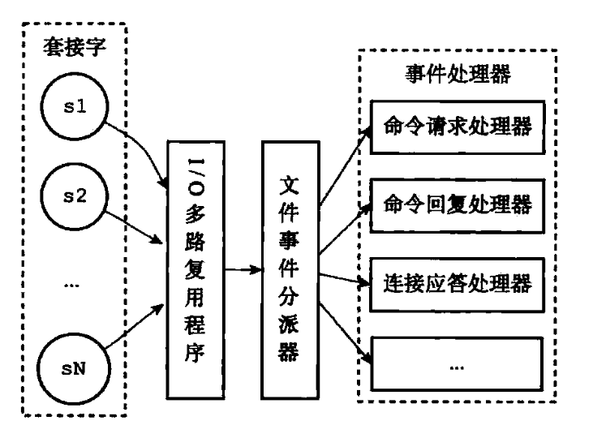
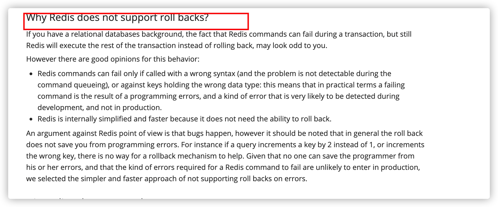
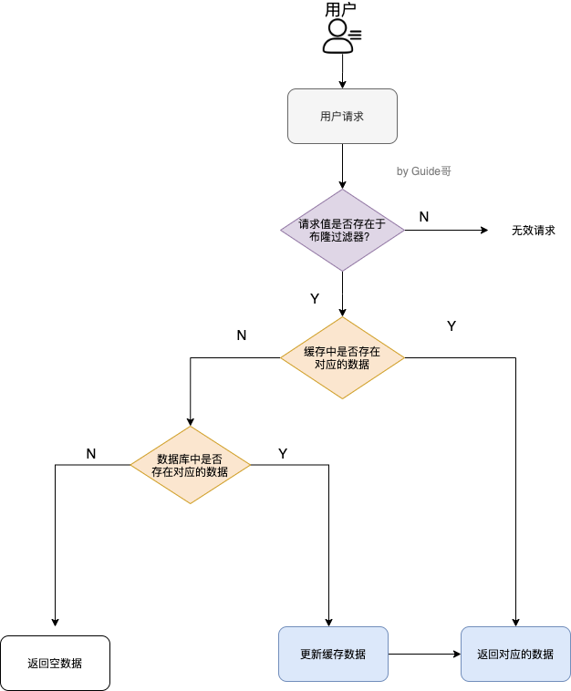

# Redis基础

Redis(Remote Dictionary Server) 是一个使用 C 语言编写的，开源的高性能非关系型（NoSQL）的键值对数据库。

与传统数据库不同的是 redis 的数据是存在**内存**中的，所以读写速度非常快，因此 redis 被广泛应用于**缓存**方向。

另外，**Redis 除了做缓存之外，Redis 也经常用来做分布式锁，甚至是消息队列。**redis 提供了多种数据类型来支持不同的业务场景。除此之外，redis 支持**事务 、持久化、分片、多种集群方案、LUA脚本、LRU驱动事件。**


## 简单认识Redis

### 缓存数据的处理流程


如果用户请求的数据在缓存中就直接返回。缓存中不存在的话就看数据库中是否存在，数据库中存在的话就更新缓存中的数据。数据库中不存在的话就返回空数据。

说明：这里的熔断是指存储层挂掉的时候，让客户端请求直接打在缓存上，不管有没有获取到数据都直接返回，这样能在有损的情况下对外提供服务。


### 为什么要用 Redis/为什么要用缓存

>  简单，来说使用缓存主要是为了提升用户体验以及应对更多的用户。**“高性能”+“高并发”**

**高性能** ：

假如用户第一次访问数据库中的某些数据的话，这个过程是比较慢，毕竟是从硬盘中读取的。但是，如果说，用户访问的数据属于高频数据并且不会经常改变的话，那么我们就可以很放心地将该用户访问的数据存在缓存中。

**这样有什么好处呢？** 那就是保证用户下一次再访问这些数据的时候就可以直接从缓存中获取了。操作缓存就是直接操作内存，所以速度相当快。

不过，要保持数据库和缓存中的数据的一致性。 如果数据库中的对应数据改变的之后，同步改变缓存中相应的数据即可！

**高并发：**

一般像 MySQL 这类的数据库的 QPS 大概都在 1w 左右（4 核 8g） ，但是使用 Redis 缓存之后很容易达到 10w+，甚至最高能达到 30w+（就单机 redis 的情况，redis 集群的话会更高）。

> QPS（Query Per Second）：服务器每秒可以执行的查询次数；

所以，直接操作缓存能够承受的数据库请求数量是远远大于直接访问数据库的，所以我们可以考虑把数据库中的部分数据转移到缓存中去，这样用户的一部分请求会直接到缓存这里而不用经过数据库。进而，我们也就提高的系统整体的并发。


### 分布式缓存常见的技术有哪些

分布式缓存使用的比较多的主要是 [Memcached](https://baike.baidu.com/item/memcached/1625373?fr=aladdin) 和 Redis。

Memcached 是分布式缓存最开始兴起的那会，比较常用的。后来，随着 Redis 的发展，大家慢慢都转而使用更加强大的 Redis 了。

分布式缓存主要解决的是单机缓存的容量受服务器限制并且无法保存通用的信息。因为，本地缓存只在当前服务里有效，比如如果你部署了两个相同的服务，他们两者之间的缓存数据是无法共同的。


### Redis和Memcached的区别


共同点 

- 都是基于内存的数据库，一般都用来当做缓存使用。
- 都有过期策略。
- 两者的性能都非常高。

**区别**

- **Redis 支持更丰富的数据类型**（支持更复杂的应用场景）。Redis 不仅仅支持简单的 k/v 类型的数据，同时还提供 list，set，zset，hash 等数据结构的存储。Memcached 只支持最简单的 k/v 数据类型。
- **Redis 支持数据的持久化**，可以将内存中的数据保持在磁盘中，重启的时候可以再次加载进行使用，而 Memecache 把数据全部存在内存之中。
- Redis 有灾难恢复机制。 因为可以把缓存中的数据持久化到磁盘上。
- **Redis支持主从同步**，Memcached 不支持。
- **Redis支持集群与分片。**Memcached 没有原生的集群模式，**需要依靠客户端**来实现往集群中分片写入数据；但是 Redis 目前是原生支持 cluster 模式的。
- Memcached 是多线程，非阻塞 IO 复用的网络模型；**Redis 使用单线程的多路 IO 复用模型。** （Redis 6.0 引入了多线程 IO ）
- Redis 支持**发布订阅模型、Lua 脚本、事务等功能**，而 Memcached 不支持。并且，Redis 支持更多的编程语言。
- Redis 在服务器内存使用完之后，可以将不用的数据放到磁盘上。但是，Memcached 在服务器内存使用完之后，就会直接报异常。
- Memcached过期数据的删除策略只用了惰性删除，而 Redis 同时使用了惰性删除与定期删除。

相信看了上面的对比之后，我们已经没有什么理由可以选择使用 Memcached 来作为自己项目的分布式缓存了。


### Redis为什么这么快

> 10万+QPS

内存、数据结构、单线程(和nginx很像)、epoll、VM

**1、完全基于内存**，绝大部分请求是纯粹的内存操作，非常快速。数据存在内存中，类似于 HashMap，HashMap 的优势就是查找和操作的时间复杂度都是O(1)；

**2、数据结构简单**，对数据操作也简单，没有关系型数据库中数据的关联，Redis中的数据结构是专门进行设计的。

**3、采用单线程**，避免了不必要的上下文切换和竞争条件，减少了CPU的消耗。并且不用去考虑各种锁的问题，不存在加锁释放锁操作，没有因为可能出现死锁而导致的性能消耗。

**4、使用多路 I/O 复用模型，非阻塞 IO；**

5、使用底层模型不同，它们之间底层实现方式以及与客户端之间通信的应用协议不一样，Redis 直接自己构建了 VM 机制 ，因为一般的系统调用系统函数的话，会浪费一定的时间去移动和请求；


## Redis单线程模型

> https://www.javazhiyin.com/22943.html
>
> TODO I/O多路复用学习之后，再重新看和总结慕课redis第一节

**Redis 基于 Reactor 模式来设计开发了自己的一套高效的事件处理模型 （Netty 的线程模型也基于 Reactor 模式**，Reactor 模式不愧是高性能 IO 的基石），这套事件处理模型对应的是 Redis 中的**文件事件处理器（file event handler）**。一直在强调的单线程，**只是文件事件处理器处理网络请求的时候只有一个线程来处理**，Redis进行持久化的时候会以子进程或者子线程的方式执行。

**既然是单线程，那怎么监听大量的客户端连接呢？**

**Redis 基于 Reactor 模式开发了自己的网络事件处理器**：这个处理器被称为**文件事件处理器**（file event handler）。

- 文件事件处理器使用 **I/O 多路复用（multiplexing）**程序来同时监听多个套接字， 并根据套接字目前执行的任务来为套接字关联不同的事件处理器。
- 当被监听的套接字准备好执行**连接应答（accept）、读取（read）、写入（write）、关闭（close）**等操作时， 与操作相对应的**文件事件**就会产生， 这时文件事件处理器就会调用套接字之前关联好的事件处理器来处理这些事件。
- **虽然文件事件处理器以单线程方式运行， 但通过使用 I/O 多路复用程序来监听多个套接字**， 文件事件处理器既实现了高性能的网络通信模型， 又让 Redis 不需要额外创建多余的线程来监听客户端的大量连接，降低了资源的消耗（和 NIO 中的 `Selector` 组件很像），保持了 Redis 内部单线程设计的简单性。



可以看出，文件事件处理器（file event handler）主要是包含 4 个部分：

- 多个 socket（客户端连接）
- IO 多路复用程序（支持多个客户端连接的关键）
- 文件事件分派器（将 socket 关联到相应的事件处理器）
- 事件处理器（连接应答处理器、命令请求处理器、命令回复处理器）


### 多路 I/O 复用模型 Todo

**这里“多路”指的是多个网络连接，“复用”指的是复用同一个线程。**

多路I/O复用模型是利用 select、poll、epoll 可以**同时监察多个流的 I/O 事件的能力**，在**空闲**的时候，会把当前线程**阻塞**掉，当有一个或多个流有 I/O 事件时，就从**阻塞态中唤醒**，于是程序就会**轮询**一遍所有的流（**epoll 是只轮询那些真正发出了事件的流**），并且只**依次顺序的处理就绪的流**，这种做法就避免了大量的无用操作。

采用多路 I/O 复用技术可以让单个线程高效的处理多个连接请求（尽量减少网络 IO 的时间消耗），且 Redis 在内存中操作数据的速度非常快，也就是说内存内的操作不会成为影响Redis性能的瓶颈，主要由以上几点造就了 Redis 具有很高的吞吐量。


### Redis为什么要采用单线程模型

> 虽然说 Redis 是单线程模型，但是， 实际上，**Redis 在 4.0 之后的版本中就已经加入了对多线程的支持。**不过，Redis 4.0 增加的多线程主要是针对一些大键值对的删除操作的命令，使用这些命令就会使用主处理之外的其他线程来“异步处理”。大体上来说，**Redis 6.0 之前主要还是单线程处理。**

**Redis的瓶颈最有可能是机器内存的大小或者网络带宽。单线程--够用且简单。单线程容易实现，而且CPU不会成为瓶颈，那就顺理成章地采用单线程的方案了**

1. <font color=red>**不存在上下文切换和竞争条件，避免了CPU的消耗。多线程就会存在死锁、线程安全，线程上下文切换等问题，甚至会影响性能。**</font>
   - list，hash等复杂的结构，这些结构有可能会进行很细粒度的操作，比如在很长的列表后面添加一个元素，在hash当中添加或者删除一个对象。这些操作可能就需要加非常多的锁，导致的结果是同步开销大大增加。

2. **Redis 的性能瓶颈不再 CPU ，主要在内存和网络。**
   - 实际上瓶颈在于网络，实际测试发现QPS峰值的时候CPU也没有跑满，CPU不是性能瓶颈。
3. 单线程编程容易并且更容易维护。
4. 更应该考虑的是集群方案。并且想利用多核也可以在一个机器上启动多个Redis实例。


#### 单线程处理不过来怎么办？/单核浪费吗

首先要明确的是redis虽然是单线程，但不是固定绑定在某个核上的。如果top -H发现cpu的利用率不高，可以配置conf文件来启动多实例。

**在同一个多核的服务器中，可以启动多个实例，组成master-master或者master-slave的形式，耗时的读命令可以完全在slave进行。**

也可以当做多个实例，只要客户端能分清哪些key放在哪个Redis进程上就可以了。


### Redis6.0 之后为何引入了多线程？

**Redis6.0 引入多线程主要是为了提高网络 IO 读写性能**，因为这个算是 Redis 中的一个性能瓶颈（Redis 的瓶颈主要受限于内存和网络）。

虽然，Redis6.0 引入了多线程，但是 Redis 的多线程只是在网络数据的读写这类耗时操作上使用了， 执行命令仍然是单线程顺序执行。因此，你也**不需要担心线程安全问题。**

Redis6.0 的多线程默认是禁用的，只使用主线程。如需开启需要修改 redis 配置文件 `redis.conf` ：

``` bash
io-threads-do-reads yes
```

开启多线程后，还需要设置线程数，否则是不生效的。同样需要修改 redis 配置文件 `redis.conf` :

``` bash
io-threads 4 #官网建议4核的机器建议设置为2或3个线程，8核的建议设置为6个线程
```

推荐阅读：

1. [Redis 6.0 新特性-多线程连环 13 问！](https://mp.weixin.qq.com/s/FZu3acwK6zrCBZQ_3HoUgw)
2. [为什么 Redis 选择单线程模型](https://draveness.me/whys-the-design-redis-single-thread/)


### 拓展：几种常见线程模型

**1、单进程多线程模型：MySQL、Memcached**、Oracle（Windows版本）；

2、多进程模型：Oracle（Linux版本）；

3、Nginx有两类进程，**一类称为Master进程(相当于管理进程)，另一类称为Worker进程（实际工作进程）。**启动方式有两种：

（1）单进程启动：此时系统中仅有一个进程，该进程既充当Master进程的角色，也充当Worker进程的角色。

（2）多进程启动：此时系统有且仅有一个Master进程，至少有一个Worker进程工作。

（3）Master进程主要进行一些全局性的初始化工作和管理Worker的工作；事件处理是在Worker中进行的。   平滑重启


## Redis过期

### Redis 给缓存数据设置过期时间有什么用？

#### 1.缓解内存消耗

一般情况下，我们设置保存的缓存数据的时候都会设置一个过期时间。为什么呢？

因为内存是有限的，如果缓存中的所有数据都是一直保存的话，分分钟直接Out of memory。

Redis 自带了给缓存数据设置过期时间的功能，比如：

``` bash
127.0.0.1:6379> exp key  60 # 数据在 60s 后过期
(integer) 1
127.0.0.1:6379> setex key 60 value # 数据在 60s 后过期 (setex:[set] + [ex]pire)
OK
127.0.0.1:6379> ttl key # 查看数据还有多久过期
(integer) 56
```

注意：**Redis中除了字符串类型有自己独有设置过期时间的命令 `setex` 外，其他方法都需要依靠 `expire` 命令来设置过期时间 。**

**`persist` 命令可以移除一个键的过期时间，使得 key 永不过期。** 

#### 2. 业务场景需求

很多时候，我们的业务场景就是需要某个数据只在某一时间段内存在，比如我们的短信验证码可能只在1分钟内有效，用户登录的 token 可能只在 1 天内有效。

如果使用传统的数据库来处理的话，一般都是自己判断过期，这样更麻烦并且性能要差很多。


### Redis是如何判断数据是否过期的

Redis 通过一个叫做过期字典（可以看作是hash表）来保存数据过期的时间。过期字典的键指向Redis数据库中的某个key(键)，过期字典的值是一个long long类型的整数，这个整数保存了key所指向的数据库键的过期时间（毫秒精度的UNIX时间戳）。 

过期字典是存储在redisDb这个结构里的：

``` c
typedef struct redisDb {
    ...
    
    dict *dict;     //数据库键空间,保存着数据库中所有键值对
    dict *expires   // 过期字典,保存着键的过期时间
    ...
} redisDb;
```


### 过期的数据的删除策略了解么？

如果假设你设置了一批 key 只能存活 1 分钟，那么 1 分钟后，Redis 是怎么对这批 key 进行删除的呢？

常用的过期数据的删除策略就两个（重要！自己造缓存轮子的时候需要格外考虑的东西）：

1. **惰性删除** ：只会在取出key的时候才对数据进行过期检查。这样对CPU最友好，但是可能会造成太多过期 key 没有被删除。
2. **定期删除** ： 每隔一段时间抽取一批 key 执行删除过期key操作。并且，Redis 底层会通过限制删除操作执行的时长和频率来减少删除操作对CPU时间的影响。

定期删除对内存更加友好，惰性删除对CPU更加友好。两者各有千秋，所以Redis 采用的是 **定期删除+惰性/懒汉式删除** 。

但是，仅仅通过给 key 设置过期时间还是有问题的。因为还是可能存在定期删除和惰性删除漏掉了很多过期  key 的情况。这样就导致大量过期 key 堆积在内存里，然后就Out of memory了。

怎么解决这个问题呢？答案就是： **Redis 内存淘汰机制。**


**如果集中过期，由于清除大量的key很耗时，会出现短暂的卡顿现象。**

解决方法：在设置key的过期时间的时候，给每个key加上随机值。


## Redis删除策略

**删除的策略需要在内存和cpu之间寻找一个平衡， 定时删除+惰性删除  折中的定期删除**

通过名字大概就能猜出这两个删除方式的意思了。

- **定时过期**：每个设置过期时间的key都需要创建一个定时器，到过期时间就会立即清除。该策略可以立即清除过期的数据，对内存很友好；但是会占用大量的CPU资源去处理过期的数据，从而影响缓存的响应时间和吞吐量。
- **惰性删除** ：只有当访问一个key时，才会判断该key是否已过期，过期则清除。该策略可以最大化地节省CPU资源，却对内存非常不友好。极端情况可能出现大量的过期key没有再次被访问，从而不会被清除，占用大量内存。
- **定期过期**：每隔一定的时间，会扫描一定数量的数据库的expires字典中一定数量的key，并清除其中已过期的key。该策略是前两者的一个折中方案。通过调整定时扫描的时间间隔和每次扫描的限定耗时，可以在不同情况下使得CPU和内存资源达到最优的平衡效果。

(expires字典会保存所有设置了过期时间的key的过期时间数据，其中，key是指向键空间中的某个键的指针，value是该键的毫秒精度的UNIX时间戳表示的过期时间。键空间是指该Redis集群中保存的所有键。

定期过期策略由位于src/redis.c的activeExpireCycle(void)函数，针对每个db在限制的时间REDIS_EXPIRELOOKUPS_TIME_LIMIT内尽可能多的删除过期key。因此，**Redis会周期性的随机测试一批设置了过期时间的key并进行处理。**测试到的已过期的key将被删除。


info查看：


key的定期删除会在Redis的周期性执行任务（serverCron，默认每100ms执行一次）中进行，而且是发生Redis的master节点，因为**slave节点会通过主节点的DEL命令同步过来达到删除key的目的。**

典型例子：

Redis启动服务器初始化时,读取配置server.hz的值,默认为10，代表每秒钟调用10次`serverCorn`的后台任务。 Redis每秒做10次如下的步骤：

- 依次遍历每个db（默认配置数是16），针对每个db，每次循环随机选择`ACTIVE_EXPIRE_CYCLE_LOOKUPS_PER_LOOP`个-20个key判断是否过期
- 删除所有发现的已过期的key
- 如果一轮所选的key少于`ACTIVE_EXPIRE_CYCLE_LOOKUPS_PER_LOOP`/4，也就是少于25%的key过期，则终止迭次。
- 若删除的key超过25%，则重复步骤1，此外在迭代过程中如果超过了一定的时间限制则终止过期删除这一过程。

这是一个基于概率的简单算法，基本的假设是抽出的样本能够代表整个key空间，redis持续清理过期的数据直至将要过期的key的百分比降到了25%以下。这也意味着在任何给定的时刻已经过期但仍占据着内存空间的key的量最多为每秒的写操作量除以4。

```C
for (j = 0; j < dbs_per_call; j++) {
 int expired;
 redisDb *db = server.db+(current_db % server.dbnum);
 
 /* Increment the DB now so we are sure if we run out of time
  * in the current DB we'll restart from the next. This allows to
  * distribute the time evenly across DBs. */
 current_db++;
 
 /* Continue to expire if at the end of the cycle more than 25%
  * of the keys were expired. */
 do {
  unsigned long num, slots;
  long long now, ttl_sum;
  int ttl_samples;
 
  /* 如果该db没有设置过期key，则继续看下个db*/
  if ((num = dictSize(db->expires)) == 0) {
   db->avg_ttl = 0;
   break;
  }
  slots = dictSlots(db->expires);
  now = mstime();
 
  /* When there are less than 1% filled slots getting random
   * keys is expensive, so stop here waiting for better times...
   * The dictionary will be resized asap. */
  if (num && slots > DICT_HT_INITIAL_SIZE &&
   (num*100/slots < 1)) break;
 
  /* The main collection cycle. Sample random keys among keys
   * with an expire set, checking for expired ones. */
  expired = 0;
  ttl_sum = 0;
  ttl_samples = 0;
 
  if (num > ACTIVE_EXPIRE_CYCLE_LOOKUPS_PER_LOOP)
   num = ACTIVE_EXPIRE_CYCLE_LOOKUPS_PER_LOOP;// 20
 
  while (num--) {
   dictEntry *de;
   long long ttl;
 
   if ((de = dictGetRandomKey(db->expires)) == NULL) break;
   ttl = dictGetSignedIntegerVal(de)-now;
   if (activeExpireCycleTryExpire(db,de,now)) expired++;
   if (ttl > 0) {
    /* We want the average TTL of keys yet not expired. */
    ttl_sum += ttl;
    ttl_samples++;
   }
  }
 
  /* Update the average TTL stats for this database. */
  if (ttl_samples) {
   long long avg_ttl = ttl_sum/ttl_samples;
 
   /* Do a simple running average with a few samples.
    * We just use the current estimate with a weight of 2%
    * and the previous estimate with a weight of 98%. */
   if (db->avg_ttl == 0) db->avg_ttl = avg_ttl;
   db->avg_ttl = (db->avg_ttl/50)*49 + (avg_ttl/50);
  }
 
  /* We can't block forever here even if there are many keys to
   * expire. So after a given amount of milliseconds return to the
   * caller waiting for the other active expire cycle. */
  iteration++;
  if ((iteration & 0xf) == 0) { /* 每迭代16次检查一次 */
   long long elapsed = ustime()-start;
 
   latencyAddSampleIfNeeded("expire-cycle",elapsed/1000);
   if (elapsed > timelimit) timelimit_exit = 1;
  }
 // 超过时间限制则退出
  if (timelimit_exit) return;
  /* 在当前db中，如果少于25%的key过期，则停止继续删除过期key */
 } while (expired > ACTIVE_EXPIRE_CYCLE_LOOKUPS_PER_LOOP/4);
}
```

但是，仅仅通过给 key 设置过期时间还是有问题的。因为还是可能存在定期删除和惰性删除漏掉了很多过期  key 的情况。这样就导致大量过期 key 堆积在内存里，然后就Out of memory了。

怎么解决这个问题呢？答案就是： **Redis 内存淘汰机制。**


## Redis内存淘汰机制

**Redis的内存用完了会发生什么？**

如果达到设置的上限，Redis的写命令会返回错误信息（但是读命令还可以正常返回）或者可以配置内存淘汰机制，当Redis达到内存上限时会冲刷掉旧的内容。

### Redis 内存淘汰机制了解么

Redis 提供 6 种数据淘汰策略：

1. **volatile-lru（least recently used）**：从已设置过期时间的数据集（server.db[i].expires）中挑选最近最少使用的数据淘汰
2. **volatile-ttl**：从已设置过期时间的数据集（server.db[i].expires）中挑选将要过期的数据淘汰
3. **volatile-random**：从已设置过期时间的数据集（server.db[i].expires）中任意选择数据淘汰
4. **allkeys-lru（least recently used）**：当内存不足以容纳新写入数据时，在键空间中，移除最近最少使用的 key（这个是最常用的）
5. **allkeys-random**：从数据集（server.db[i].dict）中任意选择数据淘汰
6. **no-eviction**：禁止驱逐数据，也就是说当内存不足以容纳新写入数据时，新写入操作会报错。这个应该没人使用吧！

4.0 版本后增加以下两种：

7. **volatile-lfu（least frequently used）**：从已设置过期时间的数据集(server.db[i].expires)中挑选最不经常使用的数据淘汰
8. **allkeys-lfu（least frequently used）**：当内存不足以容纳新写入数据时，在键空间中，移除最不经常使用的 key

**最好是代码层面主动更新。**

- LRU、LFU 算法自动清除：一致性最差，维护成本低。
- 超时自动清除(key expire)：一致性较差，维护成本低。
- 主动更新：代码层面控制生命周期，一致性最好，维护成本高。

**MySQL 里有 2000w 数据，Redis 中只存 20w 的数据，如何保证 Redis 中的数据都是热点数据?**

**首先计算出20w数据所需的内存空间，设置最大内存，然后选择合适的内存淘汰策略：**

如果数据呈现幂律分布，一部分数据访问频率高，一部分数据访问频率低，则可以使用allkeys-lru或allkeys-lfu；

如果数据呈现平等分布，所有的数据访问频率都相同，则使用allkeys-random。


# Redis数据结构

## 基础命令

[通俗易懂的Redis数据结构基础教程](https://juejin.cn/post/6844903644798664712)

可以自己本机安装 redis 或者通过 redis 官网提供的[在线 redis 环境](https://try.redis.io/)。

> Java客户端一般使用Jedis，Go一般使用go-redis。但实际工作中也要会redis的命令，可能会直接查询。

Redis的单个操作是原子性的（单线程模型），不用考虑线程安全问题。像这种incr的加操作，不用使用者同步或者加锁。

Redis都是按string类型存入数据的。

除了常用的五种，还有用于计数的HyperLogLog，支持存储地理位置信息的Geo。**Todo，抽个把小时了解。**

### 1. String

> 常用命令: set,get,decr,incr,mget 等。

String数据结构是简单的key-value类型，value其实不仅可以是String，也可以是数字。 常规key-value缓存应用； 常规计数：用户的访问次数、热点文章的点赞转发数量等等，库存数等。

最常用：

```sh
127.0.0.1:6379> set name "redis" #设置 key-value 类型的值
OK
127.0.0.1:6379> get name # 根据 key 获得对应的 value
"redis"
127.0.0.1:6379> exists key  # 判断某个 key 是否存在
(integer) 1
127.0.0.1:6379> strlen key # 返回 key 所储存的字符串值的长度。
(integer) 5
127.0.0.1:6379> del key # 删除某个 key 对应的值
(integer) 1
127.0.0.1:6379> get key
(nil)
```

批量设置 :

```sh
127.0.0.1:6379> mset key1 value1 key2 value2 # 批量设置 key-value 类型的值
OK
127.0.0.1:6379> mget key1 key2 # 批量获取多个 key 对应的 value
1) "value1"
2) "value2"
```

计数器：

字符串的内容为整数的时候可以使用

```sh
127.0.0.1:6379> set number 1
OK
127.0.0.1:6379> incr number # 将 key 中储存的数字值增一
(integer) 2
127.0.0.1:6379> get number
"2"
127.0.0.1:6379> decr number # 将 key 中储存的数字值减一
(integer) 1
127.0.0.1:6379> get number
"1"
```

过期：

```sh
127.0.0.1:6379> expire key  60 # 数据在 60s 后过期
(integer) 1
127.0.0.1:6379> setex key 60 value # 数据在 60s 后过期 (setex:[set] + [ex]pire)
OK
127.0.0.1:6379> ttl key # 查看数据还有多久过期
(integer) 56
```


### 2. List

> 常用命令: lpush,rpush,lpop,rpop,lrange等

list 就是链表，Redis list 的应用场景非常多，比如发布与订阅或者说消息队列、[慢查询](https://blog.csdn.net/qianghaohao/article/details/81052461)，微博的关注列表，粉丝列表，消息列表等功能都可以用Redis的 list 结构来实现。

Redis list 的实现为一个双向链表，即可以支持反向查找和遍历，更方便操作，不过带来了部分额外的内存开销。**添加删除操作就叫push和pop，显然可以实现Stack的功能，后入先出，因此可以实现最新消息排行榜等。**

另外可以通过 lrange 命令，就是从某个元素开始读取多少个元素，可以基于 list 实现分页查询，这个很棒的一个功能，基于 redis 实现简单的高性能分页，可以做类似微博那种下拉不断分页的东西（一页一页的往下走），性能高。

```sh
lpush list_key 1 2 3  #从左到右顺序是3，2，1  依次放到左边
lrange list_key 0 10   #从左往右，从0开始，取出10个。 顺序是3 2 1 
lrange key 0 -1    #全部显示 
lpop key              删除链表的最左边元素并返回
rpop key              删除链表的最右边元素并返回
del key               删除链表
llen myList
```


### 3. Hash

> 常用命令： hset,hmset,hget,hdel,del;   hexists,hgetall,hkeys,hvals
>
> 应用场景: 系统中对象数据的存储。Json格式

hash 是一个 string 类型的 field 和 value 的映射表，**hash 特别适合用于存储对象，每个对象有field，有getter和setter。**比如我们可以 hash 数据结构来存储用户信息，商品信息等等。

```sh
127.0.0.1:6379> hmset lilei name "lilei" description "dev" age 24
OK
127.0.0.1:6379> hget lilei age # 获取存储在哈希表中指定字段的值。
"24"
127.0.0.1:6379> hset lieli age 23 # 修改某个字段对应的值
127.0.0.1:6379> hexists lieli name # 查看 key 对应的 value中指定的字段是否存在。
(integer) 1

hdel lilei age  //只删除field name
del lilei //删除这个对象的所有hashtable 都没了
```

批量：

```sh
127.0.0.1:6379> hgetall lilei # 获取在哈希表中指定 key 的所有字段和值
1) "name"
2) "lilei"
3) "description"
4) "dev"
5) "age"
6) "23"
127.0.0.1:6379> hkeys key_name # 获取 field 列表
1) "name"
2) "age"
3) "description "
127.0.0.1:6379> hvals key_name # 获取 value 列表
1) "guide"
2) "dev"
3) "24"
```


### 4. Set

> 常用命令： sadd, smembers, spop,srem,sunion 等

通过哈希实现，添加查找删除都是O(1)，不允许重复。**无序存储**

当你需要存储一个列表数据，又不希望出现重复数据时，set是一个很好的选择，并且set提供了判断某个成员是否在一个set集合内的重要接口，这个也是list所不能提供的。可以基于 set 轻易实现**交集、并集、差集的操作。**

比如：在微博应用中，可以将一个用户所有的关注人存在一个集合中，将其所有粉丝存在一个集合。Redis可以非常方便的实现如**共同关注、共同粉丝、共同喜好**等功能。这个过程也就是求交集的过程，具体命令如下：

```sh
127.0.0.1:6379> sadd mySet value1 value2 # 添加元素进去，返回结果代表成功个数
(integer) 2   
127.0.0.1:6379> sadd mySet value1 # 不允许有重复元素
(integer) 0
127.0.0.1:6379> smembers mySet # 查看 set 中所有的元素
1) "value1"
2) "value2"
srem key value  #删除(remove)key集合中的某个value
scard mySet 	# 查看 set 的长度
```

```sh
127.0.0.1:6379> scard mySet # 查看 set 的长度
(integer) 2
127.0.0.1:6379> sismember mySet value1 # 检查某个元素是否存在set 中，只能接收单个元素
(integer) 1
127.0.0.1:6379> sadd mySet2 value2 value3
(integer) 2
# 获取 mySet 和 mySet2 的交集并存放在 mySet3 中
127.0.0.1:6379> sinterstore mySet3 mySet mySet2 
(integer) 1
127.0.0.1:6379> smembers mySet3
1) "value2"
```


### 5. Sorted Set

> 常用命令： zadd,zrange,zrange,zrem,zcard等

和set相比，sorted set增加了一个权重参数score，使得集合中的元素能够**按score进行有序排列。**成员是唯一的，分数是可以重复的

举例： 在直播系统中，实时排行信息包含直播间在线用户列表，各种礼物排行榜，弹幕消息（可以理解为按消息维度的消息排行榜）等信息，适合使用 Redis 中的 Sorted Set 结构进行存储。

还可以作为带权重的队列，比如普通消息的score为2，重要消息的score为1，工作线程可以按照score的大小获取任务，让重要的任务优先执行。

```sh
存储：zadd key score value [score value2 [score value3...]]
> zadd myzset 1 mkx
> zadd myzset 2 ccs

zrangebyscore myzset 0 10 #=zrange 按照顺序获取  从0开始 获取10个 分数越小排名越靠前 
1) "mkx"
2) "ccs"

zscore myZset value1 # 查看某个 value 的权重

zrange myzset 0 10  #不按照顺序获取

zcard myZset # 查看 sorted set 中的元素数量

zrem key value   #删除某个value
```


## 底层实现原理

### 1. String——SDS

string 数据结构是简单的 key-value 类型。虽然 Redis 是用 C 语言写的，但是 Redis 并没有使用 C 的字符串表示，而是自己构建了一种 **简单动态字符串**（simple dynamic string，**SDS**）。相比于 C 的原生字符串，Redis 的 SDS 不光可以保存文本数据还可以保存二进制数据，并且获取字符串长度复杂度为 O(1)（C 字符串为 O(N)，除此之外,Redis 的 SDS API 是安全的，不会造成缓冲区溢出。

### 2. List——双向链表

**list** 即是 **链表**。链表是一种非常常见的数据结构，特点是易于数据元素的插入和删除并且且可以灵活调整链表长度，但是链表的随机访问困难。许多高级编程语言都内置了链表的实现比如 Java 中的 **LinkedList**，但是 C 语言并没有实现链表，所以 Redis 实现了自己的链表数据结构。Redis 的 list 的实现为一个 **双向链表**，即可以支持反向查找和遍历，更方便操作，不过带来了部分额外的内存开销。

### 3. Hash 

hash 类似于 JDK1.8 前的 HashMap，内部实现也差不多(数组 + 链表)。不过，Redis 的 hash 做了更多优化。

# Redis 持久化机制

> 很多时候我们需要持久化数据也就是将内存中的数据写入到硬盘里面，大部分原因是为了之后重用数据（比如重启机器、机器故障之后恢复数据），或者是为了防止系统故障而将数据备份到一个远程位置。

https://www.cnblogs.com/wdliu/p/9377278.html

Redis不同于Memcached的很重要一点就是，Redis支持持久化，而且支持两种不同的持久化操作。**一种持久化方式叫快照（snapshotting，RDB(Redis DataBase)），另一种方式是只追加文件（append-only file,AOF）**。

**RBD——基于快照方式的持久化  主从复制也是使用rbd的快照**

​	**在某时刻把所有数据进行完整备份**

**AOF——基于写日志方式的持久化**

​	把用户执行的所有**写指令（增删改）备份到文件**中，还原数据时只需要把备份的所有指令重新执行一遍**。**


**RBD vs AOD**

- AOF文件比RDB更新频率高，优先使用AOF还原数据
- AOF比RDB更安全也更大
- RDB性能比AOF好,RDB 恢复数据集的速度也要比AOF恢复的速度要快
- 如果两个都配了优先加载AOF


## RDB 快照（snapshotting）持久化

>  **多长时间以后，至少有多少个key发生变化，自动触发BGSAVE持久化。**

RDB是Redis默认的持久化方式。**保存某个时间点的全量数据快照**，对应产生的数据文件为./src/dump.rdb(二进制文件)。

Redis创建快照之后，可以对快照进行备份，可以将快照复制到其他服务器从而**创建具有相同数据的服务器副本**（Redis主从结构，主要用来提高Redis性能），还可以将快照留在原地以便重启服务器的时候使用。


### 什么时候会触发RBD快照持久化

**BGSAVE命令：**BG即Backgroud-后台。后台方式进行持久化，客户端调用此命令会立即返回OK，主进程会立刻恢复对客户端的服务。Redis主进程会调用fork来创建一个子进程，然后子进程负责将快照写入硬盘，而父进程则继续处理命令请求，不阻塞服务器进程。

**SAVE命令：** 客户端还可以向Redis发送 **SAVE命令** 来创建一个快照，接到SAVE命令的Redis服务器在快照创建完毕之前不会再响应任何其他命令。SAVE命令不常用，我们通常只会在没有足够内存去执行BGSAVE命令的情况下，又或者即使等待持久化操作执行完毕也无所谓的情况下，才会使用这个命令。

客户端用`lastsave`命令可以获取上一次成功执行`SAVE`或`BGSAVE`的时间。

```sh
>save
OK
(18.31S)
>bgsave
Background saving started   #立即返回
```

可以java计时器定时调用BGSAVE指令，定期备份RDB文件，根据时间戳按时间存放dump.rdb文件。

**save选项：**根据redis.conf配置里面的SAVE m n 定时触发(用的是BGSAVE)。

```shell
#平衡性能与数据安全
#在900秒(15分钟)之后，如果至少有1个key发生变化，Redis就会自动触发`BGSAVE`命令创建快照。
save 900 1      

#在300秒(5分钟)之后，如果至少有10个key发生变化，Redis就会自动触发BGSAVE命令创建快照。
save 300 10     

#在60秒(1分钟)之后，如果至少有10000个key发生变化，Redis就会自动触发BGSAVE命令创建快照。
save 60 10000   
#加上这一句会禁用RBD配置
save "" 


#当备份进程出错的时候，主进程停止接受新的写入操作——保护持久化数据的一致性 
#如果有完善的监控系统，可以设置no，否则请开启
stop-writes-on-bgsave-error yes

#在备份的时候，压缩rdb文件之后，才做保存。
#建议设置为no redis本身就是cpu密集型服务器，如果开启压缩，会带来更多的CPU消耗 相比硬盘成本，CPU更值钱
rdbcompression yes
```

**一个Redis服务器连接到另一个Redis服务器：** 当一个Redis服务器连接到另一个Redis服务器，并向对方发送SYNC命令来开始一次复制操作的时候，如果主服务器目前没有执行BGSAVE操作，或者主服务器并非刚刚执行完BGSAVE操作，那么主服务器就会执行BGSAVE命令。  **最典型的是：主从复制时，主节点会自动触发**

**执行Debug Reload时**

**SHUTDOWN命令：**  当Redis通过SHUTDOWN命令接收到关闭服务器的请求时，或者接收到标准TERM信号时，如果没有开启AOF持久化，会执行一个SAVE命令，阻塞所有客户端，不再执行客户端发送的任何命令，并在SAVE命令执行完毕之后关闭服务器。


#### BGSAVE原理

> fork() + copyonwrite

**fork**

fork()的实际开销就是复制父进程的页表以及给子进程创建一个进程描述符，所以速度一般比较快。

fork()出来的子进程共享其父类的内存数据。仅仅是共享fork()出子进程的那一刻的内存数据——**快照**，后期主进程修改数据对子进程不可见。子进程出现问题，不影响父进程，父进程出现问题，子进程也会挂掉。

**copyonwrite**

主进程fork()子进程之后，内核把主进程中所有的内存页的权限都设为read-only，然后子进程的地址空间指向主进程，这也就是共享了主进程的内存。当其中某个进程写内存时，CPU硬件检测到内存页是read-only的，于是触发页异常中断（page-fault），陷入内核的一个中断例程。中断例程中，**内核就会把触发的异常的页复制一份**，于是主子进程各自持有独立的一份，其余的页还是共享主进程的。

也就是说：**直到主进程修改共享资源时，系统才会真正复制一份给主进程，而子进程所见到的快照不变。**这样不需要复制内存，实现了并发的读，节省了很多性能和资源的消耗。


#### RBD的优缺点分析

**优点：**全量数据快照，文件小，恢复快。

1. RDB 是一个非常紧凑的文件，它保存了 Redis 在某个时间点上的数据集。 这种文件**非常适合用于进行备份——主从复制**： 比如说，你可以在最近的 24 小时内，每小时备份一次 RDB 文件，并且在每个月的每一天，也备份一个 RDB 文件。 这样的话，即使遇上问题，也可以随时将数据集还原到不同的版本。
2. RDB 非常适用于灾难恢复：它只有一个文件，并且内容都非常紧凑，可以（在加密后）将它传送到别的数据中心。
3. RDB 在恢复大数据集时的速度比 AOF 的恢复速度要快。

**缺点：**

1. **数据安全性低。**RDB 是间隔一段时间进行持久化，如果持久化之间 redis 发生故障，会发生数据丢失。所以这种方式更适合数据要求不严谨的时候。


## AOF append-only file

与快照持久化相比，AOF持久化的**实时性更好**，因此已成为主流的持久化方案。当两种方式同时开启时，数据恢复Redis会优先选择AOF恢复。

默认情况下Redis没有开启AOF（append only file）方式的持久化，可以通过appendonly参数开启：

```sh
appendonly no #改为yes即可开启
```

在Redis的配置文件redis.conf中存在三种同步方式，它们分别是：

```sh
#appendfsync always     
appendfsync everysec    
#appendfsync no       
```

always:命令写入aof_buf后调用系统fsync操作同步到AOF文件，fsync完成后线程返回。配置为always时，每次写入都要同步AOF文件，这样会严重降低Redis的速度。在一般的SATA硬盘上，Redis只能支持大约几百TPS写入，显然跟Redis高性能特性背道而驰，不建议配置。

everysec:命令写入aof_buf后调用系统write操作，write完成后线程返回。fsync同步文件操作由专门线程每秒调用一次。 配置为everysec，**是建议的同步策略，也是默认配置，做到兼顾性能和数据安全性。理论上只有在系统突然宕机的情况下丢失1秒的数据。**

no:让操作系统决定何时进行同步 不推荐，一般为了提高效率，操作系统会等待缓存区填满才会同步数据到磁盘中。由于操作系统每次同步AOF文件的周期不可控，而且会加大每次同步硬盘的数据量，虽然提升了性能，但数据安全性无法保证。

### AOF过程

AOF持久化会把除查询以外的所有指令都以append的方式追加到AOF文件中。

1）所有的写入命令会追加到aof_buf缓冲区中。

2）AOF缓冲区根据对应的策略向硬盘做同步操作。

3）随着AOF文件越来越大，需要定期对AOF文件进行重写，达到压缩的目的。（用到了AOF_rewrite_buf）

4）当Redis服务器重启时，可以加载AOF文件进行数据恢复。

### AOF重写

>  AOF 重写是一个有歧义的名字，**该功能是通过读取数据库中的键值对来实现的**，程序无须对现有 AOF 文件进行任何读入、分析或者写入操作。

AOF日志文件是纯追加的文件，随着写操作的增加，AOF文件会越来越大，极端的情况下，体积不断增大的AOF文件很可能会用完硬盘空间。另外，如果AOF体积过大，那么还原操作执行时间就可能会非常长。例如递增一个计数器1000次，其实只需要保留最终的结果1000即可，但是AOF文件会把这1000次记录完整记录下来。因此Redis支持日志重写，在不中断服务的情况下在后台重建AOF文件。

重写AOF并不需要读取旧的AOF文件进行命令分析或合并，直接去内存中读取当前Redis数据库中的数据即可，记录所有没有过期的数据，生成添加这些数据的记录。

重写过程：

- 调用fork()，创建一个子进程。启用AOF重写缓存 `AOF_rewrite_buf`
- 子进程把新的AOF写到一个临时文件里，写命令的过程不依赖于原来的AOF文件
- **主进程持续将新的变动命令同时写到AOF 重写缓存**和原来的AOF里
  - 这样一来可以保证：
    1. 现有的 AOF 功能会继续执行，即使在 AOF 重写期间发生停机，也不会有任何数据丢失。
    2. 所有对数据库进行修改的命令都会被记录到 AOF 重写缓存中。
- 主进程获取子进程重写AOF完成的信号，然后往新的AOF同步AOF重写缓存中的增量变动
- 使用新的AOF文件替换掉旧的AOF文件


**AOF 重写可以由用户通过调用 `BGREWRITEAOF` 手动触发。**
每次当 `serverCron` 函数执行时， 它都会检查以下条件是否全部满足， 如果是的话， 就会触发自动的 AOF 重写：

- 没有 BGSAVE 命令在进行。
- 没有 BGREWRITEAOF 在进行。
- 当前 AOF 文件大小 `aof_current_size` 大于 `server.aof_rewrite_min_size` （默认值为 1 MB）。
- 当前 AOF 文件大小和最后一次 AOF重写后的大小 `aof_rewrite_base_size` 之间的比率大于等于指定的增长百分比 `aof_rewrite_perc` 。
  - 默认情况下， 增长百分比为 100% ， 也即是说， 如果前面三个条件都已经满足， 并且当前 AOF 文件大小比最后一次 AOF 重写时的大小要大一倍的话， 那么触发自动 AOF 重写。

**自动执行BGREWRITEAOF命令**

和快照持久化可以通过设置save选项来自动执行BGSAVE一样，AOF持久化也可以通过设置

```
auto-aof-rewrite-percentage
```

选项和

```
auto-aof-rewrite-min-size
```

选项自动执行BGREWRITEAOF命令。举例：假设用户对Redis设置了如下配置选项并且启用了AOF持久化。那么当AOF文件体积大于64mb，并且AOF的体积比上一次重写之后的体积大了至少一倍（100%）的时候，Redis将执行BGREWRITEAOF命令。

```
auto-aof-rewrite-percentage 100  
auto-aof-rewrite-min-size 64mb
```

无论是AOF持久化还是快照持久化，将数据持久化到硬盘上都是非常有必要的，但除了进行持久化外，用户还必须对持久化得到的文件进行备份（最好是备份到不同的地方），这样才能尽量避免数据丢失事故发生。如果条件允许的话，最好能将快照文件和重新重写的AOF文件备份到不同的服务器上面。

随着负载量的上升，或者数据的完整性变得 越来越重要时，用户可能需要使用到复制特性。


AOF执行过程：伪代码（了解）

```python
def AOF_REWRITE(tmp_tile_name):

  f = create(tmp_tile_name)

  # 遍历所有数据库
  for db in redisServer.db:

    # 如果数据库为空，那么跳过这个数据库
    if db.is_empty(): continue

    # 写入 SELECT 命令，用于切换数据库
    f.write_command("SELECT " + db.number)

    # 遍历所有键
    for key in db:

      # 如果键带有过期时间，并且已经过期，那么跳过这个键
      if key.have_expire_time() and key.is_expired(): continue

      if key.type == String:

        # 用 SET key value 命令来保存字符串键

        value = get_value_from_string(key)

        f.write_command("SET " + key + value)

      elif key.type == List:

        # 用 RPUSH key item1 item2 ... itemN 命令来保存列表键

        item1, item2, ..., itemN = get_item_from_list(key)

        f.write_command("RPUSH " + key + item1 + item2 + ... + itemN)

      elif key.type == Set:

        # 用 SADD key member1 member2 ... memberN 命令来保存集合键

        member1, member2, ..., memberN = get_member_from_set(key)

        f.write_command("SADD " + key + member1 + member2 + ... + memberN)

      elif key.type == Hash:

        # 用 HMSET key field1 value1 field2 value2 ... fieldN valueN 命令来保存哈希键

        field1, value1, field2, value2, ..., fieldN, valueN =\
        get_field_and_value_from_hash(key)

        f.write_command("HMSET " + key + field1 + value1 + field2 + value2 +\
                        ... + fieldN + valueN)

      elif key.type == SortedSet:

        # 用 ZADD key score1 member1 score2 member2 ... scoreN memberN
        # 命令来保存有序集键

        score1, member1, score2, member2, ..., scoreN, memberN = \
        get_score_and_member_from_sorted_set(key)

        f.write_command("ZADD " + key + score1 + member1 + score2 + member2 +\
                        ... + scoreN + memberN)

      else:

        raise_type_error()

      # 如果键带有过期时间，那么用 EXPIREAT key time 命令来保存键的过期时间
      if key.have_expire_time():
        f.write_command("EXPIREAT " + key + key.expire_time_in_unix_timestamp())

    # 关闭文件
    f.close()
```

### AOF优缺点分析

**优点：**

1. **数据安全**，aof 持久化可以配置 appendfsync 属性，有 always，每进行一次命令操作就记录到 aof 文件中一次。
2. 通过 append 模式写文件，即使中途服务器宕机，可以通过 redis-check-aof 工具解决数据一致性问题。

**缺点：**

1. AOF 文件比 RDB 文件大，且恢复速度慢。

2. 数据集大的时候，比 rdb 启动效率低。


## Redis启动时的数据加载


Redis启动数据加载流程：

1. AOF持久化开启且存在AOF文件时，优先加载AOF文件。
2. AOF关闭或者AOF文件不存在时，加载RDB文件。
3. 加载AOF/RDB文件成功后，Redis启动成功。
4. AOF/RDB文件存在错误时，Redis启动失败并打印错误信息。


### RBD、AOF混合持久化方式 

> 了解

Redis 4.0 开始支持 RDB 和 AOF 的混合持久化（默认关闭，可以通过配置项 `aof-use-rdb-preamble` 开启，yes则表示开启，no表示禁用，默认是禁用的，可通过config set修改。）。

如果把混合持久化打开，**AOF 重写的时候就直接把 RDB 的内容写到 AOF 文件开头。**这样做的好处是可以结合 RDB 和 AOF 的优点, 快速加载同时避免丢失过多的数据。当然缺点也是有的， AOF 里面的 RDB 部分是压缩格式不再是 AOF 格式，可读性较差。

混合持久化同样也是通过`bgrewriteaof`完成的，不同的是当开启混合持久化时，fork出的子进程先将共享的内存副本全量的以RDB方式写入aof文件，然后在将重写缓冲区的增量命令以AOF方式写入到文件，写入完成后通知主进程更新统计信息，并将新的含有RDB格式和AOF格式的AOF文件替换旧的的AOF文件。简单的说：**新的AOF文件前半段是RDB格式的全量数据后半段是AOF格式的增量数据。**

当我们开启了混合持久化时，启动redis依然优先加载aof文件，aof文件加载可能有两种情况如下：

- aof文件开头是rdb的格式, 先加载 rdb内容再加载剩余的 aof。
- aof文件开头不是rdb的格式，直接以aof格式加载整个文件。


# Redis应用

## 如何从海量数据中查询某一前缀的key

**面试中遇到数据问题，要摸清数据规模，即问清楚边界。**比如面试官可能问如何从redis中找出某类固定前缀的key。

**1. 数据量很小，或者非线上业务，可以使用keys指令**

`KEYS pattern` 查找所有符合给定模式的pattern的key。

```sh
>dbsize #redis中key的数量
(integer) 20000000
>keys k1* #返回所有以k1开头的key
```

keys的缺点，一次性返回所有匹配的key，数据量大的时候，会使服务卡顿，对内存的消耗和redis的服务器都是隐患。

**2. 推荐方法** **Scan命令**

`Scan cursor [MATCH PATTERN] [COUNT count]`

- cursor是游标，需要基于上一次调用scan命令返回的cursor延续之前的迭代过程

- 以0作为游标开始一次新的迭代，直到命令返回游标0完成一次遍历

- 并不保证每次执行都会返回给定count数量的元素，且不能保证重复。可以放入Set排除重复

- 由于是分批次获取的，scan指令整体时间会比keys时间长，但不会影响服务。

```shell
>scan 0 match k1* count 10
1) "1153456"  #返回的游标cursor，需要再次传入游标
2) 1) "k1793229"
   2) "k1223278"
   3) "k1969079"
>>scan k1153456 match k1* count 10
1) "3354820"  #游标不一定是递增的，有可能返回重复的数据
2) 1) "k1436657"
   2) "k1776585"
  3) "k1082438"
  4) "k1345342"
```


## Redis做分布式锁

对于秒杀，抢单这样的逻辑，是涉及到并发竞争资源的，需要做好线程的同步。

> synchronized或者reentrantLock只能锁住同一台服务器的不同线程，在实际工作中，往往要使用**多台机器-集群部署代码**，在这种场景下**怎么实现线程安全呢？**
>
> 这边服务加锁，那边的服务也得阻塞——分布式锁。当两个服务没办法协调的时候，就需要引入第三方。

可能的方法：

文件系统（同一个目录下，相同的文件名只能有一个）——可行但效率很低

#### setnx key value

Redis方式一：

```java
boolean b = setnx key value;
if(b){
//执行业务
}
delete key;
```

这种方式有大问题，如果在删除锁之前程序挂掉，会造成死锁-即redis中的锁永远无法释放，别的服务器的实例中的线程永远也没办法获得锁。


Redis方式二：

```java
boolean b = setnx key value expire key 10s;
if(b){
    //执行业务
}
delete key;
```

让key自动过期，这一条命令是**原子操作**的，因此只要能设置成key，就能设置成功自动过期时间。

> 原子性操作也可以用lua脚本实现，从 2.6版本 起, Redis 开始支持 Lua 脚本 让开发者自己扩展 Redis。Redis 允许将 Lua 脚本传到 Redis 服务器中执行, 脚本内可以调用大部分 Redis 命令, 且 Redis 保证脚本的**原子性。但redis现在支持这种原子命令，没必要使用脚本，可以做了解。**[**https://www.cnblogs.com/barrywxx/p/8563284.html**](https://www.cnblogs.com/barrywxx/p/8563284.html)

对应redis命令：

```sh
set key value [ex seconds] [px milliseconds] [nx|xx] 
#ex 过期时间单位是秒 ps 过期时间单位是毫秒
#nx 键不存在才操作 xx键存在才操作
#命令成功返回OK，不成功返回nil
```


**方式二中仍存在一些问题**

问题1：10s的时间够不够？如果时间过短，还没执行完业务逻辑就已经释放了锁。又引起了新的问题！也就是说**在程序执行期间，锁不能过期。**

下面这种能解决吗？-不能。如果setnx的执行成功，还没设置expire就挂了怎么办呢？

```java
String get(String key) {  
   String value = redis.get(key);  
   if (value  == null) {  
    if (redis.setnx(key_mutex, "1")) {  //只有一个能进来
        // 3 min timeout to avoid mutex holder crash  
        redis.expire(key_mutex, 3 * 60)  
        value = db.get(key);  
        redis.set(key, value);  
        redis.delete(key_mutex);  
    } else {  
        //其他线程休息50毫秒后重试  
        Thread.sleep(50);  
        get(key);  
    }  
  }  
} 

缺点：代码复杂度增大  存在死锁的风险
```

**解决办法：看门狗watch dog**，我计划用1min，还剩30s的时候你看到我还没出来，就给我续期1min，这样循环，直到我出来。

可以用开源的Redission实现，相当于Jedis，Java连接Redis的开源工具。tryAcquireAsync()方法中的scheduleExpirationRenewal(threadId)这个方法。[博客1](https://blog.csdn.net/asd051377305/article/details/108384490)

>  <font color=red>**其实还是存在问题：虽然小概率。**</font>看门狗是Java程序，依赖于JVM实现，GC的时候stop the world，看门狗也停下来了，如果GC stop the world的时间过长，看门狗没有续期，这个线程的程序执行期间，锁过期了！这种问题只要用JVM+Reids就没办法解决

问题2：如果时间过长，其他程序在10s之后获取到了key，等这个线程执行完业务逻辑的时候，出来delete key，把这个key又删掉了。

解决办法：Redis可不止存了key啊，还有对应的value没有利用到。应该加一个判断，**getKey里面的value是自己设置的value，才可以删除。**

**问题3：Redis实例挂掉怎么办？**

**为了防止Redis的单点故障，给Redis做集群，一主二从三哨兵。**

**但集群有一个潜在问题**：**Redis主从同步是异步的，**如果没有同步成功的时候，Reids的master挂掉，线程1还没有释放锁，这时候线程2去slave尝试获取锁，锁数据没同步过来，**线程2也获取到了锁！**


怎么解决这个问题？

问题是由于主从同步复制是异步的，那么就不复制。不用集群，**直接用多台独立的Redis！**

#### RedLock

**为了解决Redis的单点故障，用RedLock** 单数个数的Redis实例，**所有线程都顺序加锁，**当Setnx成功的数量大于一半的时候，就加锁成功。获取锁失败的（没有超过一半），把刚才加的锁全部删掉。

注意：**当RedLock中多个实例中的一个出故障之后，要延迟启动**，不要着急立刻恢复。比如有5台机器，线程1获取到1-3的锁，获取到锁。这时候挂掉第3台，如果立即恢复起来，线程1还没有执行结束，但第3台的数据没了，没有线程1的锁。线程2获取锁时，获取到了3，4，5的锁，也获取到了锁，又出现了多个线程同时获取到锁的问题。因此至少要等获取到锁的线程任务执行完毕再恢复Redis服务器。


## 使用Redis做异步队列

方法1：使用List作为队列，RPUSH生产消息，LPOP消费消息。

缺点：LPOP没有等待队列中有值就进行了消费。 有可能消费不到

弥补措施：通过在应用层引入Sleep机制，调用LPOP重试。

方法2：

#### BLPOP key [key..] timeout 

**没有消息时，阻塞，直到队列有消息或者超时**

```sh
#客户端1——消费者
#等待testQueue 30s，在此期间如果有值会返回，没有值超时以后返回
blpop testQueue 30 

#客户端2在客户端1等待期内生产一条消息
rpush testQueue aaa

#客户端1立即返回消息
1) "testQueue"
2) "aaa"
(10.09s)
```

缺点：只能供一个消费者消费，一个消费者消费之后消息就没了，其他消费者不能消费。更推荐的方式：pub/sub 主题订阅模式


#### pub/sub 主题订阅模式


- 发送者(pub)发送消息，订阅者(sub)接收消息
- 订阅者可以订阅任意数量的频道topic

```sh
#客户端1订阅频道  频道不需要预先创建，直接订阅即可
subscribe myTopic

#客户端2订阅频道  
subscribe myTopic

#客户端3订阅另一个频道
subscribe anotherTopic

#客户端4在myTopic频道发布消息
publish myTopic "hello"

#订阅myTopic的客户端1和客户端2都收到了如下消息，没有订阅的客户端3没有收到
1) "message"
2) "myTopic"
3) "hello"

#客户端4在anotherTopic频道发布消息
publish anotherTopic "i love you"

#定于anotherTopic的客户端3收到如下消息，没有订阅的客户端1和2没有收到
1) "message"
2) "anotherTopic"
3) "i love you"
```

缺点：消息的发布是无状态的，无法保证消息一定能接收到。对于发布者来说，消息即发即失。如果某个消费者在消息发布时候下线，重新上线之后是收不到消息的。更推荐用专业的消息队列。


### Redis Pipeline——管道

> https://blog.csdn.net/w1lgy/article/details/84455579
>
> Pipeline和Linux管道类似，Redis基于Request/Response协议，单个请求需要一一应答。Pipeline批量执行命令，节省多次IO往返时间。

redis客户端执行一条命令分4个过程：发送命令－〉命令排队－〉命令执行－〉返回结果
这个过程称为Round trip time(简称RTT, 往返时间)，mget mset有效节约了RTT，但大部分命令（如hgetall，并没有mhgetall）不支持批量操作，需要消耗N次RTT ，这个时候需要pipeline来解决这个问题。

Redis本身是基于Request/Response协议（请求相应模型-停等机制）的，正常情况下，客户端发送一个命令，等待Redis返回结果，Redis接收到命令，处理后响应。在这种情况下，如果同时需要执行大量的命令，那就是等待上一条命令应答后再执行，这中间不仅仅多了RTT，而且还频繁调用系统IO，发送网络请求。为了提升效率，这时候pipeline出现了，它允许客户端可以一次发送多条命令，而不等待上一条命令执行的结果，这和网络的Nagel算法有点像（TCP_NODELAY选项）。**pipeline不仅减少了RTT，同时也减少了IO调用次数（IO调用涉及到用户态到内核态之间的切换）**。


**原生批命令(mset, mget)与Pipeline对比**

1. **原生批命令是原子性，pipeline是非原子性**
   (原子性概念:一个事务是一个不可分割的最小工作单位,要么都成功要么都失败。原子操作是指你的一个业务逻辑必须是不可拆分的. 处理一件事情要么都成功，要么都失败，原子不可拆分)

2. 原生批命令一命令多个key, 但pipeline支持多命令（存在事务），非原子性
3. 原生批命令是服务端实现，而pipeline需要服务端与客户端共同完成

即时用Redis事务，Redis事务不保证原子性。


要支持Pipeline，既要服务端的支持，也要客户端支持。对于服务端来说，所需要的是能够处理一个客户端通过同一个TCP连接发来的多个命令，可以理解为，这里将多个命令切分，和处理单个命令一样（之前老生常谈的黏包现象），Redis就是这样处理的。而客户端，则是要将多个命令缓存起来，缓冲区满了或者达到发送条件就发送出去，最后才处理Redis的应答。

Jedis支持Pipeline

```java
Pipeline pipe = jedis.pipelined();//获取jedis对象的pipeline对象
```

例：脚本批量生成2000万个键值对

```sh
批量生成redis测试数据
1.Linux Bash下面执行
  for((i=1;i<=20000000;i++)); do echo "set k$i v$i" >> /tmp/redisTest.txt ;done;
  生成2千万条redis批量设置kv的语句(key=kn,value=vn)写入到/tmp目录下的redisTest.txt文件中
2.用vim去掉行尾的^M符号，使用方式如下：：
  vim /tmp/redisTest.txt
    :set fileformat=dos #设置文件的格式，通过这句话去掉每行结尾的^M符号
    ::wq #保存退出
3.通过redis提供的管道--pipe形式，去跑redis，传入文件的指令批量灌数据，需要花10分钟左右
  cat /tmp/redisTest.txt | 路径/redis-5.0.0/src/redis-cli -h 主机ip -p 端口号 --pipe
```


## Redis 事务

可以将Redis中的事务理解为 ：**Redis事务提供了一种将多个命令请求打包的功能。然后，再按顺序执行打包的所有命令，并且不会被中途打断。**

Redis 可以通过 **MULTI，EXEC，DISCARD 和 WATCH**  等命令来实现事务(transaction)功能。

``` bash
> MULTI
OK
> INCR foo
QUEUED
> INCR bar
QUEUED
> EXEC
1) (integer) 1
2) (integer) 1
```

使用 [MULTI](https://redis.io/commands/multi)命令后可以输入多个命令。Redis不会立即执行这些命令，而是将它们放到队列，当调用了[EXEC](https://redis.io/commands/exec)命令将执行所有命令。

**Redis 是不支持 roll back 的，因而不满足原子性的（而且不满足持久性）。**

- 若在事务队列中存在命令性错误（类似于java编译性错误），则执行EXEC命令时，所有命令都不会执行
- 若在事务队列中存在语法性错误（类似于java的1/0的运行时异常），则执行EXEC命令时，其他正确命令会被执行，错误命令抛出异常。

Redis官网也解释了自己为啥不支持回滚。简单来说就是Redis开发者们觉得没必要支持回滚，这样更简单便捷并且性能更好。Redis开发者觉得即使命令执行错误也应该在开发过程中就被发现而不是生产过程中。




# Redis集群

为什么需要redis集群？

（1）单个redis存在不稳定性。当redis服务宕机了，就没有可用的服务了。

（2）单个redis的读写能力是有限的。

~~sentinal和cluster是两个时代的东西 redis先开发了sentinal模式 后开发了cluster模式 有了cluster模式sentinal就没有存在的必要了 但是这个演进的过程可以方便帮助大家理解其原理。~~

哨兵 + redis 主从的部署架构，是不保证数据零丢失的，只能保证 redis 集群的高可用性。对于哨兵 + redis 主从这种复杂的部署架构，尽量在测试环境和生产环境，都进行充足的测试和演练。


## 主从同步

> 单机的 redis，能够承载的 QPS 大概就在上万到几万不等。对于缓存来说，一般都是用来支撑读高并发的。因此架构做成主从(master-slave)架构，一主多从，主负责写，并且将数据复制到其它的 slave 节点，从节点负责读。所有的读请求全部走从节点。这样也可以很轻松实现水平扩容，支撑读高并发。

**在主从复制中，数据库分为两类：主数据库(master)和从数据库(slave)。**

（1）**主节点Master可读、可写。单个**

（2）**从节点Slave只读（read-only）可以多个**

因此，主从模型可以提高**读的能力**，在一定程度上缓解了写的能力。因为能写仍然只有Master节点一个，可以将读的操作全部移交到从节点上，变相提高了写能力。

* slave挂了不影响其他slave的读和master的读和写，重新启动后会将数据从master同步过来
* master挂了以后，不影响slave的读，但**redis不再提供写服务**，master重启后redis将重新对外提供写服务

所有的slave节点数据的复制和同步都由master节点来处理，会照成master节点压力太大，可以使用主从从结构来解决。


### redis主从同步过程

#### 全量同步

1. 当启动一个 slave 的时候，它会发送一个 PSYNC 命令给 master 
2. 如果这是 slave 初次连接到 master，那么会触发一次 full resynchronization 全量复制
3. Master启动bgsave，将Redis中的数据快照保存到文件中
4. Master将保存数据快照期间收到的写命令（增量数据）缓存起来
5. Master完成文件写操作，将文件发送给slave 。同样，在发送期间使用缓冲区记录执行的写命令
6. 接收完毕，slave 丢弃所有旧数据，载入主服务器发来的快照文件
7. Master快照文件发送完毕之后，向从服务器发送这期间存储在缓冲区中的写命令

#### 增量同步

- Master接收到用户的操作指令，判断是否要传播到slave。读操作不需要
- 将操作记录追加到AOF文件中
- 将操作传播到其他Slave：1. 对齐主从数据库，确保从数据库是该操作所对应的数据库。2. 往相应缓存写入指令
- 将缓存中的数据发给Slave


## 哨兵

**主从同步，当主服务器宕机后，需要手动把一台从服务器切换为主服务器，这就需要人工干预，费事费力，还会造成一段时间内服务不可用。**这不是一种推荐的方式，更多时候，我们优先考虑**哨兵模式**。

**哨兵用于实现 redis 集群的高可用，本身也是分布式的，作为一个哨兵集群去运行，互相协同工作。**

- 哨兵至少需要 3 个实例，来保证自己的健壮性。

- 哨兵 + redis 主从的部署架构，是不保证数据零丢失的，只能保证 redis 集群的高可用性。

- 对于哨兵 + redis 主从这种复杂的部署架构，尽量在测试环境和生产环境，都进行充足的测试和演练。

**哨兵的作用就是监控redis主、从数据库是否正常运行，主出现故障自动将从数据库转换为主数据库**。

### 哨兵的作用

**集群监控**：监控主从服务器是否正常工作。

**消息通知**：如果某个 redis 实例有故障，那么哨兵通过API向管理员或其他应用程序发送故障通知。

**故障转移**：当一个主服务器不能正常工作时， Sentinel 会开始一次自动故障迁移操作， 它会进行**选举**，将其中一个从服务器升级为新的主服务器， 并让其他从服务器改为复制新的主服务器。

**配置中心**：如果故障转移发生了，通知 client 客户端新的 master 地址。


### 哨兵机制

> 哨兵(sentinel) 的一些设计思路和zookeeper非常类似。
>
> https://segmentfault.com/a/1190000002680804
>
> https://www.jianshu.com/p/06ab9daf921d

##### Sentinel的集群

- **哨兵用于实现 redis 集群的高可用，它本身也必须是分布式的，作为一个哨兵集群去运行，互相协同工作。**
  - 故障转移时，判断一个 master node 是否宕机了，需要大部分的哨兵都同意才行，并且在故障转移时涉及到了分布式选举的问题。
  - 即使部分哨兵节点挂掉了，哨兵集群还是能正常工作的，因为如果一个作为高可用机制重要组成部分的故障转移系统本身是单点的，那就很坑爹了。

- Redis多个sentinel进程使用流言协议(gossipprotocols)来接收关于Master是否下线的信息，并使用投票协议(agreement protocols)来决定是否执行自动故障迁移，以及选择哪个Slave作为新的Master。

#### 定时任务----心跳机制

- 每 1s 每个 Sentinel 对其他 Sentinel 和 Redis 执行 ping，进行心跳检测。
- 每 2s 每个 Sentinel 通过 Master 的 Channel 交换信息(pub - sub)。
- 每 10s 每个 Sentinel 对 Master 和 Slave 执行 info，目的是发现 Slave 节点、确定主从关系。

#### 节点下线

- 主观下线
  - 即 Sentinel 节点对 Redis 节点失败的偏见，超出超时时间认为 Master 已经宕机。
  - Sentinel 集群的每一个 Sentinel 节点会定时对 Redis 集群的所有节点发心跳包检测节点是否正常。如果一个节点在 `down-after-milliseconds` 时间内没有回复 Sentinel 节点的心跳包，则该 Redis 节点被该 Sentinel 节点主观下线。
- 客观下线
  - 所有 Sentinel 节点对 Redis 节点失败要达成共识，即超过 quorum 个统一。quorum 指明当有多少个sentinel认为一个master失效时，master才算真正失效，可以在conf文件中配置。
  - 当节点被一个 Sentinel 节点记为主观下线时，并不意味着该节点肯定故障了，还需要 Sentinel 集群的其他 Sentinel 节点共同判断为主观下线才行。
  - 该 Sentinel 节点会询问其它 Sentinel 节点，如果 Sentinel 集群中超过 quorum 数量的 Sentinel 节点认为该 Redis 节点主观下线，则该 Redis 客观下线。

#### 故障转移 failover

- 转移流程
  1. Sentinel 选出一个合适的 Slave 作为新的 Master(slaveof no one 命令)。
  2. 向其余 Slave 发出通知，让它们成为新 Master 的 Slave( parallel-syncs 参数)。
  3. 等待旧 Master 复活，并使之称为新 Master 的 Slave。
  4. 向客户端通知 Master 变化。
  
- **Slave选举**
  
  从 Slave 中选择新 Master 节点的规则(slave 升级成 master 之后)
  
  1. 选择 slave-priority 最高的节点。
  2. 选择复制偏移量最大的节点(同步数据最多)。
  3. 选择 runId 最小的节点。

#### Leader选举 了解

> **Leader 仅仅是故障转移操作出现的角色，故障转移完成，所有 Sentinel 又会恢复平等**

- 选举出一个 Sentinel 作为 Leader：集群中至少有三个 Sentinel 节点，但只有其中一个节点可完成故障转移。通过以下命令可以进行失败判定或领导者选举。

- 选举流程

  1. 每个主观下线的 Sentinel 节点向其他 Sentinel 节点发送命令，要求设置它为领导者.
  2. 收到命令的 Sentinel 节点如果没有同意通过其他 Sentinel 节点发送的命令，则同意该请求，否则拒绝。
  3. 如果该 Sentinel 节点发现自己的票数已经超过 Sentinel 集合半数且超过 quorum，则它成为领导者。
  4. 如果此过程有多个 Sentinel 节点成为领导者，则等待一段时间再重新进行选举。

  


## 分布式集群(Cluster)

==todo==https://blog.csdn.net/qq_38658567/article/details/106840141

http://okgoes.cn/blog/detail?blog_id=26316

[Redis集群模式搭建与原理](https://zhuanlan.zhihu.com/p/44537690)

**redis 集群模式的工作原理能说一下么？在集群模式下，redis 的 key 是如何寻址的？分布式寻址都有哪些算法？了解一致性 hash 算法吗？**


### Redis集群工作原理


sentinel机制还是只有一个master可以写，即便宕机后可以获取到新的master，但是master只有一台，性能还是有很大的瓶颈，master可能被撑爆。

**分片机制**  把数据分成几片------多个master，通过ip的hash取模来进行路由，也就是下面的hash取模

### 分布式寻址

#### hash取模

- hash(key)%机器数量
- 问题
  1. 机器宕机，造成数据丢失，数据读取失败
  1. 伸缩性  **如果要增加一台master，数据迁移过程很痛苦**

#### 一致性hash 重点了解


问题：

1. 一致性哈希算法在节点太少时，容易因为节点分布不均匀而造成缓存热点的问题。
   - 解决方案
     - 可以通过引入虚拟节点机制解决：即对每一个节点计算多个 hash，每个计算结果位置都放置一个虚拟节点。这样就实现了数据的均匀分布，负载均衡。

**hash槽**

- CRC16(key)%16384


### Gossip流言协议

[Gossip协议](https://zhuanlan.zhihu.com/p/41228196)

Gossip protocol 也叫 Epidemic Protocol （流行病协议），实际上它还有很多别名，比如：“流言算法”、“疫情传播算法”等。这个协议的作用就像其名字表示的意思一样，非常容易理解，它的方式其实在我们日常生活中也很常见，比如电脑病毒的传播，森林大火，细胞扩散等等。很多知名的 P2P 网络或区块链项目，比如著名的比特币网络在发送消息（比如发起一笔比特币转账）的时候会使用gossip协议，以确保所有的结点都会收到。

**Gossip协议基本思想是：反熵——在杂乱无章中寻求一致。点对点的去中心化/多中心化的通信：**每个结点随机地分享一些信息给网络中的其他的一些节点。最终所有的节点的状态达成一致。


Gossip 的三板斧分别是：**直接邮寄（Direct Mail）、反熵（Anti-entropy）和谣言传播（Rumor mongering）。**

**Gossip 的特点（优势）**

**1）扩展性**

网络可以允许节点的任意增加和减少，新增加的节点的状态最终会与其他节点一致。

**2）容错**

网络中任何节点的宕机和重启都不会影响 Gossip 消息的传播，Gossip 协议具有天然的分布式系统容错特性。

**3）去中心化**

Gossip 协议不要求任何中心节点，所有节点都可以是对等的，任何一个节点无需知道整个网络状况，只要网络是连通的，任意一个节点就可以把消息散播到全网。

**4）一致性收敛**

Gossip 协议中的消息会以一传十、十传百一样的指数级速度在网络中快速传播，因此系统状态的不一致可以在很快的时间内收敛到一致。消息传播速度达到了 logN。

**5）简单**

Gossip 协议的过程极其简单，实现起来几乎没有太多复杂性。


**Gossip 的缺陷**

分布式网络中，没有一种完美的解决方案，Gossip 协议跟其他协议一样，也有一些不可避免的缺陷，主要是两个：

**1）消息的延迟**

由于 Gossip 协议中，节点只会随机向少数几个节点发送消息，消息最终是通过多个轮次的散播而到达全网的，因此使用 Gossip 协议会造成不可避免的消息延迟。不适合用在对实时性要求较高的场景下。

**2）消息冗余**

Gossip 协议规定，节点会定期随机选择周围节点发送消息，而收到消息的节点也会重复该步骤，因此就不可避免的存在消息重复发送给同一节点的情况，造成了消息的冗余，同时也增加了收到消息的节点的处理压力。而且，由于是定期发送，因此，即使收到了消息的节点还会反复收到重复消息，加重了消息的冗余。


# 缓存设计

## 缓存击穿、缓存穿透、缓存雪崩

https://www.jianshu.com/p/d00348a9eb3b

### redis击穿

缓存击穿，是指一个key非常热点，在不停的扛着大并发，大并发集中对这一个点进行访问，当这个key在**失效的瞬间**，持续的大并发就穿破缓存，直接请求数据库，就像瞬间在一个屏障上凿开了一个洞。

显然，非常热的数据才会造成缓存击穿。

**1.设置超级热点数据永远不过期  更常用简单的做法**

**2.给从数据库读数据加互斥锁——不让高并发读数据库。单机环境用并发包的Lock类型，集群环境则使用分布式锁(redis的setnx)**

在实际分布式场景中，我们还可以使用 redis、tair、zookeeper 等提供的分布式锁来实现。

**3. 采用 L1 (一级缓存)和 L2(二级缓存) 缓存方式**，L1 缓存失效时间短，L2 缓存失效时间长。 请求优先从 L1 缓存获取数据，如果 L1缓存未命中则加锁，只有 1 个线程获取到锁，这个线程再从数据库中读取数据并将数据再更新到到 L1 缓存和 L2 缓存中，而其他线程依旧从 L2 缓存获取数据并返回。L2 缓存中可能会存在脏数据，需要业务能够容忍这种短时间的不一致。而且，这种方案可能会造成额外的缓存空间浪费。


### 缓存穿透

#### 什么是缓存穿透？

​    缓存穿透，是查询一个数据库一定不存在的数据。大量请求的 key 根本不存在于缓存中，导致请求直接到了数据库上，根本没有经过缓存这一层(业务代码的 bug、或恶意攻击)，**同时后端数据库也没有查询到相应的记录、无法添加缓存。**这种状态会一直维持，流量一直打到存储层上，无法利用缓存、还会给存储层带来巨大压力。

举个例子：某个黑客故意制造不存在的 key 发起大量请求，导致大量请求落到数据库。

#### 有哪些解决办法？

**最基本的就是首先做好参数校验**，一些不合法的参数请求直接抛出异常信息返回给客户端。比如查询的数据库 id 不能小于 0、传入的邮箱格式不对的时候直接返回错误消息给客户端等等。

##### 1）较短时间缓存无效 key

如果缓存和数据库都查不到某个 key 的数据就写一个到 Redis 中去并设置过期时间，具体命令如下： `SET key value EX 10086` 。这种方式可以解决请求的 key 变化不频繁的情况，如果黑客恶意攻击，每次构建不同的请求 key，会导致 Redis 中缓存大量无效的 key 。很明显，**这种方案并不能从根本上解决此问题。**如果非要用这种方式来解决穿透问题的话，尽量将无效的 key 的过期时间设置短一点比如 1 分钟。

另外，这里多说一嘴，一般情况下我们是这样设计 key 的： `表名:列名:主键名:主键值` 。

如果用 Java 代码展示的话，差不多是下面这样的：

``` java
public Object getObjectInclNullById(Integer id) {
    // 从缓存中获取数据
    Object cacheValue = cache.get(id);
    // 缓存为空
    if (cacheValue == null) {
        // 从数据库中获取
        Object storageValue = storage.get(key);
        // 缓存空对象
        cache.set(key, storageValue);
        // 如果存储数据为空，需要设置一个过期时间(300秒)
        if (storageValue == null) {
            // 必须设置过期时间，否则有被攻击的风险
            cache.expire(key, 60 * 5);
        }
        return storageValue;
    }
    return cacheValue;
}
```

##### 2）布隆过滤器⭐

> **==Todo总结布隆过滤器==**

**guava中就有  bit数组 多个hash 计算之后把数组对应位置置1** 

**key对应的所有hash计算之后的位置做且运算，有一个地方不是1就说明没有这个key。**

布隆过滤器是一个非常神奇的数据结构，通过它我们可以非常方便地判断一个给定数据是否存在于海量数据中。我们需要的就是判断 key 是否合法，有没有感觉布隆过滤器就是我们想要找的那个“人”。

具体是这样做的：把所有可能存在的请求的值都存放在布隆过滤器中，当用户请求过来，先判断用户发来的请求的值是否存在于布隆过滤器中。不存在的话，直接返回请求参数错误信息给客户端，存在的话才会走下面的流程。

加入布隆过滤器之后的缓存处理流程图如下。



但是，需要注意的是布隆过滤器可能会存在误判的情况。总结来说就是： **布隆过滤器说某个元素存在，小概率会误判。布隆过滤器说某个元素不在，那么这个元素一定不在。**

为什么会出现误判的情况呢? 我们还要从布隆过滤器的原理来说！

我们先来看一下，**当一个元素加入布隆过滤器中的时候，会进行哪些操作：**

1. 使用布隆过滤器中的哈希函数对元素值进行计算，得到哈希值（有几个哈希函数得到几个哈希值）。
2. 根据得到的哈希值，在位数组中把对应下标的值置为 1。

我们再来看一下，**当我们需要判断一个元素是否存在于布隆过滤器的时候，会进行哪些操作：**

1. 对给定元素再次进行相同的哈希计算；
2. 得到值之后判断位数组中的每个元素是否都为 1，如果值都为 1，那么说明这个值在布隆过滤器中，如果存在一个值不为 1，说明该元素不在布隆过滤器中。

然后，一定会出现这样一种情况：**不同的字符串可能哈希出来的位置相同。** （可以适当增加位数组大小或者调整我们的哈希函数来降低概率）


### 缓存雪崩

#### 什么是缓存雪崩？

实际上，缓存雪崩描述的就是这样一个简单的场景：**缓存在同一时间大面积的失效，后面的请求都直接落到了数据库上，造成数据库短时间内承受大量请求。** 这就好比雪崩一样，摧枯拉朽之势，数据库的压力可想而知，可能直接就被这么多请求弄宕机了。

举个例子：系统的缓存模块出了问题比如宕机导致不可用。造成系统的所有访问，都要走数据库。

还有一种缓存雪崩的场景是：**有一些被大量访问数据（热点缓存）在某一时刻大面积失效，导致对应的请求直接落到了数据库上。** 这样的情况，有下面几种解决办法：

举个例子 ：秒杀开始 12 个小时之前，我们统一存放了一批商品到 Redis 中，设置的缓存过期时间也是 12 个小时，那么秒杀开始的时候，这些秒杀的商品的访问直接就失效了。导致的情况就是，相应的请求直接就落到了数据库上，就像雪崩一样可怕。

#### 有哪些解决办法？

缓存失效：可能会带来的缓存雪崩。

可以考虑给每一个缓存的数据加上一个失效标记，若过期则启动另外一个线程进行缓存数据的更新。

**针对 Redis 服务不可用的情况：**

**如果缓存数据库是分布式部署，将热点数据均匀分布在不同的缓存数据库中。**

- 事前：Redis 高可用，Redis集群，避免全盘崩溃。发现机器宕机尽快补上。选择合适的内存淘汰策略。
- **事中：本地 ehcache 缓存 + hystrix限流 & 降级，避免避免同时处理大量的请求，而使数据库承受太多压力。**
- 事后：**利用 redis 持久化机制保存的数据尽快恢复缓存**

**针对热点缓存失效的情况：**

1. **缓存数据的过期时间设置随机，防止同一时间大量数据过期现象发生（类似削一下峰）。**不同分类商品，缓存不同周期。在同一分类中的商品，加上一个**随机因子**。这样能尽可能分散缓存过期时间，而且，热门类目的商品缓存时间长一些，冷门类目的商品缓存时间短一些，也能节省缓存服务的资源。
2. 缓存永不失效。


## 缓存预热

缓存预热就是系统上线后，将相关的缓存数据直接加载到缓存系统。这样就可以避免在用户请求的时候，先查询数据库，然后再将数据缓存的问题！用户直接查询事先被预热的缓存数据！

**解决方案**

1、直接写个缓存刷新页面，上线时手工操作一下；

2、数据量不大，可以在项目启动的时候自动进行加载；

3、定时刷新缓存；


## 如何保证缓存和数据库数据的一致性？

**换句话说：如何解决缓存的脏读和失效的问题？**

细说的话可以扯很多，但是我觉得其实没太大必要（小声BB：很多解决方案我也没太弄明白）。我个人觉得引入缓存之后，如果为了短时间的不一致性问题，选择让系统设计变得更加复杂的话，完全没必要。

下面单独对  **Cache Aside Pattern（旁路缓存模式）** 来聊聊。

Cache Aside Pattern 中遇到写请求是这样的：更新 DB，然后直接删除 cache 。

如果更新数据库成功，而删除缓存这一步失败的情况的话，简单说两个解决方案：

1. **缓存失效时间变短（不推荐，治标不治本）** ：我们让缓存数据的过期时间变短，这样的话缓存就会从数据库中加载数据。另外，这种解决办法对于先操作缓存后操作数据库的场景不适用。
2. **增加cache更新重试机制（常用）**： 如果 cache 服务当前不可用导致缓存删除失败的话，我们就隔一段时间进行重试，重试次数可以自己定。如果多次重试还是失败的话，我们可以把当前更新失败的 key 存入队列中，等缓存服务可用之后，再将缓存中对应的 key 删除即可。


可以考虑对更新操作（写操作）的时候先删除缓存，然后再更新数据库。

但这样做也不一定是好的：缓存脏读某种程度上都是不可避免的，因此除非尽可能的避免脏读还要考虑业务的容忍性问题。

更新操作时删除缓存，涉及数据表少的时候可以那么做，但是如果一旦业务复杂起来，涉及数据表又多，那么代码中就会耦合大量缓存删除和更新操作，代码变得雍容，以后加新功能也要去操作缓存。所以脏读真的很难避免；

如果业务不复杂，涉及数据表还不算多，缓存更新方面可以使用redis的订阅机制，本地专门有个redis监听订阅的线程去异步更新缓存。


# 推荐阅读

《Redis实战》

## 系列文章

[深入学习Redis（1）：Redis内存模型](https://www.cnblogs.com/kismetv/p/8654978.html)

[深入学习Redis（2）：持久化](https://www.cnblogs.com/kismetv/p/9137897.html)

[深入学习Redis（3）：主从复制](https://www.cnblogs.com/kismetv/p/9236731.html)

[深入学习Redis（4）：哨兵](https://www.cnblogs.com/kismetv/p/9609938.html)

[深入学习Redis（5）：集群](https://www.cnblogs.com/kismetv/p/9853040.html)


### 集群部分

[史上最全Redis高可用技术解决方案大全](https://mp.weixin.qq.com/s?__biz=Mzg2OTA0Njk0OA==&mid=2247484850&idx=1&sn=3238360bfa8105cf758dcf7354af2814&chksm=cea24a79f9d5c36fb2399aafa91d7fb2699b5006d8d037fe8aaf2e5577ff20ae322868b04a87&token=1082669959&lang=zh_CN&scene=21#wechat_redirect)