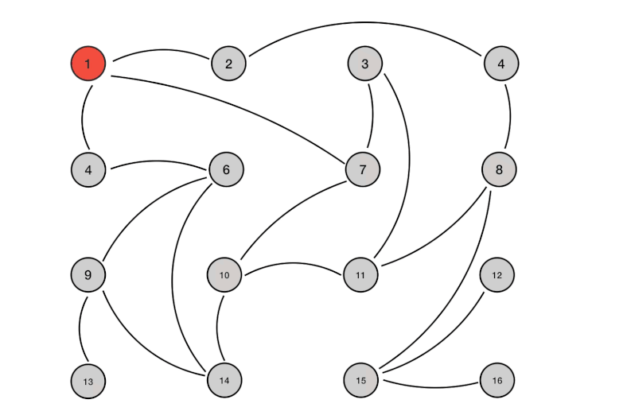

## Redis基础

Redis(Remote Dictionary Server) 是一个使用 C 语言编写的，开源的高性能非关系型（NoSQL）的键值对数据库。

与传统数据库不同的是 redis 的数据是存在**内存**中的，所以读写速度非常快，因此 redis 被广泛应用于**缓存**方向。另外，redis 也经常用来做**分布式锁**。redis 提供了多种数据类型来支持不同的业务场景。除此之外，redis 支持**事务 、持久化、分片、多种集群方案、LUA脚本、LRU驱动事件。**


说明：这里的熔断是指存储层挂掉的时候，让客户端请求直接打在缓存上，不管有没有获取到数据都直接返回，这样能在有损的情况下对外提供服务。


分布式缓存使用的比较多的主要是 [Memcached](https://baike.baidu.com/item/memcached/1625373?fr=aladdin) 和 Redis。

Memcached 是分布式缓存最开始兴起的那会，比较常用的。后来，随着 Redis 的发展，大家慢慢都转而使用更加强大的 Redis 了。

分布式缓存主要解决的是单机缓存的容量受服务器限制并且无法保存通用的信息。因为，本地缓存只在当前服务里有效，比如如果你部署了两个相同的服务，他们两者之间的缓存数据是无法共同的。


### Redis和Memcached的区别


共同点 

- 都是基于内存的数据库，一般都用来当做缓存使用。
- 都有过期策略。
- 两者的性能都非常高。

**区别**

- **Redis 支持更丰富的数据类型**（支持更复杂的应用场景）。Redis 不仅仅支持简单的 k/v 类型的数据，同时还提供 list，set，zset，hash 等数据结构的存储。Memcached 只支持最简单的 k/v 数据类型。
- **Redis 支持数据的持久化**，可以将内存中的数据保持在磁盘中，重启的时候可以再次加载进行使用，而 Memecache 把数据全部存在内存之中。
- Redis 有灾难恢复机制。 因为可以把缓存中的数据持久化到磁盘上。
- **Redis支持主从同步**，Memcached 不支持。
- **Redis支持集群与分片。**Memcached 没有原生的集群模式，需要依靠客户端来实现往集群中分片写入数据；但是 Redis 目前是原生支持 cluster 模式的。
- Memcached 是多线程，非阻塞 IO 复用的网络模型；**Redis 使用单线程的多路 IO 复用模型。** （Redis 6.0 引入了多线程 IO ）
- Redis 在服务器内存使用完之后，可以将不用的数据放到磁盘上。但是，Memcached 在服务器内存使用完之后，就会直接报异常。
- Redis 支持**发布订阅模型**、Lua 脚本、事务等功能，而 Memcached 不支持。并且，Redis 支持更多的编程语言。
- Memcached过期数据的删除策略只用了惰性删除，而 Redis 同时使用了惰性删除与定期删除。

相信看了上面的对比之后，我们已经没有什么理由可以选择使用 Memcached 来作为自己项目的分布式缓存了。


### Redis为什么这么快

> 10万+QPS

内存、数据结构、单线程(和nginx很像)、epoll、VM

**1、完全基于内存**，绝大部分请求是纯粹的内存操作，非常快速。数据存在内存中，类似于 HashMap，HashMap 的优势就是查找和操作的时间复杂度都是O(1)；

**2、数据结构简单**，对数据操作也简单，没有关系型数据库中数据的关联，Redis中的数据结构是专门进行设计的。

**3、采用单线程**，避免了不必要的上下文切换和竞争条件，减少了CPU的消耗。并且不用去考虑各种锁的问题，不存在加锁释放锁操作，没有因为可能出现死锁而导致的性能消耗。

**4、使用多路 I/O 复用模型，非阻塞 IO；**

5、使用底层模型不同，它们之间底层实现方式以及与客户端之间通信的应用协议不一样，Redis 直接自己构建了 VM 机制 ，因为一般的系统调用系统函数的话，会浪费一定的时间去移动和请求；


### Redis单线程模型

> https://www.javazhiyin.com/22943.html
>
> TODO I/O多路复用学习之后，再重新看和总结慕课redis第一节

**Redis 基于 Reactor 模式来设计开发了自己的一套高效的事件处理模型 （Netty 的线程模型也基于 Reactor 模式**，Reactor 模式不愧是高性能 IO 的基石），这套事件处理模型对应的是 Redis 中的**文件事件处理器（file event handler）**。一直在强调的单线程，**只是文件事件处理器处理网络请求的时候只有一个线程来处理**，Redis进行持久化的时候会以子进程或者子线程的方式执行。

**既然是单线程，那怎么监听大量的客户端连接呢？**

**Redis 基于 Reactor 模式开发了自己的网络事件处理器**：这个处理器被称为**文件事件处理器**（file event handler）。

- 文件事件处理器使用 **I/O 多路复用（multiplexing）**程序来同时监听多个套接字， 并根据套接字目前执行的任务来为套接字关联不同的事件处理器。
- 当被监听的套接字准备好执行**连接应答（accept）、读取（read）、写入（write）、关闭（close）**等操作时， 与操作相对应的**文件事件**就会产生， 这时文件事件处理器就会调用套接字之前关联好的事件处理器来处理这些事件。
- **虽然文件事件处理器以单线程方式运行， 但通过使用 I/O 多路复用程序来监听多个套接字**， 文件事件处理器既实现了高性能的网络通信模型， 又让 Redis 不需要额外创建多余的线程来监听客户端的大量连接，降低了资源的消耗（和 NIO 中的 Selector 组件很像），保持了 Redis 内部单线程设计的简单性。


可以看出，文件事件处理器（file event handler）主要是包含 4 个部分：

- 多个 socket（客户端连接）
- IO 多路复用程序（支持多个客户端连接的关键）
- 文件事件分派器（将 socket 关联到相应的事件处理器）
- 事件处理器（连接应答处理器、命令请求处理器、命令回复处理器）


### 多路 I/O 复用模型 Todo

**这里“多路”指的是多个网络连接，“复用”指的是复用同一个线程。**

多路I/O复用模型是利用 select、poll、epoll 可以**同时监察多个流的 I/O 事件的能力**，在**空闲**的时候，会把当前线程**阻塞**掉，当有一个或多个流有 I/O 事件时，就从**阻塞态中唤醒**，于是程序就会**轮询**一遍所有的流（**epoll 是只轮询那些真正发出了事件的流**），并且只**依次顺序的处理就绪的流**，这种做法就避免了大量的无用操作。

采用多路 I/O 复用技术可以让单个线程高效的处理多个连接请求（尽量减少网络 IO 的时间消耗），且 Redis 在内存中操作数据的速度非常快，也就是说内存内的操作不会成为影响Redis性能的瓶颈，主要由以上几点造就了 Redis 具有很高的吞吐量。


### Redis为什么要采用单线程模型

- 实际上瓶颈在于网络，实际测试发现QPS峰值的时候CPU也没有跑满，CPU不是性能瓶颈。

- 想利用多核也可以在一个机器上启动多个Redis实例。

**Redis的瓶颈最有可能是机器内存的大小或者网络带宽。单线程--够用且简单。单线程容易实现，而且CPU不会成为瓶颈，那就顺理成章地采用单线程的方案了**

**1）不需要各种锁的性能消耗**

list，hash等复杂的结构，这些结构有可能会进行很细粒度的操作，比如在很长的列表后面添加一个元素，在hash当中添加或者删除一个对象。这些操作可能就需要加非常多的锁，导致的结果是同步开销大大增加。

总之，在单线程的情况下，就不用去考虑各种锁的问题，不存在加锁释放锁操作，没有因为可能出现死锁而导致的性能消耗。

**2）CPU消耗**

**采用单线程，避免了不必要的上下文切换和竞争条件，也不存在多进程或者多线程导致的切换而消耗 CPU**。

**3）集群方案**

更应该考虑的是集群方案


#### 单线程处理不过来怎么办？/单核浪费吗

首先要明确的是redis虽然是单线程，但不是固定绑定在某个核上的。如果top -H发现cpu的利用率不高，可以配置conf文件来启动多实例。

**在同一个多核的服务器中，可以启动多个实例，组成master-master或者master-slave的形式，耗时的读命令可以完全在slave进行。**

也可以当做多个实例，只要客户端能分清哪些key放在哪个Redis进程上就可以了。


### 拓展：几种常见线程模型

**1、单进程多线程模型：MySQL、Memcached**、Oracle（Windows版本）；

2、多进程模型：Oracle（Linux版本）；

3、Nginx有两类进程，**一类称为Master进程(相当于管理进程)，另一类称为Worker进程（实际工作进程）。**启动方式有两种：

（1）单进程启动：此时系统中仅有一个进程，该进程既充当Master进程的角色，也充当Worker进程的角色。

（2）多进程启动：此时系统有且仅有一个Master进程，至少有一个Worker进程工作。

（3）Master进程主要进行一些全局性的初始化工作和管理Worker的工作；事件处理是在Worker中进行的。   平滑重启


## Redis数据结构

> Java客户端一般使用Jedis，Go一般使用go-redis。但实际工作中也要会redis的命令，可能会直接查询。

Redis的单个操作是原子性的（单线程模型），不用考虑线程安全问题。像这种incr的加操作，不用使用者同步或者加锁。

Redis都是按string类型存入数据的。

除了常用的五种，还有用于计数的HyperLogLog，支持存储地理位置信息的Geo。**Todo，抽个把小时了解。**

### 1. String

> 常用命令: set,get,decr,incr,mget 等。

String数据结构是简单的key-value类型，value其实不仅可以是String，也可以是数字。 常规key-value缓存应用； 常规计数：微博数，粉丝数，库存数等。

最常用：

```sh
127.0.0.1:6379> set name "redis" #设置 key-value 类型的值
OK
127.0.0.1:6379> get name # 根据 key 获得对应的 value
"redis"
127.0.0.1:6379> exists key  # 判断某个 key 是否存在
(integer) 1
127.0.0.1:6379> strlen key # 返回 key 所储存的字符串值的长度。
(integer) 5
127.0.0.1:6379> del key # 删除某个 key 对应的值
(integer) 1
127.0.0.1:6379> get key
(nil)
```

批量设置 :

```sh
127.0.0.1:6379> mset key1 value1 key2 value2 # 批量设置 key-value 类型的值
OK
127.0.0.1:6379> mget key1 key2 # 批量获取多个 key 对应的 value
1) "value1"
2) "value2"
```

计数器：

字符串的内容为整数的时候可以使用

```sh
127.0.0.1:6379> set number 1
OK
127.0.0.1:6379> incr number # 将 key 中储存的数字值增一
(integer) 2
127.0.0.1:6379> get number
"2"
127.0.0.1:6379> decr number # 将 key 中储存的数字值减一
(integer) 1
127.0.0.1:6379> get number
"1"
```

过期：

```sh
127.0.0.1:6379> expire key  60 # 数据在 60s 后过期
(integer) 1
127.0.0.1:6379> setex key 60 value # 数据在 60s 后过期 (setex:[set] + [ex]pire)
OK
127.0.0.1:6379> ttl key # 查看数据还有多久过期
(integer) 56
```


### 2. Hash

> 常用命令： hset,hmset,hget,hdel,del;   hexists,hgetall,hkeys,hvals
>
> 应用场景: 系统中对象数据的存储。Json格式

hash 是一个 string 类型的 field 和 value 的映射表，**hash 特别适合用于存储对象，每个对象有field，有getter和setter。**

```sh
127.0.0.1:6379> hmset lilei name "lilei" description "dev" age 24
OK
127.0.0.1:6379> hget lilei age # 获取存储在哈希表中指定字段的值。
"24"
127.0.0.1:6379> hset lieli age 23 # 修改某个字段对应的值
127.0.0.1:6379> hexists lieli name # 查看 key 对应的 value中指定的字段是否存在。
(integer) 1

hdel lilei age  //只删除field name
del lilei //删除这个对象的所有hashtable 都没了
```

批量：

```sh
127.0.0.1:6379> hgetall lilei # 获取在哈希表中指定 key 的所有字段和值
1) "name"
2) "lilei"
3) "description"
4) "dev"
5) "age"
6) "23"
127.0.0.1:6379> hkeys userInfoKey # 获取 key 列表
1) "name"
2) "age"
3) "description "
127.0.0.1:6379> hvals userInfoKey # 获取 value 列表
1) "guide"
2) "dev"
3) "24"
```


### 3. List

> 常用命令: lpush,rpush,lpop,rpop,lrange等

list 就是链表，Redis list 的应用场景非常多，也是Redis最重要的数据结构之一，比如微博的关注列表，粉丝列表，消息列表等功能都可以用Redis的 list 结构来实现。

Redis list 的实现为一个双向链表，即可以支持反向查找和遍历，更方便操作，不过带来了部分额外的内存开销。**添加删除操作就叫push和pop，显然可以实现Stack的功能，后入先出，因此可以实现最新消息排行榜等。**

另外可以通过 lrange 命令，就是从某个元素开始读取多少个元素，可以基于 list 实现分页查询，这个很棒的一个功能，基于 redis 实现简单的高性能分页，可以做类似微博那种下拉不断分页的东西（一页一页的往下走），性能高。

```sh
lpush list_key 1 2 3  #顺序是3，2，1  依次放到左边
lrange list_key 0 10   #从左往右，从0开始，取出10个。 顺序是3 2 1 
lrange key 0 -1    #全部显示 
lpop key              删除链表的最左边元素并返回
rpop key              删除链表的最右边元素并返回
del key               删除链表
llen myList
```


### 4. Set

> 常用命令： sadd, smembers, spop,srem,sunion 等

通过哈希实现，添加查找删除都是O(1)，不允许重复。**无序存储**

当你需要存储一个列表数据，又不希望出现重复数据时，set是一个很好的选择，并且set提供了判断某个成员是否在一个set集合内的重要接口，这个也是list所不能提供的。可以基于 set 轻易实现**交集、并集、差集的操作。**

比如：在微博应用中，可以将一个用户所有的关注人存在一个集合中，将其所有粉丝存在一个集合。Redis可以非常方便的实现如**共同关注、共同粉丝、共同喜好**等功能。这个过程也就是求交集的过程，具体命令如下：

```sh
127.0.0.1:6379> sadd mySet value1 value2 # 添加元素进去，返回结果代表成功个数
(integer) 2   
127.0.0.1:6379> sadd mySet value1 # 不允许有重复元素
(integer) 0
127.0.0.1:6379> smembers mySet # 查看 set 中所有的元素
1) "value1"
2) "value2"
srem key value  删除(remove)key集合中的某个value
```

```sh
127.0.0.1:6379> scard mySet # 查看 set 的长度
(integer) 2
127.0.0.1:6379> sismember mySet value1 # 检查某个元素是否存在set 中，只能接收单个元素
(integer) 1
127.0.0.1:6379> sadd mySet2 value2 value3
(integer) 2
# 获取 mySet 和 mySet2 的交集并存放在 mySet3 中
127.0.0.1:6379> sinterstore mySet3 mySet mySet2 
(integer) 1
127.0.0.1:6379> smembers mySet3
1) "value2"
```


### 5. Sorted Set

> 常用命令： zadd,zrange,zrem,zcard等

和set相比，sorted set增加了一个权重参数score，使得集合中的元素能够**按score进行有序排列。**成员是唯一的，分数是可以重复的

举例： 在直播系统中，实时排行信息包含直播间在线用户列表，各种礼物排行榜，弹幕消息（可以理解为按消息维度的消息排行榜）等信息，适合使用 Redis 中的 Sorted Set 结构进行存储。

还可以作为带权重的队列，比如普通消息的score为2，重要消息的score为1，工作线程可以按照score的大小获取任务，让重要的任务优先执行。

```sh
存储：zadd key score value   
> zadd myzset 1 mkx
> zadd myzset 2 ccs

zrangebyscore myzset 0 10 #按照顺序获取  从0开始 获取10个 分数越小排名越靠前 
1) "mkx"
2) "ccs"

zrange myzset 0 10  #不按照顺序获取

zrem key value   #删除某个value
```


## Redis应用

### 如何从海量数据中查询某一前缀的key

**面试中遇到数据问题，要摸清数据规模，即问清楚边界。**比如面试官可能问如何从redis中找出某类固定前缀的key。

**1. 数据量很小，或者非线上业务，可以使用keys指令**

`KEYS pattern` 查找所有符合给定模式的pattern的key。

```sh
>dbsize #redis中key的数量
(integer) 20000000
>keys k1* #返回所有以k1开头的key
```

keys的缺点，一次性返回所有匹配的key，数据量大的时候，会使服务卡顿，对内存的消耗和redis的服务器都是隐患。

**2. 推荐方法** **Scan命令**

`Scan cursor [MATCH PATTERN] [COUNT count]`

- cursor是游标，需要基于上一次调用scan命令返回的cursor延续之前的迭代过程

- 以0作为游标开始一次新的迭代，直到命令返回游标0完成一次遍历

- 并不保证每次执行都会返回给定count数量的元素，且不能保证重复。可以放入Set排除重复

- 由于是分批次获取的，scan指令整体时间会比keys时间长，但不会影响服务。

```shell
>scan 0 match k1* count 10
1) "1153456"  #返回的游标cursor，需要再次传入游标
2) 1) "k1793229"
   2) "k1223278"
   3) "k1969079"
>>scan k1153456 match k1* count 10
1) "3354820"  #游标不一定是递增的，有可能返回重复的数据
2) 1) "k1436657"
   2) "k1776585"
  3) "k1082438"
  4) "k1345342"
```


### Redis做分布式锁

对于秒杀，抢单这样的逻辑，是涉及到并发竞争资源的，需要做好线程的同步。

> synchronized或者reentrantLock只能锁住同一台服务器的不同线程，在实际工作中，往往要使用**多台机器-集群部署代码**，在这种场景下**怎么实现线程安全呢？**
>
> 这边服务加锁，那边的服务也得阻塞——分布式锁。当两个服务没办法协调的时候，就需要引入第三方。

可能的方法：

文件系统（同一个目录下，相同的文件名只能有一个）——可行但效率很低

#### setnx key value

Redis方式一：

```java
boolean b = setnx key value;
if(b){
//执行业务
}
delete key;
```

这种方式有大问题，如果在删除锁之前程序挂掉，会造成死锁-即redis中的锁永远无法释放，别的服务器的实例中的线程永远也没办法获得锁。


Redis方式二：

```java
boolean b = setnx key value expire key 10s;
if(b){
    //执行业务
}
delete key;
```

让key自动过期，这一条命令是**原子操作**的，因此只要能设置成key，就能设置成功自动过期时间。

> 原子性操作也可以用lua脚本实现，从 2.6版本 起, Redis 开始支持 Lua 脚本 让开发者自己扩展 Redis。Redis 允许将 Lua 脚本传到 Redis 服务器中执行, 脚本内可以调用大部分 Redis 命令, 且 Redis 保证脚本的**原子性。但redis现在支持这种原子命令，没必要使用脚本，可以做了解。**[**https://www.cnblogs.com/barrywxx/p/8563284.html**](https://www.cnblogs.com/barrywxx/p/8563284.html)

对应redis命令：

```sh
set key value [ex seconds] [px milliseconds] [nx|xx] 
#ex 过期时间单位是秒 ps 过期时间单位是毫秒
#nx 键不存在才操作 xx键存在才操作
#命令成功返回OK，不成功返回nil
```


**方式二中仍存在一些问题**

问题1：10s的时间够不够？如果时间过短，还没执行完业务逻辑就已经释放了锁。又引起了新的问题！也就是说**在程序执行期间，锁不能过期。**

**解决办法：看门狗watch dog**，我计划用1min，还剩30s的时候你看到我还没出来，就给我续期1min，这样循环，直到我出来。

可以用开源的Redission实现，相当于Jedis，Java连接Redis的开源工具。tryAcquireAsync()方法中的scheduleExpirationRenewal(threadId)这个方法。[博客1](https://blog.csdn.net/asd051377305/article/details/108384490)

>  <font color=red>**其实还是存在问题：虽然小概率。**</font>看门狗是Java程序，依赖于JVM实现，GC的时候stop the world，看门狗也停下来了，如果GC stop the world的时间过长，看门狗没有续期，这个线程的程序执行期间，锁过期了！这种问题只要用JVM+Reids就没办法解决

问题2：如果时间过长，其他程序在10s之后获取到了key，等这个线程执行完业务逻辑的时候，出来delete key，把这个key又删掉了。

解决办法：Redis可不止存了key啊，还有对应的value没有利用到。应该加一个判断，**getKey里面的value是自己设置的value，才可以删除。**


**问题3：Redis实例挂掉怎么办？**

**为了防止Redis的单点故障，给Redis做集群，一主二从三哨兵。**

**但集群有一个潜在问题**：**Redis主从同步是异步的，**如果没有同步成功的时候，Reids的master挂掉，线程1还没有释放锁，这时候线程2去slave尝试获取锁，锁数据没同步过来，**线程2也获取到了锁！**


怎么解决这个问题？

问题是由于主从同步复制是异步的，那么就不复制。不用集群，**直接用多台独立的Redis！**

#### RedLock

**为了解决Redis的单点故障，用RedLock** 单数个数的Redis实例，**所有线程都顺序加锁，**当Setnx成功的数量大于一半的时候，就加锁成功。获取锁失败的（没有超过一半），把刚才加的锁全部删掉。

注意：**当RedLock中多个实例中的一个出故障之后，要延迟启动**，不要着急立刻恢复。比如有5台机器，线程1获取到1-3的锁，获取到锁。这时候挂掉第3台，如果立即恢复起来，线程1还没有执行结束，但第3台的数据没了，没有线程1的锁。线程2获取锁时，获取到了3，4，5的锁，也获取到了锁，又出现了多个线程同时获取到锁的问题。因此至少要等获取到锁的线程任务执行完毕再恢复Redis服务器。


### 使用Redis做异步队列

方法1：使用List作为队列，RPUSH生产消息，LPOP消费消息。

缺点：LPOP没有等待队列中有值就进行了消费。 有可能消费不到

弥补措施：通过在应用层引入Sleep机制，调用LPOP重试。

方法2：

#### BLPOP key [key..] timeout 

**没有消息时，阻塞，直到队列有消息或者超时**

```sh
#客户端1——消费者
#等待testQueue 30s，在此期间如果有值会返回，没有值超时以后返回
blpop testQueue 30 

#客户端2在客户端1等待期内生产一条消息
rpush testQueue aaa

#客户端1立即返回消息
1) "testQueue"
2) "aaa"
(10.09s)
```

缺点：只能供一个消费者消费，一个消费者消费之后消息就没了，其他消费者不能消费。更推荐的方式：pub/sub 主题订阅模式


#### pub/sub 主题订阅模式


- 发送者(pub)发送消息，订阅者(sub)接收消息
- 订阅者可以订阅任意数量的频道topic

```sh
#客户端1订阅频道  频道不需要预先创建，直接订阅即可
subscribe myTopic

#客户端2订阅频道  
subscribe myTopic

#客户端3订阅另一个频道
subscribe anotherTopic

#客户端4在myTopic频道发布消息
publish myTopic "hello"

#订阅myTopic的客户端1和客户端2都收到了如下消息，没有订阅的客户端3没有收到
1) "message"
2) "myTopic"
3) "hello"

#客户端4在anotherTopic频道发布消息
publish anotherTopic "i love you"

#定于anotherTopic的客户端3收到如下消息，没有订阅的客户端1和2没有收到
1) "message"
2) "anotherTopic"
3) "i love you"
```

缺点：消息的发布是无状态的，无法保证消息一定能接收到。对于发布者来说，消息即发即失。如果某个消费者在消息发布时候下线，重新上线之后是收不到消息的。更推荐用专业的消息队列。


### Redis Pipeline——管道

> https://blog.csdn.net/w1lgy/article/details/84455579
>
> Pipeline和Linux管道类似，Redis基于Request/Response协议，单个请求需要一一应答。Pipeline批量执行命令，节省多次IO往返时间。

redis客户端执行一条命令分4个过程：发送命令－〉命令排队－〉命令执行－〉返回结果
这个过程称为Round trip time(简称RTT, 往返时间)，mget mset有效节约了RTT，但大部分命令（如hgetall，并没有mhgetall）不支持批量操作，需要消耗N次RTT ，这个时候需要pipeline来解决这个问题。

Redis本身是基于Request/Response协议（请求相应模型-停等机制）的，正常情况下，客户端发送一个命令，等待Redis返回结果，Redis接收到命令，处理后响应。在这种情况下，如果同时需要执行大量的命令，那就是等待上一条命令应答后再执行，这中间不仅仅多了RTT，而且还频繁调用系统IO，发送网络请求。为了提升效率，这时候pipeline出现了，它允许客户端可以一次发送多条命令，而不等待上一条命令执行的结果，这和网络的Nagel算法有点像（TCP_NODELAY选项）。**pipeline不仅减少了RTT，同时也减少了IO调用次数（IO调用涉及到用户态到内核态之间的切换）**。


**原生批命令(mset, mget)与Pipeline对比**

1. **原生批命令是原子性，pipeline是非原子性**
   (原子性概念:一个事务是一个不可分割的最小工作单位,要么都成功要么都失败。原子操作是指你的一个业务逻辑必须是不可拆分的. 处理一件事情要么都成功，要么都失败，原子不可拆分)

2. 原生批命令一命令多个key, 但pipeline支持多命令（存在事务），非原子性
3. 原生批命令是服务端实现，而pipeline需要服务端与客户端共同完成

即时用Redis事务，Redis事务不保证原子性。


要支持Pipeline，既要服务端的支持，也要客户端支持。对于服务端来说，所需要的是能够处理一个客户端通过同一个TCP连接发来的多个命令，可以理解为，这里将多个命令切分，和处理单个命令一样（之前老生常谈的黏包现象），Redis就是这样处理的。而客户端，则是要将多个命令缓存起来，缓冲区满了或者达到发送条件就发送出去，最后才处理Redis的应答。

Jedis支持Pipeline

```java
Pipeline pipe = jedis.pipelined();//获取jedis对象的pipeline对象
```

例：脚本批量生成2000万个键值对

```sh
批量生成redis测试数据
1.Linux Bash下面执行
  for((i=1;i<=20000000;i++)); do echo "set k$i v$i" >> /tmp/redisTest.txt ;done;
  生成2千万条redis批量设置kv的语句(key=kn,value=vn)写入到/tmp目录下的redisTest.txt文件中
2.用vim去掉行尾的^M符号，使用方式如下：：
  vim /tmp/redisTest.txt
    :set fileformat=dos #设置文件的格式，通过这句话去掉每行结尾的^M符号
    ::wq #保存退出
3.通过redis提供的管道--pipe形式，去跑redis，传入文件的指令批量灌数据，需要花10分钟左右
  cat /tmp/redisTest.txt | 路径/redis-5.0.0/src/redis-cli -h 主机ip -p 端口号 --pipe
```


## Redis 持久化机制

> 很多时候我们需要持久化数据也就是将内存中的数据写入到硬盘里面，大部分原因是为了之后重用数据（比如重启机器、机器故障之后恢复数据），或者是为了防止系统故障而将数据备份到一个远程位置。

https://www.cnblogs.com/wdliu/p/9377278.html

Redis不同于Memcached的很重要一点就是，Redis支持持久化，而且支持两种不同的持久化操作。**一种持久化方式叫快照（snapshotting，RDB(Redis DataBase)），另一种方式是只追加文件（append-only file,AOF）**。

**RBD——基于快照方式的持久化  主从复制也是使用rbd的快照**

​	**在某时刻把所有数据进行完整备份**

**AOF——基于写日志方式的持久化**

​	把用户执行的所有**写指令（增删改）备份到文件**中，还原数据时只需要把备份的所有指令重新执行一遍**。**


**RBD vs AOD**

- AOF文件比RDB更新频率高，优先使用AOF还原数据
- AOF比RDB更安全也更大
- RDB性能比AOF好,RDB 恢复数据集的速度也要比AOF恢复的速度要快
- 如果两个都配了优先加载AOF


### RDB 快照（snapshotting）持久化

>  **多长时间以后，至少有多少个key发生变化，自动触发BGSAVE持久化。**

RDB是Redis默认的持久化方式。**保存某个时间点的全量数据快照**，对应产生的数据文件为./src/dump.rdb(二进制文件)。

Redis创建快照之后，可以对快照进行备份，可以将快照复制到其他服务器从而**创建具有相同数据的服务器副本**（Redis主从结构，主要用来提高Redis性能），还可以将快照留在原地以便重启服务器的时候使用。


#### RBD过程

SAVE：接到SAVE命令的Redis服务器在快照创建完毕之前不会再响应任何其他命令。

​	SAVE命令不常用，我们通常只会在没有足够内存去执行BGSAVE命令的情况下，才会使用这个命令。

**BGSAVE**：BG即Backgroud，主进程Fork出一个子进程来创建RDB文件，不阻塞服务器进程。

​	后台方式进行持久化，调用此命令会立即返回OK，主进程会立刻恢复对客户端的服务。

客户端用`lastsave`命令可以获取上一次成功执行`SAVE`或`BGSAVE`的时间。

```sh
>save
OK
(18.31S)
>bgsave
Background saving started   #立即返回
```

可以java计时器定时调用BGSAVE指令，定期备份RDB文件，根据时间戳按时间存放dump.rdb文件。

**自动触发RDB持久化的方式**

1、根据redis.conf配置里面的SAVE m n 定时触发(用的是BGSAVE)。

```shell
#平衡性能与数据安全
#在900秒(15分钟)之后，如果至少有1个key发生变化，Redis就会自动触发`BGSAVE`命令创建快照。
save 900 1      

#在300秒(5分钟)之后，如果至少有10个key发生变化，Redis就会自动触发BGSAVE命令创建快照。
save 300 10     

#在60秒(1分钟)之后，如果至少有10000个key发生变化，Redis就会自动触发BGSAVE命令创建快照。
save 60 10000   
#加上这一句会禁用RBD配置
save "" 


#当备份进程出错的时候，主进程停止接受新的写入操作——保护持久化数据的一致性 
#如果有完善的监控系统，可以设置no，否则请开启
stop-writes-on-bgsave-error yes

#在备份的时候，压缩rdb文件之后，才做保存。
#建议设置为no redis本身就是cpu密集型服务器，如果开启压缩，会带来更多的CPU消耗 相比硬盘成本，CPU更值钱
rdbcompression yes
```

2、**主从复制时，主节点会自动触发**

3、执行Debug Reload时

4、执行Shutdown时，如果没有开启AOF持久化


#### BGSAVE原理

> fork() + copyonwrite

**fork**

fork()的实际开销就是复制父进程的页表以及给子进程创建一个进程描述符，所以速度一般比较快。

fork()出来的子进程共享其父类的内存数据。仅仅是共享fork()出子进程的那一刻的内存数据——**快照**，后期主进程修改数据对子进程不可见。子进程出现问题，不影响父进程，父进程出现问题，子进程也会挂掉。

**copyonwrite**

主进程fork()子进程之后，内核把主进程中所有的内存页的权限都设为read-only，然后子进程的地址空间指向主进程，这也就是共享了主进程的内存。当其中某个进程写内存时，CPU硬件检测到内存页是read-only的，于是触发页异常中断（page-fault），陷入内核的一个中断例程。中断例程中，**内核就会把触发的异常的页复制一份**，于是主子进程各自持有独立的一份，其余的页还是共享主进程的。

也就是说：**直到主进程修改共享资源时，系统才会真正复制一份给主进程，而子进程所见到的快照不变。**这样不需要复制内存，实现了并发的读，节省了很多性能和资源的消耗。


#### RBD的优缺点分析

**优点：**全量数据快照，文件小，恢复快。

1. RDB 是一个非常紧凑的文件，它保存了 Redis 在某个时间点上的数据集。 这种文件**非常适合用于进行备份——主从复制**： 比如说，你可以在最近的 24 小时内，每小时备份一次 RDB 文件，并且在每个月的每一天，也备份一个 RDB 文件。 这样的话，即使遇上问题，也可以随时将数据集还原到不同的版本。
2. RDB 非常适用于灾难恢复：它只有一个文件，并且内容都非常紧凑，可以（在加密后）将它传送到别的数据中心。
3. RDB 在恢复大数据集时的速度比 AOF 的恢复速度要快。

**缺点：**

1. **数据安全性低。**RDB 是间隔一段时间进行持久化，如果持久化之间 redis 发生故障，会发生数据丢失。所以这种方式更适合数据要求不严谨的时候。


### AOF

与快照持久化相比，AOF持久化的**实时性更好**，因此已成为主流的持久化方案。当两种方式同时开启时，数据恢复Redis会优先选择AOF恢复。

默认情况下Redis没有开启AOF（append only file）方式的持久化，可以通过appendonly参数开启：

```sh
appendonly no #改为yes即可开启
```

在Redis的配置文件redis.conf中存在三种同步方式，它们分别是：

```sh
#appendfsync always     
appendfsync everysec    
#appendfsync no       
```

always:命令写入aof_buf后调用系统fsync操作同步到AOF文件，fsync完成后线程返回。配置为always时，每次写入都要同步AOF文件，这样会严重降低Redis的速度。在一般的SATA硬盘上，Redis只能支持大约几百TPS写入，显然跟Redis高性能特性背道而驰，不建议配置。

everysec:命令写入aof_buf后调用系统write操作，write完成后线程返回。fsync同步文件操作由专门线程每秒调用一次。 配置为everysec，是建议的同步策略，也是默认配置，做到兼顾性能和数据安全性。理论上只有在系统突然宕机的情况下丢失1秒的数据。

no:让操作系统决定何时进行同步 不推荐，一般为了提高效率，操作系统会等待缓存区填满才会同步数据到磁盘中。由于操作系统每次同步AOF文件的周期不可控，而且会加大每次同步硬盘的数据量，虽然提升了性能，但数据安全性无法保证。


#### AOF过程

AOF持久化会把除查询以外的所有指令都以append的方式追加到AOF文件中。

1）所有的写入命令会追加到aof_buf缓冲区中。

2）AOF缓冲区根据对应的策略向硬盘做同步操作。

3）随着AOF文件越来越大，需要定期对AOF文件进行重写，达到压缩的目的。（用到了AOF_rewrite_buf）

4）当Redis服务器重启时，可以加载AOF文件进行数据恢复。


#### AOF重写

AOF日志文件是纯追加的文件，随着写操作的增加，AOF文件会越来越大。例如递增一个计数器1000次，其实只需要保留最终的结果1000即可，但是AOF文件会把这1000次记录完整记录下来。因此Redis支持日志重写，在不中断服务的情况下在后台重建AOF文件。

重写AOF并不需要读取旧的AOF文件进行命令分析或合并，直接去内存中读取当前Redis数据库中的数据即可，记录所有没有过期的数据，生成添加这些数据的记录。

重写过程：

- 调用fork()，创建一个子进程。启用AOF重写缓存 `AOF_rewrite_buf`
- 子进程把新的AOF写到一个临时文件里，写命令的过程不依赖于原来的AOF文件
- 主进程持续将新的变动命令同时写到AOF 重写缓存和原来的AOF里
  - 这样一来可以保证：
    1. 现有的 AOF 功能会继续执行，即使在 AOF 重写期间发生停机，也不会有任何数据丢失。
    2. 所有对数据库进行修改的命令都会被记录到 AOF 重写缓存中。
- 主进程获取子进程重写AOF完成的信号，然后往新的AOF同步buffer中的增量变动
- 使用新的AOF文件替换掉旧的AOF文件


**AOF 重写可以由用户通过调用 `BGREWRITEAOF` 手动触发。**
每次当 `serverCron` 函数执行时， 它都会检查以下条件是否全部满足， 如果是的话， 就会触发自动的 AOF 重写：

- 没有 BGSAVE 命令在进行。
- 没有 BGREWRITEAOF 在进行。
- 当前 AOF 文件大小 `aof_current_size` 大于 server.aof_rewrite_min_size （默认值为 1 MB）。
- 当前 AOF 文件大小和最后一次 AOF重写后的大小 `aof_rewrite_base_size` 之间的比率大于等于指定的增长百分比 `aof_rewrite_perc` 。
  - 默认情况下， 增长百分比为 100% ， 也即是说， 如果前面三个条件都已经满足， 并且当前 AOF 文件大小比最后一次 AOF 重写时的大小要大一倍的话， 那么触发自动 AOF 重写。
    

AOF执行过程：伪代码（了解）

```python
def AOF_REWRITE(tmp_tile_name):

  f = create(tmp_tile_name)

  # 遍历所有数据库
  for db in redisServer.db:

    # 如果数据库为空，那么跳过这个数据库
    if db.is_empty(): continue

    # 写入 SELECT 命令，用于切换数据库
    f.write_command("SELECT " + db.number)

    # 遍历所有键
    for key in db:

      # 如果键带有过期时间，并且已经过期，那么跳过这个键
      if key.have_expire_time() and key.is_expired(): continue

      if key.type == String:

        # 用 SET key value 命令来保存字符串键

        value = get_value_from_string(key)

        f.write_command("SET " + key + value)

      elif key.type == List:

        # 用 RPUSH key item1 item2 ... itemN 命令来保存列表键

        item1, item2, ..., itemN = get_item_from_list(key)

        f.write_command("RPUSH " + key + item1 + item2 + ... + itemN)

      elif key.type == Set:

        # 用 SADD key member1 member2 ... memberN 命令来保存集合键

        member1, member2, ..., memberN = get_member_from_set(key)

        f.write_command("SADD " + key + member1 + member2 + ... + memberN)

      elif key.type == Hash:

        # 用 HMSET key field1 value1 field2 value2 ... fieldN valueN 命令来保存哈希键

        field1, value1, field2, value2, ..., fieldN, valueN =\
        get_field_and_value_from_hash(key)

        f.write_command("HMSET " + key + field1 + value1 + field2 + value2 +\
                        ... + fieldN + valueN)

      elif key.type == SortedSet:

        # 用 ZADD key score1 member1 score2 member2 ... scoreN memberN
        # 命令来保存有序集键

        score1, member1, score2, member2, ..., scoreN, memberN = \
        get_score_and_member_from_sorted_set(key)

        f.write_command("ZADD " + key + score1 + member1 + score2 + member2 +\
                        ... + scoreN + memberN)

      else:

        raise_type_error()

      # 如果键带有过期时间，那么用 EXPIREAT key time 命令来保存键的过期时间
      if key.have_expire_time():
        f.write_command("EXPIREAT " + key + key.expire_time_in_unix_timestamp())

    # 关闭文件
    f.close()
```


#### AOF优缺点分析

**优点：**

1. **数据安全**，aof 持久化可以配置 appendfsync 属性，有 always，每进行一次命令操作就记录到 aof 文件中一次。
2. 通过 append 模式写文件，即使中途服务器宕机，可以通过 redis-check-aof 工具解决数据一致性问题。

**缺点：**

1. AOF 文件比 RDB 文件大，且恢复速度慢。

2. 数据集大的时候，比 rdb 启动效率低。


aof过程

1）所有的写入命令会追加到aof_buf缓冲区中。

2）AOF缓冲区根据对应的策略向硬盘做同步操作。

3）随着AOF文件越来越大，需要定期对AOF文件进行重写，达到压缩的目的。（用到了AOF_rewrite_buf）

4）当Redis服务器重启时，可以加载AOF文件进行数据恢复。


#### Redis启动时的数据加载


Redis启动数据加载流程：

1. AOF持久化开启且存在AOF文件时，优先加载AOF文件。
2. AOF关闭或者AOF文件不存在时，加载RDB文件。
3. 加载AOF/RDB文件成功后，Redis启动成功。
4. AOF/RDB文件存在错误时，Redis启动失败并打印错误信息。


### RBD、AOF混合持久化方式 了解

redis4.0相对与3.X版本其中一个比较大的变化是4.0添加了新的混合持久化方式。同时结合RDB持久化以及AOF持久化混合写入AOF文件。这样做的好处是可以结合 rdb 和 aof 的优点, 快速加载同时避免丢失过多的数据，缺点是 aof 里面的 rdb 部分就是压缩格式不再是 aof 格式，可读性差。

4.0版本的混合持久化默认关闭的，通过aof-use-rdb-preamble配置参数控制，yes则表示开启，no表示禁用，默认是禁用的，可通过config set修改。

混合持久化同样也是通过`bgrewriteaof`完成的，不同的是当开启混合持久化时，fork出的子进程先将共享的内存副本全量的以RDB方式写入aof文件，然后在将重写缓冲区的增量命令以AOF方式写入到文件，写入完成后通知主进程更新统计信息，并将新的含有RDB格式和AOF格式的AOF文件替换旧的的AOF文件。简单的说：新的AOF文件前半段是RDB格式的全量数据后半段是AOF格式的增量数据。

当我们开启了混合持久化时，启动redis依然优先加载aof文件，aof文件加载可能有两种情况如下：

- aof文件开头是rdb的格式, 先加载 rdb内容再加载剩余的 aof。
- aof文件开头不是rdb的格式，直接以aof格式加载整个文件。


## Redis清除策略

**Redis key清除**

如果集中过期，由于清除大量的key很耗时，会出现短暂的卡顿现象。

解决方法：在设置key的过期时间的时候，给每个key加上随机值。


# Redis集群

为什么需要redis集群？

（1）单个redis存在不稳定性。当redis服务宕机了，就没有可用的服务了。

（2）单个redis的读写能力是有限的。

sentinal和cluster是两个时代的东西 redis先开发了sentinal模式 后开发了cluster模式 有了cluster模式sentinal就没有存在的必要了 但是这个演进的过程可以方便帮助大家理解其原理

## 主从同步

**主从模式是三种模式中最简单的，在主从复制中，数据库分为两类：主数据库(master)和从数据库(slave)。**

（1）**主节点Master可读、可写。单个**

（2）**从节点Slave只读（read-only）可以多个**

因此，主从模型可以提高**读的能力**，在一定程度上缓解了写的能力。因为能写仍然只有Master节点一个，可以将读的操作全部移交到从节点上，变相提高了写能力。

* slave挂了不影响其他slave的读和master的读和写，重新启动后会将数据从master同步过来
* master挂了以后，不影响slave的读，但**redis不再提供写服务**，master重启后redis将重新对外提供写服务


### redis主从同步过程

#### 全量同步

1. 当启动一个 slave 的时候，它会发送一个 PSYNC 命令给 master 
2. 如果这是 slave 初次连接到 master，那么会触发一次 full resynchronization 全量复制
3. Master启动bgsave，将Redis中的数据快照保存到文件中
4. Master将保存数据快照期间收到的写命令（增量数据）缓存起来
5. Master完成文件写操作，将文件发送给slave 。同样，在发送期间使用缓冲区记录执行的写命令
6. 接收完毕，slave 丢弃所有旧数据，载入主服务器发来的快照文件
7. Master快照文件发送完毕之后，向从服务器发送这期间存储在缓冲区中的写命令

#### 增量同步

- Master接收到用户的操作指令，判断是否要传播到slave。读操作不需要
- 将操作记录追加到AOF文件中
- 将操作传播到其他Slave：1. 对齐主从数据库，确保从数据库是该操作所对应的数据库。2. 往相应缓存写入指令
- 将缓存中的数据发给Slave


**问题：当主节点宕机了，整个集群就没有可写的节点了。**

由于从节点上备份了主节点的所有数据，那在主节点宕机的情况下，如果能够将从节点变成一个主节点，是不是就可以解决这个问题了呢？

答：是的，这个就是Sentinel哨兵的作用。


## 哨兵机制

**哨兵用于实现 redis 集群的高可用，本身也是分布式的，作为一个哨兵集群去运行，互相协同工作。**

- 哨兵至少需要 3 个实例，来保证自己的健壮性。

- 哨兵 + redis 主从的部署架构，是不保证数据零丢失的，只能保证 redis 集群的高可用性。

- 对于哨兵 + redis 主从这种复杂的部署架构，尽量在测试环境和生产环境，都进行充足的测试和演练。

**哨兵的作用就是监控redis主、从数据库是否正常运行，主出现故障自动将从数据库转换为主数据库**。

### 哨兵的作用

**集群监控**：监控主从服务器是否正常工作。

**消息通知**：如果某个 redis 实例有故障，那么哨兵通过API向管理员或其他应用程序发送故障通知。

**故障转移**：当一个主服务器不能正常工作时， Sentinel 会开始一次自动故障迁移操作， 它会进行**选举**，将其中一个从服务器升级为新的主服务器， 并让其他从服务器改为复制新的主服务器。

**配置中心**：如果故障转移发生了，通知 client 客户端新的 master 地址。


### 哨兵机制

> 哨兵(sentinel) 的一些设计思路和zookeeper非常类似。

##### Sentinel的集群

**哨兵用于实现 redis 集群的高可用，它本身也必须是分布式的，作为一个哨兵集群去运行，互相协同工作。**

**Redis多个sentinel进程使用流言协议(gossipprotocols)来接收关于Master是否下线的信息**，并使用投票协议(agreement protocols)来决定是否执行自动故障迁移，以及选择哪个Slave作为新的Master。

#### 定时任务----心跳机制

- 每 1s 每个 Sentinel 对其他 Sentinel 和 Redis 执行 ping，进行心跳检测。
- 每 2s 每个 Sentinel 通过 Master 的 Channel 交换信息(pub - sub)。
- 每 10s 每个 Sentinel 对 Master 和 Slave 执行 info，目的是发现 Slave 节点、确定主从关系。

#### 节点下线

- 主观下线
  - 即 Sentinel 节点对 Redis 节点失败的偏见，超出超时时间认为 Master 已经宕机。
  - Sentinel 集群的每一个 Sentinel 节点会定时对 Redis 集群的所有节点发心跳包检测节点是否正常。如果一个节点在 `down-after-milliseconds` 时间内没有回复 Sentinel 节点的心跳包，则该 Redis 节点被该 Sentinel 节点主观下线。
- 客观下线
  - 所有 Sentinel 节点对 Redis 节点失败要达成共识，即超过 quorum 个统一。
  - 当节点被一个 Sentinel 节点记为主观下线时，并不意味着该节点肯定故障了，还需要 Sentinel 集群的其他 Sentinel 节点共同判断为主观下线才行。
  - 该 Sentinel 节点会询问其它 Sentinel 节点，如果 Sentinel 集群中超过 quorum 数量的 Sentinel 节点认为该 Redis 节点主观下线，则该 Redis 客观下线。

#### Leader选举

> **Sentinel 集群运行过程中故障转移完成，所有 Sentinel 又会恢复平等。Leader 仅仅是故障转移操作出现的角色。**

- 选举出一个 Sentinel 作为 Leader：集群中至少有三个 Sentinel 节点，但只有其中一个节点可完成故障转移。通过以下命令可以进行失败判定或领导者选举。
- 选举流程
  1. 每个主观下线的 Sentinel 节点向其他 Sentinel 节点发送命令，要求设置它为领导者.
  2. 收到命令的 Sentinel 节点如果没有同意通过其他 Sentinel 节点发送的命令，则同意该请求，否则拒绝。
  3. 如果该 Sentinel 节点发现自己的票数已经超过 Sentinel 集合半数且超过 quorum，则它成为领导者。
  4. 如果此过程有多个 Sentinel 节点成为领导者，则等待一段时间再重新进行选举。

#### 故障转移

- 转移流程
  1. Sentinel 选出一个合适的 Slave 作为新的 Master(slaveof no one 命令)。
  2. 向其余 Slave 发出通知，让它们成为新 Master 的 Slave( parallel-syncs 参数)。
  3. 等待旧 Master 复活，并使之称为新 Master 的 Slave。
  4. 向客户端通知 Master 变化。
- 从 Slave 中选择新 Master 节点的规则(slave 升级成 master 之后)
  1. 选择 slave-priority 最高的节点。
  2. 选择复制偏移量最大的节点(同步数据最多)。
  3. 选择 runId 最小的节点。


### Gossip流言协议

[Gossip协议](https://zhuanlan.zhihu.com/p/41228196)

Gossip protocol 也叫 Epidemic Protocol （流行病协议），实际上它还有很多别名，比如：“流言算法”、“疫情传播算法”等。这个协议的作用就像其名字表示的意思一样，非常容易理解，它的方式其实在我们日常生活中也很常见，比如电脑病毒的传播，森林大火，细胞扩散等等。很多知名的 P2P 网络或区块链项目，比如著名的比特币网络在发送消息（比如发起一笔比特币转账）的时候会使用gossip协议，以确保所有的结点都会收到。

**Gossip协议基本思想是：反熵——在杂乱无章中寻求一致。点对点的去中心化/多中心化的通信：**每个结点随机地分享一些信息给网络中的其他的一些节点。最终所有的节点的状态达成一致。



Gossip 的三板斧分别是：**直接邮寄（Direct Mail）、反熵（Anti-entropy）和谣言传播（Rumor mongering）。**

**Gossip 的特点（优势）**

**1）扩展性**

网络可以允许节点的任意增加和减少，新增加的节点的状态最终会与其他节点一致。

**2）容错**

网络中任何节点的宕机和重启都不会影响 Gossip 消息的传播，Gossip 协议具有天然的分布式系统容错特性。

**3）去中心化**

Gossip 协议不要求任何中心节点，所有节点都可以是对等的，任何一个节点无需知道整个网络状况，只要网络是连通的，任意一个节点就可以把消息散播到全网。

**4）一致性收敛**

Gossip 协议中的消息会以一传十、十传百一样的指数级速度在网络中快速传播，因此系统状态的不一致可以在很快的时间内收敛到一致。消息传播速度达到了 logN。

**5）简单**

Gossip 协议的过程极其简单，实现起来几乎没有太多复杂性。


**Gossip 的缺陷**

分布式网络中，没有一种完美的解决方案，Gossip 协议跟其他协议一样，也有一些不可避免的缺陷，主要是两个：

**1）消息的延迟**

由于 Gossip 协议中，节点只会随机向少数几个节点发送消息，消息最终是通过多个轮次的散播而到达全网的，因此使用 Gossip 协议会造成不可避免的消息延迟。不适合用在对实时性要求较高的场景下。

**2）消息冗余**

Gossip 协议规定，节点会定期随机选择周围节点发送消息，而收到消息的节点也会重复该步骤，因此就不可避免的存在消息重复发送给同一节点的情况，造成了消息的冗余，同时也增加了收到消息的节点的处理压力。而且，由于是定期发送，因此，即使收到了消息的节点还会反复收到重复消息，加重了消息的冗余。


## 分布式集群(Cluster)

**redis 集群模式的工作原理能说一下么？在集群模式下，redis 的 key 是如何寻址的？分布式寻址都有哪些算法？了解一致性 hash 算法吗？**

sentinel机制还是只有一个master可以写，即便宕机后可以获取到新的master，但是master只有一台，性能还是有很大的瓶颈，master可能被撑爆。

**分片机制**  把数据分成几片------多个master，通过ip的hash取模来进行路由，也就是下面的hash取模

#### 寻址分片

##### hash取模

- hash(key)%机器数量
- 问题
  1. 机器宕机，造成数据丢失，数据读取失败
  1. 伸缩性  **如果要增加一台master，数据迁移过程很痛苦**

**一致性hash** 重点了解

- 问题
  1. 一致性哈希算法在节点太少时，容易因为节点分布不均匀而造成缓存热点的问题。
     - 解决方案
       - 可以通过引入虚拟节点机制解决：即对每一个节点计算多个 hash，每个计算结果位置都放置一个虚拟节点。这样就实现了数据的均匀分布，负载均衡。

**hash槽**

- CRC16(key)%16384