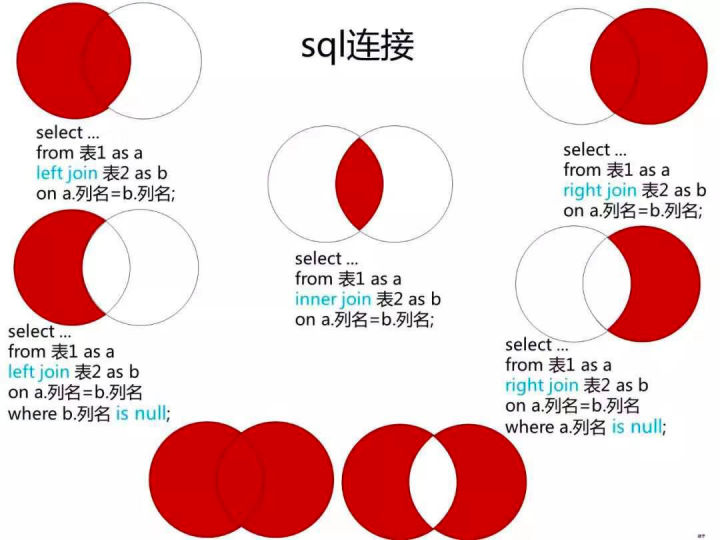

#### 最常用的操作 熟记 ⭐

```sql
#启动关闭MySQL  更多mysql管理：https://www.runoob.com/mysql/mysql-administration.html
net start mysql;
net stop mysql;

SELECT [ALL *|DISTINCT] select_expr    //要查询的列（字段）或表达式
    FROM table_references                //指定查询的数据表
    [JOIN ON XX==XX]
    WHERE where_condition                //查询时需要满足的条件
    GROUP BY col_name                    //对结果进行分组
        HAVING where_condition           //对分组内的数据进行筛选 
    ORDER BY col_name                    //查询结果进行排序 默认按照升序，降序是DESC
    LIMIT row_count       i,j 跳过i行读j行
                   //限定输出的查询结果

insert into useinfo  [(字段1，字段2...)] values (值1，值2...);

update 表名 set 字段名1=值1,字段名2=值2,… [where id='5'];

delete from useinfo where id='7';

SELECT id,age,name FROM student WHERE gender='男' 
AND (professional='教授' OR professional='讲师');

SELECT * FROM students WHERE birthday BETWEEN '1997-01-01' 
AND '1998-12-31';

SELECT * FROM student WHERE student_name Like '_娜%'; _匹配1个 %任意个

SELECT * FROM course WHERE begin_course_time IS NULL;   或者is not null

内连接可以连接多个表，尽量不要这样做
SELECT 
    course.course_name,   #course是course表上的
    SUM(choose.score) AS 总成绩,   #score是另一个表上的
    AVG(choose.score) AS 平均分
FROM choose INNER JOIN course ON choose.Course_id=course.Course_id;

左连接，左边全部显示，右边没有的显示空值 可以用于专门找null
SELECT
    teacher_name,
    department_name
FROM department LEFT JOIN teacher ON department.id=teacher.department_id
WHERE teacher.teacher.id IS NULL;

FULL JOIN:
SELECT tableA. select _ list , tableB .select_list
FROM tableA LEFT [OUTER] JOIN tableB ON tableA .Key = tableB .Key
UNION   --再写一个select语句 right join
SELECT tableA. select _ list , tableB .select_list 
FROM tableA RIGHT [OUTER] JOIN tableB ON tableA .Key = tableB .Key

--只显示成绩前五名的记录  注意先排序，再limit
当数据量很大量并且起始行号较大时， 仅用limit来限制提取行数会导致效率低下。
SELECT * FROM choose ORDER BY score DESC LIMIT 5;  
 --先按学期升序排列，相同学期的课程再按成绩降序排列
ORDER BY course.term ASC, choose.score DESC;  
--一个学院有多个老师，显示出来的学院号是重复的  distinct
SELECT DISTINCT teacher.department_id FROM teacher;  


--分数排名 给定分数表和序号,返回从高到低的分数Score和分数对应的排名Rank
select a.Score as Score,
(select count(distinct b.Score)
from Scores b //临时表b.score大于外面的a
where b.Score >= a.Score) as Rank
from Scores a  //要标记位表a，便于比较
order by a.Score DESC;
```




### group by having

### 部门工资最高的员工

**部门工资最高，可以group by department，然后用max函数**

```SQL
-- 部门工资最高的员工
SELECT
    Department.name AS 'Department',
    Employee.name AS 'Employee',
    Salary
FROM Employee JOIN Department ON 
Employee.DepartmentId = Department.Id
WHERE //能唯一确认部门id和薪资 只有薪资不行
    (Employee.DepartmentId , Salary) IN
    (   SELECT
            DepartmentId, MAX(Salary)
        FROM
            Employee
        GROUP BY DepartmentId
    )
;

--用下面185题的count=0
select ...
from ..join .. on...
where (
    select 
    0 = count(distinct e2.Salary) 
    	from Employee e2 
    	where e2.Salary > e1.Salary and e1.DepartmentId = e2.DepartmentId)
```

#### 查找重复的电子邮箱

```sql
--group by的条件只能用having，不能用where，where在group前面执行
SELECT Email
    FROM Person
GROUP BY Email
HAVING COUNT(Email) > 1;

  
--超过5名学生的课  表设计的有学生是重复的，需要用distinct
select class from courses 
group by class 
having count(distinct student) >=5; 
```

#### [**184. 部门工资前三高的所有员工**](https://leetcode-cn.com/problems/department-top-three-salaries/)

```SQL
SELECT d.Name AS 'Department', e1.Name AS 'Employee', e1.Salary
FROM Employee e1 JOIN Department d ON e1.DepartmentId = d.Id
WHERE 3 >(SELECT COUNT(DISTINCT e2.Salary) 
          FROM Employee e2 相同部门超过它的不多于3个
          WHERE e2.Salary > e1.Salary AND e1.DepartmentId = e2.DepartmentId)
order by Department, Salary DESC;
```

#### [627. 交换工资](https://leetcode-cn.com/problems/swap-salary) 

**考察CASE WHEN THEN END 表达式  表达式返回的是THEN中的值**

```SQL
UPDATE salary 
    SET sex = (CASE sex 
               WHEN 'm' THEN 'f'
               WHEN  'f' THEN 'm'  --或者 ELSE 'm'
               END);
```

