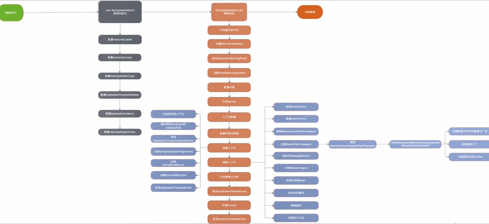
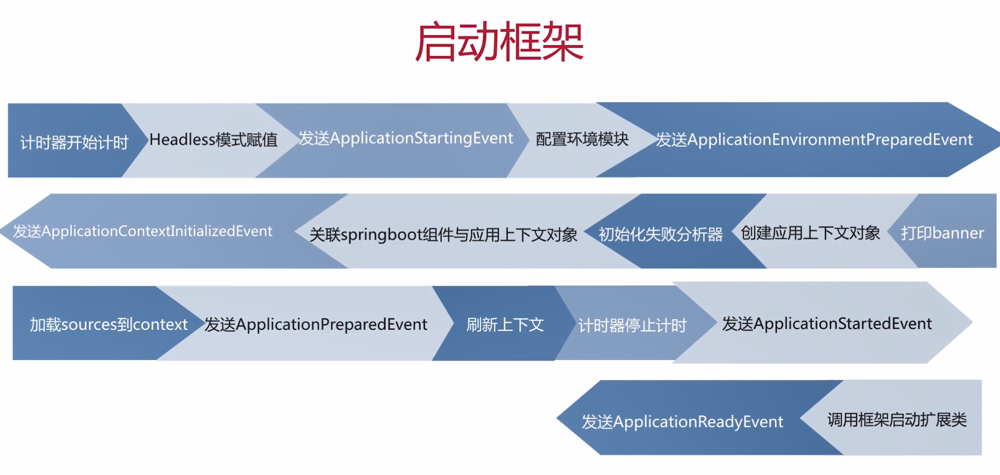

用SpringBoot代替SSM新建项目：https://blog.csdn.net/steven_zhulin/article/details/90726347

**默认的项目启动类，不用动。**

```java
package com.mkx.learnspringboot;

import org.springframework.boot.SpringApplication;
import org.springframework.boot.autoconfigure.SpringBootApplication;

@SpringBootApplication
public class LearnSpringbootApplication {
    public static void main(String[] args) {
        SpringApplication.run(LearnSpringbootApplication.class, args);
    }
}
```

写一个Controller看一下能不能启动成功。

```java
package com.mkx.learnspringboot.controller;

import org.springframework.web.bind.annotation.RequestMapping;
import org.springframework.web.bind.annotation.RestController;

@RestController //相当于@Controller+@ResponseBody
public class ControllerDemo {
    @RequestMapping("hello")
    public String helloSprintBoot() {
        return "hello SprintBoot";
    }
}
```

applications.properties配置

```properties
server.port=8080
mybatis.mapperLocations=classpath:mapping/*.xml

spring.datasource.url=jdbc:mysql://localhost:3306/mybatis?useSSL=false&useUnicode=true&characterEncoding=utf8
spring.datasource.username=root
spring.datasource.password=mkx.mysql

spring.datasource.driverClassName=com.mysql.cj.jdbc.Driver
```

启动：http://localhost:8080/hello，得到`hello SprintBoot`。


# SpringBoot启动过程

**[SpringBoot启动流程解析](https://www.cnblogs.com/trgl/p/7353782.html)、慕课全方位深入解析最新版SpringBoot源码-2-4**

蚂蚁金服CRO二面上来就问了这个问题。

**启动流程主要分为三个部分，第一部分进行SpringApplication的初始化模块-即初始化框架，配置一些基本的环境变量、资源、构造器、监听器，第二部分实现了应用具体的启动方案--即启动框架，包括启动流程的监听模块、加载配置环境模块、及核心的创建上下文环境模块，第三部分是自动化配置模块-即框架自动化装配，该模块作为springboot自动配置核心。**

`SpringApplication.run(LearnSpringbootApplication.class, args);`点进去，可以看到主要有两步：

```java
public static ConfigurableApplicationContext run(Class<?>[] primarySources, String[] args) {
    return new SpringApplication(primarySources).run(args);
}
```

先new SpringApplication初始化框架，再启动框架。





## 框架初始化

**配置资源加载器**

**配置primarySources**

**应用环境检测**

**配置系统初始化器**

**配置应用监听器**

**配置main方法所在类**

```java
	/**
	 * Create a new {@link SpringApplication} instance. The application context will load
	 * beans from the specified primary sources (see {@link SpringApplication class-level}
	 * documentation for details. The instance can be customized before calling
	 * {@link #run(String...)}.
	 * @param resourceLoader the resource loader to use
	 * @param primarySources the primary bean sources
	 * @see #run(Class, String[])
	 * @see #setSources(Set)
	 */
	@SuppressWarnings({ "unchecked", "rawtypes" })
	public SpringApplication(ResourceLoader resourceLoader, Class<?>... primarySources) {
		this.resourceLoader = resourceLoader;
		Assert.notNull(primarySources, "PrimarySources must not be null");
		this.primarySources = new LinkedHashSet<>(Arrays.asList(primarySources));
		this.webApplicationType = WebApplicationType.deduceFromClasspath();
		this.bootstrapRegistryInitializers = getBootstrapRegistryInitializersFromSpringFactories();
		setInitializers((Collection) getSpringFactoriesInstances(ApplicationContextInitializer.class));
		setListeners((Collection) getSpringFactoriesInstances(ApplicationListener.class));
		this.mainApplicationClass = deduceMainApplicationClass();
	}
```

## 启动框架



**刷新上下文调用的是Spring的refresh方法。**

```java
	/**
	 * Run the Spring application, creating and refreshing a new
	 * {@link ApplicationContext}.
	 * @param args the application arguments (usually passed from a Java main method)
	 * @return a running {@link ApplicationContext}
	 */
	public ConfigurableApplicationContext run(String... args) {
		StopWatch stopWatch = new StopWatch();
		stopWatch.start();
		DefaultBootstrapContext bootstrapContext = createBootstrapContext();
		ConfigurableApplicationContext context = null;
		configureHeadlessProperty();
		SpringApplicationRunListeners listeners = getRunListeners(args);
		listeners.starting(bootstrapContext, this.mainApplicationClass);
		try {
			ApplicationArguments applicationArguments = new DefaultApplicationArguments(args);
			ConfigurableEnvironment environment = prepareEnvironment(listeners, bootstrapContext, applicationArguments);
			configureIgnoreBeanInfo(environment);
			Banner printedBanner = printBanner(environment);
			context = createApplicationContext();
			context.setApplicationStartup(this.applicationStartup);
			prepareContext(bootstrapContext, context, environment, listeners, applicationArguments, printedBanner);
			refreshContext(context);
			afterRefresh(context, applicationArguments);
			stopWatch.stop();
			if (this.logStartupInfo) {
				new StartupInfoLogger(this.mainApplicationClass).logStarted(getApplicationLog(), stopWatch);
			}
			listeners.started(context);
			callRunners(context, applicationArguments);
		}
		catch (Throwable ex) {
			handleRunFailure(context, ex, listeners);
			throw new IllegalStateException(ex);
		}

		try {
			listeners.running(context);
		}
		catch (Throwable ex) {
			handleRunFailure(context, ex, null);
			throw new IllegalStateException(ex);
		}
		return context;
	}
```

## 框架自动化装配

**收集配置文件中的配置工厂类**

**加载组件工厂**

**注册组件内定义bean**