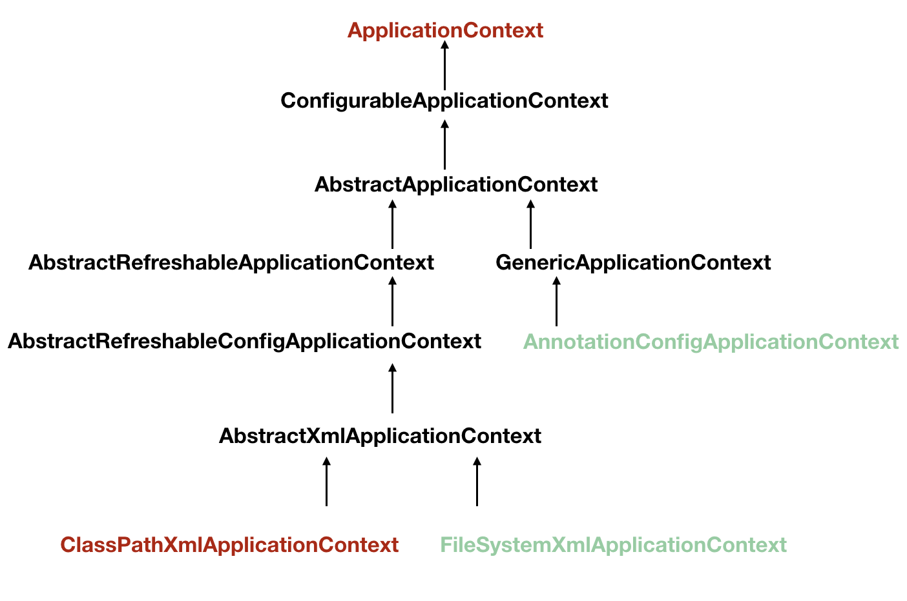
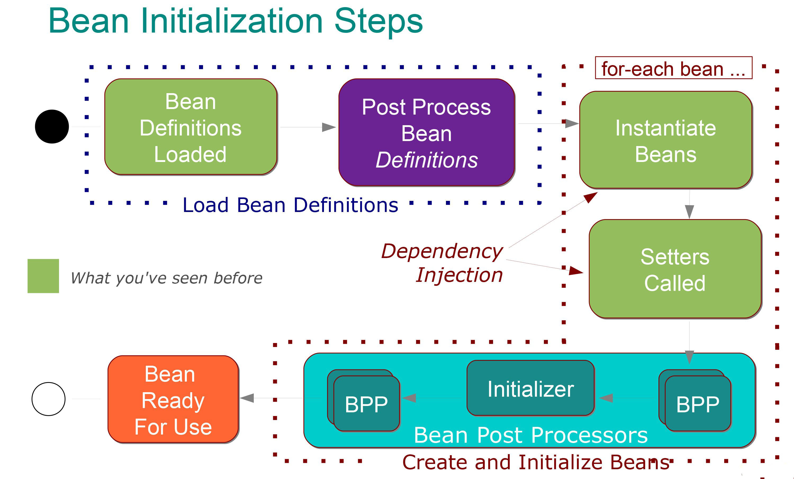
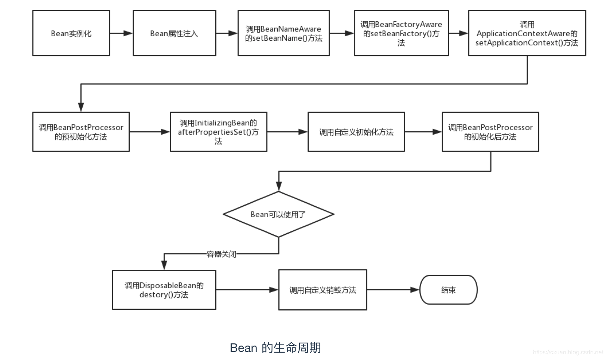
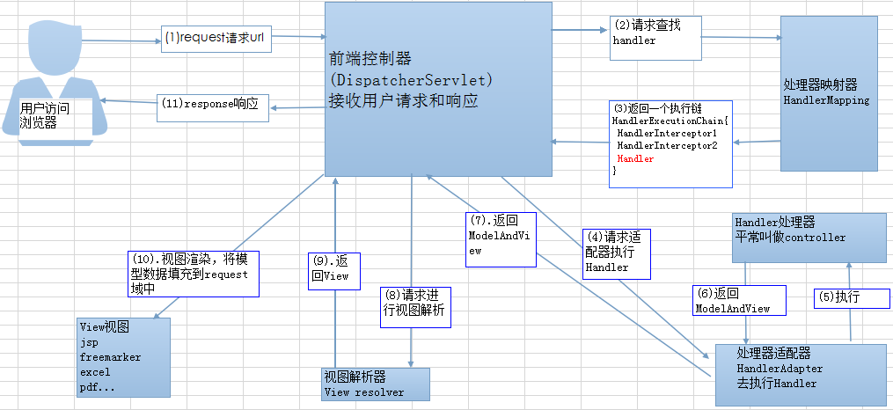
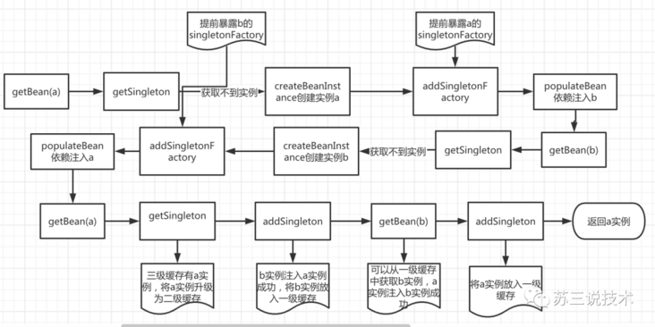
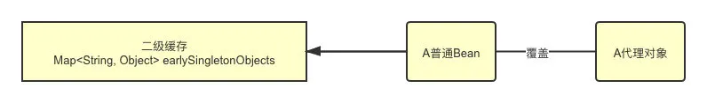

[1、Spring IOC 容器源码分析](https://www.javadoop.com/post/spring-ioc)

[2、Spring AOP 使用介绍，从前世到今生](https://www.javadoop.com/post/spring-aop-intro)

[3、Spring AOP 源码解析](https://www.javadoop.com/post/spring-aop-source)


#### 创建单例对象的过程

abstractApplicationContext中的refresh()

**beanFactory的配置，beanPostProcessor的初始化等**  

进入倒数第二个方法：finishBeanFactoryInitialization(beanFactory); //初始化所有剩下的非懒加载的单例bean

对bean进行一系列的配置操作，并最终进入最后一行，调用beanFactory的preInstantiateSingletons()方法进行初始化所有非lazy-init的bean

preInstantiateSingletons() 中遍历所有的beanNames，自定义的不是工厂bean**，进入getBean(beanName);->doGetBean()** 先初始化当前bean的所有依赖的bean，再初始化当前bean。

**判断是不是单例，如果是****调用DefaultSingletonBeanRegistry中的getSingleton()进行bean的创建。**

**@autowired**

#### Autowired底层原理？

**什么时候做Autowired的注入？**

**Autowired下边有多个实现类，可不可以编译？**

**总结**

**在容器启动，为对象赋值的时候，遇到@Autowired注解，会用后置处理器机制，来创建属性的实例，创建好之后，再利用反射机制，将实例化好的属性，赋值给对象。**

通过debug递归栈查看一下@autowired经过了哪些

1. 容器在初始化的时候，后置处理器的初始化要优先于剩下自定义Bean(比如我们自定义的Service，Controller等等)的初始化的，我们自定义的Bean初始化是在**finishBeanFactoryInitialization**(beanFactory)这里完成的，来到AbstractApplicationContext的**refresh()方法。**
2. **finishBeanFactoryInitialization(beanFactory)**-->beanFactory.preInstantiateSingletons()-->**getBean(beanName)**-->**doGetBean(beanName)-**->来到AbstractBeanFactory第317行**createBean(beanName, mbd, args)**，来创建bean实例-->来到AbstractAutowireCapableBeanFactory第503行**doCreateBean**(beanName, mbdToUse, args)-->紧接着来到AbstractAutowireCapableBeanFactory的第543行，instanceWrapper = **createBeanInstance**(beanName, mbd, args)就**已经把Bean实例创建出来了**，只不过instanceWrapper是一个被包装过了的bean，它里面的**属性还未赋实际值**-->然后来到第555行**applyMergedBeanDefinitionPostProcessors**(mbd, beanType, beanName)，这一步的作用就是**将所有的后置处理器拿出来**，并且把名字叫beanName的类中的变量都封装到InjectionMetadata的injectedElements集合里面，目的是以后从中获取，挨个创建实例，通过反射注入到相应类中。
3. 紧接着来到**AbstractAutowireCapableBeanFactory**第588行**populateBean**(beanName, mbd, instanceWrapper)-->点进去，来到AbstractAutowireCapableBeanFactory的第1347行，来**循环遍历所有的后置处理器for (BeanPostProcessor bp : getBeanPostProcessors())**，从方法名字postProcessPropertyValues也能看出来，就是给属性赋值，**当bp是AutowiredAnnotationBeanPostProcessor的时候，进入postProcessPropertyValues方法**
4. postProcessPropertyValues方法首先找到需要注入的哪些元数据，然后**metadata.inject（注入）**，注入方法点进去，来到InjectionMetadata的inject方法，在一个for循环里面依次执行element.inject(target, beanName, pvs)，来对属性进行注入。
5. 当经过一系列操作完成属性的实例化后，便来到**AutowiredAnnotationBeanPostProcessor的第611行，利用反射为此对象赋值。**这样，对象的创建以及赋值就完成了。


## IOC

**[零基础带你看Spring源码——IOC控制反转](https://mp.weixin.qq.com/s?__biz=MzIyODI2NDE3Nw==&mid=2650127780&idx=1&sn=df75f0278df2910c5c8ef03741dfda06&chksm=f0558c3ac722052c620183fb901f08139dd095bb83081eb6b468695d0ed933a4960daffa94c0&token=1123336669&lang=zh_CN#rd)**

IOC（控制反转）：获得依赖对象的方式反转了，原来对象的创建由程序自己控制，控制反转后将对象的创建转移给第三方。

IOC是一种编程思想，由主动编程变成了被动接收。

在Spring中实现控制反转的是IoC容器，其实现方法是依赖注入（Dependency Injection,DI）。

依赖注入：就是利用set方法来进行注入的。

一句话搞定：对象是由Spring创建，管理，装配！



## xml/注解

xml的优势：解耦。修改时，不用改源码，不涉及重新编译和配置。

注解的优势：配置简单，维护方便（找到了类就找到了配置）

jdk1.5开始支持注解，spring2.5开始全面支持注解。选择哪种配置的原则是简化开发和配置方便，而非追求某种技术

### bean定义

```xml
 <bean id="user" class="当前注解的类"/>
```

#### @Component

上面xml配置与`@Component("user")`等价。

**作用：**把资源让 spring 来管理。相当于在 xml 中配置一个 bean。

**属性：**value：指定 bean 的 id。如果不指定 value 属性，默认 bean 的 id 是当前类的类名。首字母小写。

**@Component三个衍生注解**

为了更好的进行分层，Spring可以使用其它三个注解，功能一样，目前使用哪一个功能都一样。

- @Controller：web层
- @Service：service层
- @Repository：dao层

### 属性注入

包含依赖注入，注入其他bean的属性就是依赖注入。

```xml
<property name="" ref="">
<property name="" value="">
```

#### @Autowired

自动按照类型注入。当使用注解注入属性时，set 方法可以省略。它只能注入其他 bean 类型。当有多个类型匹配时，使用要注入的对象变量名称作为 bean 的 id，在 spring 容器查找，找到了也可以注入成功。找不到就报错。

#### @Qualifier

在自动按照类型注入的基础之上，再按照 Bean 的 id 注入。它在给字段注入时不能独立使用，必须和@Autowire 一起使用；但是给方法参数注入时，可以独立使用。

```java
@Autowired 
@Qualifier("happyDog")
```

适用于**面向接口编程，接口可能有多个实现。**

#### @Resource

根据注解的name属性，找id相同的bean注入。可以独立使用。

#### @value

根据注解中的值，注入基本数据类型和 String 类型数据。

### 生命周期/作用范围

```xml
<bean id="" class="" scope="" init-method="" destroy-method=""/>
```

#### @Scope

指定 bean 的作用范围。value：指定范围的值。取值：singleton prototype request session globalsession

#### @PostConstruct 

用于指定初始化方法。

#### @PreDestroy

用于指定销毁方法。


### 纯注解开发

**这种纯Java的配置方式在Springboot中随处可见。**

#### @Configuration

代表当前类是一个 spring 配置类，当创建容器时会从该类上加载注解。

#### @ComponentScan

用于指定 spring 在初始化容器时要扫描的包。

```xml
<context:component-scan base-package="com.itheima"/>
```

#### @Bean

该注解只能写在方法上，表明使用此方法创建一个对象，并且放入 spring 容器。相当于我们之前写的bean标签，这个方法的名字就相当于bean中的id属性，这个方法的返回值，就相当于bean标签中的class属性。

```java
@Configuration
@ComponentScan("com.xsq.pojo")
public class KuangConfig {
    //注册一个bean，就相当于我们之前写的bean标签
    //这个方法的名字就相当于bean中的id属性
    //这个方法的返回值，就相当于bean标签中的class属性
    @Bean
    public User getUser(){
        return new User();//就是返回要注入到bean的对象
    }
}
```

如果完全使用了配置方式去做，**要通过AnnotationConfig 上下文来获取容器，通过配置类的class对象加载！** 

```java
ApplicationContext context = new AnnotationConfigApplicationContext(KuangConfig.class);        
User getUser = (User) context.getBean("getUser");   //传的是方法名
```

#### @PropertySource

用于加载.properties 文件中的配置。例如我们配置数据源时，可以把连接数据库的信息写到properties 配置文件中，就可以使用此注解指定 properties 配置文件的位置。

#### @Import

用于导入其他配置类。类似于配置文件中的 inculde 标签

**属性：**value[]：用于指定其他配置类的字节码


## AOP

[掘金:Spring-AOP基础](https://juejin.cn/post/6844903575441637390)

AOP（Aspect Oriented Programming）意为：面向切面编程，通过**预编译方式和运行期动态代理**实现程序功能的统一维护的一种技术。AOP是OOP的延续，是软件开发中的一个热点，也是Spring框架中的一个重要内容，是函数式编程的一种衍生范型。利用AOP可以对业务逻辑的各个部分进行隔离，从而使得业务逻辑各部分之间的耦合度降低，提高程序的可重用性，同时提高了开发的效率。

简单的说它就是把我们程序重复的代码抽取出来，在程序运行期间，使用动态代理的技术，在不修改源码的基础上，对我们的已有方法进行增强。

优势： 减少重复代码，提高开发效率，维护方便。


## 动态代理

**使用JDK还是CGLIB？**

1）如果目标对象实现了接口，默认情况下会采用JDK的动态代理实现AOP。

2）如果目标对象实现了接口，可以强制使用CGLIB实现AOP。在spring配置中加入`<aop:aspectj-autoproxy proxy-target-class="true"/>）`。 

3）如果目标对象没有实现了接口，会采用CGLIB库，Spring会自动在JDK动态代理和CGLIB之间转换。


## Spring中的设计模式

**[Spring中的设计模式](D:\计算机\笔记\JavaGuide\docs\system-design\framework\spring\Spring-Design-Patterns.md)**

- **工厂设计模式** : Spring使用工厂模式通过 `BeanFactory`、`ApplicationContext` 创建 bean 对象。
- **代理设计模式** : Spring AOP 功能的实现。
- **单例设计模式** : Spring 中的 Bean 默认都是单例的。
- **模板方法模式** : Spring 中 `jdbcTemplate`、`hibernateTemplate` 等以 Template 结尾的对数据库操作的类，它们就使用到了模板模式。
- **包装器设计模式** : 我们的项目需要连接多个数据库，而且不同的客户在每次访问中根据需要会去访问不同的数据库。这种模式让我们可以根据客户的需求能够动态切换不同的数据源。
- **观察者模式:** Spring 事件驱动模型就是观察者模式很经典的一个应用。
- **适配器模式** :Spring AOP 的增强或通知(Advice)使用到了适配器模式、spring MVC 中也是用到了适配器模式适配`Controller`。
- ......


这篇文章主要是想通过一些问题，加深大家对于 Spring 的理解，所以不会涉及太多的代码！这篇文章整理了挺长时间，下面的很多问题我自己在使用 Spring 的过程中也并没有注意，自己也是临时查阅了很多资料和书籍补上的。网上也有一些很多关于 Spring 常见问题/面试题整理的文章，我感觉大部分都是互相 copy，而且很多问题也不是很好，有些回答也存在问题。所以，自己花了一周的业余时间整理了一下，希望对大家有帮助。

## 1. 什么是 Spring 框架?

Spring 是一种轻量级开发框架，旨在提高开发人员的开发效率以及系统的可维护性。Spring 官网：<https://spring.io/>。

我们一般说 Spring 框架指的都是 Spring Framework，它是很多模块的集合，使用这些模块可以很方便地协助我们进行开发。这些模块是：核心容器、数据访问/集成,、Web、AOP（面向切面编程）、工具、消息和测试模块。比如：Core Container 中的 Core 组件是Spring 所有组件的核心，Beans 组件和 Context 组件是实现IOC和依赖注入的基础，AOP组件用来实现面向切面编程。

Spring 官网列出的 Spring 的 6 个特征:

- **核心技术** ：依赖注入(DI)，AOP，事件(events)，资源，i18n，验证，数据绑定，类型转换，SpEL。
- **测试** ：模拟对象，TestContext框架，Spring MVC 测试，WebTestClient。
- **数据访问** ：事务，DAO支持，JDBC，ORM，编组XML。
- **Web支持** : Spring MVC和Spring WebFlux Web框架。
- **集成** ：远程处理，JMS，JCA，JMX，电子邮件，任务，调度，缓存。
- **语言** ：Kotlin，Groovy，动态语言。

## 2. 列举一些重要的Spring模块？

下图对应的是 Spring4.x 版本。目前最新的5.x版本中 Web 模块的 Portlet 组件已经被废弃掉，同时增加了用于异步响应式处理的 WebFlux 组件。


- **Spring Core：** 基础,可以说 Spring 其他所有的功能都需要依赖于该类库。主要提供 IoC 依赖注入功能。
- **Spring  Aspects** ： 该模块为与AspectJ的集成提供支持。
- **Spring AOP** ：提供了面向切面的编程实现。
- **Spring JDBC** : Java数据库连接。
- **Spring JMS** ：Java消息服务。
- **Spring ORM** : 用于支持Hibernate等ORM工具。
- **Spring Web** : 为创建Web应用程序提供支持。
- **Spring Test** : 提供了对 JUnit 和 TestNG 测试的支持。

## 3. @RestController vs @Controller

**`Controller` 返回一个页面**

单独使用 `@Controller` 不加 `@ResponseBody`的话一般使用在要返回一个视图的情况，这种情况属于比较传统的Spring MVC 的应用，对应于前后端不分离的情况。


**`@RestController` 返回JSON 或 XML 形式数据**

但`@RestController`只返回对象，对象数据直接以 JSON 或 XML 形式写入 HTTP 响应(Response)中，这种情况属于 RESTful Web服务，这也是目前日常开发所接触的最常用的情况（前后端分离）。


**`@Controller +@ResponseBody` 返回JSON 或 XML 形式数据**

如果你需要在Spring4之前开发 RESTful Web服务的话，你需要使用`@Controller` 并结合`@ResponseBody`注解，也就是说`@Controller` +`@ResponseBody`= `@RestController`（Spring 4 之后新加的注解）。

> `@ResponseBody` 注解的作用是将 `Controller` 的方法返回的对象通过适当的转换器转换为指定的格式之后，写入到HTTP 响应(Response)对象的 body 中，通常用来返回 JSON 或者 XML 数据，返回 JSON 数据的情况比较多。


Reference:

- https://dzone.com/articles/spring-framework-restcontroller-vs-controller （图片来源）
- https://javarevisited.blogspot.com/2017/08/difference-between-restcontroller-and-controller-annotations-spring-mvc-rest.html?m=1

## 4. Spring IOC & AOP

### 4.1 谈谈自己对于 Spring IoC 和 AOP 的理解

#### IoC

IoC（Inverse of Control:控制反转）是一种**设计思想**，就是 **将原本在程序中手动创建对象的控制权，交由Spring框架来管理。**  IoC 在其他语言中也有应用，并非 Spring 特有。 **IoC 容器是 Spring 用来实现 IoC 的载体，  IoC 容器实际上就是个Map（key，value）,Map 中存放的是各种对象。**

将对象之间的相互依赖关系交给 IoC 容器来管理，并由 IoC 容器完成对象的注入。这样可以很大程度上简化应用的开发，把应用从复杂的依赖关系中解放出来。  **IoC 容器就像是一个工厂一样，当我们需要创建一个对象的时候，只需要配置好配置文件/注解即可，完全不用考虑对象是如何被创建出来的。** 在实际项目中一个 Service 类可能有几百甚至上千个类作为它的底层，假如我们需要实例化这个 Service，你可能要每次都要搞清这个 Service 所有底层类的构造函数，这可能会把人逼疯。如果利用 IoC 的话，你只需要配置好，然后在需要的地方引用就行了，这大大增加了项目的可维护性且降低了开发难度。

Spring 时代我们一般通过 XML 文件来配置 Bean，后来开发人员觉得 XML 文件来配置不太好，于是 SpringBoot 注解配置就慢慢开始流行起来。

推荐阅读：https://www.zhihu.com/question/23277575/answer/169698662

**Spring IoC的初始化过程：** 


IoC源码阅读

- https://javadoop.com/post/spring-ioc

#### AOP

AOP(Aspect-Oriented Programming:面向切面编程)能够将那些与业务无关，**却为业务模块所共同调用的逻辑或责任（例如事务处理、日志管理、权限控制等）封装起来**，便于**减少系统的重复代码**，**降低模块间的耦合度**，并**有利于未来的可拓展性和可维护性**。

**Spring AOP就是基于动态代理的**，如果要代理的对象，实现了某个接口，那么Spring AOP会使用**JDK Proxy**，去创建代理对象，而对于没有实现接口的对象，就无法使用 JDK Proxy 去进行代理了，这时候Spring AOP会使用**Cglib** ，这时候Spring AOP会使用 **Cglib** 生成一个被代理对象的子类来作为代理，如下图所示：


当然你也可以使用 AspectJ ,Spring AOP 已经集成了AspectJ  ，AspectJ  应该算的上是 Java 生态系统中最完整的 AOP 框架了。

使用 AOP 之后我们可以把一些通用功能抽象出来，在需要用到的地方直接使用即可，这样大大简化了代码量。我们需要增加新功能时也方便，这样也提高了系统扩展性。日志功能、事务管理等等场景都用到了 AOP 。

### 4.2 Spring AOP 和 AspectJ AOP 有什么区别？

**Spring AOP 属于运行时增强，而 AspectJ 是编译时增强。** Spring AOP 基于代理(Proxying)，而 AspectJ 基于字节码操作(Bytecode Manipulation)。

 Spring AOP 已经集成了 AspectJ  ，AspectJ  应该算的上是 Java 生态系统中最完整的 AOP 框架了。AspectJ  相比于 Spring AOP 功能更加强大，但是 Spring AOP 相对来说更简单，

如果我们的切面比较少，那么两者性能差异不大。但是，当切面太多的话，最好选择 AspectJ ，它比Spring AOP 快很多。

## 5. Spring bean

### 5.1 Spring 中的 bean 的作用域有哪些?

- singleton : 唯一 bean 实例，Spring 中的 bean 默认都是单例的。
- prototype : 每次请求都会创建一个新的 bean 实例。
- request : 每一次HTTP请求都会产生一个新的bean，该bean仅在当前HTTP request内有效。
- session : 每一次HTTP请求都会产生一个新的 bean，该bean仅在当前 HTTP session 内有效。
- global-session： 全局session作用域，仅仅在基于portlet的web应用中才有意义，Spring5已经没有了。Portlet是能够生成语义代码(例如：HTML)片段的小型Java Web插件。它们基于portlet容器，可以像servlet一样处理HTTP请求。但是，与 servlet 不同，每个 portlet 都有不同的会话

### 5.2 Spring 中的单例 bean 的线程安全问题了解吗？

的确是存在安全问题的。因为，当多个线程操作同一个对象的时候，对这个对象的成员变量的写操作会存在线程安全问题。

但是，一般情况下，我们常用的 `Controller`、`Service`、`Dao` 这些 Bean 是无状态的。无状态的 Bean 不能保存数据，因此是线程安全的。

常见的有 2 种解决办法：

2. 在类中定义一个 `ThreadLocal` 成员变量，将需要的可变成员变量保存在  `ThreadLocal`  中（推荐的一种方式）。
2. 改变 Bean 的作用域为 “prototype”：每次请求都会创建一个新的 bean 实例，自然不会存在线程安全问题。


### 5.3 @Component 和 @Bean 的区别是什么？

1. 作用对象不同: `@Component` 注解作用于类，而`@Bean`注解作用于方法。
2. `@Component`通常是通过类路径扫描来自动侦测以及自动装配到Spring容器中（我们可以使用 `@ComponentScan` 注解定义要扫描的路径从中找出标识了需要装配的类自动装配到 Spring 的 bean 容器中）。`@Bean` 注解通常是我们在标有该注解的方法中定义产生这个 bean,`@Bean`告诉了Spring这是某个类的示例，当我需要用它的时候还给我。
3. `@Bean` 注解比 `Component` 注解的自定义性更强，而且很多地方我们只能通过 `@Bean` 注解来注册bean。比如当我们引用第三方库中的类需要装配到 `Spring`容器时，则只能通过 `@Bean`来实现。

`@Bean`注解使用示例：

```java
@Configuration
public class AppConfig {
    @Bean
    public TransferService transferService() {
        return new TransferServiceImpl();
    }

}
```

 上面的代码相当于下面的 xml 配置

```xml
<beans>
    <bean id="transferService" class="com.acme.TransferServiceImpl"/>
</beans>
```

下面这个例子是通过 `@Component` 无法实现的。

```java
@Bean
public OneService getService(status) {
    case (status)  {
        when 1:
                return new serviceImpl1();
        when 2:
                return new serviceImpl2();
        when 3:
                return new serviceImpl3();
    }
}
```

### 5.4 将一个类声明为Spring的 bean 的注解有哪些?

我们一般使用 `@Autowired` 注解自动装配 bean，要想把类标识成可用于 `@Autowired` 注解自动装配的 bean 的类,采用以下注解可实现：

- `@Component` ：通用的注解，可标注任意类为 `Spring` 组件。如果一个Bean不知道属于哪个层，可以使用`@Component` 注解标注。
- `@Repository` : 对应持久层即 Dao 层，主要用于数据库相关操作。
- `@Service` : 对应服务层，主要涉及一些复杂的逻辑，需要用到 Dao层。
- `@Controller` : 对应 Spring MVC 控制层，主要用于接受用户请求并调用 Service 层返回数据给前端页面。

### Spring 中的 bean 生命周期? ⭐

这部分网上有很多文章都讲到了，下面的内容整理自：<https://yemengying.com/2016/07/14/spring-bean-life-cycle/> ，除了这篇文章，再推荐一篇很不错的文章 ：<https://www.cnblogs.com/zrtqsk/p/3735273.html> 。

- Bean 容器找到配置文件中 Spring Bean 的定义。
- Bean 容器利用 Java Reflection API 创建一个Bean的实例。
- 如果涉及到一些属性值 利用 `set()`方法设置一些属性值。
- 如果实现了`xxxAware`接口，通过不同类型的Aware接口拿到Spring容器的资源
  - 如果 Bean 实现了 `BeanNameAware` 接口，调用 `setBeanName()`方法，传入Bean的名字。
  - 如果 Bean 实现了 `BeanClassLoaderAware` 接口，调用 `setBeanClassLoader()`方法，传入 `ClassLoader`对象的实例。
  - 与上面的类似，如果实现了其他 `*.Aware`接口，就调用相应的方法。
- 如果有和加载这个 Bean 的 Spring 容器相关的 `BeanPostProcessor` 对象，执行`postProcessBeforeInitialization()` 方法
- 如果Bean实现了`InitializingBean`接口，执行`afterPropertiesSet()`方法。
- 如果 Bean 在配置文件中的定义包含 init-method 属性或者有`@PostConstruct`标签的init方法，执行指定的方法。
- 如果有和加载这个 Bean的 Spring 容器相关的 `BeanPostProcessor` 对象，执行`postProcessAfterInitialization()` 方法
- 当要销毁 Bean 的时候，如果 Bean 实现了 `DisposableBean` 接口，执行 `destroy()` 方法。
- 当要销毁 Bean 的时候，如果 Bean 在配置文件中的定义包含 destroy-method 属性，执行指定的方法。

图示：


与之比较类似的中文版本:


**高级的IOC，提供了很多切入点。**

**实例化 -> 属性赋值 -> 初始化 -> 销毁**

**首先加载bean定义，后处理bean定义，然后根据bean定义进行实例化，对于实现了三个aware接口的，依赖注入。bean的后处理，postProcessBeforeInitialization（初始化之前修改属性），初始化（@PostConstruct init()），postProcessAfterInitialization。DisposableBean接口-destory()方法/声明destory方法**

如果是低级容器，beanFactory这种，2 步骤就可以了：

1、加载配置文件，解析成 BeanDefinition 放在 Map 里。

2、调用 getBean 的时候，从 BeanDefinition 所属的 Map 里，拿出 Class 对象进行实例化，同时，如果有依赖关系，将递归调用 getBean 方法 —— 完成依赖注入。

https://www.jianshu.com/p/1dec08d290c1

https://www.cnblogs.com/yuxiang1/archive/2018/06/19/9199730.html





\1. 加载bean定义，并将bean实例化

**\2. 使用依赖注入，spring按照Bean定义信息配置Bean的所有属性**

**各种aware接口：依赖注入**

\3. 如果Bean实现了BeanNameAware接口，工厂调用Bean的setBeanName()方法传递Bean的ID        **作用：让实现这个接口的bean知道自己在spring容器里的名字**

\4. 如果Bean实现了BeanFactoryAware接口，工厂调用setBeanFactory()方法传入工厂自身   	**作用：让实现这个接口的bean获取配置他们的BeanFactory的引用。**

\5. 如果Bean实现了ApplicationContextAware接口的话，Spring将调用Bean的setApplicationContext()方法。**作用：让实现这个接口的bean能获取到applicationContext，这个bean就可以获取到它需要的bean。** 

为什么需要ApplicationContextAware?

　　在某些类中我们经常需要**通过ApplicationContext来获取需要的bean**,但每一次使用new ClassPathXmlApplicationContext()都会重新装配文件并实例化上下文bean，这样肯定是很麻烦的，此时ApplicationContextAware接口的作用就体现出来了——spring会给实现此接口的类注入ApplicationContext对象   别忘了给这个类标注**@Component **

**后置处理BeanPostProcessor： 实际上这个时候对象已经创建好了，后置处理器修改创建好的对象的属性（把男的变成女的），甚至把bean封装成代理对象，AOP就是这么做的。**在postProcessBeforeInitialization或者postProcessAfterInitialization方法中，对对象进行判断，看他需不需要织入切面逻辑，如果需要，那我就根据这个对象，生成一个代理对象，然后返回这个代理对象，那么最终注入容器的，自然就是代理对象了。

 有两个方法：postProcessBeforeInitialization  postProcessAfterInitialization

\6. 如果Bean 实现了BeanPostProcessor接口，那么其postProcessBeforeInitialization()方法将被调用  **初始化之前修改属性**

\7. **生命周期的回调**：如果Bean 实现了InitializingBean接口，Spring将调用他们的afterPropertiesSet()方法。如果bean使用init-method声明了初始化方法，或者使用**@PostConstruct，该方法也会被调用，用于指定初始化方法**    **给注入的成员变量ExecutorService初始化**

\8. 最后，如果Bean 实现了BeanPostProcessor接口，那么其postProcessAfterInitialization()方法将被调用

此时，Bean已经可以被应用系统使用，并将被保留在BeanFactory中直到他不再被需要。

有两种可以将其从BeanFactory中删除掉的方法

9.如果bean实现了DisposableBean接口，Spring将调用它的destory()接口方法，同样，如果bean声明了destory-method 声明销毁方法，该方法也会被调用。


## 6. Spring MVC

### 6.1 说说自己对于 Spring MVC 了解?

谈到这个问题，我们不得不提提之前 Model1 和 Model2 这两个没有 Spring MVC 的时代。

- **Model1 时代** : 很多学 Java 后端比较晚的朋友可能并没有接触过  Model1 模式下的 JavaWeb 应用开发。在 Model1 模式下，整个 Web 应用几乎全部用 JSP 页面组成，只用少量的 JavaBean 来处理数据库连接、访问等操作。这个模式下 JSP 既是控制层又是表现层。显而易见，这种模式存在很多问题。比如①将控制逻辑和表现逻辑混杂在一起，导致代码重用率极低；②前端和后端相互依赖，难以进行测试并且开发效率极低；
- **Model2 时代** ：学过 Servlet 并做过相关 Demo 的朋友应该了解“Java Bean(Model)+ JSP（View,）+Servlet（Controller）  ”这种开发模式,这就是早期的 JavaWeb MVC 开发模式。Model:系统涉及的数据，也就是 dao 和 bean。View：展示模型中的数据，只是用来展示。Controller：处理用户请求都发送给 ，返回数据给 JSP 并展示给用户。

Model2 模式下还存在很多问题，Model2的抽象和封装程度还远远不够，使用Model2进行开发时不可避免地会重复造轮子，这就大大降低了程序的可维护性和复用性。于是很多JavaWeb开发相关的 MVC 框架应运而生比如Struts2，但是 Struts2 比较笨重。随着 Spring 轻量级开发框架的流行，Spring 生态圈出现了 Spring MVC 框架， Spring MVC 是当前最优秀的 MVC 框架。相比于 Struts2 ， Spring MVC 使用更加简单和方便，开发效率更高，并且 Spring MVC 运行速度更快。

MVC 是一种设计模式,Spring MVC 是一款很优秀的 MVC 框架。Spring MVC 可以帮助我们进行更简洁的Web层的开发，并且它天生与 Spring 框架集成。Spring MVC 下我们一般把后端项目分为 Service层（处理业务）、Dao层（数据库操作）、Entity层（实体类）、Controller层(控制层，返回数据给前台页面)。

**Spring MVC 的简单原理图如下：**


### 6.2 SpringMVC 工作原理了解吗?

**原理如下图所示：**


上图的一个笔误的小问题：Spring MVC 的入口函数也就是前端控制器 `DispatcherServlet` 的作用是接收请求，响应结果。

**流程说明（重要）：**

1. 客户端（浏览器）发送请求，直接请求到 `DispatcherServlet`。
2. `DispatcherServlet` 根据请求信息调用 `HandlerMapping`，解析请求对应的 `Handler`。
3. 解析到对应的 `Handler`（也就是我们平常说的 `Controller` 控制器）后，开始由 `HandlerAdapter` 适配器处理。
4. `HandlerAdapter` 会根据 `Handler `来调用真正的处理器来处理请求，并处理相应的业务逻辑。
5. 处理器处理完业务后，会返回一个 `ModelAndView` 对象，`Model` 是返回的数据对象，`View` 是个逻辑上的 `View`。
6. `ViewResolver` 会根据逻辑 `View` 查找实际的 `View`。
7. `DispaterServlet` 把返回的 `Model` 传给 `View`（视图渲染）。
8. 把 `View` 返回给请求者（浏览器）

## 8. Spring 事务

### 8.1 Spring 管理事务的方式有几种？

1. 编程式事务，在代码中硬编码。(不推荐使用)
2. 声明式事务，在配置文件中配置（推荐使用）

**声明式事务又分为两种：**

1. 基于XML的声明式事务
2. 基于注解的声明式事务

### 8.2 Spring 事务中的隔离级别有哪几种?

**TransactionDefinition 接口中定义了五个表示隔离级别的常量：**

- **TransactionDefinition.ISOLATION_DEFAULT:**  使用后端数据库默认的隔离级别，Mysql 默认采用的 REPEATABLE_READ隔离级别 Oracle 默认采用的 READ_COMMITTED隔离级别.
- **TransactionDefinition.ISOLATION_READ_UNCOMMITTED:** 最低的隔离级别，允许读取尚未提交的数据变更，**可能会导致脏读、幻读或不可重复读**
- **TransactionDefinition.ISOLATION_READ_COMMITTED:**   允许读取并发事务已经提交的数据，**可以阻止脏读，但是幻读或不可重复读仍有可能发生**
- **TransactionDefinition.ISOLATION_REPEATABLE_READ:**  对同一字段的多次读取结果都是一致的，除非数据是被本身事务自己所修改，**可以阻止脏读和不可重复读，但幻读仍有可能发生。**
- **TransactionDefinition.ISOLATION_SERIALIZABLE:**   最高的隔离级别，完全服从ACID的隔离级别。所有的事务依次逐个执行，这样事务之间就完全不可能产生干扰，也就是说，**该级别可以防止脏读、不可重复读以及幻读**。但是这将严重影响程序的性能。通常情况下也不会用到该级别。

### 8.3 Spring 事务中哪几种事务传播行为?

**支持当前事务的情况：**

- **TransactionDefinition.PROPAGATION_REQUIRED：** 如果当前存在事务，则加入该事务；如果当前没有事务，则创建一个新的事务。
- **TransactionDefinition.PROPAGATION_SUPPORTS：** 如果当前存在事务，则加入该事务；如果当前没有事务，则以非事务的方式继续运行。
- **TransactionDefinition.PROPAGATION_MANDATORY：** 如果当前存在事务，则加入该事务；如果当前没有事务，则抛出异常。（mandatory：强制性）

**不支持当前事务的情况：**

- **TransactionDefinition.PROPAGATION_REQUIRES_NEW：** 创建一个新的事务，如果当前存在事务，则把当前事务挂起。
- **TransactionDefinition.PROPAGATION_NOT_SUPPORTED：** 以非事务方式运行，如果当前存在事务，则把当前事务挂起。
- **TransactionDefinition.PROPAGATION_NEVER：** 以非事务方式运行，如果当前存在事务，则抛出异常。

**其他情况：**

- **TransactionDefinition.PROPAGATION_NESTED：** 如果当前存在事务，则创建一个事务作为当前事务的嵌套事务来运行；如果当前没有事务，则该取值等价于TransactionDefinition.PROPAGATION_REQUIRED。

### 8.4 @Transactional(rollbackFor = Exception.class)注解了解吗？

我们知道：Exception分为运行时异常RuntimeException和非运行时异常。事务管理对于企业应用来说是至关重要的，即使出现异常情况，它也可以保证数据的一致性。

当`@Transactional`注解作用于类上时，该类的所有 public 方法将都具有该类型的事务属性，同时，我们也可以在方法级别使用该标注来覆盖类级别的定义。如果类或者方法加了这个注解，那么这个类里面的方法抛出异常，就会回滚，数据库里面的数据也会回滚。

在`@Transactional`注解中如果不配置`rollbackFor`属性,那么事务只会在遇到`RuntimeException`的时候才会回滚,加上`rollbackFor=Exception.class`,可以让事务在遇到非运行时异常时也回滚。

关于 `@Transactional ` 注解推荐阅读的文章：

- [透彻的掌握 Spring 中@transactional 的使用](https://www.ibm.com/developerworks/cn/java/j-master-spring-transactional-use/index.html)

## 9. JPA

### 9.1 如何使用JPA在数据库中非持久化一个字段？

假如我们有有下面一个类：

```java
Entity(name="USER")
public class User {
    
    @Id
    @GeneratedValue(strategy = GenerationType.AUTO)
    @Column(name = "ID")
    private Long id;
    
    @Column(name="USER_NAME")
    private String userName;
    
    @Column(name="PASSWORD")
    private String password;
  
    private String secrect;
  
}
```

如果我们想让`secrect` 这个字段不被持久化，也就是不被数据库存储怎么办？我们可以采用下面几种方法：

```java
static String transient1; // not persistent because of static
final String transient2 = “Satish”; // not persistent because of final
transient String transient3; // not persistent because of transient
@Transient
String transient4; // not persistent because of @Transient
```

一般使用后面两种方式比较多，我个人使用注解的方式比较多。


## 参考

- 《Spring 技术内幕》
- <http://www.cnblogs.com/wmyskxz/p/8820371.html>
- <https://www.journaldev.com/2696/spring-interview-questions-and-answers>
- <https://www.edureka.co/blog/interview-questions/spring-interview-questions/>
- https://www.cnblogs.com/clwydjgs/p/9317849.html
- <https://howtodoinjava.com/interview-questions/top-spring-interview-questions-with-answers/>
- <http://www.tomaszezula.com/2014/02/09/spring-series-part-5-component-vs-bean/>
- <https://stackoverflow.com/questions/34172888/difference-between-bean-and-autowired>
- <https://www.interviewbit.com/spring-interview-questions/>


## Spring循环依赖 ⭐

**非常好的解答：https://www.cnblogs.com/grey-wolf/p/13034371.html**

https://www.jb51.net/article/197450.htm

https://blog.csdn.net/weixin_42440637/article/details/112264648



首先，Spring 解决循环依赖有两个前提条件：

1. 不全是构造器方式的循环依赖
2. 必须是单例

基于上面的问题，我们知道Bean的生命周期，本质上解决循环依赖的问题就是三级缓存，通过三级缓存提前拿到未初始化的对象。

第一级缓存：

第二级缓存：

第三级缓存：

| 名称                  | 描述                                                         |
| :-------------------- | :----------------------------------------------------------- |
| singletonObjects      | 一级缓存，用来保存实例化、初始化都完成的对象。即完整的 Bean  |
| earlySingletonObjects | 二级缓存，存放提前暴露的Bean，Bean 是不完整的，用来保存实例化完成，但是未初始化-未完成属性注入和执行 init 方法。 |
| singletonFactories    | 三级缓存，用来保存一个对象工厂，提供一个匿名内部类，用于创建二级缓存中的Bean |

所有被 Spring 管理的 Bean，最终都会存放在 singletonObjects 中，这里面存放的 Bean 是经历了所有生命周期的（除了销毁的生命周期），完整的，可以给用户使用的。

earlySingletonObjects 存放的是已经被实例化，但是还没有注入属性和执行 init 方法的 Bean。

singletonFactories 存放的是生产 Bean 的工厂。

### 为什么要三级缓存？二级不行吗？

不可以，主要是为了生成代理对象。

因为三级缓存中放的是生成具体对象的匿名内部类，他可以生成代理对象，也可以是普通的实例对象。

使用三级缓存主要是为了保证不管什么时候使用的都是一个对象。

假设只有二级缓存的情况，往二级缓存中放的显示一个普通的Bean对象，`BeanPostProcessor`去生成代理对象之后，覆盖掉二级缓存中的普通Bean对象，那么多线程环境下可能取到的对象就不一致了。




#### 什么是三级缓存

在获取单例bean的时候，会进入以下方法：

```java
org.springframework.beans.factory.support.DefaultSingletonBeanRegistry#getSingleton(java.lang.String, boolean)

    protected Object getSingleton(String beanName, boolean allowEarlyReference) {
    // 1 
    Object singletonObject = this.singletonObjects.get(beanName);
    if (singletonObject == null && isSingletonCurrentlyInCreation(beanName)) {
        synchronized (this.singletonObjects) {
            // 2
            singletonObject = this.earlySingletonObjects.get(beanName);
            if (singletonObject == null && allowEarlyReference) {
                // 3
                ObjectFactory<?> singletonFactory = this.singletonFactories.get(beanName);
                if (singletonFactory != null) {
                    // 4
                    singletonObject = singletonFactory.getObject();
                    this.earlySingletonObjects.put(beanName, singletonObject);
                    this.singletonFactories.remove(beanName);
                }
            }
        }
    }
    return singletonObject;
}
```

这里面涉及到了该类中的三个field。

```java
/** 1级缓存 Cache of singleton objects: bean name to bean instance. */
private final Map<String, Object> singletonObjects = new ConcurrentHashMap<>(256);

/** 2级缓存 Cache of early singleton objects: bean name to bean instance. */
private final Map<String, Object> earlySingletonObjects = new HashMap<>(16);

/** 3级缓存 Cache of singleton factories: bean name to ObjectFactory. */
private final Map<String, ObjectFactory<?>> singletonFactories = new HashMap<>(16);
```

接着说前面的代码。

- 先从singletonObjects（一级缓存）中获取实例，如果可以获取到则直接返回singletonObject实例。
- 如果从singletonObjects（一级缓存）中获取不对实例，再从earlySingletonObjects（二级缓存）中获取实例，如果可以获取到则直接返回singletonObject实例。
- 如果从earlySingletonObjects（二级缓存）中获取不对实例，则从singletonFactories（三级缓存）中获取singletonFactory，如果获取到则调用getObject方法创建实例，把创建好的实例放到earlySingletonObjects（二级缓存）中，并且从singletonFactories（三级缓存）删除singletonFactory实例，然后返回singletonObject实例。
- 如果从singletonObjects、earlySingletonObjects和singletonFactories中都获取不到实例，则singletonObject对象为空。


**创建 Bean 的方法在 AbstractAutowireCapableBeanFactory::doCreateBean()**

```java
protected Object doCreateBean(final String beanName, final RootBeanDefinition mbd, Object[] args) throws BeanCreationException {
  BeanWrapper instanceWrapper = null;
  
  if (instanceWrapper == null) {
    // ① 实例化对象
    instanceWrapper = this.createBeanInstance(beanName, mbd, args);
  }

  final Object bean = instanceWrapper != null ? instanceWrapper.getWrappedInstance() : null;
  Class<?> beanType = instanceWrapper != null ? instanceWrapper.getWrappedClass() : null;
  
  // ② 判断是否允许提前暴露对象，如果允许，则直接添加一个 ObjectFactory 到三级缓存
  boolean earlySingletonExposure = (mbd.isSingleton() && this.allowCircularReferences &&
        isSingletonCurrentlyInCreation(beanName));
  if (earlySingletonExposure) {
    // 添加三级缓存的方法详情在下方
    addSingletonFactory(beanName, () -> getEarlyBeanReference(beanName, mbd, bean));
  }

  // ③ 填充属性
  this.populateBean(beanName, mbd, instanceWrapper);
  // ④ 执行初始化方法，并创建代理
  exposedObject = initializeBean(beanName, exposedObject, mbd);
  
  return exposedObject;
}
```

添加三级缓存的方法如下：

```java
protected void addSingletonFactory(String beanName, ObjectFactory<?> singletonFactory) {
    Assert.notNull(singletonFactory, "Singleton factory must not be null");
    synchronized (this.singletonObjects) {
        if (!this.singletonObjects.containsKey(beanName)) { // 判断一级缓存中不存在此对象
            this.singletonFactories.put(beanName, singletonFactory); // 添加至三级缓存
            this.earlySingletonObjects.remove(beanName); // 确保二级缓存没有此对象
            this.registeredSingletons.add(beanName);
        }
    }
}

@FunctionalInterface
public interface ObjectFactory<T> {
    T getObject() throws BeansException;
}
```

通过这段代码，我们可以知道 Spring 在实例化对象的之后，就会为其创建一个 Bean 工厂，并将此工厂加入到三级缓存中。

因此，**Spring 一开始提前暴露的并不是实例化的 Bean，而是将 Bean 包装起来的 ObjectFactory。为什么要这么做呢？**

**第三级缓存的目的是为了延迟代理对象的创建，因为如果没有依赖循环的话，那么就不需要为其提前创建代理，可以将它延迟到初始化完成之后再创建。**

这实际上涉及到 AOP，如果创建的 Bean 是有代理的，那么注入的就应该是代理 Bean，而不是原始的 Bean。但是 Spring 一开始并不知道 Bean 是否会有循环依赖，通常情况下（没有循环依赖的情况下），Spring 都会在完成填充属性，并且执行完初始化方法之后再为其创建代理。但是，如果出现了循环依赖的话，Spring 就不得不为其提前创建代理对象，否则注入的就是一个原始对象，而不是代理对象。因此，这里就涉及到应该在哪里提前创建代理对象？

Spring 的做法就是在 ObjectFactory 中去提前创建代理对象。它会执行 getObject() 方法来获取到 Bean。实际上，它真正执行的方法如下：

```java
protected Object getEarlyBeanReference(String beanName, RootBeanDefinition mbd, Object bean) {
  Object exposedObject = bean;
  if (!mbd.isSynthetic() && hasInstantiationAwareBeanPostProcessors()) {
    for (BeanPostProcessor bp : getBeanPostProcessors()) {
      if (bp instanceof SmartInstantiationAwareBeanPostProcessor) {
        SmartInstantiationAwareBeanPostProcessor ibp = (SmartInstantiationAwareBeanPostProcessor) bp;
        // 如果需要代理，这里会返回代理对象；否则返回原始对象
        exposedObject = ibp.getEarlyBeanReference(exposedObject, beanName);
      }
    }
  }
  return exposedObject;
}
```

**因为提前进行了代理**，避免对后面重复创建代理对象，会在 earlyProxyReferences 中记录已被代理的对象。

```java
public abstract class AbstractAutoProxyCreator extends ProxyProcessorSupport
    implements SmartInstantiationAwareBeanPostProcessor, BeanFactoryAware {
  @Override
  public Object getEarlyBeanReference(Object bean, String beanName) {
    Object cacheKey = getCacheKey(bean.getClass(), beanName);
    // 记录已被代理的对象
    this.earlyProxyReferences.put(cacheKey, bean);
    return wrapIfNecessary(bean, beanName, cacheKey);
  }
}
```

通过上面的解析，我们可以知道 Spring 需要三级缓存的目的是为了在没有循环依赖的情况下，延迟代理对象的创建，使 Bean 的创建符合 Spring 的设计原则。


### 为什么要二级缓存

一级缓存的问题在于，就1个map，里面既有完整的已经ready的bean，也有不完整的，尚未设置field的bean。

如果这时候，有其他线程去这个map里获取bean来用怎么办？拿到的bean，不完整，怎么办呢？属性都是null，直接空指针了。

**创建了bean之后，属性注入之前，将创建出来的不完整bean，放到`earlySingletonObjects`**

### 为什么要三级缓存

ioc循环依赖只有二级缓存一点问题都没有，完全够用了。三级缓存是为了AOP。

加个三级缓存，里面不存具体的bean，里面存一个工厂对象。通过工厂对象，是可以拿到最终形态的代理后的egg。

如果没有三级缓存，无论有没有循环依赖，AOP场景则为了循环依赖中最终取到的实例是代理对象，**则必须在对象实例化的一开始(依赖注入及init方法前)就先生成代理对象**，并放到二级缓存中，这样的化就不符合Spring生命周期的设计。按照Spring生命周期的设计原则，**AOP生成代理对象的基础是当前对象实例已经初始化完毕(实例+依赖注入+init方法调用+相关BeanPostProcessor调用完毕)，因此引入了三级缓存。**


