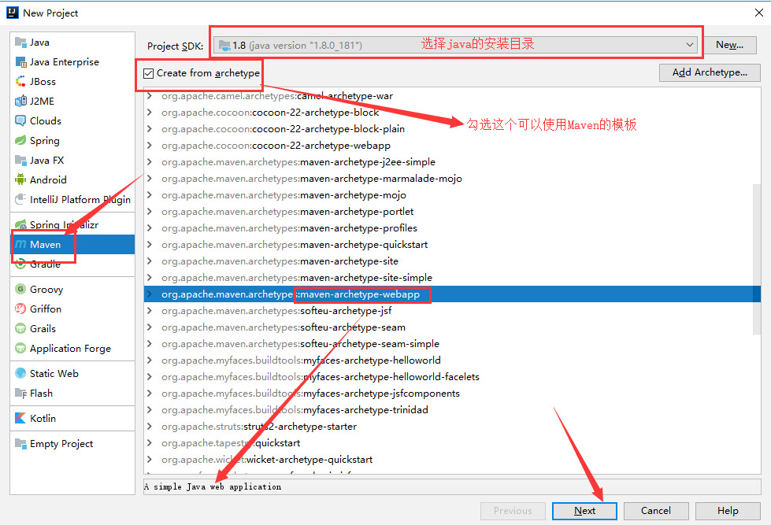

## Maven

**我为什么要学习这个技术？**

1. 在Javaweb开发中，需要使用大量的jar包，我们手动去导入；

2. 如何能够让一个东西自动帮我导入和配置这个jar包。

   由此，Maven诞生了！


我们目前用来就是方便导入jar包的！

Maven的核心思想：**约定大于配置**

- 有约束，不要去违反。

Maven会规定好你该如何去编写我们的Java代码，必须要按照这个规范来；


### Maven配置

**IDEA自带Maven，可以通过修改settings.xml来修改仓库路径、镜像等。**

在settings-Build-Build Tools-Maven中修改maven配置。

为了每次创建都生效，在New Project Settings-Settings for new project中也修改。

```xml
<mirror>
    <id>nexus-aliyun</id>  
    <mirrorOf>*,!jeecg,!jeecg-snapshots</mirrorOf>  
    <name>Nexus aliyun</name>  
    <url>http://maven.aliyun.com/nexus/content/groups/public</url> 
</mirror>

<localRepository>仓库路径</localRepository>
```

在设置中还可以设置下载源码，Maven-Importing，勾选Sources。这样就不止下载class文件，还会下载源码。

在项目右侧资源栏中选择Maven，可以进行一些重新下载、加载、下载源码等操作。


### Maven中配置Tomcat

**1、创建一个Maven的web项目**



**2、Edit configuration配置tomcat**


创建artifaces，与在tomcat webapps创建文件一样，必须指定一个文件夹。

war 模式这种可以称为是发布模式（完整的项目），将项目打成war包，再发布。
war exploded模式是直接把文件夹、jsp页面、classes等等移到Tomcat部署文件夹里面，进行加载部署.

Application context 虚拟路径映射 不写的话默认访问路径是localhost:8080

**3、运行**

