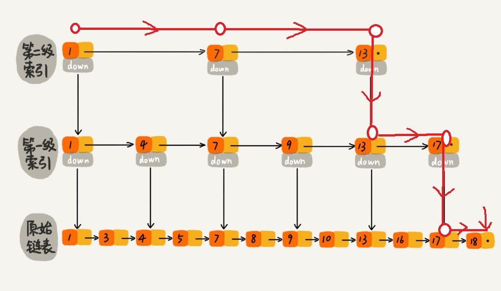

# 并发容器


JDK 提供的这些容器大部分在 **java.util.concurrent** 包中。

- **ConcurrentHashMap:** 线程安全的 HashMap。在进行读操作时(几乎)不需要加锁，而在写操作只对所操作的结点加锁而不影响客户端对其它结点的访问。读读互不影响，读写也不互斥，不过是弱一致性的，写写互斥。
- **CopyOnWriteArrayList/Set:** 线程安全的 ArrayList/set，**读取是完全不用加锁的**，**写入也不会阻塞读取操作。**只有写入和写入之间需要进行同步等待。 在读多写少的场合性能非常好，远远好于 Vector。
- **ConcurrentLinkedQueue:** 线程安全的LinkedList，高效的并发**非阻塞队列。采用CAS volatile**
- **BlockingQueue:** 阻塞队列，**非常适合用于作为数据共享的通道。**ArrayBlockingQueue（有界队列）、LinkedBlockingQueue、PriorityBlockingQueue（无界队列） 都依靠`ReentrantLock`实现线程安全。
- **ConcurrentSkipListMap:** 跳表的实现。这是一个 Map，使用跳表的数据结构进行快速查找。

各种`BlockingQueue`都用的`ReentrantLock`，因为要用到`Condition`和实现公平等功能。`CopyOnWriteArrayList`的写锁也用的是`ReentrantLock`。

`ConcurrentHashMap`的节点锁用的`synchronized`。

`ConcurrentLinkedQueue`用CAS实现添加删除，同时所有用`ReentrantLock`的一定会用到CAS。

并发包中的容器类基本都不支持插入 null 值，因为 null 值往往用作其他用途，比如用于方法的返回值代表操作失败）。ConcurrentHashMap的key和value都不能为null，这点与HashMap不同，HashMap key可以一个null，value没有限制。

## ConcurrentHashMap

我们知道 HashMap 不是线程安全的，在并发场景下如果要保证一种可行的方式是使用 `Collections.synchronizedMap()` 方法来包装我们的 HashMap。但这是通过使用一个全局的锁来同步不同线程间的并发访问，因此会带来不可忽视的性能问题。

所以就有了 HashMap 的线程安全版本—— ConcurrentHashMap 的诞生。在 ConcurrentHashMap 中，无论是读操作还是写操作都能保证很高的性能：**在进行读操作时(几乎)不需要加锁，而在写操作时通过锁节点只对所操作的节点加锁而不影响客户端对其它节点的访问。读写操作也可以并发进行，不过是弱一致性的。**

相关问题：

**Collections的synchronize方法包装一个线程安全的Map，或者直接用ConcurrentHashMap两者的区别是什么？**

前者直接在put和get方法加了synchronize同步，后者采用了结点锁以及CAS支持更高的并发。

### ConcurrentHashMap 线程安全的具体实现方式

#### JDK1.7 分段ReentrantLock

**在 JDK1.7 的时候，`ConcurrentHashMap`（分段锁）** 对整个桶数组进行了分割分段(`Segment`)，每一把锁只锁容器其中一部分数据，多线程访问容器里不同数据段的数据，就不会存在锁竞争，提高并发访问率。

**`ConcurrentHashMap` 是由 `Segment` 数组结构和 `HashEntry` 数组结构组成**。

**Segment 实现了 `ReentrantLock`，所以 `Segment` 是一种可重入锁，扮演锁的角色。**`HashEntry` 用于存储键值对数据。

```java
static class Segment<K,V> extends ReentrantLock implements Serializable {
}
```

一个 `ConcurrentHashMap` 里包含一个 `Segment` 数组。`Segment` 的结构和 `HashMap` 类似，是一种数组和链表结构，一个 `Segment` 包含一个 `HashEntry` 数组，每个 `HashEntry` 是一个链表结构的元素，每个 `Segment` 守护着一个 `HashEntry` 数组里的元素，当对 `HashEntry` 数组的数据进行修改时，必须首先获得对应的 `Segment` 的锁。

**JDK1.7 的 ConcurrentHashMap：**


<p style="text-align:right;font-size:13px;color:gray">http://www.cnblogs.com/chengxiao/p/6842045.html></p>

#### JDK1.8 synchronized节点锁+CAS

>  不同段没有竞争——>不hash冲突就没有锁竞争 

 **到了 JDK1.8 的时候已经摒弃了 `Segment` 的概念，而是直接用 `Node` 数组+链表+红黑树的数据结构来实现，并发控制使用 `synchronized` 和 CAS 来操作。（JDK1.6 以后 对 `synchronized` 锁做了很多优化）** 整个看起来就像是优化过且线程安全的 `HashMap`，虽然在 JDK1.8 中还能看到 `Segment` 的数据结构，但是已经简化了属性，只是为了兼容旧版本； 

数据结构跟HashMap1.8的结构类似，数组+链表/红黑二叉树。超过8，寻址时间复杂度为从O(N)到O(log(N))

**`synchronized` 只锁定当前链表或红黑二叉树的首节点，这样只要 hash 不冲突，就不会产生并发，效率又提升 N 倍。**

**JDK1.8 的 ConcurrentHashMap：**


JDK1.8 的 `ConcurrentHashMap` 不在是 **Segment 数组 + HashEntry 数组 + 链表**，而是 **Node 数组 + 链表 / 红黑树**。不过，Node 只能用于链表的情况，红黑树的情况需要使用 **`TreeNode`**。当冲突链表达到一定长度时，链表会转换成红黑树。

### ConcurrentHashMap和Hashtable的区别

`ConcurrentHashMap` 和 `Hashtable` 的区别主要体现在实现线程安全的方式上不同。

- **底层数据结构：**
  - `ConcurrentHashMap` 
    - JDK1.7  **分段的数组+链表** 
    - JDK1.8，**数组+链表/红黑二叉树。** 与HashMap1.8相同
  - `Hashtable`  **数组+链表**  一直没变
- **实现线程安全的方式（重要）：** 
  -  `ConcurrentHashMap` 
    - JDK1.7 分段锁：Segment 实现了 `ReentrantLock`，所以 `Segment` 是一种可重入锁，扮演锁的角色。
    - JDK1.8 并发控制使用 `synchronized` 和 CAS 来操作，`synchronized` 只锁定当前链表或红黑二叉树的首节点。   不同段没有竞争——>不hash冲突就没有锁竞争 
  -  **`Hashtable`(同一把锁)**：全表锁，使用 `synchronized` 来保证线程安全，效率非常低下。不同线程抢占资源，抢不到的阻塞或轮询

**HashTable:**


<p style="text-align:right;font-size:13px;color:gray">http://www.cnblogs.com/chengxiao/p/6842045.html></p>

## ConcurrentHashMap源码分析

**[ConcurrentHashMap源码分析视频](https://www.bilibili.com/video/BV1bp4y1k7KB?p=1)**

[ConcurrentHashMap源码分析JDK8-get/put/remove方法](https://www.jianshu.com/p/5bc70d9e5410)

[深入浅出ConcurrentHashMap1.8](https://www.jianshu.com/p/c0642afe03e0)

[ConcurrentHashMap源码解析jdk1.8](https://blog.csdn.net/programmer_at/article/details/79715177)

[阿里面试官：说一下JDK1.7 ConcurrentHashMap的实现原理](https://www.163.com/dy/article/FLIG7R2S0531LF4X.html)

**只分析1.8的：**

```java
static class Node<K,V> implements Map.Entry<K,V> {
    /**
          Node节点的hash值和key的hash值相同
          TreeNode节点的hash值
        **/
    final int hash;
    final K key;
    volatile V val;  //volatile确保了val的内存可见性
    volatile Node<K,V> next;//volatile确保了next的内存可见性
    ...
}

transient volatile Node<K,V>[] table;

//TreeNodes used at the heads of bins. 树开头的结点-root
static final class TreeBin<K,V> extends Node<K,V> {
    TreeNode<K,V> root;
    volatile TreeNode<K,V> first;
    volatile Thread waiter;
    volatile int lockState;
    // values for lockState
}

//Nodes for use in TreeBins
static final class TreeNode<K,V> extends Node<K,V> {
    TreeNode<K,V> parent;  // red-black tree links
    TreeNode<K,V> left;
    TreeNode<K,V> right;
    TreeNode<K,V> prev;    // needed to unlink next upon deletion
    boolean red;
}
```

关于table数组，有3个重要方法：对于`table[]`的读写都用的volatile读写：

```java
//以volatile读的方式读取table数组中的元素
static final <K,V> Node<K,V> tabAt(Node<K,V>[] tab, int i) {
    return (Node<K,V>)U.getObjectVolatile(tab, ((long)i << ASHIFT) + ABASE);
}
//以volatile写的方式，将元素插入table数组
static final <K,V> void setTabAt(Node<K,V>[] tab, int i, Node<K,V> v) {
    U.putObjectVolatile(tab, ((long)i << ASHIFT) + ABASE, v);
}
//以CAS的方式，将元素插入table数组
static final <K,V> boolean casTabAt(Node<K,V>[] tab, int i,
                                    Node<K,V> c, Node<K,V> v) {
    //原子的执行如下逻辑：如果tab[i]==c,则设置tab[i]=v，并返回ture.否则返回false
    return U.compareAndSwapObject(tab, ((long)i << ASHIFT) + ABASE, c, v);
}
```

注：volatile基本类型直接操作，volatile引用类型的变量需要Unsafe类中的`getObjectVolatile`，`putObjectVolatile`。

### get

[ConcurrentHashmap(1.8)get操作——为什么它不需要加锁呢/如何保证读到的数据不是脏数据的呢？](https://blog.csdn.net/xx123698/article/details/106993557/)

**get利用volatile特性，不需要同步控制，实现了无锁读。**

具体：

根据key定位hash桶，通过**tabAt的volatile读**，获取hash桶的头结点。

通过头结点Node的**volatile属性next**，遍历Node链表

找到目标node后，读取Node的**volatile属性val**

```java
public V get(Object key) {
    Node<K,V>[] tab; Node<K,V> e, p; int n, eh; K ek;
    int h = spread(key.hashCode());
    if ((tab = table) != null && (n = tab.length) > 0 &&
        //定位目标hash桶，通过tabAt方法valatile读，读取hash桶的头结点
        (e = tabAt(tab, (n - 1) & h)) != null) {
        //第一个节点就是要找的元素
        if ((eh = e.hash) == h) {
            if ((ek = e.key) == key || (ek != null && key.equals(ek)))
                //e.val也是valatile
                return e.val;
        }
        //特殊节点（红黑树，已经迁移的节点（ForwardingNode)等
        else if (eh < 0)
            return (p = e.find(h, key)) != null ? p.val : null;
        //遍历node链表（e.next也是valitle变量）
        while ((e = e.next) != null) {
            if (e.hash == h &&
                ((ek = e.key) == key || (ek != null && key.equals(ek))))
                return e.val;
        }
    }
    return null;
}
```

### put

put方法是一个大的for循环，put成功才会退出。

**当请求的hash桶为空时，采用for循环+CAS的方式无锁插入。**

**当bucket不为空的时候，才用synchronized锁，插入当前结点到链表/红黑树中。**在锁之前，如果正在扩容，当前线程也帮助扩容。

由于锁的粒度是hash桶，多个put线程只有在请求同一个hash桶时，才会被阻塞。请求不同hash桶的put线程，可以并发执行。

```java
public V put(K key, V value) {
    return putVal(key, value, false);
}

/** Implementation for put and putIfAbsent */
final V putVal(K key, V value, boolean onlyIfAbsent) {
    if (key == null || value == null) throw new NullPointerException();
    int hash = spread(key.hashCode());
    int binCount = 0;
    //for循环+CAS操作
    for (Node<K,V>[] tab = table;;) {
        Node<K,V> f; int n, i, fh;
        if (tab == null || (n = tab.length) == 0)
            tab = initTable();
        //hash桶（tab[i]）为空
        else if ((f = tabAt(tab, i = (n - 1) & hash)) == null) {
            //CAS设置tab[i]，不需要加锁
            if (casTabAt(tab, i, null,
                         new Node<K,V>(hash, key, value, null)))
                //如果设置成功，插入成功退出for循环。否则仍在for循环中，会再次检查bucket的状态
                break;                   // no lock when adding to empty bin
        }
        //hash桶（tab[i]）是fwd节点，表示正在扩容
        else if ((fh = f.hash) == MOVED)
            //帮其扩容
            tab = helpTransfer(tab, f);
        else {
            V oldVal = null;
            //hash桶不为空，对tab[i]中的头结点加锁
            synchronized (f) {
                if (tabAt(tab, i) == f) {
                    //node链表
                    if (fh >= 0) {
                        binCount = 1;

                        for (Node<K,V> e = f;; ++binCount) {
                            K ek;
                            //key-value entry已经存在，更新value
                            if (e.hash == hash &&
                                ((ek = e.key) == key ||
                                 (ek != null && key.equals(ek)))) {
                                oldVal = e.val;
                                if (!onlyIfAbsent)
                                    e.val = value;
                                break;
                            }

                            Node<K,V> pred = e;
                            //是尾节点，则插入
                            if ((e = e.next) == null) {
                                pred.next = new Node<K,V>(hash, key,
                                                          value, null);
                                break;
                            }
                        }
                    }
                    //红黑树
                    else if (f instanceof TreeBin) {
                        Node<K,V> p;
                        binCount = 2;
                        if ((p = ((TreeBin<K,V>)f).putTreeVal(hash, key,
                                                              value)) != null) {
                            oldVal = p.val;
                            if (!onlyIfAbsent)
                                p.val = value;
                        }
                    }
                }
            }
            if (binCount != 0) {
                //tab[i]的链表过长，转成红黑树或者扩容（tab.length过短，优先扩容）
                if (binCount >= TREEIFY_THRESHOLD)
                    treeifyBin(tab, i);
                if (oldVal != null)
                    return oldVal;
                break;
            }
        }
    }
    //size属性+1，如果size属性大于扩容阈值（sizeCtl)则扩容
    addCount(1L, binCount);
    return null;
}
```

1. 根据 key 计算出 hashcode 。
2. 如果数组为空，先对数组进行初始化。
3. 如果bucket插入位置处为空，利用 CAS 尝试写入，失败则自旋保证成功插入。
4. 如果当前位置的 `hashcode == MOVED == -1`,则需要进行扩容。
5. 如果都不满足，则利用 synchronized 锁写入数据。
6. 如果数量大于 `TREEIFY_THRESHOLD` 则要转换为红黑树。

2-6是for循环中的内容 if else结构

### remove

和put方法一样，多个remove线程请求不同的hash桶时，可以并发执行。

如图所示：删除的node节点的next依然指着下一个元素。此时若有一个遍历线程正在遍历这个已经删除的节点，这个遍历线程依然可以通过next属性访问下一个元素。从遍历线程的角度看，他并没有感知到此节点已经删除了，这说明了ConcurrentHashMap提供了弱一致性的迭代器。遍历操作可以参考[ConcurrentHashMap源码分析（JDK8） 遍历操作分析](https://www.jianshu.com/p/3e85ac8f8662)


```java
public V remove(Object key) {
    return replaceNode(key, null, null);
}

/**
    参数value:当 value==null 时 ，删除节点 。否则 更新节点的值为value
    参数cv:一个期望值， 当 map[key].value 等于期望值cv  或者 cv==null的时候 ，删除节点，或者更新节点的值
*/
final V replaceNode(Object key, V value, Object cv) {
    int hash = spread(key.hashCode());
    for (Node<K,V>[] tab = table;;) {
        Node<K,V> f; int n, i, fh;
        //table还没有初始化或者key对应的hash桶为空
        if (tab == null || (n = tab.length) == 0 ||
            (f = tabAt(tab, i = (n - 1) & hash)) == null)
            break;
        //正在扩容
        else if ((fh = f.hash) == MOVED)
            tab = helpTransfer(tab, f);
        else {
            V oldVal = null;
            boolean validated = false;
            synchronized (f) {
                //cas获取tab[i],如果此时tab[i]!=f,说明其他线程修改了tab[i]。回到for循环开始处，重新执行
                if (tabAt(tab, i) == f) {
                    //node链表
                    if (fh >= 0) {
                        validated = true;
                        for (Node<K,V> e = f, pred = null;;) {
                            K ek;
                            //找的key对应的node
                            if (e.hash == hash &&
                                ((ek = e.key) == key ||
                                 (ek != null && key.equals(ek)))) {
                                V ev = e.val;
                                //cv参数代表期望值
                                //cv==null:表示直接更新value/删除节点
                                //cv不为空，则只有在key的oldValue等于期望值的时候，才更新value/删除节点

                                //符合更新value或者删除节点的条件
                                if (cv == null || cv == ev ||
                                    (ev != null && cv.equals(ev))) {
                                    oldVal = ev;
                                    //更新value
                                    if (value != null)
                                        e.val = value;
                                    //删除非头节点
                                    else if (pred != null)
                                        pred.next = e.next;
                                    //删除头节点
                                    else
                                        //因为已经获取了头结点锁，所以此时不需要使用casTabAt
                                        setTabAt(tab, i, e.next);
                                }
                                break;
                            }
                            //当前节点不是目标节点，继续遍历下一个节点
                            pred = e;
                            if ((e = e.next) == null)
                                //到达链表尾部，依旧没有找到，跳出循环
                                break;
                        }
                    }
                    //红黑树
                    else if (f instanceof TreeBin) {
                        validated = true;
                        TreeBin<K,V> t = (TreeBin<K,V>)f;
                        TreeNode<K,V> r, p;
                        if ((r = t.root) != null &&
                            (p = r.findTreeNode(hash, key, null)) != null) {
                            V pv = p.val;
                            if (cv == null || cv == pv ||
                                (pv != null && cv.equals(pv))) {
                                oldVal = pv;
                                if (value != null)
                                    p.val = value;
                                else if (t.removeTreeNode(p))
                                    setTabAt(tab, i, untreeify(t.first));
                            }
                        }
                    }
                }
            }
            if (validated) {
                if (oldVal != null) {
                    //如果删除了节点，更新size
                    if (value == null)
                        addCount(-1L, -1);
                    return oldVal;
                }
                break;
            }
        }
    }
    return null;
}
```

### 扩容

[ConcurrentHashMap实现原理](https://blog.csdn.net/ZOKEKAI/article/details/90051567)

[ConcurrentHashMap是如何实现线程安全的](https://blog.csdn.net/qq_41737716/article/details/90549847)

主要通过CAS实现线程安全，在迁移过程中只锁一个Node节点。若有线程put数据，还会帮助一起扩容，这种无阻塞算法，**将并行最大化的设计，堪称一绝。**

```java
private final void transfer(Node<K,V>[] tab, Node<K,V>[] nextTab) {
    int n = tab.length, stride;
    //根据机器CPU核心数来计算，一条线程负责Node数组中多长的迁移量
    //最少不能少于MIN_TRANSFER_STRIDE=16个
    if ((stride = (NCPU > 1) ? (n >>> 3) / NCPU : n) < MIN_TRANSFER_STRIDE)
        stride = MIN_TRANSFER_STRIDE; // subdivide range
   	
    //数组还未创建，创建新数组
    if (nextTab == null) {            // initiating
        try {
            @SuppressWarnings("unchecked")
            //扩容一倍，左移1位。
            Node<K,V>[] nt = (Node<K,V>[])new Node<?,?>[n << 1]; 
            nextTab = nt;
        } catch (Throwable ex) {      // try to cope with OOME
            sizeCtl = Integer.MAX_VALUE;
            return;
        }
        nextTable = nextTab;
        //扩容索引，表示已经分配给扩容线程的table数组索引位置。
        //主要用来协调多个线程，安全地获取迁移"桶"。
        //！把原数组的长度给了transferIndex，表示由后向前进行遍历。如果从0开始，还得判断是不是结束了，减操作更容易一些。
        transferIndex = n;
    }
    
    //从这里正式开始迁移工作
    int nextn = nextTab.length;
    //标记当前节点已经迁移完成，它的hash值是MOVED=-1
    //当一个节点完成迁移，把它设置为ForwardingNode。
    ForwardingNode<K,V> fwd = new ForwardingNode<K,V>(nextTab);
    
    boolean advance = true;
    boolean finishing = false; // to ensure sweep before committing nextTab
   
    
    //逆序迁移已经获取到的hash桶集合，如果迁移完毕，则更新transferIndex，获取下一批待迁移的hash桶
    //也就是说：先确定当前线程迁移的区间，从最大下标i到最小下标bound迁移。
     for (int i = 0, bound = 0;;) {
        Node<K,V> f; int fh;
        while (advance) {
            int nextIndex, nextBound;
            if (--i >= bound || finishing)
                advance = false;
            else if ((nextIndex = transferIndex) <= 0) {
              //如果transferIndex=0，表示所以hash桶均被分配，将i置为-1，准备退出transfer方法
                i = -1;
                advance = false;
            }
            else if (U.compareAndSwapInt
                     (this, TRANSFERINDEX, nextIndex,
                      nextBound = (nextIndex > stride ?
                                   nextIndex - stride : 0))) {
                bound = nextBound;
                i = nextIndex - 1;
                advance = false;
            }
        }
         
        if (i < 0 || i >= n || i + n >= nextn) {
            int sc;
            if (finishing) {
                nextTable = null;
                table = nextTab;
                sizeCtl = (n << 1) - (n >>> 1);
                return;
            }
            /**
             第一个扩容的线程，执行transfer方法之前，会设置 sizeCtl = (resizeStamp(n) << RESIZE_STAMP_SHIFT) + 2)
             后续帮其扩容的线程，执行transfer方法之前，会设置 sizeCtl = sizeCtl+1
             每一个退出transfer的方法的线程，退出之前，会设置 sizeCtl = sizeCtl-1
             那么最后一个线程退出时：
             必然有sc == (resizeStamp(n) << RESIZE_STAMP_SHIFT) + 2)，即 (sc - 2) == resizeStamp(n) << RESIZE_STAMP_SHIFT
            */
          //不相等，说明不到最后一个线程，直接退出transfer方法
 
            if (U.compareAndSwapInt(this, SIZECTL, sc = sizeCtl, sc - 1)) {
                if ((sc - 2) != resizeStamp(n) << RESIZE_STAMP_SHIFT)
                    return;
                finishing = advance = true;
                i = n; // recheck before commit
            }
        }
         //如果当前位置是null，尝试把当前位置cas成fwd-标记已经完成。返回结果是advance，
         //又进入上面的while循环，判断迁移的下标。
        else if ((f = tabAt(tab, i)) == null)
            advance = casTabAt(tab, i, null, fwd);
         //如果当前位置是-1，也就是被标记成了fwd，已经迁移过了，跳过。
        else if ((fh = f.hash) == MOVED)
            advance = true; // already processed
        else {//开始迁移
            synchronized (f) {
                //节点位置是链表的头结点，链表的迁移。
                if (tabAt(tab, i) == f) {
                    //新位置一共两种情况，不变或者+len。ln表示低位链表，hn表示高位链表。
                    Node<K,V> ln, hn;
                    //迁移链表，将node链表分成两个新的链表
                    //当前节点的hash值>=0，还未被迁移。
                    if (fh >= 0) {
                        int runBit = fh & n;
                        //面试常问：lastRun什么意思？最一条相同颜色链的起始位置，找到这个位置，蜘蛛纸牌一样，一起挪动
                        Node<K,V> lastRun = f;
                        for (Node<K,V> p = f.next; p != null; p = p.next) {
                            //计算是0还是1，是0，原位置，是1，原位置+n(原数组的长度)
                            int b = p.hash & n;
                            if (b != runBit) {
                                runBit = b;
                                lastRun = p;
                            }
                        }    
                        //最后一条相同颜色的链路要么是高位链，要么是低位链。
                        if (runBit == 0) {
                            ln = lastRun;
                            hn = null;
                        } else {
                            hn = lastRun;
                            ln = null;
                        }
                        //直接遍历到lastRun，把低和高分离开。
                        for (Node<K,V> p = f; p != lastRun; p = p.next) {
                            int ph = p.hash; K pk = p.key; V pv = p.val;
                            if ((ph & n) == 0)
                                ln = new Node<K,V>(ph, pk, pv, ln);
                            else
                                hn = new Node<K,V>(ph, pk, pv, hn);
                        }
                        //将node链表放在新的table对应的位置 
                        //ln放到低位置--位置不变。hn放到高位置 原位置+n
                        setTabAt(nextTab, i, ln);
                        setTabAt(nextTab, i + n, hn);
                        setTabAt(tab, i, fwd);
                        advance = true;
                    }
                    
                    //迁移红黑树
                    else if (f instanceof TreeBin) {
                        TreeBin<K,V> t = (TreeBin<K,V>)f;
                        TreeNode<K,V> lo = null, loTail = null;
                        TreeNode<K,V> hi = null, hiTail = null;
                        int lc = 0, hc = 0;
                        for (Node<K,V> e = t.first; e != null; e = e.next) {
                            int h = e.hash;
                            TreeNode<K,V> p = new TreeNode<K,V>
                                (h, e.key, e.val, null, null);
                            if ((h & n) == 0) {
                                if ((p.prev = loTail) == null)
                                    lo = p;
                                else
                                    loTail.next = p;
                                loTail = p;
                                ++lc;
                            }
                            else {
                                if ((p.prev = hiTail) == null)
                                    hi = p;
                                else
                                    hiTail.next = p;
                                hiTail = p;
                                ++hc;
                            }
                        }
                        ln = (lc <= UNTREEIFY_THRESHOLD) ? untreeify(lo) :
                            (hc != 0) ? new TreeBin<K,V>(lo) : t;
                        hn = (hc <= UNTREEIFY_THRESHOLD) ? untreeify(hi) :
                            (lc != 0) ? new TreeBin<K,V>(hi) : t;
                        setTabAt(nextTab, i, ln);
                        setTabAt(nextTab, i + n, hn);
                        setTabAt(tab, i, fwd);
                        advance = true;
                    }
                }
            }
        }
    }
}
```

多线程方式完成数据的迁移工作。

**将原来的数组分段，规定每个线程最少负责16个桶的迁移工作。**


**如果要你设计迁移，你会怎样迁移？**

**一个一个重新计算然后挪动吗？**

#### ==为什么是2的n次幂呢？==

只有两种结果，一种放到新数组的原位置，一种放到新数组的原位置+原长度。

如果从16扩张成32，结点的存放位置会有什么变化，需要重新计算位置吗？

h & (n - 1)，第5位参与进了运算，如果`h & 原len = 0`，即hash的第5位是0，结点的位置不变，扩容后还在原来那个位置。如果`h & 原len = 1`，即第5位是1，扩容后的位置只需要+原长度。原位置+原长度。

**蜘蛛纸牌！！找到最后面相同颜色的位置lastRun，然后从头开始遍历直到lastRun，分成两组ln和hn。直接一组添加到原位置i，一组添加到原位置i+n**


### [ConcurrentHashMap能完全替代HashTable吗](https://blog.csdn.net/programmer_at/article/details/79715177#4-concurrenthashmap能完全替代hashtable吗)

HashTable虽然性能上不如ConcurrentHashMap，但并不能完全被取代，两者的迭代器的一致性不同的，**HashTable的迭代器是强一致性的，而ConcurrentHashMap是弱一致的。**ConcurrentHashMap的get，clear，iterator 都是弱一致性的。

下面是大白话的解释：

- Hashtable的任何操作都会把整个表锁住，是阻塞的。好处是总能获取最实时的更新，比如说线程A调用putAll写入大量数据，期间线程B调用get，线程B就会被阻塞，直到线程A完成putAll，因此线程B肯定能获取到线程A写入的完整数据。坏处是所有调用都要排队，效率较低。
- ConcurrentHashMap 是设计为非阻塞的。在更新时会局部锁住某部分数据，但不会把整个表都锁住。同步读取操作则是完全非阻塞的。好处是在保证合理的同步前提下，效率很高。坏处是严格来说读取操作不能保证反映最近的更新。例如**线程A调用putAll写入大量数据，期间线程B调用get，则只能get到目前为止已经顺利插入的部分数据。**

在上面对remove的分析也知道remove操作也是弱一致性的。


## CopyOnWriteArrayList/CopyOnWriteArraySet

这两种类的性质可以参考官方对`CopyOnWriteArraySet`的注释：

> A Set that uses an internal CopyOnWriteArrayList for all of its operations. Thus, it shares the same basic properties:
>
> - It is best suited for applications in which set sizes generally **stay small, read-only operations** vastly outnumber mutative operations, and you need to prevent interference among threads during traversal.
> - It is thread-safe.
> - Mutative operations (add, set, remove, etc.) are expensive since they usually entail copying the entire underlying array.
> - Iterators do not support the mutative remove operation.
> - Traversal via iterators is fast and cannot encounter interference from other threads. Iterators rely on **unchanging snapshots** of the array at the time the iterators were constructed.

### CopyOnWriteArrayList 简介

```java
public class CopyOnWriteArrayList<E>
    implements List<E>, RandomAccess, Cloneable, java.io.Serializable {
    private static final long serialVersionUID = 8673264195747942595L;

    /** The lock protecting all mutators */
    final transient ReentrantLock lock = new ReentrantLock();

    /** The array, accessed only via getArray/setArray. */
    private transient volatile Object[] array;

    /**
     * Gets the array.  Non-private so as to also be accessible
     * from CopyOnWriteArraySet class.
     */
    final Object[] getArray() {
        return array;
    }

    /**
     * Sets the array.
     */
    final void setArray(Object[] a) {
        array = a;
    }

    /**
     * Creates an empty list.
     */
    public CopyOnWriteArrayList() {
        setArray(new Object[0]);
    }
}
```

在很多应用场景中，读操作可能会远远大于写操作。由于读操作根本不会修改原有的数据，因此对于每次读取都进行加锁其实是一种资源浪费。我们应该允许多个线程同时访问 List 的内部数据，毕竟读取操作是安全的。

JUC中的 `CopyOnWriteArrayList` 类，在 `ReentrantReadWriteLock` 读写锁的思想又更进一步（`ReentrantReadWriteLock` 读写锁读读共享、写写互斥、读写互斥、写读互斥）。为了将读取的性能发挥到极致，**`CopyOnWriteArrayList` 支持读写分离，读取是快照读，与MVCC原理一样，完全不用加锁**，并且更厉害的是：**写入也不会阻塞读取操作(因为新建了副本)。只有写入和写入之间需要进行同步等待。**这样一来，读操作的性能就会大幅度提升。

### CopyOnWriteArrayList 是如何做到的？

从 `CopyOnWriteArrayList` 的名字就能看出 `CopyOnWriteArrayList` 是满足 `CopyOnWrite` 的 `ArrayList`，所谓 `CopyOnWrite` 也就是说：在计算机，如果你想要对一块内存进行修改时，我们**不在原有内存块中进行写操作，而是将内存拷贝一份，在新的内存中进行写操作，写完之后呢，就将指向原来内存指针指向新的内存，原来的内存就可以被回收掉了。**

`CopyOnWriteArrayList` 的所有可变操作（add，set，remove等等）都是通过**创建底层数组的新副本**来实现的。当 List 需要被修改的时候，并不修改原有内容，而是对原有数据进行一次**复制**，将修改的内容写入副本。写完之后，再将修改完的副本替换原来的数据，这样就可以保证写操作不会影响读操作了。

### CopyOnWriteArrayList 读取和写入源码简单分析

#### CopyOnWriteArrayList 读取操作的实现

**读取操作没有任何同步控制和锁操作**，**和读ArrayList一样。**原因是内部数组 array 不会发生修改，只会被另外一个 array 替换，因此可以保证数据安全。

```java
/** The array, accessed only via getArray/setArray. */
private transient volatile Object[] array;
public E get(int index) {
    return get(getArray(), index);
}
@SuppressWarnings("unchecked")
private E get(Object[] a, int index) {
    return (E) a[index];
}
final Object[] getArray() {
    return array;
}
```

#### CopyOnWriteArrayList 写入操作的实现

在添加元素时，首先复制了一个快照，然后在快照上进行添加，而不是直接在原来数组上进行。add() 方法加了锁，保证了同步，避免了多线程写的时候会 copy 出多个副本出来。

array被volatile修饰了，让其他还没读的看到换了新的数组，正在读的还读的旧数组——弱一致性。

```java
/**
* Appends the specified element to the end of this list.
* @param e element to be appended to this list
* @return {@code true} (as specified by {@link Collection#add})
*/
public boolean add(E e) {
    final ReentrantLock lock = this.lock; //用的final修饰
    lock.lock();//加锁
    try {
        Object[] elements = getArray();
        int len = elements.length;
        Object[] newElements = Arrays.copyOf(elements, len + 1);//拷贝新数组
        newElements[len] = e;
        setArray(newElements);
        return true;
    } finally {
        lock.unlock();//释放锁
    }
}
```

### CopyOnWriteArrayList的缺点

#### 内存占用问题

适用于多读少写场景。写操作一多，不但写写互斥会加锁，更重要的是会不断拷贝创建副本。特别是对超大对象的修改时，性能消耗会很严重。

针对内存占用问题，可以通过压缩容器中的元素的方法来减少大对象的内存消耗，比如，如果元素全是10进制的数字，可以考虑把它压缩成36进制或64进制。或者不使用CopyOnWrite容器，而使用其他的并发容器，如[ConcurrentHashMap](http://ifeve.com/concurrenthashmap/)。

#### 弱一致性问题

`CopyOnWrite容器`只能保证数据的最终一致性，不能保证数据的实时一致性。所以如果你希望写入的的数据，马上能读到，请不要使用CopyOnWrite容器。**【当执行add或remove操作没完成时，get获取的仍然是快照——旧数组的元素】**

**如果用迭代器读，读的是快照版本，弱一致性。**

弱一致性是指返回迭代器后，其它线程对list的增删改对迭代器是不可见的。调用迭代器的时候，给迭代器传入当前数组，迭代器中用final修饰，数组引用不会再修改。继承自ListIterator的对迭代器的删除，添加操作都会抛出异常。

```java
/**
* Returns an iterator over the elements in this list in proper sequence.
*
* <p>The returned iterator provides a snapshot of the state of the list
* when the iterator was constructed. No synchronization is needed while
* traversing the iterator. The iterator does <em>NOT</em> support the
* {@code remove} method.
*
* @return an iterator over the elements in this list in proper sequence
*/
public Iterator<E> iterator() {
    return new COWIterator<E>(getArray(), 0);
}

static final class COWIterator<E> implements ListIterator<E> {
    /** Snapshot of the array */
    private final Object[] snapshot;
    /** Index of element to be returned by subsequent call to next.  */
    private int cursor;

    private COWIterator(Object[] elements, int initialCursor) {
        cursor = initialCursor;
        snapshot = elements;
    }

    public boolean hasNext() {
        return cursor < snapshot.length;
    }

    public boolean hasPrevious() {
        return cursor > 0;
    }

    @SuppressWarnings("unchecked")
    public E next() {
        if (! hasNext())
            throw new NoSuchElementException();
        return (E) snapshot[cursor++];
    }

    @SuppressWarnings("unchecked")
    public E previous() {
        if (! hasPrevious())
            throw new NoSuchElementException();
        return (E) snapshot[--cursor];
    }

    public int nextIndex() {
        return cursor;
    }

    public int previousIndex() {
        return cursor-1;
    }

    /**
         * Not supported. Always throws UnsupportedOperationException.
         * @throws UnsupportedOperationException always; {@code remove}
         *         is not supported by this iterator.
         */
    public void remove() {
        throw new UnsupportedOperationException();
    }

    /**
         * Not supported. Always throws UnsupportedOperationException.
         * @throws UnsupportedOperationException always; {@code set}
         *         is not supported by this iterator.
         */
    public void set(E e) {
        throw new UnsupportedOperationException();
    }

    /**
         * Not supported. Always throws UnsupportedOperationException.
         * @throws UnsupportedOperationException always; {@code add}
         *         is not supported by this iterator.
         */
    public void add(E e) {
        throw new UnsupportedOperationException();
    }

    @Override
    public void forEachRemaining(Consumer<? super E> action) {
        Objects.requireNonNull(action);
        Object[] elements = snapshot;
        final int size = elements.length;
        for (int i = cursor; i < size; i++) {
            @SuppressWarnings("unchecked") E e = (E) elements[i];
            action.accept(e);
        }
        cursor = size;
    }
}
```


## ConcurrentLinkedQueue

Java 提供的线程安全的 Queue 可以分为阻塞队列和非阻塞队列，其中**阻塞队列的典型例子是 `BlockingQueue`，非阻塞队列的典型例子是 `ConcurrentLinkedQueue`**，在实际应用中要根据实际需要选用阻塞队列或者非阻塞队列。

**阻塞队列通过加锁来实现，非阻塞队列通过 CAS 操作实现。**

`ConcurrentLinkedQueue` 内部变量都是volatile修饰的，add等方法都是使用无锁的CAS 非阻塞算法来实现（`UNSAFE.compareAndSwapObject`）。

- 从名字上就知道底层是用链表实现的，双向链表，因此不支持随机读取，指定位置读取和删除操作都不是O(1)的。

- 除了有`ConcurrentLinkedQueue` ，还有`ConcurrentLinkedDeque`，与它类似，是Deque的线程安全版。
- 是在高并发环境中性能最好的队列，线程安全，适合多读场景。如果对队列加锁的成本较高则适合使用无锁的 ConcurrentLinkedQueue来替代。

```java
public class ConcurrentLinkedQueue<E> extends AbstractQueue<E>
    implements Queue<E>, java.io.Serializable {
    private static class Node<E> {
        volatile E item;
        volatile Node<E> next;
        ...
    }

    private transient volatile Node<E> head;
    private transient volatile Node<E> tail;
}
```

### CAS实现添加删除

[源码分析](https://www.jianshu.com/p/231caf90f30b)

[java并发面试常识之ConcurrentLinkedQueue](https://www.imooc.com/article/details/id/26439)

```java
public boolean add(E e) {
    return offer(e);
}
public boolean offer(E e) {
    checkNotNull(e);   //为空判断，e为null是抛异常
    final Node<E> newNode = new Node<E>(e); //将e包装成newNode
    for (Node<E> t = tail, p = t;;) {  //循环cas，直至加入成功
        //t = p = tail 
        Node<E> q = p.next;
        if (q == null) {   //判断p是否为尾节点
            //如果是，p.next = newNode
            if (p.casNext(null, newNode)) {
                //首次添加时，p 等于t，不进行尾节点更新，所以所尾节点存在滞后性  
                //并发环境，可能存添加/删除，tail就更难保证正确指向最后节点。
                if (p != t) 
                    //更新尾节点为最新元素
                    casTail(t, newNode);  
                return true;
            }
        }
        else if (p == q)
            //当tail不执行最后节点时，如果执行出列操作，很有可能将tail也给移除了    
            //此时需要对tail节点进行复位，复位到head节点
            p = (t != (t = tail)) ? t : head;
        else
            //推动tail尾节点往队尾移动
            p = (p != t && t != (t = tail)) ? t : q;
    }
}
```

```java
public E poll() {
    restartFromHead:
    for (;;) {
        for (Node<E> h = head, p = h, q;;) {
            //入列折腾的tail，那出列折腾的就是head
            E item = p.item;
            //出列判断依据是节点的item=null
            //item ！= null， 并且能将操作节点的item设置null， 表示出列成功
            if (item != null && p.casItem(item, null)) {
                if (p != h) 
                    //一旦出列成功需要对head进行移动
                    updateHead(h, ((q = p.next) != null) ? q : p);
                return item;
            }
            else if ((q = p.next) == null) {
                updateHead(h, p);
                return null;
            }
            else if (p == q)
                //第一轮操作失败，下一轮继续，调回到循环前
                continue restartFromHead;
            else
                //推动head节点移动
                p = q;
        }
    }
}
```


## BlockingQueue

==TODO[解读 java 并发队列 BlockingQueue](https://javadoop.com/post/java-concurrent-queue "https://javadoop.com/post/java-concurrent-queue")==

阻塞队列（BlockingQueue）相比于 `ConcurrentLinkedQueue` 使用更广泛。典型适用场景是“生产者-消费者”问题：BlockingQueue 提供了**可阻塞的插入和移除**的方法。当队列容器已满，生产者线程会被阻塞，直到队列未满；当队列容器为空时，消费者线程会被阻塞，直至队列非空时为止。

`BlockingQueue` 是一个接口，继承自 `Queue`，其实现类都属于线程安全的` Queue`。常用的四个实现类：`ArrayBlockingQueue`、`LinkedBlockingQueue`、`PriorityBlockingQueue`、`SynchronousQueue`。

**都用的ReentrantLock  lock.lockInterruptibly();  可以调用interrupt方法中断**

**获取不到锁的在队列阻塞等待着**


**阻塞队列：满足队列的FIFO。不管并发有多高，在任意时刻，永远只有一个线程能够进行队列的入队或者出队操作。因此是线程安全的队列。**

分为：有界队列和无界队列。无界队列只是理论上，实际上不可能比内存还大。

**有界队列：ArrayBlockingQueue** 队列满，只能进行出队操作。所有入队操作必须等待——也就是被阻塞。队列空，只能进行入队操作，所有出队操作必须阻塞等待。

**无界队列：LinkedBlockingQueue  最大是INT_MAX**

### ArrayBlockingQueue

**ArrayBlockingQueue** 是 BlockingQueue 接口的**有界**队列实现类，底层采用**数组**来实现。ArrayBlockingQueue 一旦创建，容量不能改变。其并发控制采用可重入锁 `ReentrantLock` 来控制，不管是插入操作还是读取操作，都需要获取到锁才能进行操作。当队列容量满时，尝试将元素放入队列将导致操作阻塞；尝试从一个空队列中取一个元素也会同样阻塞。

因为依赖于`ReentrantLock`，可以选择公平锁还是非公平锁。所谓公平性是指先来先服务，即最先等待的线程能够最先访问到 ArrayBlockingQueue。

默认情况下不能保证线程访问队列的公平性。如果保证公平性，通常会降低吞吐量。构造方法传入第二个参数获取公平阻塞队列：

```java
public ArrayBlockingQueue(int capacity) {
    this(capacity, false);
}
public ArrayBlockingQueue(int capacity, boolean fair){...}
```

#### 源码分析

**使用经典的 two-condition algorithm**

```java
public class ArrayBlockingQueue<E> extends AbstractQueue<E>
        implements BlockingQueue<E>, java.io.Serializable {
    /** The queued items */
    final Object[] items;

    /** items index for next take, poll, peek or remove */
    int takeIndex;
    /** items index for next put, offer, or add */
    int putIndex;
    /** Number of elements in the queue */
    int count;

    /*
     * Concurrency control uses the classic two-condition algorithm
     * found in any textbook.
     */

    /** Main lock guarding all access */
    final ReentrantLock lock;

    /** Condition for waiting takes */
    private final Condition notEmpty;

    /** Condition for waiting puts */
    private final Condition notFull;
}
```

##### put

```java
public void put(E e) throws InterruptedException {
    checkNotNull(e);  //e是null，throw new NullPointerException();
    final ReentrantLock lock = this.lock;
    //https://blog.csdn.net/u013851082/article/details/70140223
    lock.lockInterruptibly();  
    try {
        while (count == items.length){
            notFull.await();   //满了
        }
        enqueue(e);  //放入并通知
    } finally {
        lock.unlock();
    }
}
```

##### take

```java
public E take() throws InterruptedException {
    final ReentrantLock lock = this.lock;
    lock.lockInterruptibly();
    try {
        while (count == 0)
            notEmpty.await();
        return dequeue();
    } finally {
        lock.unlock();
    }
}
```

##### enqueue

```java

/**
     * Inserts element at current put position, advances, and signals.
     * Call only when holding lock.
     */
private void enqueue(E x) {
    // assert lock.getHoldCount() == 1;
    // assert items[putIndex] == null;
    final Object[] items = this.items;
    items[putIndex] = x;
    if (++putIndex == items.length)
        putIndex = 0;
    count++;
    notEmpty.signal();
}
```

### LinkedBlockingQueue

**LinkedBlockingQueue** 基于单向链表实现的阻塞队列，可以当做无界队列也可以当做有界队列来使用，同样满足 FIFO 的特性，与 ArrayBlockingQueue 相比起来具有**更高的吞吐量**，为了防止 LinkedBlockingQueue 容量迅速增，损耗大量内存。通常在创建 LinkedBlockingQueue 对象时，会指定其大小，如果未指定，容量等于 Integer.MAX_VALUE。

**相关构造方法:**

```java
    /**
     *某种意义上的无界队列
     * Creates a {@code LinkedBlockingQueue} with a capacity of
     * {@link Integer#MAX_VALUE}.
     */
    public LinkedBlockingQueue() {
        this(Integer.MAX_VALUE);
    }

    /**
     *有界队列
     * Creates a {@code LinkedBlockingQueue} with the given (fixed) capacity.
     *
     * @param capacity the capacity of this queue
     * @throws IllegalArgumentException if {@code capacity} is not greater
     *         than zero
     */
    public LinkedBlockingQueue(int capacity) {
        if (capacity <= 0) throw new IllegalArgumentException();
        this.capacity = capacity;
        last = head = new Node<E>(null);
    }
```

### PriorityBlockingQueue

**PriorityBlockingQueue** 是`PriorityQueue`的线程安全版本，是一个支持优先级的无界阻塞队列。默认情况下元素采用自然顺序进行排序，也可以通过自定义类实现 `compareTo()` 方法来指定元素排序规则，或者初始化时通过构造器参数 `Comparator` 来指定排序规则。

PriorityBlockingQueue 并发控制采用的是 **ReentrantLock**，队列为无界队列，可以传入初始大小，会动态扩容，不能设置上限。

与`PriorityQueue`一样，插入队列的对象必须是可比较大小的（comparable），否则报 ClassCastException 异常。它的插入操作 put 方法不会 block，因为它是无界队列（take 方法在队列为空的时候会阻塞）。

### SynchronousQueue

CachedThreadPool用到。

SynchronousQueue的内部实现了两个类，一个是TransferStack类，使用LIFO顺序存储元素，这个类用于非公平模式；还有一个类是TransferQueue，使用FIFI顺序存储元素，这个类用于公平模式。

它是一个特殊的队列，它的名字其实就蕴含了它的特征 - - 同步的队列。为什么说是同步的呢？这里说的并不是多线程的并发问题，而是因为当一个线程往队列中写入一个元素时，写入操作不会立即返回，需要等待另一个线程来将这个元素拿走；同理，当一个读线程做读操作的时候，同样需要一个相匹配的写线程的写操作。这里的 Synchronous 指的就是**读线程和写线程需要同步**，一个读线程匹配一个写线程。

SynchronousQueue 的队列其实是虚的，其不提供任何空间（一个都没有）来存储元素。它不会为队列中元素维护存储空间。与其他队列不同的是，它维护一组线程，这些线程在等待着把元素加入或移出队列。数据必须从某个写线程交给某个读线程，而不是写到某个队列中等待被消费。


**一种无缓冲的等待队列**，类似于无中介的直接交易，有点像原始社会中的生产者和消费者，生产者拿着产品去集市销售给产品的最终消费者，**而消费者必须亲自去集市找到所要商品的直接生产者**，如果一方没有找到合适的目标，那么对不起，大家都在集市等待。

因为SynchronousQueue没有存储功能，**因此put和take会一直阻塞**，直到有另一个线程已经准备好参与到交付过程中。仅当有足够多的消费者，并且总是有一个消费者准备好获取交付的工作时，才适合使用同步队列。

你不能在 SynchronousQueue 中使用 peek 方法（在这里这个方法直接返回 null），peek 方法的语义是只读取不移除，显然，这个方法的语义是不符合 SynchronousQueue 的特征的。SynchronousQueue 也不能被迭代，因为根本就没有元素可以拿来迭代的。虽然 SynchronousQueue 间接地实现了 Collection 接口，但是如果你将其当做 Collection 来用的话，那么集合是空的。


## ConcurrentSkipListMap

**依靠cas实现**

使用跳表实现 Map 和使用哈希算法实现 Map 的另外一个不同之处是：哈希并不会保存元素的顺序，而跳表内所有的元素都是排序的。因此在对跳表进行遍历时，你会得到一个有序的结果。所以，如果你的应用需要**有序性**，那么跳表就是你不二的选择。JDK 中实现这一数据结构的类是 ConcurrentSkipListMap。


下面这部分内容参考了极客时间专栏[《数据结构与算法之美》](https://time.geekbang.org/column/intro/126?code=zl3GYeAsRI4rEJIBNu5B/km7LSZsPDlGWQEpAYw5Vu0=&utm_term=SPoster)以及《实战 Java 高并发程序设计》。

**为了引出 ConcurrentSkipListMap，先带着大家简单理解一下跳表。**

**跳表用的是一种利用空间换时间的算法。**

对于一个单链表，即使链表是有序的，如果我们想要在其中查找某个数据，也只能从头到尾遍历链表，这样效率自然就会很低，跳表就不一样了。跳表是一种可以用来快速查找的数据结构，有点类似于平衡树。它们都可以对元素进行快速的查找。但一个重要的区别是：对平衡树的插入和删除往往很可能导致平衡树进行一次全局的调整。而对跳表的**插入和删除**只需要对整个数据结构的**局部**进行操作即可。这样带来的好处是：在高并发的情况下，你会需要一个全局锁来保证整个平衡树的线程安全。而对于跳表，你只需要**部分锁**即可。这样，在**高并发环境下，你就可以拥有更好的性能。**而就查询的性能而言，跳表的时间复杂度也是 **O(logn)** 所以在并发数据结构中，JDK 使用跳表来实现一个 Map。

跳表的本质是同时维护了多个链表，并且链表是**分层**的，最低层的链表维护了跳表内所有的元素，每上面一层链表都是下面一层的子集。

跳表内的所有链表的元素都是排序的。查找时，可以从顶级链表开始找。一旦发现被查找的元素大于当前链表中的取值，就会转入下一层链表继续找。这也就是说在查找过程中，搜索是跳跃式的。如下图所示，在跳表中查找元素 18。



查找 18 的时候原来需要遍历 18 次，现在只需要 7 次即可。针对链表长度比较大的时候，构建索引查找效率的提升就会非常明显。


# 原子类

todo总结

**原子类**  **适用于计数器，累加器等**

java.util.concurrent.atomic目录下

AtomicInteger 类主要利用 **CAS (compare and swap) + volatile 和 native** 方法来保证原子操作，从而避免 synchronized 的高开销，执行效率大为提升。

CAS的原理是拿期望的值和原本的一个值作比较，如果相同则更新成新的值。UnSafe 类的 objectFieldOffset() 方法是一个本地方法，这个方法是用来拿到“原来的值”的内存地址。另外 value 是一个volatile变量，在内存中可见，因此 JVM 可以保证任何时刻任何线程总能拿到该变量的最新值。

**基本类型** 

使用原子的方式更新基本类型

- AtomicInteger：整型原子类
- AtomicLong：长整型原子类
- AtomicBoolean ：布尔型原子类

**数组类型**

使用原子的方式更新数组里的某个元素

- AtomicIntegerArray：整型数组原子类
- AtomicLongArray：长整型数组原子类
- AtomicReferenceArray ：引用类型数组原子类

**引用类型**

- AtomicReference：引用类型原子类
- AtomicReferenceFieldUpdater：原子更新引用类型里的字段
- AtomicMarkableReference ：原子更新带有标记位的引用类型

**对象的属性修改类型**

- AtomicIntegerFieldUpdater:原子更新整型字段的更新器
- AtomicLongFieldUpdater：原子更新长整型字段的更新器
- **AtomicStampedReference** ：原子更新带有版本号的引用类型。该类将整数值与引用关联起来，可用于解决原子的更新数据和数据的版本号，可以解决使用 CAS 进行原子更新时可能出现的 ABA 问题。
- AtomicMarkableReference：原子更新带有标记的引用类型。该类将 boolean 标记与引用关联起来，也可以解决使用 CAS 进行原子更新时可能出现的 ABA 问题。


# AQS

**[Java并发之AQS详解](https://www.cnblogs.com/waterystone/p/4920797.html)**

**[Java并发包基石-AQS详解](https://www.cnblogs.com/chengxiao/p/7141160.html)**

[深入浅出java同步器AQS](https://www.jianshu.com/p/d8eeb31bee5c)

队列同步器AQS是用来构建锁或其他同步组件的基础框架，内部使用一个int成员变量表示同步状态，通过内置的FIFO队列来完成资源获取线程的排队工作。

不同的自定义同步器争用共享资源的方式也不同。**自定义同步器在实现时只需要实现共享资源state的获取与释放方式即可**，至于具体线程等待队列的维护（如获取资源失败入队/唤醒出队等），AQS已经在顶层实现好了。自定义同步器实现时主要实现以下几种方法：

- isHeldExclusively()：该线程是否正在独占资源。只有用到condition才需要去实现它。
- tryAcquire(int)：独占方式。尝试获取资源，成功则返回true，失败则返回false。
- tryRelease(int)：独占方式。尝试释放资源，成功则返回true，失败则返回false。
- tryAcquireShared(int)：共享方式。尝试获取资源。负数表示失败；0表示成功，但没有剩余可用资源；正数表示成功，且有剩余资源。
- tryReleaseShared(int)：共享方式。尝试释放资源，如果释放后允许唤醒后续等待结点返回true，否则返回false。

AQS中状态state，等待队列的头节点head和尾节点head，都是通过volatile修饰，保证了多线程之间的可见。

```java
public abstract class AbstractQueuedSynchronizer extends
    AbstractOwnableSynchronizer implements java.io.Serializable { 
    //等待队列的头节点
    private transient volatile Node head;
    //等待队列的尾节点
    private transient volatile Node tail;
    //同步状态
    private volatile int state;
    protected final int getState() { return state;}
    protected final void setState(int newState) { state = newState;}
    ...
        
    
    /**
     * The current owner of exclusive mode synchronization. 独占锁的owner
     */
    private transient Thread exclusiveOwnerThread;    
}
```


### CLH队列


每当有线程竞争失败，都是插入到队列的尾节点，tail节点始终指向队列中的最后一个元素。

```java
static final class Node {
    static final Node SHARED = new Node();
    static final Node EXCLUSIVE = null;
    static final int CANCELLED =  1;
    static final int SIGNAL    = -1;
    static final int CONDITION = -2;
    static final int PROPAGATE = -3;
    volatile int waitStatus;
    volatile Node prev;
    volatile Node next;
    volatile Thread thread;
    Node nextWaiter;
    ...
}
```

每个节点中， 除了存储了当前线程，前后节点的引用以外，还有一个waitStatus变量，用于描述节点当前的状态。多线程并发执行时，队列中会有多个节点存在，这个waitStatus其实代表对应线程的状态：有的线程可能获取锁因为某些原因放弃竞争；有的线程在等待满足条件，满足之后才能执行等等。一共有4种状态：

- **CANCELLED**(1)：表示当前结点已取消调度。当timeout或被中断（响应中断的情况下），会触发变更为此状态，进入该状态后的结点将不会再变化。
- **SIGNAL**(-1)：表示后继结点在等待当前结点唤醒。后继结点入队时，会将前继结点的状态更新为SIGNAL。
- **CONDITION**(-2)：表示结点等待在Condition上，当其他线程调用了Condition的signal()方法后，CONDITION状态的结点将**从等待队列转移到同步队列中**，等待获取同步锁。
- **PROPAGATE**(-3)：共享模式下，前继结点不仅会唤醒其后继结点，同时也可能会唤醒后继的后继结点。
- **0**：新结点入队时的默认状态。


## 独占获取锁 acquire(int)

　　此方法是独占模式下线程获取共享资源的顶层入口。如果获取到资源，线程直接返回，否则进入等待队列，直到获取到资源为止，且整个过程忽略中断的影响。这也正是lock()的语义，当然不仅仅只限于lock()。获取到资源后，线程就可以去执行其临界区代码了。

```java
public final void acquire(int arg) {
    if (!tryAcquire(arg) &&
        acquireQueued(addWaiter(Node.EXCLUSIVE), arg))
        selfInterrupt();
}
```

函数流程如下：

1. tryAcquire()尝试直接去获取资源，如果成功则直接返回（这里体现了**非公平锁**，每个线程获取锁时会尝试直接抢占加锁一次，而CLH队列中可能还有别的线程在等待）；
2. 没成功，addWaiter()将该线程加入等待队列的尾部，并标记为独占模式；
3. acquireQueued()使线程在等待队列中休息，有机会时（轮到自己，会被unpark()）会去尝试获取资源。获取到资源后才返回。如果在整个等待过程中被中断过，则返回true，否则返回false。
4. 线程每次被唤醒时，都要进行中断检测，如果发现当前线程被中断，那么抛出InterruptedException并退出循环。从无限循环的代码可以看出，并不是被唤醒的线程一定能获得锁，必须调用tryAccquire重新竞争，因为锁是非公平的，有可能被新加入的线程获得，从而导致刚被唤醒的线程再次被阻塞，这个细节充分体现了“非公平”的精髓。

这也是ReentrantLock.lock()的流程，lock()整个函数就是一条acquire(1)！

### tryAcquire(int)

此方法尝试去获取独占资源。如果获取成功，则直接返回true，否则直接返回false。这也正是tryLock()的语义，还是那句话，当然不仅仅只限于tryLock()。如下是tryAcquire()的源码：

```java
protected boolean tryAcquire(int arg) {
    throw new UnsupportedOperationException();
}
```

在AQS种，`tryAcquire`会直接throw异常。AQS只是一个框架，只定义了一个接口，具体资源的获取**交由自定义同步器去实现了**（通过state的get/set/CAS）！至于能不能重入，能不能加锁，那就看具体的自定义同步器怎么去设计了！当然，自定义同步器在进行资源访问时要考虑线程安全的影响。

这里之所以没有定义成abstract，是因为独占模式下只用实现tryAcquire-tryRelease，而共享模式下只用实现tryAcquireShared-tryReleaseShared。如果都定义成abstract，那么每个模式也要去实现另一模式下的接口。说到底，Doug Lea还是站在咱们开发者的角度，尽量减少不必要的工作量。

#### 怎么用tryAcquire实现公平锁和非公平锁呢？

**参照`ReentrantLock`。tryAcquire是否先调用`hasQueuedPredecessors()`判断队列是不是空的，如果空的，再尝试获取，就是公平锁。不调用`hasQueuedPredecessors`判断，直接尝试CAS，就是非公平锁。**

**非公平：**

```java
protected final boolean tryAcquire(int acquires) {
    return nonfairTryAcquire(acquires);
}

final boolean nonfairTryAcquire(int acquires) {
    final Thread current = Thread.currentThread();
    int c = getState();
    if (c == 0) {
        if (compareAndSetState(0, acquires)) {
            setExclusiveOwnerThread(current);
            return true;
        }
    }
    else if (current == getExclusiveOwnerThread()) {
        int nextc = c + acquires;
        if (nextc < 0) // overflow
            throw new Error("Maximum lock count exceeded");
        setState(nextc);
        return true;
    }
    return false;
}
```

**公平**：

```java
protected final boolean tryAcquire(int acquires) {
    final Thread current = Thread.currentThread();
    int c = getState();
    if (c == 0) {
        if (!hasQueuedPredecessors() &&
            compareAndSetState(0, acquires)) {
            setExclusiveOwnerThread(current);
            return true;
        }
    }
    else if (current == getExclusiveOwnerThread()) {
        int nextc = c + acquires;
        if (nextc < 0)
            throw new Error("Maximum lock count exceeded");
        setState(nextc);
        return true;
    }
    return false;
}
```


### addWaiter(Node)

> 入队，如果让自己设计，应该用==**CAS自旋volatile变量**==，入队成功才返回。

此方法用于将当前线程加入到等待队列的队尾，并返回当前线程所在的结点。

```java
private Node addWaiter(Node mode) {
    //以给定模式构造结点。mode有两种：EXCLUSIVE（独占）和SHARED（共享）
    Node node = new Node(Thread.currentThread(), mode);

    //尝试快速方式直接放到队尾。
    Node pred = tail;
    if (pred != null) {
        node.prev = pred;
        if (compareAndSetTail(pred, node)) {
            pred.next = node;
            return node;
        }
    }

    //上一步失败则通过enq入队。
    enq(node);
    return node;
}
```

#### enq(Node)

此方法用于将node加入队尾。源码如下：

```java
private Node enq(final Node node) {
    //CAS"自旋"，直到成功加入队尾
    for (;;) {
        Node t = tail;
        if (t == null) { // 队列为空，创建一个空的标志结点作为head结点，并将tail也指向它。
            if (compareAndSetHead(new Node()))
                tail = head;
        } else {//正常流程，放入队尾
            node.prev = t;
            if (compareAndSetTail(t, node)) {
                t.next = node;
                return t;
            }
        }
    }
}
```

如果你看过AtomicInteger.getAndIncrement()函数源码，那么相信你一眼便看出这段代码的精华。**CAS自旋volatile变量，是一种非常经典的用法！**

### acquireQueued(Node, int)

通过tryAcquire()和addWaiter()，该线程获取资源失败，已经被放入等待队列尾部了。聪明的你立刻应该能想到该线程下一部该干什么了吧：**进入等待状态休息，直到其他线程彻底释放资源后唤醒自己，自己再拿到资源，然后就可以去干自己想干的事了**。没错，就是这样！是不是跟医院排队拿号有点相似~~acquireQueued()就是干这件事：**在等待队列中排队拿号（中间没其它事干可以休息），直到拿到号后再返回**。

```java
final boolean acquireQueued(final Node node, int arg) {
    boolean failed = true;//标记是否成功拿到资源
    try {
        boolean interrupted = false;//标记等待过程中是否被中断过

        //又是一个“自旋”！
        for (;;) {
            final Node p = node.predecessor();//拿到前驱
            //如果前驱是head，即该结点已成老二，那么便有资格去尝试获取资源（可能是老大释放完资源唤醒自己的，当然也可能被interrupt了）。
            if (p == head && tryAcquire(arg)) {
                setHead(node);//拿到资源后，将head指向该结点。所以head所指的标杆结点，就是当前获取到资源的那个结点或null。
                p.next = null; // setHead中node.prev已置为null，此处再将head.next置为null，就是为了方便GC回收以前的head结点。也就意味着之前拿完资源的结点出队了！
                failed = false; // 成功获取资源
                return interrupted;//返回等待过程中是否被中断过
            }

            //如果自己可以休息了，就通过park()进入waiting状态，直到被unpark()。如果不可中断的情况下被中断了，那么会从park()中醒过来，发现拿不到资源，从而继续进入park()等待。
            if (shouldParkAfterFailedAcquire(p, node) &&
                parkAndCheckInterrupt())
                interrupted = true;//如果等待过程中被中断过，哪怕只有那么一次，就将interrupted标记为true
        }
    } finally {
        if (failed) // 如果等待过程中没有成功获取资源（如timeout，或者可中断的情况下被中断了），那么取消结点在队列中的等待。
            cancelAcquire(node);
    }
}
```

到这里了，我们先不急着总结acquireQueued()的函数流程，先看看shouldParkAfterFailedAcquire()和parkAndCheckInterrupt()具体干些什么。

#### shouldParkAfterFailedAcquire(Node, Node)

此方法主要用于检查状态，看看自己是否真的可以去休息了，万一队列前边的线程都放弃了只是瞎站着，那也说不定，对吧！

```java
private static boolean shouldParkAfterFailedAcquire(Node pred, Node node) {
    int ws = pred.waitStatus;//拿到前驱的状态
    if (ws == Node.SIGNAL)
        //如果已经告诉前驱拿完号后通知自己一下，那就可以安心休息了
        return true;
    if (ws > 0) {
        /*
         * 如果前驱放弃了，那就一直往前找，直到找到最近一个正常等待的状态，并排在它的后边。
         * 注意：那些放弃的结点，由于被自己“加塞”到它们前边，它们相当于形成一个无引用链，稍后就会被保安大叔赶走了(GC回收)！
         */
        do {
            node.prev = pred = pred.prev;
        } while (pred.waitStatus > 0);
        pred.next = node;
    } else {
         //如果前驱正常，那就把前驱的状态设置成SIGNAL，告诉它拿完号后通知自己一下。有可能失败，人家说不定刚刚释放完呢！
        compareAndSetWaitStatus(pred, ws, Node.SIGNAL);
    }
    return false;
}
```

整个流程中，**如果前驱结点的状态不是SIGNAL，那么自己就不能安心去休息**，需要去找个安心的休息点，同时可以再尝试下看有没有机会轮到自己拿号。

#### parkAndCheckInterrupt()

如果线程找好安全休息点后，那就可以安心去休息了。此方法就是让线程去休息，真正进入等待状态。

```java
private final boolean parkAndCheckInterrupt() {
    LockSupport.park(this);
    return Thread.interrupted();
}
```

**park()会让当前线程进入waiting状态。在此状态下，有两种途径可以唤醒该线程：1）被unpark()；2）被interrupt()。**

#### 总结acquireQueued()

OK，看了shouldParkAfterFailedAcquire()和parkAndCheckInterrupt()，现在让我们再回到acquireQueued()，总结下该函数的具体流程：

1. 结点进入队尾后，检查状态，找到安全休息点；
2. 调用park()进入waiting状态，等待unpark()或interrupt()唤醒自己；
3. 被唤醒后，看自己是不是有资格能拿到号。如果拿到，head指向当前结点，并返回从入队到拿到号的整个过程中是否被中断过；如果没拿到，继续流程1。


## release(int)

 　上一小节已经把acquire()说完了，这一小节就来讲讲它的反操作release()吧。此方法是独占模式下线程释放共享资源的顶层入口。它会释放指定量的资源，如果彻底释放了**（即state=0）**,它会唤醒等待队列里的其他线程来获取资源。这也正是unlock()的语义，当然不仅仅只限于unlock()。

```java
public final boolean release(int arg) {
    if (tryRelease(arg)) {
        Node h = head;//找到头结点
        if (h != null && h.waitStatus != 0)
            unparkSuccessor(h);//唤醒等待队列里的下一个线程
        return true;
    }
    return false;
}
```

逻辑并不复杂。它调用tryRelease()来释放资源。有一点需要注意的是，**它是根据tryRelease()的返回值来判断该线程是否已经完成释放掉资源了，所以自定义同步器在设计tryRelease()的时候要明确这一点！！**

### tryRelease(int)

此方法尝试去释放指定量的资源。下面是tryRelease()的源码：

```java
protected boolean tryRelease(int arg) {
	throw new UnsupportedOperationException();
}
```

跟tryAcquire()一样，这个方法是需要独占模式的自定义同步器去实现的。正常来说，tryRelease()都会成功的，因为这是独占模式，该线程来释放资源，那么它肯定已经拿到独占资源了，直接减掉相应量的资源即可(state-=arg)，也不需要考虑线程安全的问题。但要注意它的返回值，上面已经提到了，**release()是根据tryRelease()的返回值来判断该线程是否已经完成释放掉资源了！**所以自义定同步器在实现时，如果已经彻底释放资源(state=0)，要返回true，否则返回false。

#### ReentrantLock tryRelease源码

```java
protected final boolean tryRelease(int releases) {
    int c = getState() - releases;
    if (Thread.currentThread() != getExclusiveOwnerThread())
        throw new IllegalMonitorStateException();
    boolean free = false;
    if (c == 0) {
        free = true;
        setExclusiveOwnerThread(null);
    }
    setState(c);
    return free;
}
```

### unparkSuccessor(Node)

此方法用于唤醒等待队列中下一个线程。

```java
private void unparkSuccessor(Node node) {
    //这里，node一般为当前线程所在的结点。
    int ws = node.waitStatus;
    if (ws < 0)//置零当前线程所在的结点状态，允许失败。
        compareAndSetWaitStatus(node, ws, 0);

    Node s = node.next;//找到下一个需要唤醒的结点s
    if (s == null || s.waitStatus > 0) {//如果为空或已取消
        s = null;
        for (Node t = tail; t != null && t != node; t = t.prev) // 从后向前找。
            if (t.waitStatus <= 0)//从这里可以看出，<=0的结点，都是还有效的结点。
                s = t;
    }
    if (s != null)
        LockSupport.unpark(s.thread);//唤醒
}
```

这个函数并不复杂。一句话概括：**用unpark()唤醒等待队列中最前边的那个未放弃线程**，这里我们也用s来表示吧。此时，再和acquireQueued()联系起来，s被唤醒后，进入if (p == head && tryAcquire(arg))的判断（即使p!=head也没关系，它会再进入shouldParkAfterFailedAcquire()寻找一个安全点。这里既然s已经是等待队列中最前边的那个未放弃线程了，那么通过shouldParkAfterFailedAcquire()的调整，s也必然会跑到head的next结点，下一次自旋p==head就成立啦），然后s把自己设置成head标杆结点，表示自己已经获取到资源了，acquire()也返回了！！And then, DO what you WANT!


思考：如果获取锁的线程在release时异常了，没有unpark队列中的其他结点，这时队列中的其他结点会怎么办？是不是没法再被唤醒了？

这时，队列中等待锁的线程将永远处于park状态，无法再被唤醒！！！但是我们再回头想想，获取锁的线程在什么情形下会release抛出异常呢？？

1. 线程突然死掉了？可以通过thread.stop来停止线程的执行，但该函数的执行条件要严苛的多，而且函数注明是非线程安全的，已经标明Deprecated；
2. 线程被interupt了？线程在运行态是不响应中断的，所以也不会抛出异常；
3. release代码有bug，抛出异常了？目前来看，Doug Lea的release方法还是比较健壮的，没有看出能引发异常的情形（如果有，恐怕早被用户吐槽了）。**除非自己写的tryRelease()有bug，那就没啥说的，自己写的bug只能自己含着泪去承受了**。


## acquireShared(int)

> 有了独占锁，想一下怎么在独占锁的基础上改成共享锁呢？

　　此方法是共享模式下线程获取共享资源的顶层入口。它会获取指定量的资源，获取成功则直接返回，获取失败则进入等待队列，直到获取到资源为止，整个过程忽略中断。下面是acquireShared()的源码：

```java
public final void acquireShared(int arg) {
    if (tryAcquireShared(arg) < 0)
        doAcquireShared(arg);
}
```

这里tryAcquireShared()依然需要自定义同步器去实现。但是AQS已经把其返回值的语义定义好了：负值代表获取失败；0代表获取成功，但没有剩余资源；正数表示获取成功，还有剩余资源，其他线程还可以去获取。所以这里acquireShared()的流程就是：

1. tryAcquireShared()尝试获取资源，成功则直接返回；
2. 失败则通过doAcquireShared()进入等待队列，直到获取到资源为止才返回。

### doAcquireShared(int)

此方法用于将当前线程加入等待队列尾部休息，直到其他线程释放资源唤醒自己，自己成功拿到相应量的资源后才返回。

```java
private void doAcquireShared(int arg) {
    final Node node = addWaiter(Node.SHARED);//加入队列尾部
    boolean failed = true;//是否成功标志
    try {
        boolean interrupted = false;//等待过程中是否被中断过的标志
        for (;;) {
            final Node p = node.predecessor();//前驱
            if (p == head) {//如果到head的下一个，因为head是拿到资源的线程，此时node被唤醒，很可能是head用完资源来唤醒自己的
                int r = tryAcquireShared(arg);//尝试获取资源
                if (r >= 0) {//成功
                    setHeadAndPropagate(node, r);//将head指向自己，还有剩余资源可以再唤醒之后的线程
                    p.next = null; // help GC
                    if (interrupted)//如果等待过程中被打断过，此时将中断补上。
                        selfInterrupt();
                    failed = false;
                    return;
                }
            }

            //判断状态，寻找安全点，进入waiting状态，等着被unpark()或interrupt()
            if (shouldParkAfterFailedAcquire(p, node) &&
                parkAndCheckInterrupt())
                interrupted = true;
        }
    } finally {
        if (failed)
            cancelAcquire(node);
    }
}
```

有木有觉得跟acquireQueued()很相似？对，其实流程并没有太大区别。只不过这里将补中断的selfInterrupt()放到doAcquireShared()里了，而独占模式是放到acquireQueued()之外，其实都一样，不知道Doug Lea是怎么想的。

　　跟独占模式比，还有一点需要注意的是，这里只有线程是head.next时（“老二”），才会去尝试获取资源，有剩余的话还会唤醒之后的队友。那么问题就来了，假如老大用完后释放了5个资源，而老二需要6个，老三需要1个，老四需要2个。老大先唤醒老二，老二一看资源不够，他是把资源让给老三呢，还是不让？答案是否定的！老二会继续park()等待其他线程释放资源，也更不会去唤醒老三和老四了。独占模式，同一时刻只有一个线程去执行，这样做未尝不可；但共享模式下，多个线程是可以同时执行的，现在因为老二的资源需求量大，而把后面量小的老三和老四也都卡住了。当然，这并不是问题，**只是AQS保证严格按照入队顺序唤醒罢了（保证公平，但降低了并发）。**

#### setHeadAndPropagate(Node, int)

```java
private void setHeadAndPropagate(Node node, int propagate) {
    Node h = head;
    setHead(node);//head指向自己
     //如果还有剩余量，继续唤醒下一个邻居线程
    if (propagate > 0 || h == null || h.waitStatus < 0) {
        Node s = node.next;
        if (s == null || s.isShared())
            doReleaseShared();
    }
}
```

　此方法在setHead()的基础上多了一步，就是自己苏醒的同时，如果条件符合（比如还有剩余资源），还会去唤醒后继结点，毕竟是共享模式！

　　doReleaseShared()我们留着下一小节的releaseShared()里来讲。

OK，至此，acquireShared()也要告一段落了。让我们再梳理一下它的流程：

1. 1. tryAcquireShared()尝试获取资源，成功则直接返回；
   2. 失败则通过doAcquireShared()进入等待队列park()，直到被unpark()/interrupt()并成功获取到资源才返回。整个等待过程也是忽略中断的。

　　其实跟acquire()的流程大同小异，只不过多了个**自己拿到资源后，还会去唤醒后继队友的操作（这才是共享嘛）**。

## releaseShared()

　　上一小节已经把acquireShared()说完了，这一小节就来讲讲它的反操作releaseShared()吧。此方法是共享模式下线程释放共享资源的顶层入口。它会释放指定量的资源，如果成功释放且允许唤醒等待线程，它会唤醒等待队列里的其他线程来获取资源。下面是releaseShared()的源码：

```java
public final boolean releaseShared(int arg) {
    if (tryReleaseShared(arg)) {//尝试释放资源
        doReleaseShared();//唤醒后继结点
        return true;
    }
    return false;
}
```

此方法的流程也比较简单，一句话：释放掉资源后，唤醒后继。跟独占模式下的release()相似，但有一点稍微需要注意：独占模式下的tryRelease()在完全释放掉资源（state=0）后，才会返回true去唤醒其他线程，这主要是基于独占下可重入的考量；而共享模式下的releaseShared()则没有这种要求，共享模式实质就是控制一定量的线程并发执行，那么拥有资源的线程在释放掉部分资源时就可以唤醒后继等待结点。例如，资源总量是13，A（5）和B（7）分别获取到资源并发运行，C（4）来时只剩1个资源就需要等待。A在运行过程中释放掉2个资源量，然后tryReleaseShared(2)返回true唤醒C，C一看只有3个仍不够继续等待；随后B又释放2个，tryReleaseShared(2)返回true唤醒C，C一看有5个够自己用了，然后C就可以跟A和B一起运行。而ReentrantReadWriteLock读锁的tryReleaseShared()只有在完全释放掉资源（state=0）才返回true，所以自定义同步器可以根据需要决定tryReleaseShared()的返回值。

### doReleaseShared()

此方法主要用于唤醒后继。

```java
private void doReleaseShared() {
    for (;;) {
        Node h = head;
        if (h != null && h != tail) {
            int ws = h.waitStatus;
            if (ws == Node.SIGNAL) {
                if (!compareAndSetWaitStatus(h, Node.SIGNAL, 0))
                    continue;
                unparkSuccessor(h);//唤醒后继
            }
            else if (ws == 0 &&
                     !compareAndSetWaitStatus(h, 0, Node.PROPAGATE))
                continue;
        }
        if (h == head)// head发生变化
            break;
    }
}
```

总结：

本节我们详解了独占和共享两种模式下获取-释放资源(acquire-release、acquireShared-releaseShared)的源码，相信大家都有一定认识了。值得注意的是，acquire()和acquireShared()两种方法下，线程在等待队列中都是忽略中断的。AQS也支持响应中断的，acquireInterruptibly()/acquireSharedInterruptibly()即是，相应的源码跟acquire()和acquireShared()差不多，这里就不再详解了。