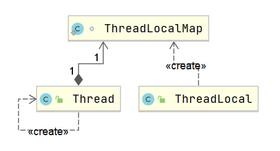

[深入浅出ReentrantLock](https://www.jianshu.com/p/4358b1466ec9)

[Memory Barrier（内存屏障）](https://www.jianshu.com/p/d3fda02d4cae)


### 线程状态

[Thread状态详解](http://www.cnblogs.com/waterystone/p/4920007.html)


# 请描述避免多线程竞争时有哪些手段？

**1) 不可变对象；**

**2) 互斥锁；**

**3) ThreadLocal 对象；**

**4) CAS；**


## 锁

[美团技术团队：不可不说的Java“锁”事](https://tech.meituan.com/2018/11/15/java-lock.html)

根据分类标准我们把锁分为以下 7 大类别：

- 偏向锁/轻量级锁/重量级锁
- 可重入锁/非可重入锁
- 共享锁/独占锁
- 公平锁/非公平锁
- 悲观锁/乐观锁
- 自旋锁/非自旋锁
- 可中断锁/不可中断锁


### 悲观锁/乐观锁

Java中，synchronized关键字和Lock的实现类都是悲观锁。

乐观锁在Java中是通过使用无锁编程来实现，最常采用的是CAS算法，Java原子类中的递增操作就通过CAS自旋实现的。


### 独享锁 VS 共享锁

JDK中的synchronized和JUC中Lock的实现类就是互斥锁。

共享锁是指该锁可被多个线程所持有。如果线程T对数据A加上共享锁后，则其他线程只能对A再加共享锁，不能加排它锁。获得共享锁的线程只能读数据，不能修改数据。

独享锁与共享锁也是通过AQS来实现的，通过实现不同的方法，来实现独享或者共享。


我们看到ReentrantReadWriteLock有两把锁：ReadLock和WriteLock，由词知意，一个读锁一个写锁，合称“读写锁”。再进一步观察可以发现ReadLock和WriteLock是靠内部类Sync实现的锁。Sync是AQS的一个子类，这种结构在CountDownLatch、ReentrantLock、Semaphore里面也都存在。

在ReentrantReadWriteLock里面，读锁和写锁的锁主体都是Sync，但读锁和写锁的加锁方式不一样。读锁是共享锁，写锁是独享锁。读锁的共享锁可保证并发读非常高效，而读写、写读、写写的过程互斥，因为读锁和写锁是分离的。所以ReentrantReadWriteLock的并发性相比一般的互斥锁有了很大提升。


### ReentrantReadWriteLock

前面讲到的ReentrantLock保证了只有一个线程可以执行临界区代码：但是有些时候，这种保护有点过头。有些时候希望：**允许多个线程同时读，但只要有一个线程在写，其他线程就必须等待。**

例如，一个论坛的帖子，回复可以看做写入操作，它是不频繁的，但是，浏览可以看做读取操作，是非常频繁的，这种情况就可以使用ReadWriteLock。**这里说的ReadWriteLock实际上是ReentrantReadWriteLock，和ReentrantLock一样实现了Lock接口。**

用ReadWriteLock实现这个功能十分容易。我们需要创建一个ReentrantReadWriteLock实例，然后分别获取读锁和写锁：

```java
public class Counter {
    private final ReadWriteLock rwlock = new ReentrantReadWriteLock();
    private final Lock rlock = rwlock.readLock();
    private final Lock wlock = rwlock.writeLock();
    private int[] counts = new int[10];

    public void inc(int index) {
        wlock.lock(); // 加写锁
        try {
            counts[index] += 1;
        } finally {
            wlock.unlock(); // 释放写锁
        }
    }

    public int[] get() {
        rlock.lock(); // 加读锁
        try {
            return Arrays.copyOf(counts, counts.length);
        } finally {
            rlock.unlock(); // 释放读锁
        }
    }
}
```

### StampedLock

- **StampedLock提供了乐观读锁，可取代ReadWriteLock以进一步提升并发性能；**
- **乐观锁：乐观地估计读的过程中大概率不会有写入，因此被称为乐观锁。可以直接写，读取之后检查读取过程中版本号是否发生变化。悲观锁则是读的过程中拒绝有写入，也就是写入必须等待。**
- **StampedLock是不可重入锁。**

前面介绍的ReadWriteLock可以解决多线程同时读，但只有一个线程能写的问题。如果我们深入分析ReadWriteLock，会发现它有个潜在的问题：如果有线程正在读，写线程需要等待读线程释放锁后才能获取写锁，即**读的过程中不允许写，这是一种悲观的读锁。**

要进一步提升并发执行效率，Java 8引入了新的读写锁：StampedLock。

StampedLock和ReadWriteLock相比，改进之处在于：**读的过程中也允许获取写锁后写入！**这样一来，我们读的数据就可能不一致，所以，需要一点额外的代码来判断读的过程中是否有写入，**这种读锁是一种乐观锁。**

**乐观锁的意思就是乐观地估计读的过程中大概率不会有写入，因此被称为乐观锁。**反过来，**悲观锁则是读的过程中拒绝有写入，也就是写入必须等待。**显然乐观锁的并发效率更高，但一旦有小概率的写入导致读取的数据不一致，需要能检测出来，再读一遍就行。

```java
public class Point {
    private final StampedLock stampedLock = new StampedLock();

    private double x;
    private double y;

    public void move(double deltaX, double deltaY) {
        long stamp = stampedLock.writeLock(); // 获取写锁
        try {
            x += deltaX;
            y += deltaY;
        } finally {
            stampedLock.unlockWrite(stamp); // 释放写锁
        }
    }

    public double distanceFromOrigin() {
        long stamp = stampedLock.tryOptimisticRead(); // 获得一个乐观读锁
        // 注意下面两行代码不是原子操作
        // 假设x,y = (100,200)
        double currentX = x;
        // 此处已读取到x=100，但x,y可能被写线程修改为(300,400)
        double currentY = y;
        // 此处已读取到y，如果没有写入，读取是正确的(100,200)
        // 如果有写入，读取是错误的(100,400)
        if (!stampedLock.validate(stamp)) { // 检查乐观读锁后是否有其他写锁发生
            stamp = stampedLock.readLock(); // 获取一个悲观读锁
            try {
                currentX = x;
                currentY = y;
            } finally {
                stampedLock.unlockRead(stamp); // 释放悲观读锁
            }
        }
        return Math.sqrt(currentX * currentX + currentY * currentY);
    }
}
```

**和ReadWriteLock相比，写入的加锁是完全一样的，不同的是读取。**注意到首先我们通过tryOptimisticRead()获取一个乐观读锁，**并返回版本号。**接着进行读取，读取完成后，我们通过**validate()去验证版本号，如果在读取过程中没有写入，版本号不变，验证成功**，我们就可以放心地继续后续操作。如果在读取过程中有写入，版本号会发生变化，验证将失败。在失败的时候，我们再通过获取悲观读锁再次读取。由于写入的概率不高，程序在绝大部分情况下可以通过乐观读锁获取数据，极少数情况下使用悲观读锁获取数据。

**可见，StampedLock把读锁细分为乐观读和悲观读，能进一步提升并发效率。**但这也是有代价的：一是代码更加复杂，**二是StampedLock是不可重入锁，不能在一个线程中反复获取同一个锁。**

StampedLock还提供了更复杂的将悲观读锁升级为写锁的功能，它主要使用在if-then-update的场景：即先读，如果读的数据满足条件，就返回，如果读的数据不满足条件，再尝试写。


## ThreadLocal

==**ThreadLocal即线程本地存储，ThreadLocal会为每一个线程提供一个独立的变量副本，因此避免了多线程竞争。**==

在同步机制中，通过对象的锁机制保证同一时间只有一个线程访问变量。这时该变量是多个线程共享的，使用同步机制要求程序慎密地分析什么时候对变量进行读写，什么时候需要锁定某个对象，什么时候释放对象锁等繁杂的问题，程序设计和编写难度相对较大。

而ThreadLocal则从另一个角度来解决多线程的并发访问。ThreadLocal会为每一个线程提供一个独立的变量副本，从而隔离了多个线程对数据的访问冲突。因为每一个线程都拥有自己的变量副本，从而也就没有必要对该变量进行同步了。ThreadLocal提供了线程安全的共享对象，在编写多线程代码时，可以把不安全的变量封装进ThreadLocal。

概括起来说，对于多线程资源共享的问题，同步机制采用了“以时间换空间”的方式，而ThreadLocal采用了“以空间换时间”的方式。前者仅提供一份变量，让不同的线程排队访问，而后者**为每一个线程都提供了一份变量，因此可以同时访问而互不影响。**

```java
import java.util.Random;
import java.util.concurrent.ExecutorService;
import java.util.concurrent.Executors;

public class ThreadLocalDemo implements Runnable {
    private static final ThreadLocal<Integer> threadLocal = ThreadLocal.withInitial(() -> 1);

    @Override
    public void run() {
        System.out.println("Thread Name= " + Thread.currentThread().getName() + " default value = " + threadLocal.get());
        int i = new Random().nextInt(1000);
        try {
            Thread.sleep(i);
        } catch (InterruptedException e) {
            e.printStackTrace();
        }
        threadLocal.set(i);
        System.out.println("Thread Name= " + Thread.currentThread().getName() + " new value = " + threadLocal.get());
    }


    public static void main(String[] args) throws InterruptedException {
        ExecutorService executorService = Executors.newFixedThreadPool(5);
        for (int i = 0; i < 5; i++) {
            executorService.execute(new ThreadLocalDemo());
            Thread.sleep(new Random().nextInt(1000));
        }
        executorService.shutdown(); //不关的话程序会一直等着
    }
}
```

测试输出：

```java
Thread Name= pool-1-thread-1 default value = 1
Thread Name= pool-1-thread-1 new value = 492
Thread Name= pool-1-thread-2 default value = 1
Thread Name= pool-1-thread-2 new value = 47
Thread Name= pool-1-thread-3 default value = 1
Thread Name= pool-1-thread-3 new value = 296
Thread Name= pool-1-thread-4 default value = 1
Thread Name= pool-1-thread-4 new value = 332
Thread Name= pool-1-thread-5 default value = 1
Thread Name= pool-1-thread-5 new value = 558
```

从输出中可以看出，pool-1-thread-1已经改变了threadLocal变量的值，但仍然是thread-2默认格式化程序与初始化值相同，其他线程也一样。

**说明threadLocal为每个线程都有一个threadLocal副本，修改彼此互不影响！**


### ThreadLocal原理



从 `Thread`类源代码入手。

```java
public class Thread implements Runnable {
 ......
//与此线程有关的ThreadLocal值。由ThreadLocal类维护
ThreadLocal.ThreadLocalMap threadLocals = null;

//与此线程有关的InheritableThreadLocal值。由InheritableThreadLocal类维护
ThreadLocal.ThreadLocalMap inheritableThreadLocals = null;
 ......
}
```

从上面`Thread`类 源代码可以看出`Thread` 类中有一个 `threadLocals` 和 一个  `inheritableThreadLocals` 变量，它们都是 `ThreadLocalMap`  类型的变量,我们可以把 `ThreadLocalMap`  理解为`ThreadLocal` 类实现的定制化的 `HashMap`。默认情况下这两个变量都是null，只有当前线程调用 `ThreadLocal` 类的 `set`或`get`方法时才创建它们，实际上调用这两个方法的时候，我们调用的是`ThreadLocalMap`类对应的 `get()`、`set() `方法。

`ThreadLocalMap`是`ThreadLocal`的静态内部类。

#### `ThreadLocal`类的`set()`方法


`ThreadLocal`中的`set`方法原理如上图所示，很简单，主要是判断`ThreadLocalMap`是否存在，然后使用`ThreadLocal`中的`set`方法进行数据处理。

```java
//set是放到了调用set方法的当前线程的ThreadLocalMap中
public void set(T value) {
    Thread t = Thread.currentThread();
    ThreadLocalMap map = getMap(t);
    if (map != null) {
        map.set(this, value);
    } else {
        createMap(t, value);
    }
}
ThreadLocalMap getMap(Thread t) {
    return t.threadLocals;
}
```

通过上面这些内容，我们足以通过猜测得出结论：**最终的变量是放在了当前线程的 `ThreadLocalMap` 中，并不是存在 `ThreadLocal` 上，ThreadLocal 可以理解为只是ThreadLocalMap的封装，传递了变量值。**

**每个Thread中都具备一个ThreadLocalMap，而ThreadLocalMap可以存储以ThreadLocal为key的键值对。** 比如我们在同一个线程中声明了两个 `ThreadLocal` 对象的话，会使用 `Thread`内部都是使用仅有那个`ThreadLocalMap` 存放数据的，`ThreadLocalMap`的 key 就是 `ThreadLocal`对象，value 就是 `ThreadLocal` 对象调用`set`方法设置的值。`ThreadLocal` 是 map结构是为了让每个线程可以关联多个 `ThreadLocal`变量。这也就解释了ThreadLocal声明的变量为什么在每一个线程都有自己的专属本地变量。

### ThreadLocal 内存泄露问题

`ThreadLocalMap` 中使用的 key 为 `ThreadLocal` 的弱引用，而 value 是强引用。所以，如果 `ThreadLocal` 没有被外部强引用的情况下，在垃圾回收的时候会 key 会被清理掉，而 value 不会被清理掉。这样一来，`ThreadLocalMap` 中就会出现key为null的Entry。假如我们不做任何措施的话，value 永远无法被GC 回收，这个时候就可能会产生内存泄露。

```java
/**
* The entries in this hash map extend WeakReference, using
* its main ref field as the key (which is always a
* ThreadLocal object).  Note that null keys (i.e. entry.get()
* == null) mean that the key is no longer referenced, so the
* entry can be expunged from table.  Such entries are referred to
* as "stale entries" in the code that follows.
*/
static class Entry extends WeakReference<ThreadLocal<?>> {
    /** The value associated with this ThreadLocal. */
    Object value;

    Entry(ThreadLocal<?> k, Object v) {
        super(k);
        value = v;
    }
}
```

ThreadLocalMap实现中已经考虑了这种情况，在调用 `set()`、`get()`、`remove()` 方法的时候，会清理掉 key 为 null 的记录。源码在`replaceStaleEntry`，`expungeStaleEntry`中。

**使用完 `ThreadLocal`方法后 最好手动调用`remove()`方法**

**弱引用介绍：**

> 如果一个对象只具有弱引用，那就类似于**可有可无的生活用品**。弱引用与软引用的区别在于：只具有弱引用的对象拥有更短暂的生命周期。在垃圾回收器线程扫描它所管辖的内存区域的过程中，一旦发现了只具有弱引用的对象，不管当前内存空间足够与否，都会回收它的内存。不过，由于垃圾回收器是一个优先级很低的线程， 因此不一定会很快发现那些只具有弱引用的对象。
>
> 弱引用可以和一个引用队列（ReferenceQueue）联合使用，如果弱引用所引用的对象被垃圾回收，Java虚拟机就会把这个弱引用加入到与之关联的引用队列中。