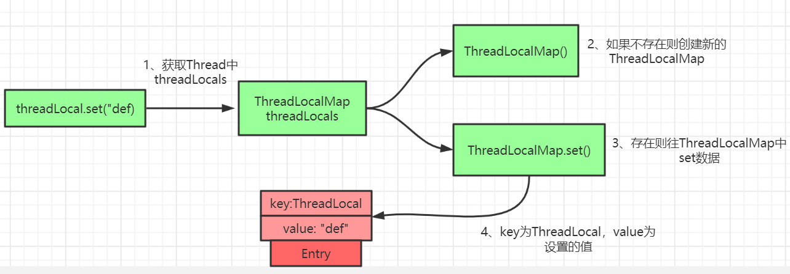

[深入浅出ReentrantLock](https://www.jianshu.com/p/4358b1466ec9)

[Memory Barrier（内存屏障）](https://www.jianshu.com/p/d3fda02d4cae)


请描述避免多线程竞争时有哪些手段？

**1) 不可变对象；**

**2) 互斥锁；**

**3) ThreadLocal 对象；**

**4) CAS；**


## ThreadLocal

==**ThreadLocal即线程本地存储，ThreadLocal会为每一个线程提供一个独立的变量副本，因此避免了多线程竞争。**==

在同步机制中，通过对象的锁机制保证同一时间只有一个线程访问变量。这时该变量是多个线程共享的，使用同步机制要求程序慎密地分析什么时候对变量进行读写，什么时候需要锁定某个对象，什么时候释放对象锁等繁杂的问题，程序设计和编写难度相对较大。

而ThreadLocal则从另一个角度来解决多线程的并发访问。ThreadLocal会为每一个线程提供一个独立的变量副本，从而隔离了多个线程对数据的访问冲突。因为每一个线程都拥有自己的变量副本，从而也就没有必要对该变量进行同步了。ThreadLocal提供了线程安全的共享对象，在编写多线程代码时，可以把不安全的变量封装进ThreadLocal。

概括起来说，对于多线程资源共享的问题，同步机制采用了“以时间换空间”的方式，而ThreadLocal采用了“以空间换时间”的方式。前者仅提供一份变量，让不同的线程排队访问，而后者**为每一个线程都提供了一份变量，因此可以同时访问而互不影响。**

```java
import java.util.Random;
import java.util.concurrent.ExecutorService;
import java.util.concurrent.Executors;

public class ThreadLocalDemo implements Runnable {
    private static final ThreadLocal<Integer> threadLocal = ThreadLocal.withInitial(() -> 1);

    @Override
    public void run() {
        System.out.println("Thread Name= " + Thread.currentThread().getName() + " default value = " + threadLocal.get());
        int i = new Random().nextInt(1000);
        try {
            Thread.sleep(i);
        } catch (InterruptedException e) {
            e.printStackTrace();
        }
        threadLocal.set(i);
        System.out.println("Thread Name= " + Thread.currentThread().getName() + " new value = " + threadLocal.get());
    }


    public static void main(String[] args) throws InterruptedException {
        ExecutorService executorService = Executors.newFixedThreadPool(5);
        for (int i = 0; i < 5; i++) {
            executorService.execute(new ThreadLocalDemo());
            Thread.sleep(new Random().nextInt(1000));
        }
        executorService.shutdown(); //不关的话程序会一直等着
    }
}
```

测试输出：

```java
Thread Name= pool-1-thread-1 default value = 1
Thread Name= pool-1-thread-1 new value = 492
Thread Name= pool-1-thread-2 default value = 1
Thread Name= pool-1-thread-2 new value = 47
Thread Name= pool-1-thread-3 default value = 1
Thread Name= pool-1-thread-3 new value = 296
Thread Name= pool-1-thread-4 default value = 1
Thread Name= pool-1-thread-4 new value = 332
Thread Name= pool-1-thread-5 default value = 1
Thread Name= pool-1-thread-5 new value = 558
```

从输出中可以看出，pool-1-thread-1已经改变了threadLocal变量的值，但仍然是thread-2默认格式化程序与初始化值相同，其他线程也一样。

**说明threadLocal为每个线程都有一个threadLocal副本，修改彼此互不影响！**


### ThreadLocal原理


从 `Thread`类源代码入手。

```java
public class Thread implements Runnable {
 ......
//与此线程有关的ThreadLocal值。由ThreadLocal类维护
ThreadLocal.ThreadLocalMap threadLocals = null;

//与此线程有关的InheritableThreadLocal值。由InheritableThreadLocal类维护
ThreadLocal.ThreadLocalMap inheritableThreadLocals = null;
 ......
}
```

从上面`Thread`类 源代码可以看出`Thread` 类中有一个 `threadLocals` 和 一个  `inheritableThreadLocals` 变量，它们都是 `ThreadLocalMap`  类型的变量,我们可以把 `ThreadLocalMap`  理解为`ThreadLocal` 类实现的定制化的 `HashMap`。默认情况下这两个变量都是null，只有当前线程调用 `ThreadLocal` 类的 `set`或`get`方法时才创建它们，实际上调用这两个方法的时候，我们调用的是`ThreadLocalMap`类对应的 `get()`、`set() `方法。

`ThreadLocalMap`是`ThreadLocal`的静态内部类。

#### `ThreadLocal`类的`set()`方法



`ThreadLocal`中的`set`方法原理如上图所示，很简单，主要是判断`ThreadLocalMap`是否存在，然后使用`ThreadLocal`中的`set`方法进行数据处理。

```java
//set是放到了调用set方法的当前线程的ThreadLocalMap中
public void set(T value) {
    Thread t = Thread.currentThread();
    ThreadLocalMap map = getMap(t);
    if (map != null) {
        map.set(this, value);
    } else {
        createMap(t, value);
    }
}
ThreadLocalMap getMap(Thread t) {
    return t.threadLocals;
}
```

通过上面这些内容，我们足以通过猜测得出结论：**最终的变量是放在了当前线程的 `ThreadLocalMap` 中，并不是存在 `ThreadLocal` 上，ThreadLocal 可以理解为只是ThreadLocalMap的封装，传递了变量值。**

**每个Thread中都具备一个ThreadLocalMap，而ThreadLocalMap可以存储以ThreadLocal为key的键值对。** 比如我们在同一个线程中声明了两个 `ThreadLocal` 对象的话，会使用 `Thread`内部都是使用仅有那个`ThreadLocalMap` 存放数据的，`ThreadLocalMap`的 key 就是 `ThreadLocal`对象，value 就是 `ThreadLocal` 对象调用`set`方法设置的值。`ThreadLocal` 是 map结构是为了让每个线程可以关联多个 `ThreadLocal`变量。这也就解释了ThreadLocal声明的变量为什么在每一个线程都有自己的专属本地变量。

### ThreadLocal 内存泄露问题

`ThreadLocalMap` 中使用的 key 为 `ThreadLocal` 的弱引用，而 value 是强引用。所以，如果 `ThreadLocal` 没有被外部强引用的情况下，在垃圾回收的时候会 key 会被清理掉，而 value 不会被清理掉。这样一来，`ThreadLocalMap` 中就会出现key为null的Entry。假如我们不做任何措施的话，value 永远无法被GC 回收，这个时候就可能会产生内存泄露。

```java
/**
* The entries in this hash map extend WeakReference, using
* its main ref field as the key (which is always a
* ThreadLocal object).  Note that null keys (i.e. entry.get()
* == null) mean that the key is no longer referenced, so the
* entry can be expunged from table.  Such entries are referred to
* as "stale entries" in the code that follows.
*/
static class Entry extends WeakReference<ThreadLocal<?>> {
    /** The value associated with this ThreadLocal. */
    Object value;

    Entry(ThreadLocal<?> k, Object v) {
        super(k);
        value = v;
    }
}
```

ThreadLocalMap实现中已经考虑了这种情况，在调用 `set()`、`get()`、`remove()` 方法的时候，会清理掉 key 为 null 的记录。源码在`replaceStaleEntry`，`expungeStaleEntry`中。

**使用完 `ThreadLocal`方法后 最好手动调用`remove()`方法**

**弱引用介绍：**

> 如果一个对象只具有弱引用，那就类似于**可有可无的生活用品**。弱引用与软引用的区别在于：只具有弱引用的对象拥有更短暂的生命周期。在垃圾回收器线程扫描它所管辖的内存区域的过程中，一旦发现了只具有弱引用的对象，不管当前内存空间足够与否，都会回收它的内存。不过，由于垃圾回收器是一个优先级很低的线程， 因此不一定会很快发现那些只具有弱引用的对象。
>
> 弱引用可以和一个引用队列（ReferenceQueue）联合使用，如果弱引用所引用的对象被垃圾回收，Java虚拟机就会把这个弱引用加入到与之关联的引用队列中。