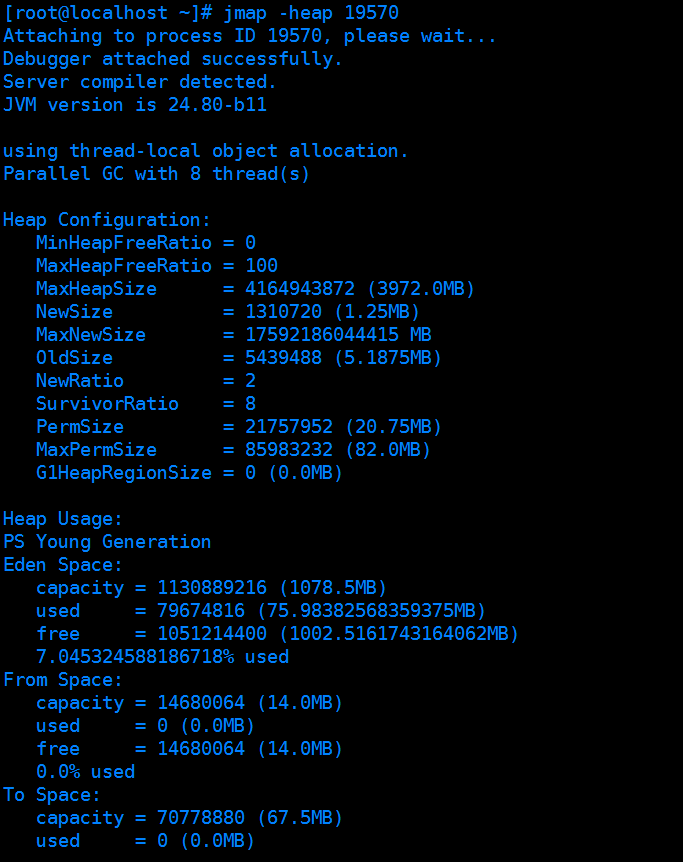
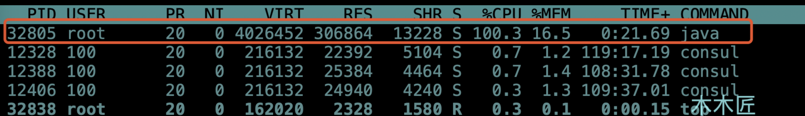
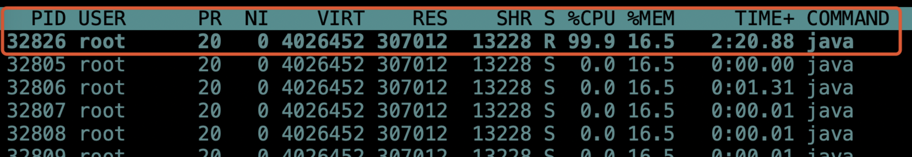
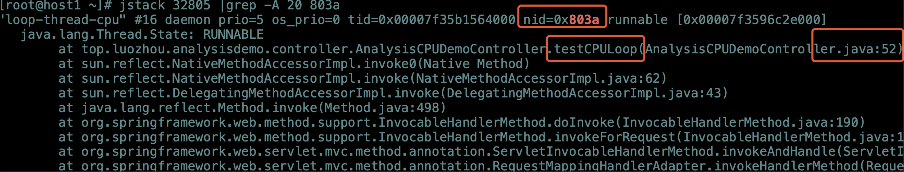
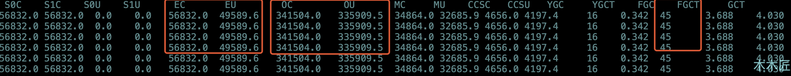
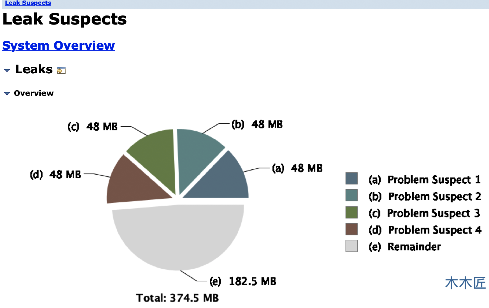
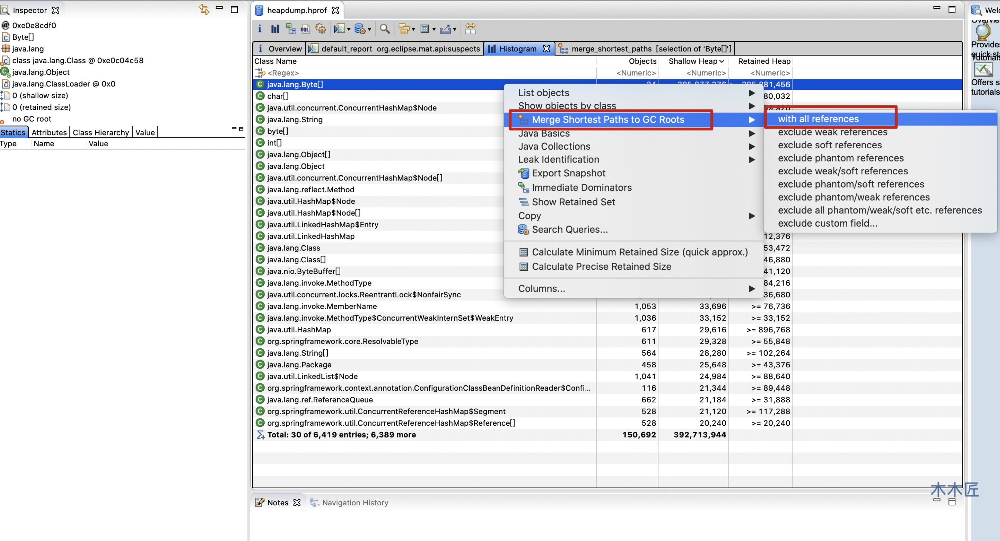
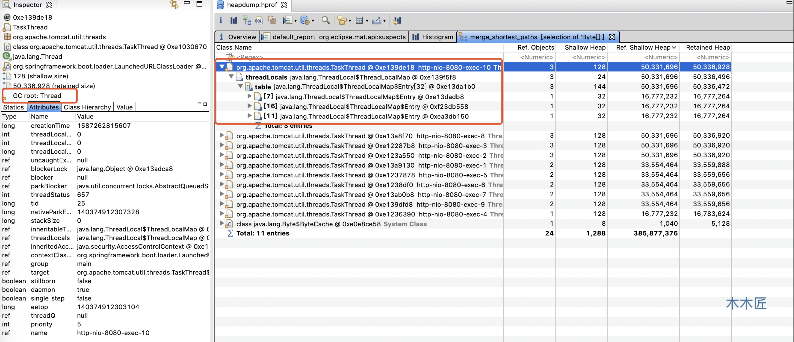

# Java性能问题定位

top -H 查看整个机器CPU使用率，内存使用率

top -Hp pid 查看某个进程下的线程CPU使用率，内存使用率

```sh
#5表示每5秒采集一次服务器状态，10表示 采集10次
vmstat 5 10
```

`jstack pid` 查看线程的堆栈信息，排除死锁。

执行 `printf '%x' 32826` 获取16进制的线程id，用于`dump`信息查询，结果为 `803a`。最后我们执行`jstack 32805 |grep -A 20 803a `来查看下详细的`dump`信息，能分析出CPU占满的原因。

**`jstat -gc pid`** 命令查看程序的GC情况，来发现是不是有内存泄漏问题-很多次 Full Gc都清除不掉。

```sh
java -jar -Xms500m -Xmx500m -XX:+HeapDumpOnOutOfMemoryError -XX:HeapDumpPath=/tmp/heapdump.hprof  -XX:+PrintGCTimeStamps -XX:+PrintGCDetails -Xloggc:/tmp/heaplog.log analysis-demo-0.0.1-SNAPSHOT.jar
```

保存dump文件之后，用MAT工具分析，可以可视化相关信息，分析内存泄漏。

vmstat是一个指定周期和采集次数的虚拟内存检测工具，可以统计内存，CPU，swap的使用情况，它还有一个重要的常用功能，**用来观察进程的上下文切换。**


性能优化一向是后端服务优化的重点，但是线上性能故障问题不是经常出现，或者受限于业务产品，根本就没办法出现性能问题，包括笔者自己遇到的性能问题也不多，所以为了提前储备知识，当出现问题的时候不会手忙脚乱，我们本篇文章来模拟下常见的几个Java性能故障，来学习怎么去分析和定位。

## 常用定位问题的工具/命令

既然是定位问题，肯定是需要借助工具，我们先了解下需要哪些工具可以帮忙定位问题。

### Linux命令

#### top

`top -Hp 32805`命令使我们最常用的Linux命令之一，它可以实时的显示当前正在执行的进程的CPU使用率，内存使用率等系统信息。

```sh
top -Hp pid #查看线程的系统资源使用情况
```

#### 如何获得java程序的pid

```sh
ps -ef|grep java
```

#### vmstat命令 

vmstat是一个指定周期和采集次数的虚拟内存检测工具，可以统计内存，CPU，swap的使用情况，它还有一个重要的常用功能，用来观察进程的上下文切换。

```sh
#5表示每5秒采集一次服务器状态，10表示 采集10次
vmstat 5 10
```

字段说明如下:

- r: 运行队列中进程数量（当数量大于CPU核数表示有阻塞的线程）
- b: 等待IO的进程数量
- swpd: 使用虚拟内存大小
- free: 空闲物理内存大小
- buff: 用作缓冲的内存大小(内存和硬盘的缓冲区)
- cache: 用作缓存的内存大小（CPU和内存之间的缓冲区）
- si: 每秒从交换区写到内存的大小，由磁盘调入内存
- so: 每秒写入交换区的内存大小，由内存调入磁盘
- bi: 每秒读取的块数
- bo: 每秒写入的块数
- in: 每秒中断数，包括时钟中断。
- cs: 每秒上下文切换数。
- us: 用户进程执行时间百分比(user time)
- sy: 内核系统进程执行时间百分比(system time)
- wa: IO等待时间百分比
- id: 空闲时间百分比

#### pidstat命令

需要先安装

pidstat 是 Sysstat 中的一个组件，也是一款功能强大的性能监测工具，`top` 和 `vmstat` 两个命令都是监测进程的内存、CPU 以及 I/O 使用情况，而 pidstat 命令可以检测到线程级别的。`pidstat`命令线程切换字段说明如下：

- UID ：被监控任务的真实用户ID。
- TGID ：线程组ID。
- TID：线程ID。
- cswch/s：主动切换上下文次数，这里是因为资源阻塞而切换线程，比如锁等待等情况。
- nvcswch/s：被动切换上下文次数，这里指CPU调度切换了线程。

### JDK工具命令

####  jstack

**[示例](https://www.cnblogs.com/wuchanming/p/7766994.html)**

jstack是JDK工具命令，它是一种线程堆栈分析工具，最常用的功能就是使用 `jstack pid` 命令查看线程的堆栈信息，也**经常用来排除死锁情况。**

```sh
jstack [ option ] pid
```

#### jstat

https://blog.csdn.net/dnc8371/article/details/107255359

它可以检测Java程序运行的实时情况，包括堆内存信息和垃圾回收信息，我们常常用来查看程序垃圾回收情况。常用的命令是`jstat -gc pid`。

```sh
执行以下命令。 这是启动jstat的简单选项。
jstat -gc -t 11656 10000 30 
-gc ：将显示与垃圾收集相关的统计信息

自JVM启动以来的-t时间戳将被打印

11656：目标JVM进程ID
10000：每10,000毫秒（即10秒）将打印一次统计信息。
30 ：将打印30次迭代的统计信息。 因此，以上选项将导致JVM打印指标300秒（即10秒x 30次迭代）。
```

信息字段说明如下：

- S0C：年轻代中 To Survivor 的容量（单位 KB）；

- S1C：年轻代中 From Survivor 的容量（单位 KB）；

- S0U：年轻代中 To Survivor 目前已使用空间（单位 KB）；

- S1U：年轻代中 From Survivor 目前已使用空间（单位 KB）；

- EC：年轻代中 Eden 的容量（单位 KB）；

- EU：年轻代中 Eden 目前已使用空间（单位 KB）；

- OC：老年代的容量（单位 KB）；

- OU：老年代目前已使用空间（单位 KB）；

- MC：元空间的容量（单位 KB）；

- MU：元空间目前已使用空间（单位 KB）；

- YGC：从应用程序启动到采样时年轻代中 gc 次数；

- YGCT：从应用程序启动到采样时年轻代中 gc 所用时间 (s)；

- FGC：从应用程序启动到采样时 老年代（Full Gc）gc 次数；

- FGCT：从应用程序启动到采样时 老年代代（Full Gc）gc 所用时间 (s)；

- GCT：从应用程序启动到采样时 gc 用的总时间 (s)。

#### jmap命令

jmap也是JDK工具命令，他可以查看堆内存的初始化信息以及堆内存的使用情况，还可以生成dump文件来进行详细分析。

```sh
#查看堆内存情况命令
jmap -heap pid
```




### 插件/工具

#### Visual VM:多合一故障处理工具

可以使用Java VisualVM工具检测JVM内存。https://www.cnblogs.com/liululee/p/11056779.html

VisualVM 提供在 Java 虚拟机 (Java Virutal Machine, JVM) 上运行的 Java 应用程序的详细信息。在 VisualVM 的图形用户界面中，您可以方便、快捷地查看多个 Java 应用程序的相关信息。Visual VM 官网：<https://visualvm.github.io/> 。Visual VM 中文文档:<https://visualvm.github.io/documentation.html>。

下面这段话摘自《深入理解 Java 虚拟机》。

> VisualVM（All-in-One Java Troubleshooting Tool）是到目前为止随 JDK 发布的功能最强大的运行监视和故障处理程序，官方在 VisualVM 的软件说明中写上了“All-in-One”的描述字样，预示着他除了运行监视、故障处理外，还提供了很多其他方面的功能，如性能分析（Profiling）。VisualVM 的性能分析功能甚至比起 JProfiler、YourKit 等专业且收费的 Profiling 工具都不会逊色多少，而且 VisualVM 还有一个很大的优点：不需要被监视的程序基于特殊 Agent 运行，因此他对应用程序的实际性能的影响很小，使得他可以直接应用在生产环境中。这个优点是 JProfiler、YourKit 等工具无法与之媲美的。

 VisualVM 基于 NetBeans 平台开发，因此他一开始就具备了插件扩展功能的特性，通过插件扩展支持，VisualVM 可以做到：

- **显示虚拟机进程以及进程的配置、环境信息（jps、jinfo）。**
- **监视应用程序的 CPU、GC、堆、方法区以及线程的信息（jstat、jstack）。**
- **dump 以及分析堆转储快照（jmap、jhat）。**
- **方法级的程序运行性能分析，找到被调用最多、运行时间最长的方法。**
- **离线程序快照：收集程序的运行时配置、线程 dump、内存 dump 等信息建立一个快照，可以将快照发送开发者处进行 Bug 反馈。**
- **其他 plugins 的无限的可能性......**

如果想了解的话可以看:

- <https://visualvm.github.io/documentation.html>
- <https://www.ibm.com/developerworks/cn/java/j-lo-visualvm/index.html>


#### mat内存工具

MAT(Memory Analyzer Tool)工具是eclipse的一个插件(MAT也可以单独使用)，它分析大内存的dump文件时，可以非常直观的看到各个对象在堆空间中所占用的内存大小、类实例数量、对象引用关系、利用OQL对象查询，以及可以很方便的找出对象GC Roots的相关信息。

**idea中也有这么一个插件，就是JProfiler**。 

相关阅读：

1. 《性能诊断利器 JProfiler 快速入门和最佳实践》：[https://segmentfault.com/a/1190000017795841](https://segmentfault.com/a/1190000017795841)


## 模拟问题

基础环境jdk1.8，采用SpringBoot框架来写几个接口来触发模拟场景，首先是模拟CPU占满情况

### CPU占满

模拟CPU占满还是比较简单，直接写一个死循环计算消耗CPU即可。

````java
/**
 * 模拟CPU占满
 */
@GetMapping("/cpu/loop")
public void testCPULoop() throws InterruptedException {
    System.out.println("请求cpu死循环");
    Thread.currentThread().setName("loop-thread-cpu");
    int num = 0;
    while (true) {
        num++;
        if (num == Integer.MAX_VALUE) {
            System.out.println("reset");
        }
        num = 0;
    }

}
````

请求接口地址测试`curl localhost:8080/cpu/loop`，发现CPU立马飙升到100%



通过执行`top -Hp 32805` 查看Java线程情况



执行 `printf '%x' 32826` 获取16进制的线程id，用于`dump`信息查询，结果为 `803a`。最后我们执行`jstack 32805 |grep -A 20 803a `来查看下详细的`dump`信息。



这里`dump`信息直接定位出了问题方法以及代码行，这就定位出了CPU占满的问题。

### 内存泄露

模拟内存泄漏借助了ThreadLocal对象来完成，ThreadLocal是一个线程私有变量，可以绑定到线程上，在整个线程的生命周期都会存在，但是由于ThreadLocal的特殊性，ThreadLocal是基于ThreadLocalMap实现的，ThreadLocalMap的Entry继承WeakReference，而Entry的Key是WeakReference的封装，换句话说Key就是弱引用，弱引用在下次GC之后就会被回收，如果ThreadLocal在set之后不进行后续的操作，因为GC会把Key清除掉，但是Value由于线程还在存活，所以Value一直不会被回收，最后就会发生内存泄漏。

````Java
/**
* 模拟内存泄漏
*/
@GetMapping(value = "/memory/leak")
public String leak() {
    System.out.println("模拟内存泄漏");
    ThreadLocal<Byte[]> localVariable = new ThreadLocal<Byte[]>();
    localVariable.set(new Byte[4096 * 1024]);// 为线程添加变量
    return "ok";
}
````

我们给启动加上堆内存大小限制，同时设置内存溢出的时候输出堆栈快照并输出日志。

`java -jar -Xms500m -Xmx500m -XX:+HeapDumpOnOutOfMemoryError -XX:HeapDumpPath=/tmp/heapdump.hprof  -XX:+PrintGCTimeStamps -XX:+PrintGCDetails -Xloggc:/tmp/heaplog.log analysis-demo-0.0.1-SNAPSHOT.jar`

启动成功后我们循环执行100次，`for i in {1..500}; do curl localhost:8080/memory/leak;done`,还没执行完毕，系统已经返回500错误了。查看系统日志出现了如下异常：

```
java.lang.OutOfMemoryError: Java heap space
```

我们用`jstat -gc pid` 命令来看看程序的GC情况。



很明显，内存溢出了，堆内存经过45次 Full Gc 之后都没释放出可用内存，这说明当前堆内存中的对象都是存活的，有GC Roots引用，无法回收。那是什么原因导致内存溢出呢？是不是我只要加大内存就行了呢？如果是普通的内存溢出也许扩大内存就行了，但是如果是内存泄漏的话，扩大的内存不一会就会被占满，所以我们还需要确定是不是内存泄漏。我们之前保存了堆 Dump 文件，这个时候借助我们的MAT工具来分析下。导入工具选择`Leak Suspects Report`，工具直接就会给你列出问题报告。



这里已经列出了可疑的4个内存泄漏问题，我们点击其中一个查看详情。


这里已经指出了内存被线程占用了接近50M的内存，占用的对象就是ThreadLocal。如果想详细的通过手动去分析的话，可以点击`Histogram`,查看最大的对象占用是谁，然后再分析它的引用关系，即可确定是谁导致的内存溢出。



上图发现占用内存最大的对象是一个Byte数组，我们看看它到底被那个GC Root引用导致没有被回收。按照上图红框操作指引，结果如下图：



我们发现Byte数组是被线程对象引用的，图中也标明，Byte数组对像的GC Root是线程，所以它是不会被回收的，展开详细信息查看，我们发现最终的内存占用对象是被ThreadLocal对象占据了。这也和MAT工具自动帮我们分析的结果一致。

### 死锁

死锁会导致耗尽线程资源，占用内存，表现就是内存占用升高，CPU不一定会飙升(看场景决定)，如果是直接new线程，会导致JVM内存被耗尽，报无法创建线程的错误，这也是体现了使用线程池的好处。

```java
 ExecutorService service = new ThreadPoolExecutor(4, 10,
            0, TimeUnit.SECONDS, new LinkedBlockingQueue<Runnable>(1024),
            Executors.defaultThreadFactory(),
            new ThreadPoolExecutor.AbortPolicy());
   /**
     * 模拟死锁
     */
    @GetMapping("/cpu/test")
    public String testCPU() throws InterruptedException {
        System.out.println("请求cpu");
        Object lock1 = new Object();
        Object lock2 = new Object();
        service.submit(new DeadLockThread(lock1, lock2), "deadLookThread-" + new Random().nextInt());
        service.submit(new DeadLockThread(lock2, lock1), "deadLookThread-" + new Random().nextInt());
        return "ok";
    }

public class DeadLockThread implements Runnable {
    private Object lock1;
    private Object lock2;

    public DeadLockThread1(Object lock1, Object lock2) {
        this.lock1 = lock1;
        this.lock2 = lock2;
    }

    @Override
    public void run() {
        synchronized (lock2) {
            System.out.println(Thread.currentThread().getName()+"get lock2 and wait lock1");
            try {
                TimeUnit.MILLISECONDS.sleep(2000);
            } catch (InterruptedException e) {
                e.printStackTrace();
            }
            synchronized (lock1) {
                System.out.println(Thread.currentThread().getName()+"get lock1 and lock2 ");
            }
        }
    }
}
```

我们循环请求接口2000次，发现不一会系统就出现了日志错误，线程池和队列都满了,由于我选择的当队列满了就拒绝的策略，所以系统直接抛出异常。

```
java.util.concurrent.RejectedExecutionException: Task java.util.concurrent.FutureTask@2760298 rejected from java.util.concurrent.ThreadPoolExecutor@7ea7cd51[Running, pool size = 10, active threads = 10, queued tasks = 1024, completed tasks = 846]
```

通过`ps -ef|grep java`命令找出 Java 进程 pid，执行`jstack pid` 即可出现java线程堆栈信息，这里发现了5个死锁，我们只列出其中一个，很明显线程`pool-1-thread-2`锁住了`0x00000000f8387d88`等待`0x00000000f8387d98`锁，线程`pool-1-thread-1`锁住了`0x00000000f8387d98`等待锁`0x00000000f8387d88`,这就产生了死锁。

```JAVA
Java stack information for the threads listed above:
===================================================
"pool-1-thread-2":
        at top.luozhou.analysisdemo.controller.DeadLockThread2.run(DeadLockThread.java:30)
        - waiting to lock <0x00000000f8387d98> (a java.lang.Object)
        - locked <0x00000000f8387d88> (a java.lang.Object)
        at java.util.concurrent.Executors$RunnableAdapter.call(Executors.java:511)
        at java.util.concurrent.FutureTask.run(FutureTask.java:266)
        at java.util.concurrent.ThreadPoolExecutor.runWorker(ThreadPoolExecutor.java:1149)
        at java.util.concurrent.ThreadPoolExecutor$Worker.run(ThreadPoolExecutor.java:624)
        at java.lang.Thread.run(Thread.java:748)
"pool-1-thread-1":
        at top.luozhou.analysisdemo.controller.DeadLockThread1.run(DeadLockThread.java:30)
        - waiting to lock <0x00000000f8387d88> (a java.lang.Object)
        - locked <0x00000000f8387d98> (a java.lang.Object)
        at java.util.concurrent.Executors$RunnableAdapter.call(Executors.java:511)
        at java.util.concurrent.FutureTask.run(FutureTask.java:266)
        at java.util.concurrent.ThreadPoolExecutor.runWorker(ThreadPoolExecutor.java:1149)
        at java.util.concurrent.ThreadPoolExecutor$Worker.run(ThreadPoolExecutor.java:624)
        at java.lang.Thread.run(Thread.java:748)
          
 Found 5 deadlocks.
```

### 线程频繁切换

上下文切换会导致将大量CPU时间浪费在寄存器、内核栈以及虚拟内存的保存和恢复上，导致系统整体性能下降。当你发现系统的性能出现明显的下降时候，需要考虑是否发生了大量的线程上下文切换。

```java
 @GetMapping(value = "/thread/swap")
    public String theadSwap(int num) {
        System.out.println("模拟线程切换");
        for (int i = 0; i < num; i++) {
            new Thread(new ThreadSwap1(new AtomicInteger(0)),"thread-swap"+i).start();
        }
        return "ok";
    }
public class ThreadSwap1 implements Runnable {
    private AtomicInteger integer;

    public ThreadSwap1(AtomicInteger integer) {
        this.integer = integer;
    }

    @Override
    public void run() {
        while (true) {
            integer.addAndGet(1);
            Thread.yield(); //让出CPU资源
        }
    }
}
```

这里我创建多个线程去执行基础的原子+1操作，然后让出 CPU 资源，理论上 CPU 就会去调度别的线程，我们请求接口创建100个线程看看效果如何，`curl localhost:8080/thread/swap?num=100`。接口请求成功后，我们执行`vmstat 1 10，表示每1秒打印一次，打印10次，线程切换采集结果如下：

```
procs -----------memory---------- ---swap-- -----io---- -system-- ------cpu-----
 r  b   swpd   free   buff  cache   si   so    bi    bo   in   cs us sy id wa st
101  0 128000 878384    908 468684    0    0     0     0 4071 8110498 14 86  0  0  0
100  0 128000 878384    908 468684    0    0     0     0 4065 8312463 15 85  0  0  0
100  0 128000 878384    908 468684    0    0     0     0 4107 8207718 14 87  0  0  0
100  0 128000 878384    908 468684    0    0     0     0 4083 8410174 14 86  0  0  0
100  0 128000 878384    908 468684    0    0     0     0 4083 8264377 14 86  0  0  0
100  0 128000 878384    908 468688    0    0     0   108 4182 8346826 14 86  0  0  0
```

这里我们关注4个指标，`r`,`cs`,`us`,`sy`。

**r=100**,说明等待的进程数量是100，线程有阻塞。

**cs=800多万**，说明每秒上下文切换了800多万次，这个数字相当大了。

**us=14**，说明用户态占用了14%的CPU时间片去处理逻辑。

**sy=86**，说明内核态占用了86%的CPU，这里明显就是做上下文切换工作了。

我们通过`top`命令以及`top -Hp pid`查看进程和线程CPU情况，发现Java线程CPU占满了，但是线程CPU使用情况很平均，没有某一个线程把CPU吃满的情况。

```
PID USER      PR  NI    VIRT    RES    SHR S  %CPU %MEM     TIME+ COMMAND                                                                            
 87093 root      20   0 4194788 299056  13252 S 399.7 16.1  65:34.67 java 
```

```
 PID USER      PR  NI    VIRT    RES    SHR S %CPU %MEM     TIME+ COMMAND                                                                             
 87189 root      20   0 4194788 299056  13252 R  4.7 16.1   0:41.11 java                                                                                
 87129 root      20   0 4194788 299056  13252 R  4.3 16.1   0:41.14 java                                                                                
 87130 root      20   0 4194788 299056  13252 R  4.3 16.1   0:40.51 java                                                                                
 87133 root      20   0 4194788 299056  13252 R  4.3 16.1   0:40.59 java                                                                                
 87134 root      20   0 4194788 299056  13252 R  4.3 16.1   0:40.95 java 
```

结合上面用户态CPU只使用了14%，内核态CPU占用了86%，可以基本判断是Java程序线程上下文切换导致性能问题。

我们使用`pidstat`命令来看看Java进程内部的线程切换数据，执行`pidstat -p 87093 -w 1 10 `,采集数据如下：

```
11:04:30 PM   UID       TGID       TID   cswch/s nvcswch/s  Command
11:04:30 PM     0         -     87128      0.00     16.07  |__java
11:04:30 PM     0         -     87129      0.00     15.60  |__java
11:04:30 PM     0         -     87130      0.00     15.54  |__java
11:04:30 PM     0         -     87131      0.00     15.60  |__java
11:04:30 PM     0         -     87132      0.00     15.43  |__java
11:04:30 PM     0         -     87133      0.00     16.02  |__java
11:04:30 PM     0         -     87134      0.00     15.66  |__java
11:04:30 PM     0         -     87135      0.00     15.23  |__java
11:04:30 PM     0         -     87136      0.00     15.33  |__java
11:04:30 PM     0         -     87137      0.00     16.04  |__java
```

根据上面采集的信息，我们知道Java的线程每秒切换15次左右，正常情况下，应该是个位数或者小数。结合这些信息我们可以断定Java线程开启过多，导致频繁上下文切换，从而影响了整体性能。

**为什么系统的上下文切换是每秒800多万，而 Java 进程中的某一个线程切换才15次左右？**

系统上下文切换分为三种情况:

1、多任务：在多任务环境中，一个进程被切换出CPU，运行另外一个进程，这里会发生上下文切换。

2、中断处理：发生中断时，硬件会切换上下文。在vmstat命令中是`in`

3、用户和内核模式切换：当操作系统中需要在用户模式和内核模式之间进行转换时，需要进行上下文切换,比如进行系统函数调用。

Linux 为每个 CPU 维护了一个就绪队列，将活跃进程按照优先级和等待 CPU 的时间排序，然后选择最需要 CPU 的进程，也就是优先级最高和等待 CPU 时间最长的进程来运行。也就是vmstat命令中的`r`。

那么，进程在什么时候才会被调度到 CPU 上运行呢？

- 进程执行完终止了，它之前使用的 CPU 会释放出来，这时再从就绪队列中拿一个新的进程来运行
- 为了保证所有进程可以得到公平调度，CPU 时间被划分为一段段的时间片，这些时间片被轮流分配给各个进程。当某个进程时间片耗尽了就会被系统挂起，切换到其它等待 CPU 的进程运行。
- 进程在系统资源不足时，要等待资源满足后才可以运行，这时进程也会被挂起，并由系统调度其它进程运行。
- 当进程通过睡眠函数 sleep 主动挂起时，也会重新调度。
- 当有优先级更高的进程运行时，为了保证高优先级进程的运行，当前进程会被挂起，由高优先级进程来运行。
- 发生硬件中断时，CPU 上的进程会被中断挂起，转而执行内核中的中断服务程序。

结合我们之前的内容分析，阻塞的就绪队列是100左右，而我们的CPU只有4核，这部分原因造成的上下文切换就可能会相当高，再加上中断次数是4000左右和系统的函数调用等，整个系统的上下文切换到800万也不足为奇了。Java内部的线程切换才15次，是因为线程使用`Thread.yield()`来让出CPU资源，但是CPU有可能继续调度该线程，这个时候线程之间并没有切换，这也是为什么内部的某个线程切换次数并不是非常大的原因。

### 总结

本文模拟了常见的性能问题场景，分析了如何定位CPU100%、内存泄漏、死锁、线程频繁切换问题。分析问题我们需要做好两件事，第一，掌握基本的原理，第二，借助好工具。本文也列举了分析问题的常用工具和命令，希望对你解决问题有所帮助。当然真正的线上环境可能十分复杂，并没有模拟的环境那么简单，但是原理是一样的，问题的表现也是类似的，我们重点抓住原理，活学活用，相信复杂的线上问题也可以顺利解决。

### 参考 

1、https://linux.die.net/man/1/pidstat

2、https://linux.die.net/man/8/vmstat

3、https://help.eclipse.org/2020-03/index.jsp?topic=/org.eclipse.mat.ui.help/welcome.html

4、https://www.linuxblogs.cn/articles/18120200.html

5、https://www.tutorialspoint.com/what-is-context-switching-in-operating-system


# JVM性能调优

[GC调优实例](https://blog.csdn.net/zhangjunli/article/details/81115259)

## 参数

>  本文由 JavaGuide 翻译自 https://www.baeldung.com/jvm-parameters，并对文章进行了大量的完善补充。翻译不易，如需转载请注明出处为：   作者： 。

## 1.概述

在本篇文章中，你将掌握最常用的 JVM 参数配置。如果对于下面提到了一些概念比如堆、

## 2.堆内存相关

>Java 虚拟机所管理的内存中最大的一块，Java 堆是所有线程共享的一块内存区域，在虚拟机启动时创建。**此内存区域的唯一目的就是存放对象实例，几乎所有的对象实例以及数组都在这里分配内存。**

### 2.1.显式指定堆内存`–Xms`和`-Xmx`

与性能有关的最常见实践之一是根据应用程序要求初始化堆内存。如果我们需要指定最小和最大堆大小（推荐显示指定大小），以下参数可以帮助你实现：

```
-Xms<heap size>[unit] 
-Xmx<heap size>[unit]
```

- **heap size** 表示要初始化内存的具体大小。
- **unit** 表示要初始化内存的单位。单位为***“ g”*** (GB) 、***“ m”***（MB）、***“ k”***（KB）。

举个栗子🌰，如果我们要为JVM分配最小2 GB和最大5 GB的堆内存大小，我们的参数应该这样来写：

```
-Xms2G -Xmx5G
```

### 2.2.显式新生代内存(Young Ceneration)

根据[Oracle官方文档](https://docs.oracle.com/javase/8/docs/technotes/guides/vm/gctuning/sizing.html)，在堆总可用内存配置完成之后，第二大影响因素是为 `Young Generation` 在堆内存所占的比例。默认情况下，YG 的最小大小为 1310 *MB*，最大大小为*无限制*。

一共有两种指定 新生代内存(Young Ceneration)大小的方法：

**1.通过`-XX:NewSize`和`-XX:MaxNewSize`指定**

```
-XX:NewSize=<young size>[unit] 
-XX:MaxNewSize=<young size>[unit]
```

举个栗子🌰，如果我们要为 新生代分配 最小256m 的内存，最大 1024m的内存我们的参数应该这样来写：

```
-XX:NewSize=256m
-XX:MaxNewSize=1024m
```

**2.通过`-Xmn<young size>[unit] `指定**

举个栗子🌰，如果我们要为 新生代分配256m的内存（NewSize与MaxNewSize设为一致），我们的参数应该这样来写：

```
-Xmn256m 
```

GC 调优策略中很重要的一条经验总结是这样说的：

> 将新对象预留在新生代，由于 Full GC 的成本远高于 Minor GC，因此尽可能将对象分配在新生代是明智的做法，实际项目中根据 GC 日志分析新生代空间大小分配是否合理，适当通过“-Xmn”命令调节新生代大小，最大限度降低新对象直接进入老年代的情况。

另外，你还可以通过**`-XX:NewRatio=<int>`**来设置新生代和老年代内存的比值。

比如下面的参数就是设置新生代（包括Eden和两个Survivor区）与老年代的比值为1。也就是说：新生代与老年代所占比值为1：1，新生代占整个堆栈的 1/2。

```
-XX:NewRatio=1
```

### 2.3.显示指定永久代/元空间的大小

**从Java 8开始，如果我们没有指定 Metaspace 的大小，随着更多类的创建，虚拟机会耗尽所有可用的系统内存（永久代并不会出现这种情况）。**

JDK 1.8 之前永久代还没被彻底移除的时候通常通过下面这些参数来调节方法区大小

```java
-XX:PermSize=N //方法区 (永久代) 初始大小
-XX:MaxPermSize=N //方法区 (永久代) 最大大小,超过这个值将会抛出 OutOfMemoryError 异常:java.lang.OutOfMemoryError: PermGen
```

相对而言，垃圾收集行为在这个区域是比较少出现的，但并非数据进入方法区后就“永久存在”了。

**JDK 1.8 的时候，方法区（HotSpot 的永久代）被彻底移除了（JDK1.7 就已经开始了），取而代之是元空间，元空间使用的是本地内存。**

下面是一些常用参数：

```java
-XX:MetaspaceSize=N //设置 Metaspace 的初始（和最小大小）
-XX:MaxMetaspaceSize=N //设置 Metaspace 的最大大小，如果不指定大小的话，随着更多类的创建，虚拟机会耗尽所有可用的系统内存。
```

## 3.垃圾收集相关

### 3.1.垃圾回收器

为了提高应用程序的稳定性，选择正确的[垃圾收集](http://www.oracle.com/webfolder/technetwork/tutorials/obe/java/gc01/index.html)算法至关重要。

JVM具有四种类型的*GC*实现：

- 串行垃圾收集器
- 并行垃圾收集器
- CMS垃圾收集器
- G1垃圾收集器

可以使用以下参数声明这些实现：

```
-XX:+UseSerialGC
-XX:+UseParallelGC
-XX:+USeParNewGC
-XX:+UseG1GC
```

有关*垃圾回收*实施的更多详细信息，请参见[此处](https://github.com/Snailclimb/JavaGuide/blob/master/docs/java/jvm/JVM%E5%9E%83%E5%9C%BE%E5%9B%9E%E6%94%B6.md)。

### 3.2.GC记录

为了严格监控应用程序的运行状况，我们应该始终检查JVM的*垃圾回收*性能。最简单的方法是以人类可读的格式记录*GC*活动。

使用以下参数，我们可以记录*GC*活动：

```
-XX:+UseGCLogFileRotation 
-XX:NumberOfGCLogFiles=< number of log files > 
-XX:GCLogFileSize=< file size >[ unit ]
-Xloggc:/path/to/gc.log
```


## 推荐阅读

- [CMS GC 默认新生代是多大？](https://www.jianshu.com/p/832fc4d4cb53)
- [CMS GC启动参数优化配置](https://www.cnblogs.com/hongdada/p/10277782.html)
- [从实际案例聊聊Java应用的GC优化-美团技术团队](https://tech.meituan.com/2017/12/29/jvm-optimize.html)
- [JVM性能调优详解](https://www.choupangxia.com/2019/11/11/interview-jvm-gc-08/) （2019-11-11）
- [JVM参数使用手册](https://segmentfault.com/a/1190000010603813)