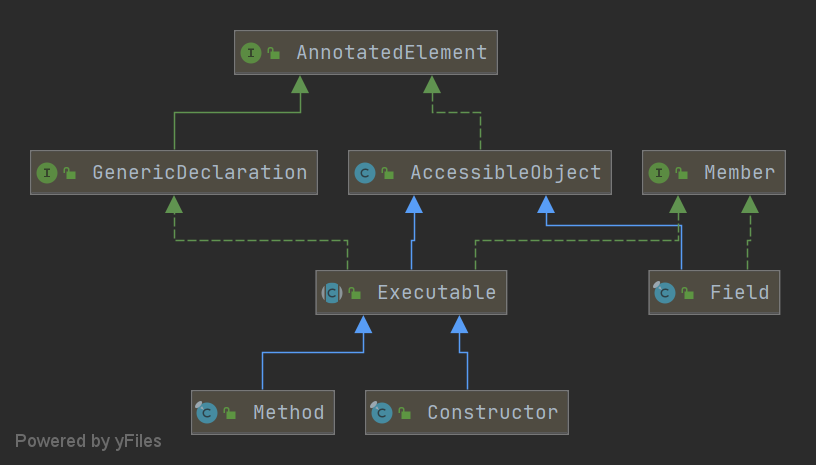
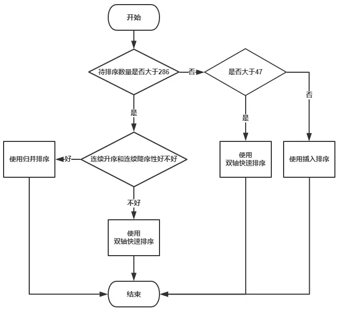
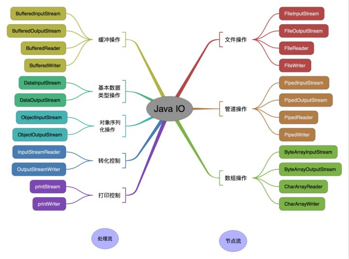

# 谈谈你对Java的理解

- 平台无关性，编译与解释共存。
- GC垃圾回收
- 语言特性

  - 泛型

  - 反射

  - lambda表达式
- 面向对象
    - 封装
    - 继承
    - 多态
- 类库
    - 集合
    - 并发库/多线程
    - IO/NIO
    - 网络库
- 异常处理


# 基础知识

## Java常识

### Java 与 C++ 的区别

- Java 是纯粹的面向对象语言，所有的对象都继承自 java.lang.Object，C++ 为了兼容 C 即支持面向对象也支持面向过程。
- Java 通过虚拟机从而实现跨平台特性，但是 C++ 依赖于特定的平台。
- Java 没有指针，程序内存更加安全。
- Java 支持自动垃圾回收，而 C++ 需要手动回收。
- Java 不支持多重继承，只能通过实现多个接口来达到相同目的，而 C++ 支持多重继承。
- 在 C 语言中，字符串或字符数组最后都会有一个额外的字符`'\0'`来表示结束。但是，Java 语言中没有结束符这一概念，Java中一切皆对象，数组有长度，不需要浪费一个空间标识符表示结束。 这是一个值得深度思考的问题，具体原因推荐看这篇[文章](https://blog.csdn.net/sszgg2006/article/details/49148189)
- Java 的 goto 是保留字，但是不可用，C++ 可以使用 goto。


### JRE or JDK

- JRE：Java Runtime Environment，Java 运行环境的简称，为 Java 的运行提供了所需的环境。它是一个 JVM 程序，主要包括了 JVM 的标准实现和一些 Java 基本类库。
- JDK：Java Development Kit，Java 开发工具包，提供了 Java 的开发及运行环境。JDK 是 Java 开发的核心，集成了 JRE 以及一些其它的工具，比如编译 Java 源码的编译器 javac 等。


## JVM，平台无关性

Java 虚拟机（JVM）是运行 Java 字节码的虚拟机。JVM 有针对不同系统的特定实现（Windows，Linux，macOS），目的是使用相同的字节码，它们都会给出相同的结果。

**什么是字节码?采用字节码的好处是什么?**

> 在 Java 中，JVM 可以理解的代码就叫做`字节码`（即扩展名为 `.class` 的文件），它不面向任何特定的处理器，只面向虚拟机。Java 语言通过字节码的方式，在一定程度上解决了传统解释型语言执行效率低的问题，同时又保留了解释型语言可移植的特点。所以 Java 程序运行时比较高效，而且，由于字节码并不针对一种特定的机器，因此，Java 程序无须重新编译便可在多种不同操作系统的计算机上运行。

**Java 程序从源代码到运行一般有下面 3 步：**


我们需要格外注意的是 .class->机器码 这一步。在这一步 JVM 类加载器首先加载字节码文件，然后通过解释器逐行解释执行，这种方式的执行速度会相对比较慢。而且，有些方法和代码块是经常需要被调用的(也就是所谓的热点代码)，所以后面引进了 **JIT 编译器**，而 JIT 属于运行时编译。当 JIT 编译器完成第一次编译后，其会将字节码对应的机器码保存下来，下次可以直接使用。而我们知道，机器码的运行效率肯定是高于 Java 解释器的。这也解释了我们为什么经常会说 Java 是编译与解释共存的语言。

> HotSpot 采用了惰性评估(Lazy Evaluation)的做法，根据二八定律，消耗大部分系统资源的只有那一小部分的代码（热点代码），而这也就是 JIT 所需要编译的部分。JVM 会根据代码每次被执行的情况收集信息并相应地做出一些优化，因此执行的次数越多，它的速度就越快。JDK 9 引入了一种新的编译模式 AOT(Ahead of Time Compilation)，它是直接将字节码编译成机器码，这样就避免了 JIT 预热等各方面的开销。JDK 支持分层编译和 AOT 协作使用。但是 ，AOT 编译器的编译质量是肯定比不上 JIT 编译器的。

**总结：**

Java 虚拟机（JVM）是运行 Java 字节码的虚拟机。JVM 有针对不同系统的特定实现（Windows，Linux，macOS），目的是使用相同的字节码，它们都会给出相同的结果。字节码和不同系统的 JVM 实现是 Java 语言“一次编译，随处可以运行”的关键所在。


### 为什么说 Java 语言“编译与解释并存”？

高级编程语言按照程序的执行方式分为编译型和解释型两种。简单来说，编译型语言是指编译器针对特定的操作系统将源代码一次性翻译成可被该平台执行的机器码；解释型语言是指解释器对源程序逐行解释成特定平台的机器码并立即执行。比如，你想阅读一本英文名著，你可以找一个英文翻译人员帮助你阅读，有两种选择方式，你可以先等翻译人员将全本的英文名著（也就是源码）都翻译成汉语，再去阅读，也可以让翻译人员翻译一段，你在旁边阅读一段，慢慢把书读完。

Java 语言既具有编译型语言的特征，也具有解释型语言的特征，因为 Java 程序要经过先编译，后解释两个步骤，由 Java 编写的程序需要先经过编译步骤，生成字节码（\*.class 文件），这种字节码必须由 Java 解释器来解释执行。因此，我们可以认为 Java 语言编译与解释并存。


## 语法基础

### 基本数据类型

| 基本类型 | 位数 | 字节 | 默认值  |
| :------- | :--- | :--- | ------- |
| int      | 32   | 4    | 0       |
| short    | 16   | 2    | 0       |
| long     | 64   | 8    | 0L      |
| byte     | 8    | 1    | 0       |
| char     | 16   | 2    | 'u0000' |
| float    | 32   | 4    | 0f      |
| double   | 64   | 8    | 0d      |
| boolean  | 1    |      | false   |

注意：Java 里使用 long 类型的数据一定要在数值后面加上 **L**，否则将作为整型解析。


#### 字符型常量和字符串常量的区别

1. 形式上: 字符常量是单引号引起的一个字符; 字符串常量是双引号引起的 0 个或若干个字符

2. 含义上: 字符常量相当于一个整型值( ASCII 值),可以参加表达式运算; 字符串常量代表一个地址值(该字符串在内存中存放位置)

3. 占内存大小 字符常量只占 2 个字节; 字符串常量占若干个字节 (**注意： char 在 Java 中占两个字节**),

   > 字符封装类 `Character` 有一个成员常量 `Character.SIZE` 值为 16,单位是`bits`,该值除以 8(`1byte=8bits`)后就可以得到 2 个字节


### 包装类

#### 自动装箱与拆箱

- **装箱**：将基本类型用它们对应的引用类型包装起来；
- **拆箱**：将包装类型转换为基本数据类型；

```java
Integer i = new Integer(10); //Java SE5之前只支持这种写法。

//Java SE5之后可以这么写，根据数值创建对应的 Integer对象，这就是装箱。
Integer i = 10;  //装箱
int n = i;   //拆箱
```

从反编译得到的字节码内容可以看出，在装箱的时候自动调用的是Integer的valueOf(int)方法。而在拆箱的时候自动调用的是Integer的intValue方法。

更多内容见：[深入剖析 Java 中的装箱和拆箱](https://www.cnblogs.com/dolphin0520/p/3780005.html)


#### 包装类的常量池

**Java 基本类型的包装类除了两种浮点类型，其余都实现了常量池技术，即 Byte, Short, Integer, Long, Character, Boolean；前面 4 种包装类默认创建了数值[-128，127] 的相应类型的缓存数据，Character 创建了数值在[0,127]范围的缓存数据，Boolean 直接返回 True Or False。如果超出对应范围仍然会去创建新的对象。**

```java
private static class CharacterCache {
    private CharacterCache(){}

    static final Character cache[] = new Character[127 + 1];
    static {
        for (int i = 0; i < cache.length; i++)
            cache[i] = new Character((char)i);
    }
}
```

#### 整型包装类值的比较

**所有整型包装类对象值的比较必须使用equals方法。**

先看下面这个例子：

```java
Integer x = 3;
Integer y = 3;
System.out.println(x == y);// true
Integer a = new Integer(3);
Integer b = new Integer(3);
System.out.println(a == b);//false
System.out.println(a.equals(b));//true
```

当使用自动装箱方式创建一个Integer对象时，当数值在-128 ~127时，会将创建的 Integer 对象缓存起来，当下次再出现该数值时，直接从缓存中取出对应的Integer对象。所以上述代码中，x和y引用的是相同的Integer对象。	

**为啥把缓存设置为[-128，127]区间？性能和资源之间的权衡。**

```java
Integer i1 = 33;
Integer i2 = 33;
System.out.println(i1 == i2);// 输出 true
Integer i11 = 333;
Integer i22 = 333;
System.out.println(i11 == i22);// 输出 false  如果要比较值，应该用equals()
Double i3 = 1.2;
Double i4 = 1.2;
System.out.println(i3 == i4);// 输出 false
```

**Integer 缓存源代码：**

```java
/**
*此方法将始终缓存-128 到 127（包括端点）范围内的值，并可以缓存此范围之外的其他值。
*/
public static Integer valueOf(int i) {
    if (i >= IntegerCache.low && i <= IntegerCache.high)
        return IntegerCache.cache[i + (-IntegerCache.low)];
    return new Integer(i);
}
```

**应用场景：**

1. Integer i1=40；Java 在编译的时候会直接将代码封装成 Integer i1=Integer.valueOf(40);，从而使用常量池中的对象。
2. Integer i1 = new Integer(40); 显式用new，这种情况下会创建新的对象。

```java
Integer i1 = 40;
Integer i2 = new Integer(40);
System.out.println(i1 == i2);   //输出 false
```

**Integer 比较更丰富的一个例子:**

```java
Integer i1 = 40;
Integer i2 = 40;
Integer i3 = 0;
Integer i4 = new Integer(40);
Integer i5 = new Integer(40);
Integer i6 = new Integer(0);

i1==i2   true
i1==i2+i3   true
i1==i4   false
i4==i5   false
i4==i5+i6   true
40==i5+i6   true
```

解释：

语句 i4 == i5 + i6，**因为+这个操作符不适用于 Integer 对象，首先 i5 和 i6 进行自动拆箱操作**，进行数值相加，即 i4 == 40。然后 Integer 对象无法与数值进行直接比较，所以 i4 自动拆箱转为 int 值 40，最终这条语句转为 40 == 40 进行数值比较。


### Java的值传递

> **Java方法得到的是参数值的一个拷贝，方法不能修改传递给它的任何参数变量的内容。**

首先回顾一下在程序设计语言中有关将参数传递给方法（或函数）的一些专业术语。**按值调用(call by value)表示方法接收的是调用者提供的值，而按引用调用（call by reference)表示方法接收的是调用者提供的变量地址。一个方法可以修改传递引用所对应的变量值，而不能修改传递值调用所对应的变量值。** 它用来描述各种程序设计语言（不只是 Java)中方法参数传递方式。

**Java 程序设计语言总是采用按值调用。也就是说，方法得到的是所有参数值的一个拷贝，也就是说，方法不能修改传递给它的任何参数变量的内容。**

- 一个方法不能修改一个基本数据类型的参数（即数值型或布尔型）。
- 一个方法可以改变一个对象参数的状态。
- 一个方法不能让对象参数引用一个新的对象。

例1：一个方法不能修改一个基本数据类型的参数。

```java
public static void main(String[] args) {
    int num1 = 10;
    int num2 = 20;

    swap(num1, num2);

    System.out.println("num1 = " + num1);
    System.out.println("num2 = " + num2);
}

public static void swap(int a, int b) {
    int temp = a;
    a = b;
    b = temp;

    System.out.println("a = " + a);
    System.out.println("b = " + b);
}

结果：
a = 20
b = 10
num1 = 10
num2 = 20
```

在 swap 方法中，a、b 的值进行交换，并不会影响到 num1、num2。因为，a、b 中的值，只是从 num1、num2 的复制过来的。也就是说，a、b 相当于 num1、num2 的副本，副本的内容无论怎么修改，都不会影响到原件本身。

例2：一个方法可以改变一个对象参数的状态。

```java
public static void main(String[] args) {
	int[] arr = { 1, 2, 3, 4, 5 };
	System.out.println(arr[0]);
	change(arr);
	System.out.println(arr[0]);
}

public static void change(int[] array) {
	// 将数组的第一个元素变为0
	array[0] = 0;
}

结果：
1
0
```
array 被初始化 arr 的拷贝也就是一个对象的引用，也就是说 array 和 arr 指向的是同一个数组对象。 因此，外部对引用对象的改变会反映到所对应的对象上。理由很简单，**方法得到的是对象引用的拷贝，对象引用及其他的拷贝同时引用同一个对象。**

**很多程序设计语言（特别是，C++和 Pascal)提供了两种参数传递的方式：值调用和引用调用。有些程序员认为 Java 程序设计语言对对象采用的是引用调用，实际上，这种理解是不对的。由于这种误解具有一定的普遍性，所以下面给出一个反例来详细地阐述一下这个问题。**

**例3：一个方法不能让对象参数引用一个新的对象。**

```java
public class Test {
    public static void main(String[] args) {
        // TODO Auto-generated method stub
        Student s1 = new Student("小张");
        Student s2 = new Student("小李");
        Test.swap(s1, s2);
        System.out.println("s1:" + s1.getName());
        System.out.println("s2:" + s2.getName());
    }

    public static void swap(Student x, Student y) {
        Student temp = x;
        x = y;
        y = temp;
        System.out.println("x:" + x.getName());
        System.out.println("y:" + y.getName());
    }
}

结果：
x:小李
y:小张
s1:小张
s2:小李   
```
方法并没有改变存储在变量 s1 和 s2 中的对象引用。swap 方法的参数 x 和 y 被初始化为两个对象引用的拷贝，这个方法交换的是这两个拷贝。即x和y交换了指向，但不会影响s1和s2的指向。

#### 深拷贝 vs 浅拷贝

1. **浅拷贝**：对基本数据类型进行值传递，对引用数据类型进行引用传递般的拷贝，此为浅拷贝。
2. **深拷贝**：对基本数据类型进行值传递，对引用数据类型，创建一个新的对象，并复制其内容，此为深拷贝。


# Java 各版本的新特性

**New highlights in Java SE 8**

1. Lambda Expressions
2. Pipelines and Streams
3. Date and Time API
4. Default Methods
5. Type Annotations
6. Nashhorn JavaScript Engine
7. Concurrent Accumulators
8. Parallel operations
9. PermGen Error Removed

**New highlights in Java SE 7**

1. Strings in Switch Statement
2. Type Inference for Generic Instance Creation
3. Multiple Exception Handling
4. Support for Dynamic Languages
5. Try with Resources
6. Java nio Package
7. Binary Literals, Underscore in literals
8. Diamond Syntax
9. [Difference between Java 1.8 and Java 1.7?](http://www.selfgrowth.com/articles/difference-between-java-18-and-java-17)
10. [Java 8 特性](http://www.importnew.com/19345.html)


# Java 面向对象

## 面向对象基础

### 谈谈对面向过程编程、面向对象编程还有面向切面编程的理解？

面向过程编程：将问题划分为多个步骤，一步一步实现以解决问题。

面向对象编程： 把一个问题分解成多个对象，然后使用这些对象互相配合以解决问题。

面向切面编程：通过预编译方式和运行期**动态代理**实现程序功能的统一维护的一种技术，可以在运行时（或者编译期、类加载时）动态地将代码切入到类的指定方法的指定位置上。


**优缺点**

- **面向过程** ：**一般面向过程性能比面向对象高。** 因为类调用时需要实例化，开销比较大，比较消耗资源，所以当性能是最重要的考量因素的时候，比如单片机、嵌入式开发、Linux/Unix 等一般采用面向过程开发。但是，**面向过程没有面向对象易维护、易复用、易扩展。**
- **面向对象** ：**面向对象易维护、易复用、易扩展。** 因为面向对象有封装、继承、多态性的特性，所以可以设计出低耦合的系统，使系统更加灵活、更加易于维护。但是，**面向对象性能比面向过程低**。

面向过程性能比面向对象高？

> 得分情况而定，c和c++就是很好的例子，两种语言执行效率差距其实并不大，但是两种语言的设计思想就不同。
>
> 这个并不是根本原因，面向过程也需要分配内存，计算内存偏移量，Java 性能差的主要原因并不是因为它是面向对象语言，而是 Java 是半编译语言，最终的执行代码并不是可以直接被 CPU 执行的二进制机械码。而面向过程语言大多都是直接编译成机械码在电脑上执行，并且其它一些面向过程的脚本语言性能也并不一定比 Java 好。


### 重载和重写

> 重载就是同样的一个方法能够根据输入数据的不同，做出不同的处理
>
> 重写就是当子类继承自父类的相同方法，输入数据一样，但要做出有别于父类的响应时，你就要覆盖父类方法

**重载：**

要完整地描述一个方法，需要指出方法的方法名以及参数列表，即方法的签名。如果同一个类中（或者父类和子类之间），相同方法名，不同的参数列表（参数类型不同、个数不同、顺序不同），变产生了重载。

方法返回值和访问修饰符不是方法签名的一部分，因此不能有两个名字相同，参数列表也相同却返回不同值或者访问修饰符不同的方法。

综上：重载就是同一个类中多个同名方法根据不同的传参来执行不同的逻辑处理。

**重写：**

重写发生在运行期，是子类对父类的允许访问的方法的实现过程进行重新编写。

1. 返回值类型、方法名、参数列表必须相同，抛出的异常范围小于等于父类，访问修饰符范围大于等于父类。
2. 如果父类方法访问修饰符为 `private/final/static` 则子类就不能重写该方法，但是被 static 修饰的方法能够被再次声明。
3. 构造方法无法被重写

综上：重写就是子类对父类方法的重新改造，外部样子不能改变，内部逻辑可以改变。

**方法的重写要遵循“两同两小一大”**：

- “两同”即方法名相同、形参列表相同；
- “两小”指的是子类方法返回值类型应比父类方法返回值类型更小或相等，子类方法声明抛出的异常类应比父类方法声明抛出的异常类更小或相等；
- “一大”指的是子类方法的访问权限应比父类方法的访问权限更大或相等。


### 构造方法

主要作用是完成对类对象的初始化工作。

**构造方法有哪些特性？**

1. 名字与类名相同。
2. 没有返回值，但不能用 void 声明构造函数。
3. 生成类的对象时自动执行，无需调用。


**构造器 Constructor 是否可被 override?**

**Constructor 不能被 override（重写），但是可以 overload（重载）**，所以你可以看到一个类中有多个构造函数的情况。


**若一个类没有声明构造方法，该程序能正确执行吗? 为什么?**

可以执行。因为一个类即使没有声明构造方法也会有默认的不带参数的构造方法。**如果我们自己添加了类的构造方法（无论是否有参），Java 就不会再添加默认的无参数的构造方法了，**这时候，就不能直接 new 一个对象而不传递参数了，所以我们一直在不知不觉地使用构造方法，这也是为什么我们在创建对象的时候后面要加一个括号（因为要调用无参的构造方法）。如果我们重载了有参的构造方法，记得都要把无参的构造方法也写出来（无论是否用到），因为这可以帮助我们在创建对象的时候少踩坑。


### 成员变量与局部变量区别

1. 从语法形式上看:成员变量是属于类的，而局部变量是在代码块或方法中定义的变量或是方法的参数；成员变量可以被 public,private,static 等修饰符所修饰，而局部变量不能被访问控制修饰符及 static 所修饰；但是，成员变量和局部变量都能被 final 所修饰。
2. 从变量在内存中的存储方式来看:如果成员变量是使用`static`修饰的，那么这个成员变量是属于类的，如果没有使用`static`修饰，这个成员变量是属于实例的。而对象存在于堆内存，局部变量则存在于栈内存。
3. 从变量在内存中的生存时间上看:成员变量是对象的一部分，它随着对象的创建而存在，而局部变量随着方法的调用而自动消失。
4. 成员变量如果没有被赋初值:则会自动以类型的默认值而赋值（一种情况例外:被 final 修饰的成员变量也必须显式地赋值），而局部变量则不会自动赋值。


## 封装

利用抽象数据类型将数据和基于数据的操作封装在一起，使其构成一个不可分割的独立实体。数据被保护在抽象数据类型的内部，尽可能地隐藏内部的细节，只保留一些对外的接口使其与外部发生联系。用户无需关心对象内部的细节，但可以通过对象对外提供的接口来访问该对象。

**比如：不需要知道ArrayList或者LinkedList底层的实现细节，有哪些属性，都用的什么类型，可以直接用ArrayList或LinkedList，并且对一些属性做修改。**

**优点：**

- 减少耦合：可以独立地开发、测试、优化、使用、理解和修改
- 减轻维护的负担：可以更容易被理解，并且在调试的时候可以不影响其他模块
- 有效地调节性能：可以通过剖析来确定哪些模块影响了系统的性能
- 提高软件的可重用性
- 降低了构建大型系统的风险：即使整个系统不可用，但是这些独立的模块却有可能是可用的


以下 Person 类封装 name、gender、age 等属性，外界只能通过 get() 方法获取一个 Person 对象的 name 属性和 gender 属性，而无法获取 age 属性，但是 age 属性可以供 work() 方法使用。

**注意到 gender 属性使用 int 数据类型进行存储，封装使得用户注意不到这种实现细节。**并且在需要修改 gender 属性使用的数据类型时，也可以在不影响客户端代码的情况下进行。

```java
public class Person {

    private String name;
    private int gender;
    private int age;

    public String getName() {
        return name;
    }

    public String getGender() {
        return gender == 0 ? "man" : "woman";
    }

    public void work() {
        if (18 <= age && age <= 50) {
            System.out.println(name + " is working very hard!");
        } else {
            System.out.println(name + " can't work any more!");
        }
    }
}
```


## 继承

继承是使用已存在的类的定义作为基础建立新类的技术，**新类的定义可以增加新的数据或新的功能，也可以用父类的功能，但不能选择性地继承父类。**通过使用继承，可以快速地创建新的类，可以提高代码的重用，程序的可维护性，节省大量创建新类的时间 ，提高我们的开发效率。

继承实现了 **IS-A** 关系，例如 Cat 和 Animal 就是一种 IS-A 关系，因此 Cat 可以继承自 Animal，从而获得 Animal 非 private 的属性和方法。

**继承应该遵循里氏替换原则，子类对象必须能够替换掉所有父类对象。**

Cat 可以当做 Animal 来使用，也就是说可以使用 Animal 引用 Cat 对象。父类引用指向子类对象称为 **向上转型** 。

```java
Animal animal = new Cat();
```

关于继承如下 3 点请记住：

1. 子类拥有父类对象所有的属性和方法（包括私有属性和私有方法），但是**父类中的私有属性和方法子类是无法访问，只是拥有。**
2. 子类可以拥有自己属性和方法，即子类可以对父类进行扩展。
3. 子类可以用自己的方式实现父类的方法。


**存在继承的情况下，初始化顺序为：**

- 父类（静态变量、静态语句块）
- 子类（静态变量、静态语句块）
- 父类（实例变量、普通语句块）
- 父类（构造函数）
- 子类（实例变量、普通语句块）
- 子类（构造函数）


#### 在 Java 中定义一个不做事且没有参数的构造方法的作用

Java 程序在执行子类的构造方法之前，如果没有用 `super()`来调用父类特定的构造方法，则会调用父类中“没有参数的构造方法”。因此，如果父类中只定义了有参数的构造方法，而在子类的构造方法中又没有用 `super()`来调用父类中特定的构造方法，则编译时将发生错误，因为 Java 程序在父类中找不到没有参数的构造方法可供执行。解决办法是在父类里加上一个不做事且没有参数的构造方法。


## 多态

多态，顾名思义，表示一个对象具有多种的状态。具体表现为父类的引用指向子类的实例。

多态分为编译时多态和运行时多态：

- 编译时多态主要指方法的重载
- 运行时多态指程序中定义的对象引用所指向的具体类型在运行期间才确定

**多态的特点:**

- 对象类型和引用类型之间具有继承（类）/实现（接口）的关系；
- 引用类型变量发出的方法调用的到底是哪个类中的方法，必须在程序运行期间才能确定；
- 多态不能调用“只在子类存在但在父类不存在”的方法；
- 如果子类重写了父类的方法，真正执行的是子类覆盖的方法，如果子类没有覆盖父类的方法，执行的是父类的方法。

运行时多态有三个条件：

- 继承
- 重写
- 向上转型

下面的代码中，乐器类（Instrument）有两个子类：Wind 和 Percussion，它们都覆盖了父类的 play() 方法，并且在 main() 方法中使用父类 Instrument 来引用 Wind 和 Percussion 对象。在 Instrument 引用调用 play() 方法时，会执行实际引用对象所在类的 play() 方法，而不是 Instrument 类的方法。

```java
public class Instrument {
    public void play() {
        System.out.println("Instument is playing...");
    }
}

public class Wind extends Instrument {
    public void play() {
        System.out.println("Wind is playing...");
    }
}

public class Percussion extends Instrument {
    public void play() {
        System.out.println("Percussion is playing...");
    }
}

public class Music {
    public static void main(String[] args) {
        List<Instrument> instruments = new ArrayList<>();
        instruments.add(new Wind());
        instruments.add(new Percussion());
        for(Instrument instrument : instruments) {
            instrument.play();
        }
    }
}


Wind is playing...
Percussion is playing...Copy to clipboardErrorCopied
```

在 Java 虚拟机中，一切方法调用在 Class 文件里面存储的都只是符号引用，需要在**类加载期间，甚至到运行期间才能确定目标方法的直接引用。**多态之所以能够被实现，是由字节码指令 **invokevirtual** 的特性决定的，**invokevirtual 指令会在运行时找到对象的实际类型，并调用对应的方法。**而出于性能的考虑，大部分虚拟机会为类在方法区中建立一个虚方法表（invokeinterface 对应接口方法表），使用虚方法表来代替元数据查找以提高性能。


### 抽象类和接口的异同

抽象类：含有 abstract 修饰符的 class 就算抽象类；它既可以有抽象方法，也可以有普通方法，构造方法，静态方法，但是不能有抽象构造方法和抽象静态方法。且如果其子类没有实现其所有的抽象方法，那么该子类也必须是抽象类；**抽象类除了不能实例化之外，和普通的类没有区别**

接口：他可以看成是抽象类的一个特例，使用 interface 修饰符；接口默认的方法是public的，写不写public修饰符是一样的。

内部结构：

​    jdk7：接口只有常量和抽象方法，无构造器

​    **jdk8：接口增加了默认方法和静态方法，无构造器**

 (详见issue:https://github.com/Snailclimb/JavaGuide/issues/146)

存疑：jdk9：接口允许以private修饰的方法，无构造器

**共同点：**

​    **不能实例化；**

**不同点：**

- **抽象类是单继承的，而接口可以多继承（实现），**接口自己本身可以通过extends关键字扩展多个接口。
- **从设计层面来说，抽象是对类的抽象，是一种模板设计，而接口是对行为的抽象，是一种行为的规范。**
- **接口中除了static、final变量，不能有其他变量，而抽象类中则不一定。**

接口方法默认修饰符是public，抽象方法可以有public、protected和default这些修饰符，抽象方法就是为了被重写所以不能使用private关键字修饰。


**抽象类能否实例化，理论依据是什么？**

不能，抽象类是不完整的，某些方法可能只有声明，而没有定义（实现），调用这些方法会出现未知的结果。


# Java语言特性

## Java泛型

Java 泛型（generics）是 JDK 5 中引入的一个新特性, 泛型提供了编译时类型安全检测机制，该机制允许程序员在编译时检测到非法的类型。泛型的本质是参数化类型，也就是说所操作的数据类型被指定为一个参数。

```java
List<Integer> list = new ArrayList<>();

list.add(12);
//这里直接添加会报错
list.add("a");
Class<? extends List> clazz = list.getClass();
Method add = clazz.getDeclaredMethod("add", Object.class);
//但是通过反射添加，是可以的
add.invoke(list, "kl");

System.out.println(list)
```

泛型一般有三种使用方式：泛型类、泛型接口、泛型方法。

**1.泛型类**：

```java
//此处T可以随便写为任意标识，常见的如T、E、K、V等形式的参数常用于表示泛型
//在实例化泛型类时，必须指定T的具体类型
public class Generic<T>{

    private T key;

    public Generic(T key) {
        this.key = key;
    }

    public T getKey(){
        return key;
    }
}
```

如何实例化泛型类：

```java
Generic<Integer> genericInteger = new Generic<Integer>(123456);
```

**2.泛型接口** ：

```java
public interface Generator<T> {
    public T method();
}
```

实现泛型接口，不指定类型：

```java
class GeneratorImpl<T> implements Generator<T>{
    @Override
    public T method() {
        return null;
    }
}
```

实现泛型接口，指定类型：

```java
class GeneratorImpl<T> implements Generator<String>{
    @Override
    public String method() {
        return "hello";
    }
}
```

**3.泛型方法 ：接受各种类型的参数**

```java
public static <E> void printArray(E[] inputArray) {
    for ( E element : inputArray ){
        System.out.printf("%s ", element);
    }
    System.out.println();
}
```

使用：

```java
// 创建不同类型数组： Integer, Double 和 Character
Integer[] intArray = { 1, 2, 3 };
String[] stringArray = { "Hello", "World" };
printArray(intArray);
printArray(stringArray);
```


### 什么是泛型擦除/类型擦除

[基础知识-Java泛型擦除](https://blog.csdn.net/qq_30878303/article/details/79639904)

**Java 的泛型是伪泛型，这是因为 Java 在编译期间，所有的泛型信息都会被擦掉，这也就是通常所说类型擦除 。** 更多关于类型擦除的问题，可以查看这篇文章：[《Java 泛型类型擦除以及类型擦除带来的问题》](https://www.cnblogs.com/wuqinglong/p/9456193.html) 。

```java
public static void main(String[] args) {
    ArrayList<String> list1 = new ArrayList<String>();
    list1.add("abc");

    ArrayList<Integer> list2 = new ArrayList<Integer>();
    list2.add(123);

    System.out.println(list1.getClass() == list2.getClass());
}
```

`ArrayList<String>`和`ArrayList<Integer>`对象的`getClass()`方法获取类信息，用`==`比较，返回是true。说明对于JVM来说，这两种类是同一个类，在编译完成后泛型类型`String`和`Integer`都被擦除掉了，只剩下原始类型`ArrayList`。

通过编译时的泛型约束使程序更安全，同时避免过多的创建类而造成的运行时的过度消耗。

当然了，想给`ArrayList<String>`添加Integer类型的对象也是可以的，同样是在运行期间获取信息的反射了~


### 有哪些常用的通配符

**常用的通配符为： T，E，K，V，？**

- ？ 表示不确定的 java 类型
- T (type) 表示具体的一个 java 类型
- K V (key value) 分别代表 java 键值中的 Key Value
- E (element) 代表 Element

更多关于 Java 泛型中的通配符可以查看这篇文章：[《聊一聊-JAVA 泛型中的通配符 T，E，K，V，？》](https://juejin.im/post/5d5789d26fb9a06ad0056bd9)


### Object、泛型、通配符区别

==todo找一些?的例子==

`?`是一个不确定的类型，通常用于**泛型方法的调用代码和形参**，不能用于定义类和泛型方法。用于读取未知类型容器中的元素

`<?>`

？的默认是实现是? extends Object，表示`?`是继承Object的任意类型。

`<? extends T>` **上限通配**

这里?表示一个未知的类，而T是一个具体的类，在实际使用的时候T需要替换成一个具体的类，表示**实例化的时候泛型参数要是T或T的子类。**

`<? super T>` **下限通配**

这里?表示一个未知的类，而T是一个具体的类，在实际使用的时候T需要替换成一个具体的类，表示**实例化的时候泛型参数要是T或是T的父类。**

i. 在Java集合框架中，对于参数值是未知类型的容器类，只能读取其中元素，不能向其中添加元素， 因为，其类型是未知，所以编译器无法识别添加元素的类型和容器的类型是否兼容，唯一的例外是NULL

ii. 而泛型方法中的泛型参数对象是可修改的，因为类型参数T是确定的（在调用方法时确定）


## 反射

> [Java 基础之—反射（非常重要）](https://blog.csdn.net/sinat_38259539/article/details/71799078)
>
> [Java反射使用总结](https://zhuanlan.zhihu.com/p/80519709)
>
> [Spring XML配置使用反射](https://segmentfault.com/a/1190000010162647?utm_source=tuicool&utm_medium=referral)

### 什么是反射

**JAVA 反射机制是在运行状态中，对于任意一个类，都能够知道这个类的所有属性和方法；对于任意一个对象，都能够调用它的任意一个方法和属性；这种动态获取的信息以及动态调用对象的方法的功能称为 java 语言的反射机制。**

**实现原理：对于任意一个类，在JVM第一次读到一种class时，会创建一个对应的Class实例，实例中保存了该class的所有信息——可以知道这个类的所有属性和方法；能通过Class对象，来调用它的任意方法和属性。**

> 获取构造方法，创建对象-newInstance()，获取修改字段-field.set，调用方法method.invoke，无论是否私有。

**关键点：**

- **调用私有方法/修改私有属性/调用私有属性/获取私有constructor：setAccessible(true)**
- 除了int等基本类型外，Java的其他类型全部都是class。**class是由JVM在执行过程中动态加载的，**JVM在第一次读取到一种class类型时，将其加载进内存。——类加载
- **每加载一种class，JVM就为其创建一个Class类型的实例，并关联起来。**JVM为每个加载的class及interface创建了对应的Class实例来保存class及interface的所有信息；一旦类被加载到JVM中，同一个类将不会被再次载入。被载入JVM的类都有一个**唯一标识就是该类的全名+类加载器名，即包括包名和类名。**
- **JVM总是动态加载class，可以在运行期根据条件来控制加载class。**

以String类为例，当JVM加载String类时，它首先读取String.class文件到内存，然后，为String类创建一个Class实例并关联起来：Class cls = new Class(String);

这个Class实例是JVM内部创建的，Class类的构造方法是private，只有JVM能创建Class实例，我们自己的Java程序是无法创建Class实例的。

所以，JVM持有的每个Class实例都指向一个数据类型（class或interface）。实例中保存了该class的所有信息，包括类名、包名、父类、实现的接口、所有构造方法、方法、字段等，因此，如果获取了某个Class实例，我们就可以通过这个Class实例获取到该实例对应的class的所有信息，可以通过Class实例创建对象，调用方法，修改字段。

### 获取 Class 对象的四种方式

如果我们动态获取到这些信息，我们需要依靠 Class 对象。Class 类对象将一个类的方法、变量等信息告诉运行的程序。Java 提供了四种方式获取 Class 对象:

1.知道具体类的情况下可以使用：

```java
Class alunbarClass = TargetObject.class;
```

但是我们一般是不知道具体类的，基本都是通过遍历包下面的类来获取 Class 对象，通过此方式获取Class对象不会进行初始化

2.通过 `Class.forName()`传入类的路径获取：

```java
Class alunbarClass1 = Class.forName("cn.javaguide.TargetObject");
```

Class.forName(className)方法，内部实际调用的是一个native方法  forName0(className, true, ClassLoader.getClassLoader(caller), caller);

第2个boolean参数表示类是否需要初始化，**Class.forName(className)默认是需要初始化。**

**一旦初始化，就会触发目标对象的 static块代码执行，static参数也会被再次初始化。**

3.通过对象实例`instance.getClass()`获取：

```java
Employee e = new Employee();
Class alunbarClass2 = e.getClass();
```

4.通过类加载器`xxxClassLoader.loadClass()`传入类路径获取

```java
class clazz = ClassLoader.LoadClass("cn.javaguide.TargetObject");
```

通过类加载器获取Class对象不会进行初始化，意味着不进行包括初始化等一些列步骤，静态块和静态对象不会得到执行。


#### 静态编译和动态编译

- **静态编译：** 在编译时确定类型，绑定对象
- **动态编译：** 运行时确定类型，绑定对象

**如果使用反射可以获取并修改private字段的值，那么类的封装还有什么意义？**

正常情况下，我们总是通过p.name来访问Person的name字段，编译器会根据public、protected和private决定是否允许访问字段，这样就达到了数据封装的目的。

**而反射是一种非常规的用法**，使用反射，首先代码非常繁琐，其次，它**更多地是给工具或者底层框架来使用，目的是在不知道目标实例任何信息的情况下，获取特定字段的值。**


#### 反射机制优缺点

- **优点：** 运行期类型的判断，动态加载类，提高代码灵活度。
- **缺点：** 1,性能瓶颈：反射相当于一系列解释操作，通知 JVM 要做的事情，性能比直接的 java 代码要慢很多。2,安全问题，让我们可以动态操作改变类的属性同时也增加了类的安全隐患。


#### 反射的应用场景

**反射是框架设计的灵魂。**

在我们平时的项目开发过程中，基本上很少会直接使用到反射机制，但这不能说明反射机制没有用，实际上有很多设计、开发都与反射机制有关，例如模块化的开发，通过反射去调用对应的字节码；动态代理设计模式也采用了反射机制，还有我们日常使用的 Spring／Hibernate 等框架也大量使用到了反射机制。

举例：

1. 我们在使用 JDBC 连接数据库时使用 `Class.forName()`通过反射加载数据库的驱动程序；
2. Spring 框架的 IOC（动态加载管理 Bean）创建对象以及 AOP（动态代理）功能都和反射有联系；
3. 动态配置实例的属性；
4. ......


#### 反射机制的相关类

| 类名          | 用途                                             |
| ------------- | ------------------------------------------------ |
| Class类       | 代表类的实体，在运行的Java应用程序中表示类和接口 |
| Field类       | 代表类的成员变量（成员变量也称为类的属性）       |
| Method类      | 代表类的方法                                     |
| Constructor类 | 代表类的构造方法                                 |

#### 反射举例

```java
package com.interview.javabasic.reflect;

public class Robot {
    private String name;
    public void sayHi(String helloSentence){
        System.out.println(helloSentence + " " + name);
    }
    private String throwHello(String tag){
        return "Hello " + tag;
    }
}
```

通过反射获取Robot类中的私有属性，私有方法：

```java
package com.interview.javabasic.reflect;

import java.lang.reflect.Field;
import java.lang.reflect.InvocationTargetException;
import java.lang.reflect.Method;

public class ReflectSample {
    public static void main(String[] args) throws ClassNotFoundException, 
    IllegalAccessException, InstantiationException, InvocationTargetException, 
    NoSuchMethodException, NoSuchFieldException {
         //全名
        Class rc = Class.forName("com.interview.javabasic.reflect.Robot");
        //根据robot的Class对象，创建robot实例，需要强制转换
        Robot r = (Robot) rc.newInstance();
        //Java9 之后上面的创建方法废弃了：
        //Robot r = (Robot) rc.getDeclaredConstructor().newInstance();
        System.out.println("Class name is " + rc.getName());
        //获取方法对象，参数是方法名，方法参数列表对象（方法名+参数列表确定方法）
        Method getHello = rc.getDeclaredMethod("throwHello", String.class);
        //设置这个方法可见
        getHello.setAccessible(true);
        //调用方法 第一个参数是调用方法的对象，后面是参数对象
        Object str = getHello.invoke(r, "Bob");
        System.out.println("getHello result is " + str);
        Method sayHi = rc.getMethod("sayHi", String.class);
        sayHi.invoke(r, "Welcome");
        //获取字段
        Field name = rc.getDeclaredField("name");
        name.setAccessible(true);
        //修改指定对象的这个字段
        name.set(r, "Alice");
        sayHi.invoke(r, "Welcome");
    }
}
```


### Class

**三种获取Class对象的方法**

- **通过静态变量获取**

- **通过实例变量获取**

- **通过完整类名(包名+类名)获取**

```java
Class cls = String.class;
String s = "Hello";    Class cls = s.getClass();
Class cls = Class.forName("java.lang.String");
```

**Class实例在JVM中是唯一的，因此这三种方法获取到的Class都是相同的。**

```java
返回与给定字符串名称的类或接口相关联的类对象。 
public static Class<?> forName(String className) 
    throws ClassNotFoundException

创建实例：返回类型是泛型，需要强制转换  比如：Robot r = (Robot) rc.newInstance();
public T newInstance() throws ...

当我们判断一个实例是否是某个类型时，使用instanceof操作符，返回boolean
Java9 之后上面的创建方法废弃了，推荐使用：
clazz.getDeclaredConstructor().newInstance();


返回类的类加载器：            
public ClassLoader getClassLoader()  

返回由类对象表示的实体的名称（类，接口，数组类，原始类型或void），作为String 。即，完整类名：
public String getName()                                            

获取继承关系：
public Class<? super T> getSuperclass()
public Class<?>[] getInterfaces()

```

```java
获取构造方法，字段，方法  
可以获取当前+父类的public的
getConstructor getMethod  getField  
    
中间+Declared，包括当前类private的  
getDeclaredConstructor(Class<?>... parameterTypes);
    
getDeclaredField(String name);
    
getDeclaredMethod(String name, Class<?>... parameterTypes);
    
+s获取所有  例：Method[] getMethods()   Method[] getDeclaedMethods()
```


getDeclaredMethod之后，需要先设置私有方法的访问检查：

[Field](https://docs.oracle.com/javase/8/docs/api/java/lang/reflect/Field.html), [Method](https://docs.oracle.com/javase/8/docs/api/java/lang/reflect/Method.html), [Constructor](https://docs.oracle.com/javase/8/docs/api/java/lang/reflect/Constructor.html)通用：extends java.lang.reflect.AccessibleObject



设置私有字段、方法、构造方法。 true的值表示反射对象应该在使用时抑制Java语言访问检查。

```java
public void setAccessible(boolean flag) throws SecurityException
```


### Field

**java.lang.reflect.Field;**

**封装了字段的所有信息**

```java
获取字段的名称，类型，修饰符
getName()：返回字段名称
getType()：返回字段类型 
getModifiers()：返回字段的修饰符，它是一个int，不同的bit表示不同的含义。


获取和修改实例的特定字段值，包括private的
获取指定对象的指定字段的值
private字段要先设置：fieldTag.setAccessible(true);  有可能被JVM阻止
public Object get(Object obj) throws ...

修改某个对象的这个field的值
public void set(Object obj, Object value) throws ...
```


### Method 

返回方法名，字段，返回类型，参数类型

```java
调用方法，第一个参数是调用这个方法的对象，后面的参数是方法的参数对象。
public Object invoke(Object obj, Object... args) throws ...
```

通过反射调用方法时，仍然遵循多态原则。


### Constructor

```java
public T newInstance(Object... initargs) throws ...
public T newInstance(Object... parameters);
```


**反射为何耗性能？ todo**

运行时注解的信息可以在运行时通过反射机制获取

由于反射涉及动态地解析类型，**无法执行 Java 虚拟机的某些优化措施**（比如 JIT？公共子表达式消除？数组范围检查消除？方法内联？逃逸分析？），因此性能低于非反射操作。如果是依赖注入，生成新的类时，还需要执行一遍类的加载过程（加载、验证、准备、解析、初始化）。


## 异常

在 Java 中，所有的异常都有一个共同的祖先 `java.lang` 包中的 `Throwable` 类。`Throwable` 类有两个重要的子类 `Exception`（异常）和 `Error`（错误）。`Exception` 能被程序本身处理(`try-catch`)， `Error` 是无法处理的(只能尽量避免)。

`Exception` 和 `Error` 二者都是 Java 异常处理的重要子类，各自都包含大量子类。

- **`Exception`** :程序本身可以处理的异常，可以通过 `catch` 来进行捕获。`Exception` 又可以分为 受检查异常(必须处理) 和 不受检查异常(可以不处理)。
- **`Error`** ：`Error` 属于程序无法处理的错误 ，我们没办法通过 `catch` 来进行捕获 。例如，Java 虚拟机运行错误（`Virtual MachineError`）、虚拟机内存不够错误(`OutOfMemoryError`)、类定义错误（`NoClassDefFoundError`）等 。这些异常发生时，Java 虚拟机（JVM）一般会选择线程终止。


**受检查异常**

除了`RuntimeException`及其子类以外，其他的`Exception`类及其子类都属于受检查异常 。常见的受检查异常有： IO 相关的异常、`ClassNotFoundException` 、`SQLException`...。

Java 代码在编译过程中，如果受检查异常没有被 `catch`/`throw` 处理的话，就没办法通过编译 。

**不受检查异常**

Java 代码在编译过程中 ，我们即使不处理不受检查异常也可以正常通过编译。

`RuntimeException` 及其子类都统称为非受检查异常，例如：`NullPoin​terException`、`NumberFormatException`（字符串转换为数字）、`ArrayIndexOutOfBoundsException`（数组越界）、`ClassCastException`（类型转换错误）、`ArithmeticException`（算术错误）等。


### Throwable

**Throwable 类常用方法**

- **`public string getMessage()`**:返回异常发生时的简要描述
- **`public string toString()`**:返回异常发生时的详细信息
- **`public string getLocalizedMessage()`**:返回异常对象的本地化信息。使用 `Throwable` 的子类覆盖这个方法，可以生成本地化信息。如果子类没有覆盖该方法，则该方法返回的信息与 `getMessage（）`返回的结果相同
- **`public void printStackTrace()`**:在控制台上打印 `Throwable` 对象封装的异常信息


### try-catch-finally

- **`try`块：** 用于捕获异常。其后可接零个或多个 `catch` 块，如果没有 `catch` 块，则必须跟一个 `finally` 块。
- **`catch`块：** 用于处理 try 捕获到的异常。
- **`finally` 块：** 无论是否捕获或处理异常，`finally` 块里的语句都会被执行。当在 `try` 块或 `catch` 块中遇到 `return` 语句时，`finally` 语句块将在方法返回之前被执行。

**在以下 3 种特殊情况下，`finally` 块不会被执行：**

1. 在 `try` 或 `finally `块中用了 `System.exit(int)`退出程序。但是，如果 `System.exit(int)` 在异常语句之后，`finally` 还是会被执行
2. 程序所在的线程死亡。
3. 关闭 CPU。

**注意：** 当 try 语句和 finally 语句中都有 return 语句时，在方法返回之前，finally 语句的内容将被执行，并且 finally 语句的返回值将会覆盖原始的返回值。如下：

```java
public class Test {
    public static int f(int value) {
        try {
            return value * value;
        } finally {
            if (value == 2) {
                return 0;
            }
        }
    }
}
```

如果调用 `f(2)`，返回值将是 0，因为 finally 语句的返回值覆盖了 try 语句块的返回值。

#### 使用 `try-with-resources` 来代替`try-catch-finally`

1. **适用范围（资源的定义）：** 任何实现 `java.lang.AutoCloseable`或者 `java.io.Closeable` 的对象
2. **关闭资源和 final 的执行顺序：** 在 `try-with-resources` 语句中，任何 catch 或 finally 块在声明的资源关闭后运行

《Effecitve Java》中明确指出：

> 面对必须要关闭的资源，我们总是应该优先使用 `try-with-resources` 而不是`try-finally`。随之产生的代码更简短，更清晰，产生的异常对我们也更有用。`try-with-resources`语句让我们更容易编写必须要关闭的资源的代码，若采用`try-finally`则几乎做不到这点。

Java 中类似于`InputStream`、`OutputStream` 、`Scanner` 、`PrintWriter`等的资源都需要我们调用`close()`方法来手动关闭，一般情况下我们都是通过`try-catch-finally`语句来实现这个需求，如下：

```java
        //读取文本文件的内容
        Scanner scanner = null;
        try {
            scanner = new Scanner(new File("D://read.txt"));
            while (scanner.hasNext()) {
                System.out.println(scanner.nextLine());
            }
        } catch (FileNotFoundException e) {
            e.printStackTrace();
        } finally {
            if (scanner != null) {
                scanner.close();
            }
        }
```

使用 Java 7 之后的 `try-with-resources` 语句改造上面的代码:

```java
try (Scanner scanner = new Scanner(new File("test.txt"))) {
    while (scanner.hasNext()) {
        System.out.println(scanner.nextLine());
    }
} catch (FileNotFoundException fnfe) {
    fnfe.printStackTrace();
}
```

当然多个资源需要关闭的时候，使用 `try-with-resources` 实现起来也非常简单，如果你还是用`try-catch-finally`可能会带来很多问题。

通过使用分号分隔，可以在`try-with-resources`块中声明多个资源。

```java
try (BufferedInputStream bin = new BufferedInputStream(new FileInputStream(new File("test.txt")));
     BufferedOutputStream bout = new BufferedOutputStream(new FileOutputStream(new File("out.txt")))) {
    int b;
    while ((b = bin.read()) != -1) {
        bout.write(b);
    }
}
catch (IOException e) {
    e.printStackTrace();
}
```


## 逃逸

### this引用逃逸

todo：https://www.cnblogs.com/jian0110/p/9369096.html 

**多线程的this逃逸：构造方法中直接new了一个class的对象。**this逃逸是指当一个对象还没有完成构造（构造方法尚未返回）的时候，其他线程就已经可以获得到该对象的引用，并可以通过该引用操作该对象

解决办法：不要在对象的构造方法中使用this引用逃逸。要将启动线程的动作延迟到构造方法完成之后。

```java
if (uniqueInstance == null) {
   synchronized (Singleton.class) {
       uniqueInstance = new Singleton();
  }
}
```

uniqueInstance 采用 volatile 关键字修饰，防止this逃逸。 uniqueInstance = new Singleton(); 这段代码其实是分为三步执行：

1. **为 uniqueInstance 分配内存空间**
2. **初始化 uniqueInstance**
3. **将 uniqueInstance** **指向分配的内存地址**

但是由于 JVM 具有指令重排的特性，执行顺序有可能变成 1>3>2。指令重排在单线程环境下不会出现问题，但是在**多线程环境下会导致一个线程获得还没有初始化的实例。**例如，线程 T1 执行了 1 和 3，此时 T2 调用 getUniqueInstance() 后发现 uniqueInstance 不为空，因此返回 uniqueInstance，但此时 uniqueInstance 还未被初始化。

使用 volatile 可以禁止 JVM 的指令重排，保证在多线程环境下也能正常运行。


# 常用类

## Object

Object 类是一个特殊的类，是所有类的父类。除默认构造方法`Object() `之外，它主要提供了以下 11 个方法：

```java
//用于反射
//native方法，用于返回当前运行时对象的Class对象，使用了final关键字修饰，故不允许子类重写。
public final native Class<?> getClass()

//native方法，用于返回对象的哈希码，主要使用在哈希表中，比如JDK中的HashMap。    
public native int hashCode() 
    
//用于比较2个对象的内存地址是否相等，一般会重写equals()方法比较两个对象的内容是否相同 
public boolean equals(Object obj)

//返回类的名字@实例的哈希码的16进制的字符串。建议Object所有的子类都重写这个方法。    
public String toString()
    
//naitive方法，用于创建并返回当前对象的一份拷贝。一般情况下，对于任何对象 x，表达式 x.clone() != x 为true，x.clone().getClass() == x.getClass() 为true。
//Object本身没有实现Cloneable接口，所以不重写clone方法并且进行调用的话会发生CloneNotSupportedException异常。
protected native Object clone() throws CloneNotSupportedException

//实例被垃圾回收器回收的时候触发的操作：当垃圾回收器确定不存在对该对象的更多引用时，由对象的垃圾回收器调用此方法。 一般不建议自己重写这个方法
protected void finalize() throws Throwable { }

//native方法，并且不能重写。唤醒一个在此对象监视器上等待的线程(监视器相当于就是锁的概念)。如果有多个线程在等待只会任意唤醒一个。 从等待池到锁池
public final native void notify()

//native方法，并且不能重写。跟notify一样，唯一的区别就是会唤醒在此对象监视器上等待的所有线程，而不是一个线程。
public final native void notifyAll()

//不仅会让出CPU，还会释放已经占有的同步锁的资源。
//native方法，并且不能重写。暂停线程的执行。注意：sleep方法没有释放锁，而wait方法释放了锁 。timeout是等待时间。
public final native void wait(long timeout) throws InterruptedException

//多了nanos参数，这个参数表示额外时间（以毫微秒为单位，范围是 0-999999）。 所以超时的时间还需要加上nanos毫秒。
public final void wait(long timeout, int nanos) throws InterruptedException

//跟之前的2个wait方法一样，只不过该方法一直等待，没有超时时间这个概念
public final void wait() throws InterruptedException
```

**为什么wait notify会放在Object里边？wait(),notify(),notifyAll()用来操作线程为什么定义在Object类中？** 

1、这些方法存在于同步中；

2、使用这些方法必须标识同步所属的锁；

3、**锁可以是任意对象，所以任意对象调用方法一定定义在Object类中。**


### == 和 equals 的区别

**`==` : 基本数据类型==比较的是值，引用数据类型==比较的是内存地址，即判断两个对象是不是同一个对象。**

> 因为 Java 只有值传递，所以，对于 == 来说，不管是比较基本数据类型，还是引用数据类型的变量，其本质比较的都是值，只是引用类型变量存的值是对象的地址。

**`equals()`** : 它的作用也是判断两个对象是否相等，它不能用于比较基本数据类型的变量。`equals()`方法存在于`Object`类中，而`Object`类是所有类的直接或间接父类。

`Object`类`equals()`方法：

```java
public boolean equals(Object obj) {
     return (this == obj);
}
```

- 如果类没有覆盖 `equals()`方法。则通过`equals()`比较该类的两个对象时，等价于通过“==”比较这两个对象，比较是否指向同一个对象。
- 如果类覆盖了 `equals()`方法，一般，我们都覆盖 `equals()`方法来两个对象的内容相等；若它们的内容相等，则返回 true(即，认为这两个对象相等)。

**举个例子：**todo常量池总结

```java
public class test1 {
    public static void main(String[] args) {
        String a = new String("ab"); // a 为一个引用
        String b = new String("ab"); // b为另一个引用,对象的内容一样
        String aa = "ab"; // 放在常量池中
        String bb = "ab"; // 从常量池中查找
        if (aa == bb) // true
            System.out.println("aa==bb");
        if (a == b) // false，非同一对象
            System.out.println("a==b");
        if (a.equals(b)) // true
            System.out.println("aEQb");
    }
}
```

**说明：**

- `String` 中的 `equals` 方法是被重写过的，因为 `Object` 的 `equals` 方法是比较的对象的内存地址，而 `String` 的 `equals` 方法比较的是对象的值。
- 当创建 `String` 类型的对象时，虚拟机会在常量池中查找有没有已经存在的值和要创建的值相同的对象，如果有就把它赋给当前引用。如果没有就在常量池中重新创建一个 `String` 对象。

`String`类`equals()`方法：

```java
public boolean equals(Object anObject) {
    if (this == anObject) {
        return true;
    }
    if (anObject instanceof String) {
        String anotherString = (String)anObject;
        int n = value.length;
        if (n == anotherString.value.length) {
            char v1[] = value;
            char v2[] = anotherString.value;
            int i = 0;
            while (n-- != 0) {
                if (v1[i] != v2[i])
                    return false;
                i++;
            }
            return true;
        }
    }
    return false;
}
```


### 正确使用 equals 方法

Object的equals方法容易抛空指针异常，**应使用常量或确定有值的对象来调用 equals。** 

举个例子：

```java
// 不能使用一个值为null的引用类型变量来调用非静态方法，否则会抛出异常
String str = null;
if (str.equals("SnailClimb")) {
  ...
} else {
  ..
}
```

运行上面的程序会抛出空指针异常，但是我们把第二行的条件判断语句改为下面这样的话，就不会抛出空指针异常，else 语句块得到执行。：

```java
"SnailClimb".equals(str);// false 
```

**不过更推荐使用 `java.util.Objects#equals`(JDK7 引入的工具类)。**

```java
Objects.equals(null,"SnailClimb");// false
```

我们看一下`java.util.Objects#equals`的源码就知道原因了。

```java
public static boolean equals(Object a, Object b) {
    // 可以避免空指针异常。如果a==null的话此时a.equals(b)就不会得到执行，避免出现空指针异常。
    return (a == b) || (a != null && a.equals(b));
}
```

**注意：**

Reference:[Java中equals方法造成空指针异常的原因及解决方案](https://blog.csdn.net/tick_tock97/article/details/72824894)

- 每种原始类型都有默认值一样，如int默认值为 0，boolean 的默认值为 false，null 是任何引用类型的默认值，不严格的说是所有 Object 类型的默认值。
- 可以使用 == 或者 != 操作来比较null值，但是不能使用其他算法或者逻辑操作。在Java中`null == null`将返回true。
- 不能使用一个值为null的引用类型变量来调用非静态方法，否则会抛出异常


### hashCode()与 equals()

见[HashMap](常用类/HashMap.md/#hashCode()与equals())


### Clone()

```java
protected native Object clone() throws CloneNotSupportedException
```

clone() 方法是 Object 的一个 protected 方法。Object本身没有实现Cloneable接口，所以不重写clone方法并且进行调用的话会发生CloneNotSupportedException异常。

如果要使用clone方法，要实现Cloneable接口。如果一个类没有实现 Cloneable 接口又调用了 clone() 方法，就会抛出 CloneNotSupportedException。

**clone() 的替代方案**

使用 clone() 方法来拷贝一个对象即复杂又有风险，它会抛出异常，并且还需要类型转换。Effective Java 书上讲到，最好不要去使用 clone()，可以使用拷贝构造函数或者拷贝工厂来拷贝一个对象。


## Collection

​        Collection是一个接口，它主要的两个分支是：List 和 Set。

​        List和Set都是接口，它们继承于Collection。List是有序的队列，List中可以有重复的元素；而Set是数学概念中的集合，Set中没有重复元素！

​        List和Set都有它们各自的实现类。

​         为了方便，我们抽象出了AbstractCollection抽象类，它实现了Collection中的绝大部分函数；这样，在Collection的实现类中，我们就可以通过继承AbstractCollection省去重复编码。AbstractList和AbstractSet都继承于AbstractCollection，具体的List实现类继承于AbstractList，而Set的实现类则继承于AbstractSet。

​          另外，Collection中有一个iterator()函数，它的作用是返回一个Iterator接口。通常，我们通过Iterator迭代器来遍历集合。ListIterator是List接口所特有的，在List接口中，通过ListIterator()返回一个ListIterator对象。


## Map

> Map不属于Collection，但也是Java最常用的类之一，也放到这一部分。

[HashMap](https://blog.csdn.net/woshimaxiao1/article/details/83661464)

[HashMap底层实现原理](https://blog.csdn.net/tuke_tuke/article/details/51588156)

### HashMap死循环问题

hashmap线程不安全，在扩容的时候会导致死循环 https://www.jianshu.com/p/1e9cf0ac07f4


## 排序实现

**Java排序的实现**

**以前是这样的：**



基本上排序好了，用归并排序  很乱，用快速排序

看源码好像只有Dual-Pivot Quicksort


### comparable 和 Comparator 的区别

- `comparable` 接口实际上是出自`java.lang`包 它有一个 `compareTo(Object obj)`方法用来排序
- `comparator`接口实际上是出自 java.util 包它有一个`compare(Object obj1, Object obj2)`方法用来排序

一般我们需要对一个集合使用自定义排序时，我们就要重写`compareTo()`方法或`compare()`方法，当我们需要对某一个集合实现两种排序方式，比如一个 song 对象中的歌名和歌手名分别采用一种排序方法的话，我们可以重写`compareTo()`方法和使用自制的`Comparator`方法或者以两个 Comparator 来实现歌名排序和歌星名排序。

#### 实现Comparable接口来自定义TreeMap、PQ排序对象

```java
// person对象实现Comparable接口，就可以使传入treemap，PQ中的数据按顺序排列
public  class Person implements Comparable<Person> {
    private String name;
    private int age;

    public Person(String name, int age) {
        super();
        this.name = name;
        this.age = age;
    }

    public String getName() {
        return name;
    }

    public void setName(String name) {
        this.name = name;
    }

    public int getAge() {
        return age;
    }

    public void setAge(int age) {
        this.age = age;
    }

    /**
     * T重写compareTo方法实现按年龄来排序
     */
    @Override
    public int compareTo(Person o) {
        if (this.age > o.getAge()) {
            return 1;
        }
        if (this.age < o.getAge()) {
            return -1;
        }
        return 0;
    }
}

```

```java
public static void main(String[] args) {
    TreeMap<Person, String> pdata = new TreeMap<Person, String>();
    pdata.put(new Person("张三", 30), "zhangsan");
    pdata.put(new Person("李四", 20), "lisi");
    pdata.put(new Person("王五", 10), "wangwu");
    pdata.put(new Person("小红", 5), "xiaohong");
    // 得到key的值的同时得到key所对应的值
    Set<Person> keys = pdata.keySet();
    for (Person key : keys) {
        System.out.println(key.getAge() + "-" + key.getName());
    }
}
```

Output：

```
5-小红
10-王五
20-李四
30-张三
```

#### Comparator 定制排序

```java
List<Integer> list = new ArrayList(Arrays.asList(3, 2, 1));

Collections.sort(list, new Comparator<Integer>() {
    @Override
    public int compare(Integer o1, Integer o2) {
        return o1.compareTo(o2);
    }
});
//也可以使用lambda表达式
Collections.sort(list, (o1, o2) -> (o1 - o2));
Collections.sort(list, Comparator.comparingInt(o -> o));
```


# I/O

## BIO,NIO,AIO

https://zhuanlan.zhihu.com/p/23488863 (美团技术团队)

> 熟练掌握 BIO,NIO,AIO 的基本概念以及一些常见问题是你准备面试的过程中不可或缺的一部分，另外这些知识点也是学习 Netty 的基础。

- **BIO (Blocking I/O):** 同步阻塞 I/O 模式，数据的读取写入必须阻塞在一个线程内等待其完成。在活动连接数不是特别高（小于单机 1000）的情况下，这种模型是比较不错的，可以让每一个连接专注于自己的 I/O 并且编程模型简单，也不用过多考虑系统的过载、限流等问题。线程池本身就是一个天然的漏斗，可以缓冲一些系统处理不了的连接或请求。但是，当面对十万甚至百万级连接的时候，传统的 BIO 模型是无能为力的。因此，我们需要一种更高效的 I/O 处理模型来应对更高的并发量。
- **NIO (Non-blocking/New I/O):** NIO 是一种同步非阻塞的 I/O 模型，在 Java 1.4 中引入了 NIO 框架，对应 java.nio 包，提供了 Channel , Selector，Bu
- ffer 等抽象。NIO 中的 N 可以理解为 Non-blocking，不单纯是 New。它支持面向缓冲的，基于通道的 I/O 操作方法。 NIO 提供了与传统 BIO 模型中的 `Socket` 和 `ServerSocket` 相对应的 `SocketChannel` 和 `ServerSocketChannel` 两种不同的套接字通道实现,两种通道都支持阻塞和非阻塞两种模式。阻塞模式使用就像传统中的支持一样，比较简单，但是性能和可靠性都不好；非阻塞模式正好与之相反。对于低负载、低并发的应用程序，可以使用同步阻塞 I/O 来提升开发速率和更好的维护性；对于高负载、高并发的（网络）应用，应使用 NIO 的非阻塞模式来开发
- **AIO (Asynchronous I/O):** AIO 也就是 NIO 2。在 Java 7 中引入了 NIO 的改进版 NIO 2,它是异步非阻塞的 IO 模型。异步 IO 是基于事件和回调机制实现的，也就是应用操作之后会直接返回，不会堵塞在那里，当后台处理完成，操作系统会通知相应的线程进行后续的操作。AIO 是异步 IO 的缩写，虽然 NIO 在网络操作中，提供了非阻塞的方法，但是 NIO 的 IO 行为还是同步的。对于 NIO 来说，我们的业务线程是在 IO 操作准备好时，得到通知，接着就由这个线程自行进行 IO 操作，IO 操作本身是同步的。

查阅网上相关资料，我发现就目目前来说 AIO 的应用还不是很广泛，Netty 之前也尝试使用过 AIO，不过又放弃了。


## 获取用键盘输入常用的两种方法

方法 1：通过 Scanner

```java
Scanner input = new Scanner(System.in);
String s  = input.nextLine();
input.close();
```

方法 2：通过 BufferedReader

```java
BufferedReader input = new BufferedReader(new InputStreamReader(System.in));
String s = input.readLine();
```


##  Java 中 IO 流分为几种?

- 按照流的流向分，可以分为输入流和输出流；
- 按照操作单元划分，可以划分为字节流和字符流；
- 按照流的角色划分为节点流和处理流。

Java Io 流共涉及 40 多个类，这些类看上去很杂乱，但实际上很有规则，而且彼此之间存在非常紧密的联系， Java I0 流的 40 多个类都是从如下 4 个抽象类基类中派生出来的。

- InputStream/Reader: 所有的输入流的基类，前者是字节输入流，后者是字符输入流。
- OutputStream/Writer: 所有输出流的基类，前者是字节输出流，后者是字符输出流。

按操作方式分类结构图：


按操作对象分类结构图：



### 既然有了字节流,为什么还要有字符流?

问题本质想问：**不管是文件读写还是网络发送接收，信息的最小存储单元都是字节，那为什么 I/O 流操作要分为字节流操作和字符流操作呢？**

回答：字符流是由 Java 虚拟机将字节转换得到的，问题就出在这个过程还算是非常耗时，并且，如果我们不知道编码类型就很容易出现乱码问题。所以， I/O 流就干脆提供了一个直接操作字符的接口，方便我们平时对字符进行流操作。如果音频文件、图片等媒体文件用字节流比较好，如果涉及到字符的话使用字符流比较好。


# xxx 与 yyy 的 异同？辨析

#### throw 与 throws

​    throw：手动抛出异常，一般出现在函数体中；

​    throws：声明方法可能抛出的异常，一般出现在**方法头部**；

#### final 、finally 与 finalize

​    final：用于声明属性，方法和类，**表示属性不可变，方法不可重写，类不可继承；**

​    finally：它是异常处理语句结构的一部分，表示总是会执行；

​    finalize：它是Object类的 一个方法，在 垃圾收集器 执行 的时候会调用被回收对象的此方法，可以重写此方法 提供垃圾收集时代的其他资源回收，例如关闭文件等。jvm 不保证此方法总被调用；

#### Collection 与 Collections

​     Collection：它是接口， 集合类的上级接口，继承与他有关的接口主要有List和Set；

​    Collections：它 是针对集合类的一个帮助类，他提供一系列静态方法实现对各种集合的搜索、排序、线程安全等操作；如 Collections.sort（xxx）；

#### ArrayList 与 LinkedList、Vector

​        ArrayList：对数组进行封装，实现长度可变的数组，和数组采用相同的存储方式，在内存中分配连续的空间。优点在于遍历元素和随机访问元素效率高；多线程不安全；

​        LinkedList：采用双向链表的存储方式，优点在于插入和删除元素效率高；多线程不安全；

​        **Vector：类似于 ArrayList；但其使用了 synchronized 方法**（多线程安全），使得性能上比 ArrayList 差；同时，在数组扩容时， ArrayList 是增加原来的 0.5倍，变成 1.5倍长度，而Vector 是增加 1倍，变成 2倍长度。

​        jdk7：创建 ArrayList 对象时，默认长度为 10，类似饿汉模式

​        jdk8：创建 ArrayList 对象时，默认长度为 0，在你第一次插入数据时，创建一个 长度为10 的数组，类似懒汉模式

#### HashMap、LinkedHashMap、Hashtable、ConcurrentHashMap

​        HashMap是基于哈希表的Map接口的非同步实现（多线程不安全）， 允许使用null值和null键(HashMap最多只允许一条记录的键为null，允许多条记录的值为null)；

​        Hashtable也是一个散列表，它存储的内容是键值对。key和value都不允许为null，Hashtable遇到null，直接返回NullPointerException。 线程安全,几乎所有的public的方法都是synchronized的，较HashMap速度慢。

​        ConcurrentHashMap是弱一致性，也就是说遍历过程中其他线程可能对链表结构做了调整，因此get和containsKey返回的可能是过时的数据。ConcurrentHashMap是基于**分段锁**设计来实现线程安全性，只有在同一个分段内才存在竞态关系，不同的分段锁之间没有锁竞争。

​        LinkedHashMap是HashMap的一个子类，它保留插入顺序，帮助我们实现了有序的HashMap。 其维护一个双向链表，并不是说其除了维护存入的数据，另外维护了一个双向链表对象，而是说其根据重写HashMap的实体类Entry，来实现能够将HashMap的数据组成一个双向列表，其存储的结构还是数组+链表的形式。

​        TreeMap 是一个有序的key-value集合，它是通过红黑树实现的。 该映射根据其键的自然顺序(字母排序)进行排序，或者根据创建映射时提供的 Comparator 进行排序，具体取决于使用的构造方法。 TreeMap是非线程安全的。

​        jdk7：创建 HashMap对象时，默认长度为 16，类似饿汉模式（内部数据结构是数组加链表）；新加元素时 元素往头部添加

​        jdk8：创建 HashMap对象时，默认长度为 0，在你第一次插入数据时，创建一个 长度为16的数组，类似懒汉模式（内部数据结构是数组加链表再加红黑树）；新加元素时元素往树尾部添加。

转换为红黑树的条件：一个是链表的长度达到8个，一个是数组的长度达到64个

#### http 、 https

​        HTTP协议传输的数据都是未加密的，也就是明文的，因此使用HTTP协议传输隐私信息非常不安全，为了保证这些隐私数据能加密传输，于是网景公司设计了SSL（Secure Sockets Layer）协议用于对HTTP协议传输的数据进行加密，从而就诞生了HTTPS。简单来说，HTTPS协议是由SSL+HTTP协议构建的可进行加密传输、身份认证的网络协议，要比http协议安全。

​        HTTPS和HTTP的区别主要如下：

​        1、https协议需要到ca申请证书，一般免费证书较少，因而需要一定费用。

​        2、http是超文本传输协议，信息是明文传输，https则是具有安全性的ssl加密传输协议。

​        3、http和https使用的是完全不同的连接方式，用的端口也不一样，前者是80，后者是443。

​        4、http的连接很简单，是无状态的；HTTPS协议是由SSL+HTTP协议构建的可进行加密传输、身份认证的网络协议，比http协议安全。

#### json、gson

​        JSON是一种与开发语言无关的,轻量级的数据格式,全称是JavaScript Object Notation,现在几乎每种语言都有处理JSON的API。

​        Gson是Google提供的用来在Java对象和JSON数据之间进行映射的Java类库,可以将一个JSON字符串转成一个Java对象,或者反过来 。

#### == / equals（）

​        java中的数据类型分为两种:

​        一 、基本数据类型:

​         byte、short、int、long、float、double、char、boolean

​          比较它们需要用  ==  ，比较的是它们的值是否相等

​           二、引用数据类型：

​           也就是对基本数据类型的封装，用 == 比较的是它们的内存地址（其实还是比较的基本数据类型，它们的内存地址不就是int吗）。当new的时候，会给它一个新的内存地址，所以再通过==比较，就会返回false;在Object类中的equals方法其实比较的也是内存地址，用==和equals方法比较结果是一样的，但在一些类中把equals方法重写了，如String、Integer等类中，而不是单纯的比较内存地址了，而是比较内容或者值是否相等。

​            这个equals方法不是固定的，有需要的时候，我们根据情况自己重写。

#### cookie / session

​        cookie数据存放在客户的浏览器上，session数据放在服务器上。

​        cookie不是很安全，别人可以分析存放在本地的COOKIE并进行COOKIE欺骗

​       考虑到安全应当使用session。

​        session会在一定时间内保存在服务器上。当访问增多，会比较占用你服务器的性能

​       考虑到减轻服务器性能方面，应当使用COOKIE。

​        单个cookie保存的数据不能超过4K，很多浏览器都限制一个站点最多保存20个cookie。

​    所以个人建议：

​           将登陆信息等重要信息存放为SESSION

​           其他信息如果需要保留，可以放在COOKIE中

#### DOM / SAX 解析

​        SAX解析方式：逐行扫描文档，一遍扫描一遍解析。相比于DOM，SAX可以在解析文档的任意时刻停止解析解析，是一种速度更快，更高效的方法。 优点：解析可以立即开始，速度快，没有内存压力 缺点：不能对结点做修改 ；适用于读取 XML文件。

​        DOM解析方式：DOM解析器在解析XML文档时，会把文档中的所有元素，按照其出现的层次关系，解析成一个个Node对象（节点） 优点：把XML文件在内存中构建属性结构，可以遍历和修改节点。 缺点：如果文件比较大，内存有压力，解析的时间会比较长。适用于修改 XML文件

#### stack / queue

​        栈与队列的相同点： 

​            1.都是线性结构。 

​            2.插入操作都是限定在表尾进行。

​            3.都可以通过顺序结构和链式结构实现。

​            4.插入与删除的时间复杂度都是O（1），在空间复杂度上两者也一样。

​            5.多链栈和多链队列的管理模式可以相同。 

​        栈与队列的不同点： 

​            1.删除数据元素的位置不同，栈的删除操作在表尾进行，队列的删除操作在表头进行。 

​            2.应用场景不同；常见栈的应用场景包括括号问题的求解，表达式的转换和求值，函数调用和递归实现，深度优先搜索遍历等；常见的队列的应用场景包括计算机系统中各种资源的管理，消息缓冲器的管理和广度优先搜索遍历等。 

​            3.顺序栈能够实现多栈空间共享，而顺序队列不能。

