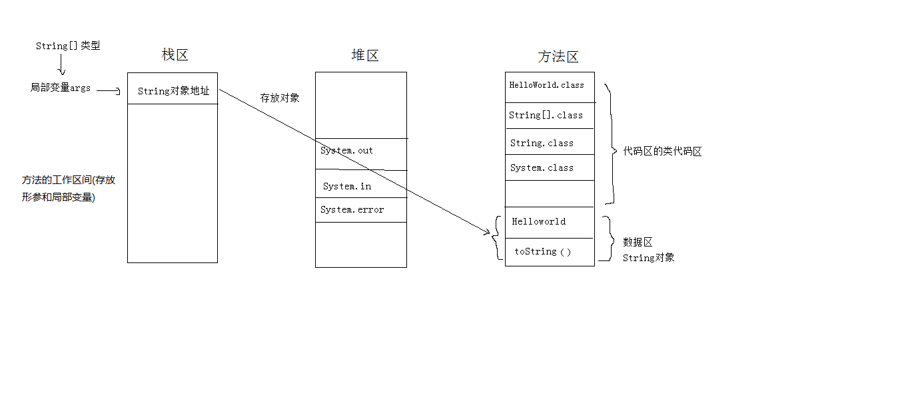
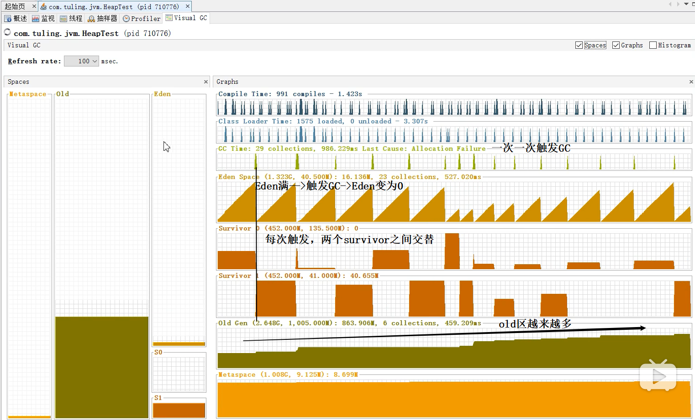

### Java启动main函数执行Hello World的整个详细过程？

分析内存图：

HelloWorld的具体执行过程：

1. 执行HelloWorld.java文件，**生成HelloWorld.class字节码文件；**

2. 虚拟机执行HelloWorld.class，将这个**类加载**到内存中(即方法区的类代码区中)；

3. 虚拟机通过类找到HelloWorld的**主方法**(程序的入口方法)，访问权限为public（公有可用），虚拟机**传递String[]**(字符串数组对象：空数组)类型参数的地址到主方法的args中去，并在栈区为args开辟内存空间，返回一个void的返回值；
4. 定义一个String(标准类库中的)类型的变量(在**栈区**开辟空间)s，s的值不确定(垃圾值，编译无法通过)；
5. s = “Hello World!”，对象“Hello World!”**在方法区的常量数据区开辟空间**，属性即为：Hello World!方法即为：toString()，变量s存放对象“Hello World!”的地址；
6. 虚拟机找到标准类库中的**System.class类并加载到内存中**(即方法区的类代码区中)，System.out为标准字节输出流对象()，并调用println()方法将变量s的值打印到屏幕上。

 

PS: 虚拟机调用主方法时会创建三个默认对象：System.out(标准字节输出流对象)、System.in(标准字节输入流对象)和System.error(标准字节出错流对象).

以上共涉及：

1个java文件：HelloWorld.java

4个class类： HelloWorld.class、String[].class、String.class、System.class

5个对象： “Hello World!”、String[]、System.out、System.in、System.error

2个变量：args、s

3个方法：main()、toString()、println()


#### 一个实例，完全搞懂GC内存流转

```java
public class HeapTest{
   byte[] a=new byte[1024*100];  //100kB
   public static void main(String[] args) throws InterruptedException {
       /*main中的局部变量heapTests在线程main栈帧中的局部变量表，指向heap中的heapTest对象。
       heapTest又指向所有添加的new HeapTest()对象，每个对象占100kB
       也就是说：所有对象都可达，没办法被GC回收，full GC也收不回，最终OOM*/
       ArrayList<HeapTest> heapTests=new ArrayList<>();
       
       while(true){
           //每隔10ms，添加一次100kB的数据块
           heapTests.add(new HeapTest());  //这些HeapTest都能通过heapTests调用到
           Thread.sleep(10);
      }
  }
}
```

使用jdk的jvisualvm工具，安装Visual GC插件：



最终：Exception in thread "main" java.lang.OutOfMemoryError: Java heap space