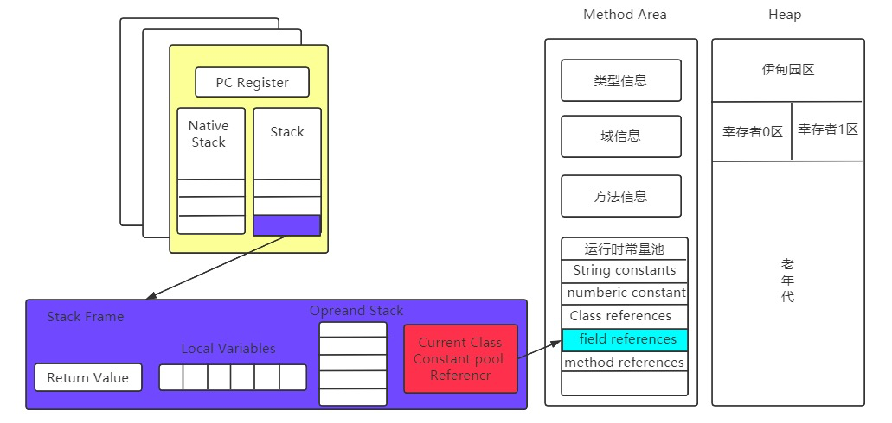
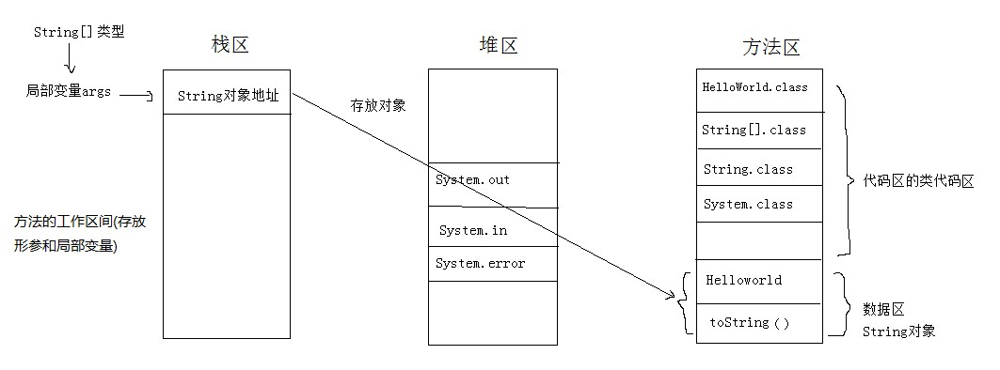

# JVM内存区域

## 程序计数器

作用：

1. 字节码解释器通过改变程序计数器来依次读取指令，从而实现代码的流程控制，如：顺序执行、选择、循环、异常处理。

2. 在多线程的情况下，程序计数器用于记录当前线程执行的位置，从而当线程被切换回来的时候能够知道该线程上次运行到哪儿了。

程序计数器是**唯一一个不会出现** **OutOfMemoryError** **的内存区域**，它的生命周期随着线程的创建而创建，随着线程的结束而死亡。


## 线程栈

### 动态连接

[JVM里的符号引用如何存储](https://www.zhihu.com/question/30300585)



**动态链接：指向运行时常量池中该栈帧所属方法的引用-符号引用。**

**类加载的解析阶段：**根据指令去把运行时常量池中的“**符号引用**”。之后根据这些信息去对应**类的方法表**里寻找对应的方法，得到**方法表的偏移量（指针），这个偏移量（指针）就是“直接引用”**。 **注意解析阶段是静态连接**

**符号引用包括：1.类的全限定名，2.字段名和属性，3.方法名和属性**


#### 方法调用/静态连接和动态连接

**[方法调用](https://blog.csdn.net/xyh930929/article/details/84067186)**

所有方法调用中的目标方法在Class文件里面都是一个常量池中的符号引用，**在类加载的解析阶段**，会将其中的一部分符号引用转化为直接引用，这种转化称为**静态连接或静态解析**。这种解析能成立的前提是：方法在程序真正运行之前就有一个可确定的调用版本，并且这个方法的调用版本在运行期是不可改变的。换句话说，调用目标在程序代码写好、编译器进行编译时就必须确定下来。另一部分将在每一次运行期间转化为直接引用，这部分称为**动态连接**。

**有哪些方法是静态连接呢？**

**不可能通过继承或别的方式重写其他版本的方法：**

静态方法与类型直接关联，私有方法不能被子类调用，final方法不能被重写，实例构造器方法不能被重写。这些方法被成为非虚方法。

其他方法都称之为虚方法，都有可能被重写。

与之相对应的是，在Java虚拟机里面提供了5条方法调用字节码指令，分别如下

```java
前两种在解析阶段能确定下来，是静态解析：
invokestatic:调用静态方法。
invokespecial:调用实例构造器方法、私有方法和父类方法。
   
后面三种会进行动态选择：    
invokevirtual:调用所有的虚方法
invokeinterface:调用接口方法,会在运行时再确定一个实现此接口的对象。
invokedynamic:先在运行时动态解析出调用点限定符所引用的方法,然后再执行该方法,在此之前的4条调用指令,分派逻辑是固化在Java虚拟机内部的,而- - invokedynamic指令的分派逻辑是由用户所设定的引导方法决定的。
```

由于动态分派是非常频繁的动作，而且动态分派的方法版本选择过程需要运行时在类的方法元数据中搜索合适的目标方法，因此在虚拟机的实际实现中基于性能的考虑，大部分实现都不会真正地进行如此频繁的搜索。面对这种情况，最常用的“稳定优化”手段就是为类在方法区中建立一个**虚方法表**(Vritual Method Table，也称为vtable，与此对应的，在invokeinterface执行时也会用到接口方法表——Inteface Method Table，简称itable)，使用虚方法表索引来代替元数据查找以提高性能。

虚方法表中存放着各个方法的实际入口地址。**如果某个方法在子类中没有被重写,那子类的虚方法表里面的地址入口和父类相同方法的地址入口是一致的，都指向父类的实现入口。如果子类中重写了这个方法，子类方法表中的地址将会替换为指向子类实现版本的入口地址。**


### Java启动main函数执行Hello World的整个详细过程？

分析内存图：

HelloWorld的具体执行过程：

1. 执行HelloWorld.java文件，**生成HelloWorld.class字节码文件；**

2. 虚拟机执行HelloWorld.class，将这个**类加载**到内存中(即方法区的类代码区中)；

3. 虚拟机通过类找到HelloWorld的**主方法**(程序的入口方法)，访问权限为public（公有可用），虚拟机**传递String[]**(字符串数组对象：空数组)类型参数的地址到主方法的args中去，并在栈区为args开辟内存空间，返回一个void的返回值；
4. 定义一个String(标准类库中的)类型的变量(在**栈区**开辟空间)s，s的值不确定(垃圾值，编译无法通过)；
5. s = “Hello World!”，对象“Hello World!”**在方法区的常量数据区开辟空间**，属性即为：Hello World!方法即为：toString()，变量s存放对象“Hello World!”的地址；
6. 虚拟机找到标准类库中的**System.class类并加载到内存中**(即方法区的类代码区中)，System.out为标准字节输出流对象()，并调用println()方法将变量s的值打印到屏幕上。

 

PS: 虚拟机调用主方法时会创建三个默认对象：System.out(标准字节输出流对象)、System.in(标准字节输入流对象)和System.error(标准字节出错流对象).

以上共涉及：

1个java文件：HelloWorld.java

4个class类： HelloWorld.class、String[].class、String.class、System.class

5个对象： “Hello World!”、String[]、System.out、System.in、System.error

2个变量：args、s

3个方法：main()、toString()、println()


#### 一个实例，完全搞懂GC内存流转

```java
public class HeapTest{
   byte[] a=new byte[1024*100];  //100kB
   public static void main(String[] args) throws InterruptedException {
       /*main中的局部变量heapTests在线程main栈帧中的局部变量表，指向heap中的heapTest对象。
       heapTest又指向所有添加的new HeapTest()对象，每个对象占100kB
       也就是说：所有对象都可达，没办法被GC回收，full GC也收不回，最终OOM*/
       ArrayList<HeapTest> heapTests=new ArrayList<>();
       
       while(true){
           //每隔10ms，添加一次100kB的数据块
           heapTests.add(new HeapTest());  //这些HeapTest都能通过heapTests调用到
           Thread.sleep(10);
      }
  }
}
```

使用jdk的jvisualvm工具，安装Visual GC插件：


最终：Exception in thread "main" java.lang.OutOfMemoryError: Java heap space