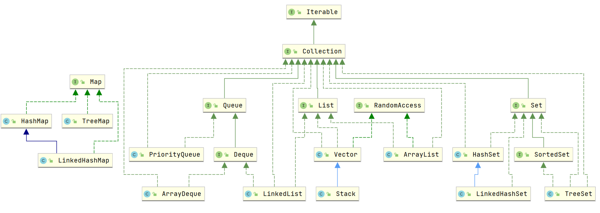

# Java 集合概览



### 为什么要使用集合？

当我们需要保存一组类型相同的数据的时候，我们应该是用一个容器来保存，这个容器就是数组，但是，使用数组存储对象具有一定的弊端，
因为我们在实际开发中，存储的数据的类型是多种多样的，于是，就出现了“集合”，集合同样也是用来存储多个数据的。

数组的缺点是一旦声明之后，长度就不可变了；同时，声明数组时的数据类型也决定了该数组存储的数据的类型；而且，数组存储的数据是有序的、可重复的，特点单一。
但是集合提高了数据存储的灵活性，Java 集合不仅可以用来存储不同类型不同数量的对象，还可以保存具有映射关系的数据。

### 说说 List,Set,Map 三者的区别？

- `List`(对付顺序的好帮手)： 存储的元素是有序的、可重复的。
- `Set`(注重独一无二的性质): 存储的元素是无序的、不可重复的。
- `Map`(用 Key 来搜索的专家): 使用键值对（kye-value）存储，类似于数学上的函数 y=f(x)，“x”代表 key，"y"代表 value，Key 是无序的、不可重复的，value 是无序的、可重复的，每个键最多映射到一个值。

###  集合框架底层数据结构总结

先来看一下 `Collection` 接口下面的集合。

#### List

- `Arraylist`： `Object[]`数组
- `Vector`：`Object[]`数组
- `LinkedList`： 双向链表(JDK1.6 之前为循环链表，JDK1.7 取消了循环)

#### Set

- `HashSet`（无序，唯一）: 基于 `HashMap` 实现的，底层采用 `HashMap` 来保存元素
- `LinkedHashSet`：`LinkedHashSet` 是 `HashSet` 的子类，并且其内部是通过 `LinkedHashMap` 来实现的。有点类似于我们之前说的 `LinkedHashMap` 其内部是基于 `HashMap` 实现一样，不过还是有一点点区别的
- `TreeSet`（有序，唯一）： 红黑树(自平衡的排序二叉树)

再来看看 `Map` 接口下面的集合。

#### Map

- `HashMap`： JDK1.8 之前 `HashMap` 由数组+链表组成的，数组是 `HashMap` 的主体，链表则是主要为了解决哈希冲突而存在的（“拉链法”解决冲突）。JDK1.8 以后在解决哈希冲突时有了较大的变化，当链表长度大于阈值（默认为 8）（将链表转换成红黑树前会判断，如果当前数组的长度小于 64，那么会选择先进行数组扩容，而不是转换为红黑树）时，将链表转化为红黑树，以减少搜索时间
- `LinkedHashMap`： `LinkedHashMap` 继承自 `HashMap`，所以它的底层仍然是基于拉链式散列结构即由数组和链表或红黑树组成。另外，`LinkedHashMap` 在上面结构的基础上，增加了一条双向链表，使得上面的结构可以保持键值对的插入顺序。同时通过对链表进行相应的操作，实现了访问顺序相关逻辑。
- `Hashtable`： 数组+链表组成的，数组是 `HashMap` 的主体，链表则是主要为了解决哈希冲突而存在的
- `TreeMap`： 红黑树（自平衡的排序二叉树）

#### 双向链表和双向循环链表

**双向链表：** 包含两个指针，一个 prev 指向前一个节点，一个 next 指向后一个节点。

> 另外推荐一篇把双向链表讲清楚的文章：[https://juejin.im/post/5b5d1a9af265da0f47352f14](https://juejin.im/post/5b5d1a9af265da0f47352f14)

**双向循环链表：** 最后一个节点的 next 指向 head，而 head 的 prev 指向最后一个节点，构成一个环。


#### RandomAccess 接口

```java
public interface RandomAccess {
}
```

查看源码我们发现实际上 `RandomAccess` 接口中什么都没有定义。所以，在我看来 `RandomAccess` 接口不过是一个标识罢了。标识什么？ 标识实现这个接口的类具有随机访问功能。

在 `binarySearch（)` 方法中，它要判断传入的 list 是否 `RamdomAccess` 的实例，如果是，调用`indexedBinarySearch()`方法，如果不是，那么调用`iteratorBinarySearch()`方法

```java
    public static <T>
    int binarySearch(List<? extends Comparable<? super T>> list, T key) {
        if (list instanceof RandomAccess || list.size()<BINARYSEARCH_THRESHOLD)
            return Collections.indexedBinarySearch(list, key);
        else
            return Collections.iteratorBinarySearch(list, key);
    }
```

`ArrayList` 实现了 `RandomAccess` 接口， 而 `LinkedList` 没有实现。为什么呢？我觉得还是和底层数据结构有关！`ArrayList` 底层是数组，而 `LinkedList` 底层是链表。数组天然支持随机访问，时间复杂度为 O(1)，所以称为快速随机访问。链表需要遍历到特定位置才能访问特定位置的元素，时间复杂度为 O(n)，所以不支持快速随机访问。，`ArrayList` 实现了 `RandomAccess` 接口，就表明了他具有快速随机访问功能。 `RandomAccess` 接口只是标识，并不是说 `ArrayList` 实现 `RandomAccess` 接口才具有快速随机访问功能的！

### 如何选用集合?

主要根据集合的特点来选用，比如我们需要根据键值获取到元素值时就选用 `Map` 接口下的集合，需要排序时选择 `TreeMap`,不需要排序时就选择 `HashMap`,需要保证线程安全就选用 `ConcurrentHashMap`。

当我们只需要存放元素值时，就选择实现`Collection` 接口的集合，需要保证元素唯一时选择实现 `Set` 接口的集合比如 `TreeSet` 或 `HashSet`，不需要就选择实现 `List` 接口的比如 `ArrayList` 或 `LinkedList`，然后再根据实现这些接口的集合的特点来选用。


### 不要在 foreach 循环里进行元素的 remove/add 操作

> 有待继续总结 迭代器失效？

如果要进行`remove`操作，可以调用迭代器的 `remove `方法而不是集合类的 remove 方法。因为如果列表在任何时间从结构上修改创建迭代器之后，以任何方式除非通过迭代器自身`remove/add`方法，迭代器都将抛出一个`ConcurrentModificationException`,这就是单线程状态下产生的 **fail-fast 机制**。

> **fail-fast 机制** ：多个线程对 fail-fast 集合进行修改的时，可能会抛出ConcurrentModificationException，单线程下也会出现这种情况，上面已经提到过。

Java8开始，可以使用`Collection#removeIf()`方法删除满足特定条件的元素,如

``` java
List<Integer> list = new ArrayList<>();
for (int i = 1; i <= 10; ++i) {
    list.add(i);
}
list.removeIf(filter -> filter % 2 == 0); /* 删除list中的所有偶数 */
System.out.println(list); /* [1, 3, 5, 7, 9] */
```

`java.util`包下面的所有的集合类都是fail-fast的，而`java.util.concurrent`包下面的所有的类都是fail-safe的。


## Collections 工具类

Collections 工具类常用方法:

1. 排序
2. 查找,替换操作
3. 同步控制(不推荐，需要线程安全的集合类型时请考虑使用 JUC 包下的并发集合)

### 排序操作

```java
void reverse(List list)//反转
void shuffle(List list)//随机排序
void sort(List list)//按自然排序的升序排序
void sort(List list, Comparator c)//定制排序，由Comparator控制排序逻辑
void swap(List list, int i , int j)//交换两个索引位置的元素
void rotate(List list, int distance)//旋转。当distance为正数时，将list后distance个元素整体移到前面。当distance为负数时，将 list的前distance个元素整体移到后面
```

### 查找,替换操作

```java
int binarySearch(List list, Object key)//对List进行二分查找，返回索引，注意List必须是有序的
int max(Collection coll)//根据元素的自然顺序，返回最大的元素。 类比int min(Collection coll)
int max(Collection coll, Comparator c)//根据定制排序，返回最大元素，排序规则由Comparatator类控制。类比int min(Collection coll, Comparator c)
void fill(List list, Object obj)//用指定的元素代替指定list中的所有元素。
int frequency(Collection c, Object o)//统计元素出现次数
int indexOfSubList(List list, List target)//统计target在list中第一次出现的索引，找不到则返回-1，类比int lastIndexOfSubList(List source, list target).
boolean replaceAll(List list, Object oldVal, Object newVal), 用新元素替换旧元素
```

### 同步控制

`Collections` 提供了多个`synchronizedXxx()`方法·，该方法可以将指定集合包装成线程同步的集合，从而解决多线程并发访问集合时的线程安全问题。

我们知道 `HashSet`，`TreeSet`，`ArrayList`,`LinkedList`,`HashMap`,`TreeMap` 都是线程不安全的。`Collections` 提供了多个静态方法可以把他们包装成线程同步的集合。

**最好不要用下面这些方法，效率非常低，需要线程安全的集合类型时请考虑使用 JUC 包下的并发集合。**

方法如下：

```java
synchronizedCollection(Collection<T>  c) //返回指定 collection 支持的同步（线程安全的）collection。
synchronizedList(List<T> list)//返回指定列表支持的同步（线程安全的）List。
synchronizedMap(Map<K,V> m) //返回由指定映射支持的同步（线程安全的）Map。
synchronizedSet(Set<T> s) //返回指定 set 支持的同步（线程安全的）set。
```


# List

## ArrayList

`ArrayList` 的底层是数组队列，相当于动态数组。它的线程安全版本是`CopyOnWriteArrayList`。

与 Java 中的数组相比，它的容量能动态增长。在添加大量元素前，应用程序可以使用`ensureCapacity`操作来增加 `ArrayList` 实例的容量。这可以减少递增式再分配的数量。

`ArrayList`继承于 **`AbstractList`** ，实现了 **`List`**, **`RandomAccess`**, **`Cloneable`**, **`java.io.Serializable`** 这些接口。

```java
public class ArrayList<E> extends AbstractList<E>
    implements List<E>, RandomAccess, Cloneable, java.io.Serializable{
}
```

- `RandomAccess` 是一个标志接口，表明实现这个这个接口的 List 集合是支持**快速随机访问**的。在 `ArrayList` 中，我们即可以通过元素的序号快速获取元素对象，这就是快速随机访问。
- `ArrayList` 实现了 **`Cloneable` 接口** ，即覆盖了函数`clone()`，能被克隆。
- `ArrayList` 实现了 `java.io.Serializable `接口，这意味着`ArrayList`支持序列化，能通过序列化去传输。

### Arraylist 和 Vector 的区别?

- `ArrayList` 是 `List` 的主要实现类，底层使用 `Object[]`存储，适用于频繁的查找工作，线程不安全 ；
- `Vector` 是 `List` 的古老实现类，底层使用` Object[]` 存储，线程安全的。

### Arraylist 与 LinkedList 区别?

1. **是否保证线程安全：** `ArrayList` 和 `LinkedList` 都是不同步的，也就是不保证线程安全；
2. **底层数据结构：** `Arraylist` 底层使用的是 **`Object` 数组**；`LinkedList` 底层使用的是 **双向链表** 数据结构（JDK1.6 之前为循环链表，JDK1.7 取消了循环。注意双向链表和双向循环链表的区别，下面有介绍到！）
3. **插入和删除是否受元素位置的影响：** ① **`ArrayList` 采用数组存储，所以插入和删除元素的时间复杂度受元素位置的影响。** 比如：执行`add(E e)`方法的时候， `ArrayList` 会默认在将指定的元素追加到此列表的末尾，这种情况时间复杂度就是 O(1)。但是如果要在指定位置 i 插入和删除元素的话（`add(int index, E element)`）时间复杂度就为 O(n-i)。因为在进行上述操作的时候集合中第 i 和第 i 个元素之后的(n-i)个元素都要执行向后位/向前移一位的操作。 ② **`LinkedList` 采用链表存储，所以对于`add(E e)`方法的插入，删除元素时间复杂度不受元素位置的影响，近似 O(1)，如果是要在指定位置`i`插入和删除元素的话（`(add(int index, E element)`） 时间复杂度近似为`o(n))`因为需要先移动到指定位置再插入。**
4. **是否支持快速随机访问：** `LinkedList` 不支持高效的随机元素访问，而 `ArrayList` 支持。快速随机访问就是通过元素的序号快速获取元素对象(对应于`get(int index)`方法)。
5. **内存空间占用：** ArrayList 的空间浪费主要体现在在 list 列表的结尾会预留一定的容量空间，而 LinkedList 的空间花费则体现在它的每一个元素都需要消耗比 ArrayList 更多的空间（因为要存放直接后继和直接前驱以及数据）。

### Arraylist源码分析

```java
public class ArrayList<E> extends AbstractList<E>
        implements List<E>, RandomAccess, Cloneable, java.io.Serializable{
      private static final long serialVersionUID = 8683452581122892189L;

    //默认初始容量大小
    private static final int DEFAULT_CAPACITY = 10;
    //空数组（用于空实例）。
    private static final Object[] EMPTY_ELEMENTDATA = {};
    //用于默认大小空实例的共享空数组实例。
    //我们把它从EMPTY_ELEMENTDATA数组中区分出来，以知道在添加第一个元素时容量需要增加多少。
    private static final Object[] DEFAULTCAPACITY_EMPTY_ELEMENTDATA = {};
    // 保存ArrayList数据的数组
    transient Object[] elementData; // non-private to simplify nested class access
    private int size;

    /**
     * 带初始容量参数的构造函数（用户可以在创建ArrayList对象时自己指定集合的初始大小）
     */
    public ArrayList(int initialCapacity) {
        if (initialCapacity > 0) {
            //如果传入的参数大于0，创建initialCapacity大小的数组
            this.elementData = new Object[initialCapacity];
        } else if (initialCapacity == 0) {
            //如果传入的参数等于0，创建空数组
            this.elementData = EMPTY_ELEMENTDATA;
        } else {
            //其他情况，抛出异常
            throw new IllegalArgumentException("Illegal Capacity: "+
                                               initialCapacity);
        }
    }

    /**
     *默认无参构造函数
     *DEFAULTCAPACITY_EMPTY_ELEMENTDATA 为0.初始化为10，也就是说初始其实是空数组 当添加第一个元素的时候数组容量才变成10
     */
    public ArrayList() {
        this.elementData = DEFAULTCAPACITY_EMPTY_ELEMENTDATA;
    }
}
```

空构造器，DEFAULTCAPACITY_EMPTY_ELEMENTDATA 为0，初始化为10，也就是说初始其实是空数组，当添加第一个元素的时候数组容量才变成10。

扩容：`int newCapacity = oldCapacity + (oldCapacity >> 1);`，扩容之后变为原来的1.5倍。

扩容时采用大量`System.arraycopy()` 和 `Arrays.copyOf()`方法。

```java
public static native void arraycopy(Object src,  int  srcPos, Object dest, 
                                    int destPos,int length);
```

```java
public static <T> T[] copyOf(T[] original, int newLength);
```

`Arrays.copyOf()`内部调用的是`System.arraycopy()` ，把目标数组返回给了调用放。

提供了`ensureCapacity`方法，在向 ArrayList 添加大量元素之前可以先使用`ensureCapacity` 方法，以减少扩容次数。


## LinkedList

**LinkedList是一个实现了List接口和Deque接口的双端链表。** 
LinkedList底层的链表结构使它支持高效的插入和删除操作，另外它实现了Deque接口，使得LinkedList类也具有队列的特性。
LinkedList不是线程安全的，如果想使LinkedList变成线程安全的，可以调用静态类Collections类中的synchronizedList方法： 

```java
List list = Collections.synchronizedList(new LinkedList(...));
```

更高效的方式是使用`ConcurrentLinkedQueue`。


**LinkedList是双向链表：**

```java
private static class Node<E> {
    E item;//节点值
    Node<E> next;//后继节点
    Node<E> prev;//前驱节点
}
```


很多添加删除获取首尾节点的方法都继承自Deque，抛出异常的情况和Deque相同：

名称中含有remove()、get()，addd()的如果是null，会抛出NoSuchElementException。其余含有poll，peek，pop的如果是null，就返回null。


# Set


### 无序性和不可重复性的含义是什么

1、什么是无序性？无序性不等于随机性 ，无序性是指存储的数据在底层数组中并非按照数组索引的顺序添加 ，而是根据数据的哈希值决定的。

2、什么是不可重复性？不可重复性是指添加的元素按照 equals()判断时 ，返回 false，需要同时重写 equals()方法和 HashCode()方法。

### 比较 HashSet、LinkedHashSet 和 TreeSet 三者的异同

`HashSet` 是 `Set` 接口的主要实现类 ，`HashSet` 的底层是 `HashMap`，线程不安全的，可以存储 null 值；

`LinkedHashSet` 是 `HashSet` 的子类，能够按照添加的顺序遍历；

`TreeSet` 底层使用红黑树，能够按照添加元素的顺序进行遍历，排序的方式有自然排序和定制排序。


# Queue

## Deque

The twelve methods described above are summarized in the following table:

|             | **First Element (Head)**                                     | **Last Element (Tail)**                                      |                                                              |                                                              |
| ----------- | ------------------------------------------------------------ | ------------------------------------------------------------ | ------------------------------------------------------------ | ------------------------------------------------------------ |
|             | *Throws exception*                                           | *Special value*                                              | *Throws exception*                                           | *Special value*                                              |
| **Insert**  | [`addFirst(e)`](https://docs.oracle.com/javase/8/docs/api/java/util/Deque.html#addFirst-E-) | [`offerFirst(e)`](https://docs.oracle.com/javase/8/docs/api/java/util/Deque.html#offerFirst-E-) | [`addLast(e)`](https://docs.oracle.com/javase/8/docs/api/java/util/Deque.html#addLast-E-) | [`offerLast(e)`](https://docs.oracle.com/javase/8/docs/api/java/util/Deque.html#offerLast-E-) |
| **Remove**  | [`removeFirst()`](https://docs.oracle.com/javase/8/docs/api/java/util/Deque.html#removeFirst--) | [`pollFirst()`](https://docs.oracle.com/javase/8/docs/api/java/util/Deque.html#pollFirst--) | [`removeLast()`](https://docs.oracle.com/javase/8/docs/api/java/util/Deque.html#removeLast--) | [`pollLast()`](https://docs.oracle.com/javase/8/docs/api/java/util/Deque.html#pollLast--) |
| **Examine** | [`getFirst()`](https://docs.oracle.com/javase/8/docs/api/java/util/Deque.html#getFirst--) | [`peekFirst()`](https://docs.oracle.com/javase/8/docs/api/java/util/Deque.html#peekFirst--) | [`getLast()`](https://docs.oracle.com/javase/8/docs/api/java/util/Deque.html#getLast--) | [`peekLast()`](https://docs.oracle.com/javase/8/docs/api/java/util/Deque.html#peekLast--) |

名称中含有remove()、get()，addd()的如果是null，会抛出NoSuchElementException。其余含有poll，peek，pop的如果是null，就返回null。

This interface extends the [`Queue`](https://docs.oracle.com/javase/8/docs/api/java/util/Queue.html) interface. When a deque is used as a queue, FIFO (First-In-First-Out) behavior results. Elements are added at the end of the deque and removed from the beginning. The methods inherited from the `Queue` interface are precisely equivalent to `Deque` methods as indicated in the following table:

| **`Queue` Method**                                           | **Equivalent `Deque` Method**                                |
| ------------------------------------------------------------ | ------------------------------------------------------------ |
| [`add(e)`](https://docs.oracle.com/javase/8/docs/api/java/util/Queue.html#add-E-) | [`addLast(e)`](https://docs.oracle.com/javase/8/docs/api/java/util/Deque.html#addLast-E-) |
| [`offer(e)`](https://docs.oracle.com/javase/8/docs/api/java/util/Queue.html#offer-E-) | [`offerLast(e)`](https://docs.oracle.com/javase/8/docs/api/java/util/Deque.html#offerLast-E-) |
| [`remove()`](https://docs.oracle.com/javase/8/docs/api/java/util/Queue.html#remove--) | [`removeFirst()`](https://docs.oracle.com/javase/8/docs/api/java/util/Deque.html#removeFirst--) |
| [`poll()`](https://docs.oracle.com/javase/8/docs/api/java/util/Queue.html#poll--) | [`pollFirst()`](https://docs.oracle.com/javase/8/docs/api/java/util/Deque.html#pollFirst--) |
| [`element()`](https://docs.oracle.com/javase/8/docs/api/java/util/Queue.html#element--) | [`getFirst()`](https://docs.oracle.com/javase/8/docs/api/java/util/Deque.html#getFirst--) |
| [`peek()`](https://docs.oracle.com/javase/8/docs/api/java/util/Queue.html#peek--) | [`peekFirst()`](https://docs.oracle.com/javase/8/docs/api/java/util/Deque.html#peek--) |

左边的这些方法Deque也都有，含义和右边的方法相同，用左边和右边都行。

Deques can also be used as LIFO (Last-In-First-Out) stacks. This interface should be used in preference to the legacy [`Stack`](https://docs.oracle.com/javase/8/docs/api/java/util/Stack.html) class. When a deque is used as a stack, elements are pushed and popped from the beginning of the deque. Stack methods are precisely equivalent to `Deque` methods as indicated in the table below:

| **Stack Method**                                             | **Equivalent `Deque` Method**                                |
| ------------------------------------------------------------ | ------------------------------------------------------------ |
| [`push(e)`](https://docs.oracle.com/javase/8/docs/api/java/util/Deque.html#push-E-) | [`addFirst(e)`](https://docs.oracle.com/javase/8/docs/api/java/util/Deque.html#addFirst-E-) |
| [`pop()`](https://docs.oracle.com/javase/8/docs/api/java/util/Deque.html#pop--) | [`removeFirst()`](https://docs.oracle.com/javase/8/docs/api/java/util/Deque.html#removeFirst--) |
| [`peek()`](https://docs.oracle.com/javase/8/docs/api/java/util/Deque.html#peek--) | [`peekFirst()`](https://docs.oracle.com/javase/8/docs/api/java/util/Deque.html#peekFirst--) |

Note that the [`peek`](https://docs.oracle.com/javase/8/docs/api/java/util/Deque.html#peek--) method works equally well when a deque is used as a queue or a stack; in either case, elements are drawn from the beginning of the deque.


# List和Array的相互转换

## 如何正确的将数组转换为ArrayList?

stackoverflow：https://dwz.cn/vcBkTiTW

**1. 自己动手实现（教育目的）**

```java
//JDK1.5+
static <T> List<T> arrayToList(final T[] array) {
  final List<T> l = new ArrayList<T>(array.length);

  for (final T s : array) {
    l.add(s);
  }
  return l;
}
```

```java
Integer [] myArray = { 1, 2, 3 };
System.out.println(arrayToList(myArray).getClass());//class java.util.ArrayList
```

**2. 最简便的方法(推荐)**

```java
List list = new ArrayList<>(Arrays.asList("a", "b", "c"))
```

**3. 使用 Java8 的Stream(推荐)**

```java
Integer [] myArray = { 1, 2, 3 };
List myList = Arrays.stream(myArray).collect(Collectors.toList());
//基本类型也可以实现转换（依赖boxed的装箱操作）
int [] myArray2 = { 1, 2, 3 };
List myList = Arrays.stream(myArray2).boxed().collect(Collectors.toList());
```

**4. 使用 Guava(推荐)**

对于不可变集合，你可以使用[`ImmutableList`](https://github.com/google/guava/blob/master/guava/src/com/google/common/collect/ImmutableList.java)类及其[`of()`](https://github.com/google/guava/blob/master/guava/src/com/google/common/collect/ImmutableList.java#L101)与[`copyOf()`](https://github.com/google/guava/blob/master/guava/src/com/google/common/collect/ImmutableList.java#L225)工厂方法：（参数不能为空）

```java
List<String> il = ImmutableList.of("string", "elements");  // from varargs
List<String> il = ImmutableList.copyOf(aStringArray);      // from array
```

对于可变集合，你可以使用[`Lists`](https://github.com/google/guava/blob/master/guava/src/com/google/common/collect/Lists.java)类及其[`newArrayList()`](https://github.com/google/guava/blob/master/guava/src/com/google/common/collect/Lists.java#L87)工厂方法：

```java
List<String> l1 = Lists.newArrayList(anotherListOrCollection);    // from collection
List<String> l2 = Lists.newArrayList(aStringArray);               // from array
List<String> l3 = Lists.newArrayList("or", "string", "elements"); // from varargs
```

**5. 使用 Apache Commons Collections**

```java
List<String> list = new ArrayList<String>();
CollectionUtils.addAll(list, str);
```

**6. 使用 Java9 的 `List.of()`方法**

``` java
Integer[] array = {1, 2, 3};
List<Integer> list = List.of(array);
System.out.println(list); /* [1, 2, 3] */
/* 不支持基本数据类型 */
```


### Arrays.asList()使用指南

最近使用`Arrays.asList()`遇到了一些坑，然后在网上看到这篇文章：[Java Array to List Examples](http://javadevnotes.com/java-array-to-list-examples) 感觉挺不错的，但是还不是特别全面。所以，自己对于这块小知识点进行了简单的总结。

#### 简介

`Arrays.asList()`在平时开发中还是比较常见的，我们可以使用它将一个数组转换为一个List集合。

```java
String[] myArray = {"Apple", "Banana", "Orange"};
List<String> myList = Arrays.asList(myArray);
//上面两个语句等价于下面一条语句
List<String> myList = Arrays.asList("Apple","Banana", "Orange");
```

JDK 源码对于这个方法的说明：

```java
/**
  *返回由指定数组支持的固定大小的列表。此方法作为基于数组和基于集合的API之间的桥梁，
  * 与 Collection.toArray()结合使用。返回的List是可序列化并实现RandomAccess接口。
  */
public static <T> List<T> asList(T... a) {
    return new ArrayList<>(a);
}
```

#### 使用时的注意事项

##### 1. 使用集合的修改方法:`add()`、`remove()`、`clear()`会抛出异常。

**《阿里巴巴Java 开发手册》对其的描述**

`Arrays.asList()`将数组转换为集合后,底层其实还是数组，《阿里巴巴Java 开发手册》对于这个方法有如下描述：

方法.png)

`Arrays.asList()` 方法返回的并不是 `java.util.ArrayList` ，而是 `java.util.Arrays` 的一个内部类,这个内部类并没有实现集合的修改方法或者说并没有重写这些方法。

```java
List myList = Arrays.asList(1, 2, 3);
System.out.println(myList.getClass());//class java.util.Arrays$ArrayList
```

下图是`java.util.Arrays$ArrayList`的简易源码，我们可以看到这个类重写的方法有哪些。

```java
  private static class ArrayList<E> extends AbstractList<E>
        implements RandomAccess, java.io.Serializable
    {
        ...

        @Override
        public E get(int index) {
          ...
        }

        @Override
        public E set(int index, E element) {
          ...
        }

        @Override
        public int indexOf(Object o) {
          ...
        }

        @Override
        public boolean contains(Object o) {
           ...
        }

        @Override
        public void forEach(Consumer<? super E> action) {
          ...
        }

        @Override
        public void replaceAll(UnaryOperator<E> operator) {
          ...
        }

        @Override
        public void sort(Comparator<? super E> c) {
          ...
        }
    }
```

我们再看一下`java.util.AbstractList`的`remove()`方法，这样我们就明白为啥会抛出`UnsupportedOperationException`。

```java
public E remove(int index) {
    throw new UnsupportedOperationException();
}
```

##### 2. 传递的数组必须是对象数组，而不是基本类型。

`Arrays.asList()`是泛型方法，传入的对象必须是对象数组。

```java
int[] myArray = {1, 2, 3};
List myList = Arrays.asList(myArray);
System.out.println(myList.size());//1
System.out.println(myList.get(0));//数组地址值
System.out.println(myList.get(1));//报错：ArrayIndexOutOfBoundsException
int[] array = (int[]) myList.get(0);
System.out.println(array[0]);//1
```

当传入一个原生数据类型数组时，`Arrays.asList()` 的真正得到的参数不是数组中的元素，而是数组对象本身！此时List 的唯一元素就是这个数组，这也就解释了上面的代码。

我们使用包装类型数组就可以解决这个问题。

```java
Integer[] myArray = {1, 2, 3};
```


## Collection.toArray()方法使用的坑&如何反转数组

该方法是一个泛型方法：`<T> T[] toArray(T[] a);` 如果`toArray`方法中没有传递任何参数的话返回的是`Object`类型数组。

```java
String [] s= new String[]{
    "dog", "lazy", "a", "over", "jumps", "fox", "brown", "quick", "A"
};
List<String> list = Arrays.asList(s);
Collections.reverse(list);
s=list.toArray(new String[0]);//没有指定类型的话会报错
```

由于JVM优化，`new String[0]`作为`Collection.toArray()`方法的参数现在使用更好，`new String[0]`就是起一个模板的作用，指定了返回数组的类型，0是为了节省空间，因为它只是为了说明返回的类型。详见：<https://shipilev.net/blog/2016/arrays-wisdom-ancients/>

