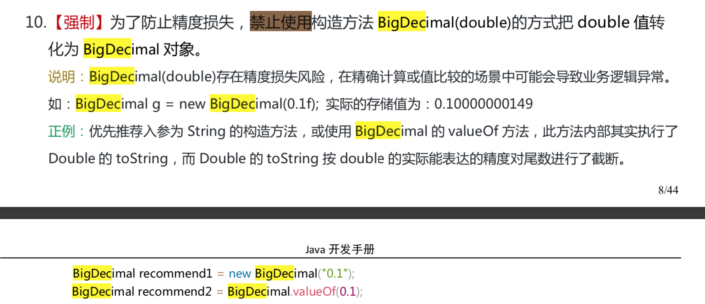

# 基本数据类型

| 基本类型 | 位数 | 字节 | 默认值  |
| :------- | :--- | :--- | ------- |
| int      | 32   | 4    | 0       |
| short    | 16   | 2    | 0       |
| long     | 64   | 8    | 0L      |
| byte     | 8    | 1    | 0       |
| char     | 16   | 2    | 'u0000' |
| float    | 32   | 4    | 0f      |
| double   | 64   | 8    | 0d      |
| boolean  | 1    |      | false   |

注意：Java 里使用 long 类型的数据一定要在数值后面加上 **L**，否则将作为整型解析。


# 包装类

**Java 基本类型的包装类的大部分都实现了常量池技术，即 Byte,Short,Integer,Long,Character,Boolean；前面 4 种包装类默认创建了数值[-128，127] 的相应类型的缓存数据，Character 创建了数值在[0,127]范围的缓存数据，Boolean 直接返回 True Or False。如果超出对应范围仍然会去创建新的对象。** 


### 整型包装类值的比较

==**所有整型包装类对象值的比较必须使用equals方法。**==

先看下面这个例子：

```java
Integer x = 3;
Integer y = 3;
System.out.println(x == y);// true
Integer a = new Integer(3);
Integer b = new Integer(3);
System.out.println(a == b);//false
System.out.println(a.equals(b));//true
```

当使用自动装箱方式创建一个Integer对象时，当数值在-128 ~127时，会将创建的 Integer 对象缓存起来，当下次再出现该数值时，直接从缓存中取出对应的Integer对象。所以上述代码中，x和y引用的是相同的Integer对象。	

**为啥把缓存设置为[-128，127]区间？性能和资源之间的权衡。**

```java
private static class CharacterCache {
    private CharacterCache(){}

    static final Character cache[] = new Character[127 + 1];
    static {
        for (int i = 0; i < cache.length; i++)
            cache[i] = new Character((char)i);
    }
}
```

**两种浮点数类型的包装类 Float,Double 并没有实现常量池技术。**

```java
Integer i1 = 33;
Integer i2 = 33;
System.out.println(i1 == i2);// 输出 true
Integer i11 = 333;
Integer i22 = 333;
System.out.println(i11 == i22);// 输出 false  如果要比较值，应该用equals()
Double i3 = 1.2;
Double i4 = 1.2;
System.out.println(i3 == i4);// 输出 false
```

**Integer 缓存源代码：**

```java
/**
*此方法将始终缓存-128 到 127（包括端点）范围内的值，并可以缓存此范围之外的其他值。
*/
    public static Integer valueOf(int i) {
        if (i >= IntegerCache.low && i <= IntegerCache.high)
            return IntegerCache.cache[i + (-IntegerCache.low)];
        return new Integer(i);
    }
```

**应用场景：**

1. Integer i1=40；Java 在编译的时候会直接将代码封装成 Integer i1=Integer.valueOf(40);，从而使用常量池中的对象。
2. Integer i1 = new Integer(40); 显式用new，这种情况下会创建新的对象。

```java
Integer i1 = 40;
Integer i2 = new Integer(40);
System.out.println(i1 == i2);   //输出 false
```

**Integer 比较更丰富的一个例子:**

```java
Integer i1 = 40;
Integer i2 = 40;
Integer i3 = 0;
Integer i4 = new Integer(40);
Integer i5 = new Integer(40);
Integer i6 = new Integer(0);

i1==i2   true
i1==i2+i3   true
i1==i4   false
i4==i5   false
i4==i5+i6   true
40==i5+i6   true
```

解释：

语句 i4 == i5 + i6，**因为+这个操作符不适用于 Integer 对象，首先 i5 和 i6 进行自动拆箱操作**，进行数值相加，即 i4 == 40。然后 Integer 对象无法与数值进行直接比较，所以 i4 自动拆箱转为 int 值 40，最终这条语句转为 40 == 40 进行数值比较。


#### 自动装箱与拆箱

- **装箱**：将基本类型用它们对应的引用类型包装起来；
- **拆箱**：将包装类型转换为基本数据类型；

更多内容见：[深入剖析 Java 中的装箱和拆箱](https://www.cnblogs.com/dolphin0520/p/3780005.html)


## BigDecimal

### BigDecimal 的用处

《阿里巴巴Java开发手册》中提到：**浮点数之间的等值判断，基本数据类型不能用==来比较，包装数据类型不能用 equals 来判断。** 具体原理和浮点数的编码方式有关，这里就不多提了，我们下面直接上实例：

```java
float a = 1.0f - 0.9f;
float b = 0.9f - 0.8f;
System.out.println(a);// 0.100000024
System.out.println(b);// 0.099999964
System.out.println(a == b);// false
```

具有基本数学知识的我们很清楚的知道输出并不是我们想要的结果（**精度丢失**），我们如何解决这个问题呢？一种很常用的方法是：**使用使用 BigDecimal 来定义浮点数的值，再进行浮点数的运算操作。**

```java
BigDecimal a = new BigDecimal("1.0");
BigDecimal b = new BigDecimal("0.9");
BigDecimal c = new BigDecimal("0.8");

BigDecimal x = a.subtract(b); 
BigDecimal y = b.subtract(c); 

System.out.println(x); /* 0.1 */
System.out.println(y); /* 0.1 */
System.out.println(Objects.equals(x, y)); /* true */
```

### BigDecimal 的大小比较

`a.compareTo(b)` : 返回 -1 表示 `a` 小于 `b`，0 表示 `a` 等于 `b` ， 1表示 `a` 大于 `b`。

```java
BigDecimal a = new BigDecimal("1.0");
BigDecimal b = new BigDecimal("0.9");
System.out.println(a.compareTo(b));// 1
```

### BigDecimal 保留几位小数

通过 `setScale`方法设置保留几位小数以及保留规则。保留规则有挺多种，不需要记，IDEA会提示。

```java
BigDecimal m = new BigDecimal("1.255433");
BigDecimal n = m.setScale(3,BigDecimal.ROUND_HALF_DOWN);
System.out.println(n);// 1.255
```

### BigDecimal 的使用注意事项

注意：我们在使用BigDecimal时，为了防止精度丢失，推荐使用它的 **BigDecimal(String)** 构造方法来创建对象。《阿里巴巴Java开发手册》对这部分内容也有提到如下图所示。



### 总结

BigDecimal 主要用来操作（大）浮点数，BigInteger 主要用来操作大整数（超过 long 类型）。

BigDecimal 的实现利用到了 BigInteger, 所不同的是 BigDecimal 加入了小数位的概念


# 基本数据类型与包装数据类型的使用标准

Reference:《阿里巴巴Java开发手册》

- 【强制】所有的 POJO 类属性必须使用包装数据类型。
- 【强制】RPC 方法的返回值和参数必须使用包装数据类型。
- 【推荐】所有的局部变量使用基本数据类型。

比如我们如果自定义了一个Student类,其中有一个属性是成绩score,如果用Integer而不用int定义,一次考试,学生可能没考,值是null,也可能考了,但考了0分,值是0,这两个表达的状态明显不一样.

**说明** :POJO 类属性没有初值是提醒使用者在需要使用时，必须自己显式地进行赋值，任何 NPE 问题(Null Pointer Exception)，或者入库检查，都由使用者来保证。

**正例** : 数据库的查询结果可能是 null，因为自动拆箱，用基本数据类型接收有 NPE 风险。

**反例** : 比如显示成交总额涨跌情况，即正负 x%，x 为基本数据类型，调用的 RPC 服务，调用不成功时，返回的是默认值，页面显示为 0%，这是不合理的，应该显示成中划线。所以包装数据类型的 null 值，能够表示额外的信息，如:远程调用失败，异常退出。