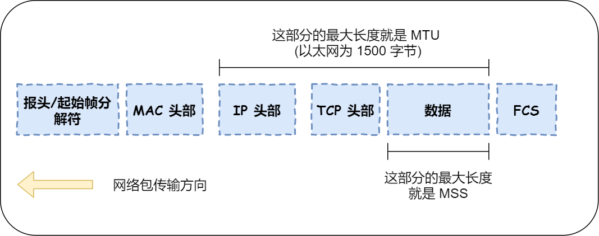
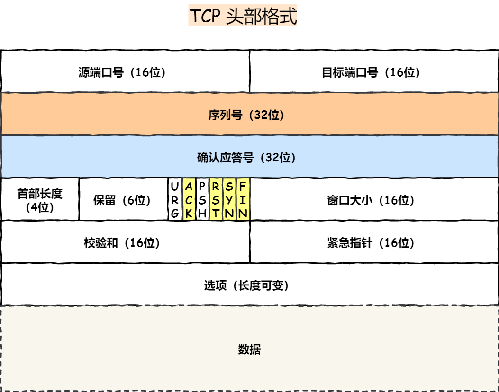
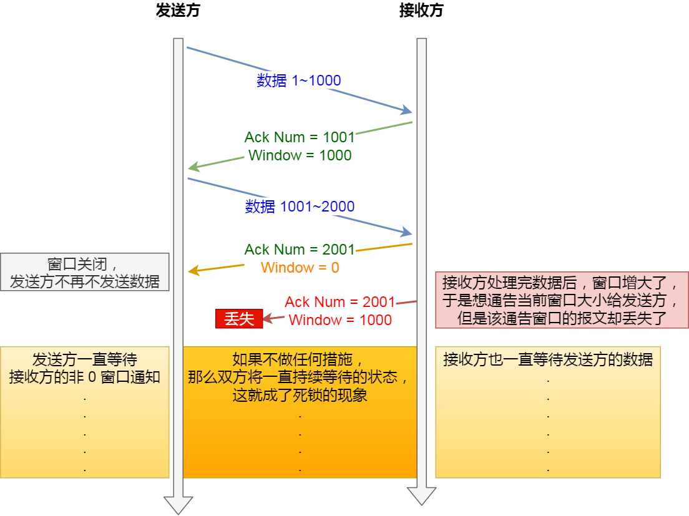
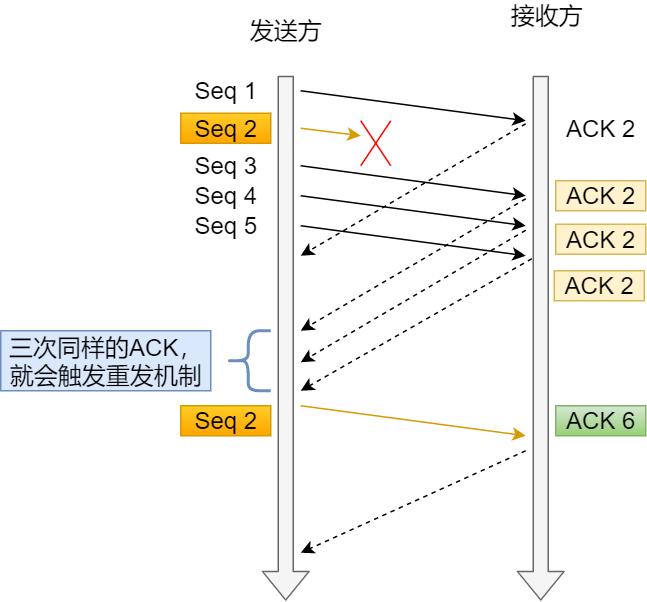
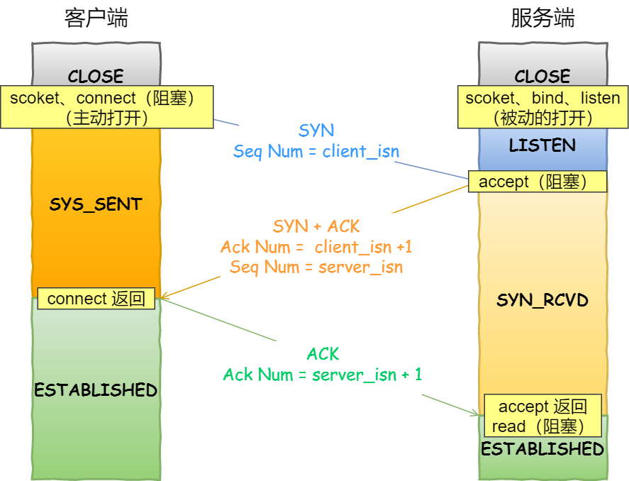
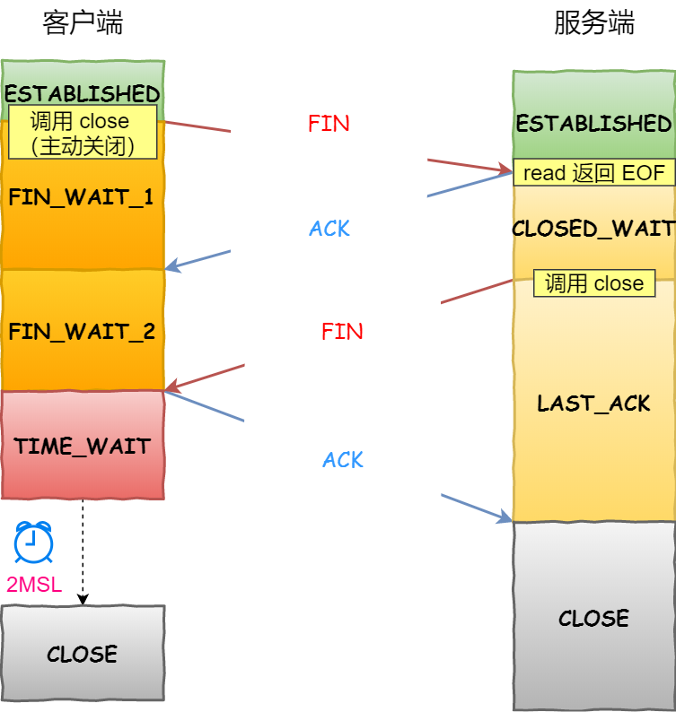
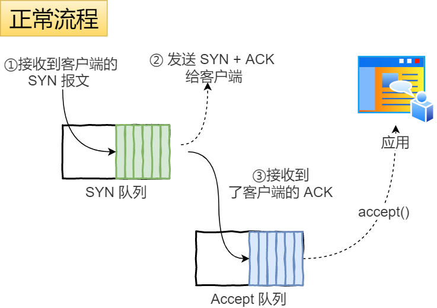
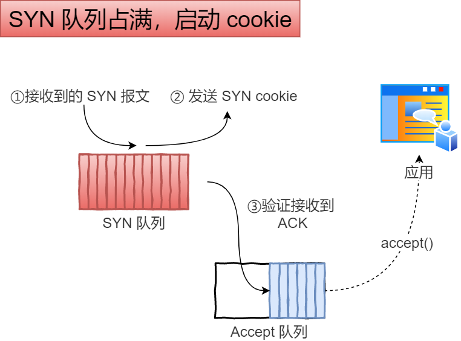

#  OSI与TCP/IP


>  图片来源：https://blog.csdn.net/yaopeng_2005/article/details/7064869

**五层协议** **报文-数据段-数据包-数据帧-数据位**

- **应用层** ：为特定应用程序提供数据传输服务，例如 HTTP、DNS 等协议。数据单位为报文。
- **传输层** ：为进程提供通用数据传输服务。由于应用层协议很多，定义通用的传输层协议就可以支持不断增多的应用层协议。传输层包括两种协议：传输控制协议 TCP，提供面向连接、可靠的数据传输服务，数据单位为报文段；用户数据报协议 UDP，提供无连接、尽最大努力的数据传输服务，数据单位为用户数据报。TCP 主要提供完整性服务，UDP 主要提供及时性服务。
- **网络层** ：为主机提供数据传输服务，而传输层协议是为主机中的进程提供数据传输服务。网络层把传输层传递下来的报文段或者用户数据报封装成分组。
- **数据链路层** ：网络层针对的还是主机之间的数据传输服务，而主机之间可以有很多链路，链路层协议就是为同一链路的主机提供数据传输服务。数据链路层把网络层传下来的分组封装成帧。
- **物理层** ：考虑的是怎样在传输媒体上传输数据比特流，而不是指具体的传输媒体。物理层的作用是尽可能屏蔽传输媒体和通信手段的差异，使数据链路层感觉不到这些差异。

**OSI比五层协议多两层**

其中表示层和会话层用途如下：

- **表示层** ：数据压缩、加密以及数据描述，这使得应用程序不必关心在各台主机中数据内部格式不同的问题。
- **会话层** ：建立及管理会话。

五层协议没有表示层和会话层，而是将这些功能留给应用程序开发者处理。

**TCP/IP**

在互联网使用的各种协中最重要和最著名的就是 TCP/IP 两个协议。现在人们经常提到的TCP/IP并不一定单指TCP和IP这两个具体的协议，而往往表示互联网所使用的整个TCP/IP协议族。

它只有四层，**相当于五层协议中数据链路层和物理层合并为网络接口层。**五层协议的体系结构只是为了介绍网络原理而设计的，实际应用还是 TCP/IP 四层体系结构。

TCP/IP 体系结构不严格遵循 OSI 分层概念，应用层可能会直接使用 IP 层或者网络接口层。

**数据在各层之间的传递过程**

在向下的过程中，需要添加下层协议所需要的首部或者尾部，而在向上的过程中不断拆开首部和尾部。

路由器只有下面三层协议，因为路由器位于网络核心中，不需要为进程或者应用程序提供服务，因此也就不需要传输层和应用层。


# 应用层

**应用层(application-layer）的任务是通过应用进程间的交互来完成特定网络应用。**应用层协议定义的是应用进程（进程：主机中正在运行的程序）间的通信和交互的规则。对于不同的网络应用需要不同的应用层协议。在互联网中应用层协议很多，如**域名系统DNS**，支持万维网应用的 **HTTP协议**，支持电子邮件的 **SMTP协议**等等。数据单位为报文。

**域名系统**

> 域名系统(Domain Name System缩写 DNS，Domain Name被译为域名)是因特网的一项核心服务，它作为可以将域名和IP地址相互映射的一个分布式数据库，能够使人更方便的访问互联网，而不用去记住能够被机器直接读取的IP数串。（百度百科）例如：一个公司的 Web 网站可看作是它在网上的门户，而域名就相当于其门牌地址，通常域名都使用该公司的名称或简称。例如上面提到的微软公司的域名，类似的还有：IBM 公司的域名是 www.ibm.com、Oracle 公司的域名是 www.oracle.com、Cisco公司的域名是 www.cisco.com 等。

**HTTP协议**

> 超文本传输协议（HTTP，HyperText Transfer Protocol)是互联网上应用最为广泛的一种网络协议。所有的 WWW（万维网） 文件都必须遵守这个标准。设计 HTTP 最初的目的是为了提供一种发布和接收 HTML 页面的方法。（百度百科）


# 传输层

**传输层(transport layer)：为两台主机进程之间的通信提供通用的数据传输服务（端到端）**。应用进程利用该服务传送应用层报文。“通用的”是指并不针对某一个特定的网络应用，而是多种应用可以使用同一个运输层服务。由于一台主机可同时运行多个线程，因此传输层有复用和分用的功能。所谓复用就是指多个应用层进程可同时使用下面运输层的服务，分用和复用相反，是传输层把收到的信息分别交付上面应用层中的相应进程。

**运输层主要使用以下两种协议:**

- 传输控制协议 TCP（Transmission Control Protocol）**是面向连接的，提供可靠交付，有流量控制，拥塞控制，提供全双工通信，面向字节流（把应用层传下来的报文看成字节流，把字节流组织成大小不等的数据块）**的传输层通信协议。

- 用户数据报协议 UDP（User Datagram Protocol）**是无连接的，尽最大可能交付，没有拥塞控制，面向报文（对于应用层传下来的报文不合并也不拆分，只是添加 UDP 首部）**，支持一对一、一对多、多对一和多对多的交互通信。  


## TCP,UDP 协议对比⭐

UDP 在传送数据之前不需要先建立连接，远地主机在收到 UDP 报文后，不需要给出任何确认。虽然 UDP 不提供可靠交付，但在某些情况下 UDP 确是一种最有效的工作方式（一般用于即时通信），比如： QQ 语音、 QQ 视频 、直播等等

TCP 提供面向连接的服务。在传送数据之前必须先建立连接，数据传送结束后要释放连接。 TCP 不提供广播或多播服务。由于 TCP 要提供可靠的，面向连接的传输服务（TCP的可靠体现在TCP在传递数据之前，会有三次握手来建立连接，而且在数据传递时，有确认、窗口、重传、拥塞控制机制，在数据传完后，还会断开连接用来节约系统资源），这一难以避免增加了许多开销，如确认，流量控制，计时器以及连接管理等。这不仅使协议数据单元的首部增大很多，还要占用许多处理机资源。TCP 一般用于文件传输、发送和接收邮件、远程登录等场景。

- **TCP面向连接，UDP无连接。**

- **TCP 是一对一的两点服务，UDP 支持一对一、一对多、多对多的交互通信。**
- **TCP 是可靠交付数据的**，数据可以无差错、不丢失、不重复、按需到达。**UDP 尽最大努力交付**，不保证可靠交付数据。
- TCP 有拥塞控制和流量控制机制**，UDP 没有**
- TCP面向字节流，UDP是报文段
- TCP传输所需资源多，传输慢；UDP传输所需资源少，传输快。
- TCP首部长度可变（20-60字节） UDP首部固定8字节

### TCP与UDP应用场景

由于 TCP 是面向连接，能保证数据的可靠性交付，因此经常用于：

- FTP文件传输、POP3 SMTP 发送和接收邮件、TELNET远程登录等场景。
- HTTP / HTTPS SSH

由于 UDP 面向无连接，它可以随时发送数据，再加上UDP本身的处理既简单又高效，因此经常用于：

- 包总量较少的通信，如 DNS 、SNMP 等
- 即时通信：视频、音频等多媒体通信
- **DHCP**（Dynamic Host Configuration Protocol，动态主机配置协议），动态配置IP地址。
- BOOTP（Boot Protocol，启动协议），应用于无盘设备。NTP（Network Time Protocol，网络时间协议），用于网络同步。

运行在TCP和UDP协议上：

- DNS（Domain Name Service，域名服务），用于完成地址查找，邮件转发等工作。


### 如何理解TCP面向字节流，UDP面向报文段？

**问题的关键在于TCP是有缓冲区**，作为对比，UDP面向报文段是没有缓冲区的。

TCP发送报文时，是将应用层数据写入TCP缓冲区中，然后由TCP协议来控制发送这里面的数据，而发送的状态是按字节流的方式发送的，跟应用层写下来的报文长度没有任何关系，所以说是流。

**在TCP建立连接前两次握手的SYN报文中选项字段的MSS值，通信双方商定通信的最大报文长度。**如果应用层交付下来的数据过大，就会对数据分段，然后发送；否则通过滑动窗口协议来控制通信双发的数据。

UDP，没有缓冲区。应用层交给UDP的报文，无论多长，既不合并，也不拆分，UDP添加首部以后就交给ip层，由网络层负责分片。若报文太长，则IP层需要分片，降低效率。若太短，会是IP太小。**UDP发送端调用了几次write，接收端必须用相同次数的read读完。**


### TCP与UDP分片 了解即可



MSS：除去 IP 和 TCP 头部之后，一个网络包所能容纳的 TCP 数据的最大长度；

MTU：一个网络包的最大长度，以太网中一般为 1500 字节；

- TCP 的数据大小如果大于 MSS 大小，则会在传输层进行分片，目标主机收到后，也同样在传输层组装 TCP 数据包，如果中途丢失了一个分片，只需要传输丢失的这个分片。
- UDP 的数据大小如果大于 MTU 大小，则会在 IP 层进行分片，目标主机收到后，在 IP 层组装完数据，接着再传给传输层，但是如果中途丢了一个分片，则就需要重传所有的数据包，这样传输效率非常差，所以通常 UDP 的报文应该小于 MTU。


#### 既然 IP 层会分片，为什么 TCP 层还需要 MSS 呢？

如果在 TCP 的整个报文（头部 + 数据）交给 IP 层进行分片，会有什么异常呢？

当 IP 层有一个超过 MTU 大小的数据（TCP 头部 + TCP 数据）要发送，那么 IP 层就要进行分片，把数据分片成若干片，保证每一个分片都小于 MTU。把一份 IP 数据报进行分片以后，由目标主机的 IP 层来进行重新组装后，再交给上一层 TCP 传输层。

这看起来井然有序，但这存在隐患的，**那么当如果一个 IP 分片丢失，整个 IP 报文的所有分片都得重传**。

因为 IP 层本身没有超时重传机制，它由传输层的 TCP 来负责超时和重传。

当接收方发现 TCP 报文（头部 + 数据）的某一片丢失后，则不会响应 ACK 给对方，那么发送方的 TCP 在超时后，就会重发「整个 TCP 报文（头部 + 数据）」。

因此，可以得知由 IP 层进行分片传输，是非常没有效率的。

所以，为了达到最佳的传输效能 TCP 协议在**建立连接的时候通常要协商双方的 MSS 值**，当 TCP 层发现数据超过 MSS 时，则就先会进行分片，当然由它形成的 IP 包的长度也就不会大于 MTU ，自然也就不用 IP 分片了。


## TCP

传输控制协议 TCP（Transmission Control Protocol）**是面向连接的，提供可靠交付，有流量控制，拥塞控制，提供全双工通信，面向字节流（把应用层传下来的报文看成字节流，把字节流组织成大小不等的数据块）**的传输层通信协议。

- **面向连接**：一定是「一对一」才能连接，不能像 UDP 协议可以一个主机同时向多个主机发送消息，也就是一对多是无法做到的；
- **可靠的**：无论的网络链路中出现了怎样的链路变化，TCP 都可以保证一个报文一定能够到达接收端；
- **字节流**：消息是「没有边界」的，所以无论我们消息有多大都可以进行传输。并且消息是「有序的」，当「前一个」消息没有收到的时候，即使它先收到了后面的字节，那么也不能扔给应用层去处理，同时对「重复」的报文会自动丢弃。


### TCP头部格式

**TCP首部20-60字节** 

**固定：源端口目的端口(4) 序号(4) 确认号(4)  窗口(2)  校验和(2) 首部长度(4b) 标记位(6b) 紧急指针(2) **

**可变： 选项   填充**



**序列号**：在建立连接时由计算机生成的随机数作为其初始值，通过 SYN 包传给接收端主机，每发送一次数据，就「累加」一次该「数据字节数」的大小。**用来解决网络包乱序、重复等问题。**

**确认应答号**：指下一次「期望」收到的数据的序列号，发送端收到这个确认应答以后可以认为在这个序号以前的数据都已经被正常接收。**用来解决不丢包的问题。**

只有ACK标志位为1时，确认序号字段才有效，ack=seq+1。

窗口大小：**接收端告诉发送端自己还有多少缓冲区可以接收数据。于是发送端就可以根据这个接收端的处理能力来发送数据，而不会导致接收端处理不过来。——进行流量控制**

**控制位：**

- ACK：**确认序号有效。**TCP 规定除了最初建立连接时的 SYN 包之外该位必须设置为 1 。
- RST：TCP 连接中出现异常必须强制断开连接。**记忆：RESET**
- SYN：**发起一个新连接**。
- FIN：**释放一个连接。**当通信结束希望断开连接时，通信双方的主机之间就可以相互交换 FIN 位为 1 的 TCP 段。
- **PSH：接收方应该尽快将这个报文交给应用层。**
- **URG：紧急指针（urgent pointer）有效。**


**紧急指针什么用？**

有时一些应用程序在某些紧急情况下（如在某些连接中进行强制中断）要求在接收方在没有处理完数据之前就能够发送一些紧急数据，这就使得发送方将CODE字段的URG置为1 即紧急指针字段有效，这样可以不必考虑你发送的紧急数据在数据流中的位置，也就是相当于**优先级最高**。**紧急指针指出的是紧急数据在报文段中结束的位置**


### TCP协议如何保证可靠传输 ⭐

1. **校验和**：发送方在发送数据之前计算检验和，并进行校验和的填充。接收方，收到数据后，对数据以同样的方式进行计算，求出校验和，与发送方的进行比对
2. **确认应答与序列号**：TCP传输时将每个字节的数据都进行了编号，TCP传输的过程中，每次接收方收到数据后，都会对传输方进行确认应答，也就是发送ACK报文，报文中包含对应的确认序列号。
3. **超时重传**：发送方在发送完数据后等待一个时间，时间到达没有接收到ACK报文，那么对刚才发送的数据进行重新发送。  
4. **连接管理**：连接管理就是三次握手与四次挥手的过程
5. **流量控制**：TCP 连接的每一方都有固定大小的缓冲空间，TCP的接收端只允许发送端发送接收端缓冲区能接纳的数据。当接收方来不及处理发送方的数据，能提示发送方降低发送的速率，防止包丢失。TCP 使用的流量控制协议是可变大小的滑动窗口协议。 （TCP 利用滑动窗口实现流量控制）。
6. **拥塞控制**：发送端在刚开始就发送大量的数据，那么就可能造成网络拥塞。所以TCP引入了慢启动的机制，在开始发送数据时，先发送少量的数据探路。**快速重传**
7. **ARQ协议**： 也是为了实现可靠传输的，它的基本原理就是每发完一个分组就停止发送，等待对方确认。在收到确认后再发下一个分组。


**超时重传vs快速重传（拥塞控制的一部分）**

超时重传的原因可能是数据包丢失或ACK应答丢失。

超时时间的设置是动态变化的，略大于报文往返所需时间。有专门的计算公式，需要linux系统做采样。并且，如果超时重发的数据，再次超时的时候，又需要重传的时候，TCP 的策略是**超时间隔加倍。**

**因此如果网络堵塞，超时时间可能相对比较长。**TCP 还有另外一种**快速重传（Fast Retransmit）机制**，它**不以时间为驱动，而是以数据驱动重传**。


#### 流量控制

> **TCP 利用滑动窗口实现流量控制。流量控制是为了控制发送方发送速率，保证接收方来得及接收。** 接收方发送的确认报文中的窗口字段可以用来控制发送方窗口大小，从而影响发送方的发送速率。将窗口字段设置为 0，则发送方不能发送数据。

发送方不能无脑的发数据给接收方，要考虑接收方处理能力。如果一直无脑的发数据给对方，但对方处理不过来（从有限空间的缓冲区把数据读走），那么就会导致触发重发机制，从而导致网络流量的无端的浪费。

为了解决这种现象发生，**TCP 提供一种机制可以让「发送方」根据「接收方」的实际接收能力控制发送的数据量，这就是所谓的流量控制。**

接收方发送的确认报文中的窗口字段可以用来控制发送方窗口大小，从而影响发送方的发送速率。如果窗口大小为 0 时（也叫窗口关闭），发送方不能发送数据，直到窗口变为非 0。

由于TCP+IP头部占40个字节，窗口太小，只能发送很少的数据，太浪费。所以一般当窗口大小小于 MSS 与 1/2 缓存大小中的最小值时，就会向发送方通告窗口为 0，也就阻止了发送方再发数据过来。等什么时候空间够大了，再发送。

**流量控制的核心：滑动窗口**

窗口大小就是指**无需等待确认应答，而可以继续发送数据的最大值**。

窗口大小由哪一方决定？

TCP 头里有一个字段叫 Window，也就是窗口大小。

**这个字段是接收端告诉发送端自己还有多少缓冲区可以接收数据。于是发送端就可以根据这个接收端的处理能力来发送数据，而不会导致接收端处理不过来。**

所以，通常窗口的大小是由接收方的窗口大小来决定的。

发送方发送的数据大小不能超过接收方的窗口大小，否则接收方就无法正常接收到数据。

##### 窗口关闭潜在的危险——死锁 了解



**TCP 是如何解决窗口关闭时，潜在的死锁现象呢？**

为了解决这个问题，TCP 为每个连接设有一个持续定时器，**只要 TCP 连接一方收到对方的零窗口通知，就启动持续计时器。**

如果持续计时器超时，就会发送**窗口探测 ( Window probe ) 报文**，而对方在确认这个探测报文时，给出自己现在的接收窗口大小。窗口探测的次数一般为 3 次，每次大约 30-60 秒（不同的实现可能会不一样）。如果 3 次过后接收窗口还是 0 的话，有的 TCP 实现就会发 RST 报文来中断连接。


#### 拥塞控制

**为什么有流量控制，还需要拥塞控制/ 流量控制和拥塞控制的区别**

前面的流量控制是避免「发送方」的数据填满「接收方」的缓存，但是并不知道网络的中发生了什么。

**在网络出现拥堵时**，如果继续发送大量数据包，可能会导致数据包时延、丢失等，这时 TCP 就会重传数据，但是一重传就会导致网络的负担更重，于是会导致更大的延迟以及更多的丢包，这个情况就会进入恶性循环被不断地放大....

所以，TCP 不能忽略网络上发生的事，它被设计成一个无私的协议，当网络发送拥塞时，TCP 会自我牺牲，降低发送的数据量。

于是，就有了**拥塞控制**，控制的目的就是**避免「发送方」的数据填满整个网络。**

**拥塞窗口 cwnd**是发送方维护的一个的状态变量，它会根据**网络的拥塞程度动态变化的**。

流量控制要求发送方发送的数据不超过接收方的rwnd，拥塞控制要求发送方发送的数据不超过拥塞窗口，因此发送窗口的值是swnd = min(cwnd, rwnd)。

拥塞窗口 cwnd 变化的规则：

- 只要网络中没有出现拥塞，cwnd 就会增大；
- 但网络中出现了拥塞，cwnd 就减少；

**那么怎么知道当前网络是否出现了拥塞呢？**

其实只要「发送方」没有在规定时间内接收到 ACK 应答报文，也就是**发生了超时重传，就会认为网络出现了拥塞。**

拥塞控制主要是四个算法：

- **慢开始** 指数增长，直到遇到拥塞避免的开始ssthresh，编程线性增长
- **拥塞避免**   一般来说 ssthresh 的初始大小是 65535 字节。
- **拥塞发生-超时重传**  遇到超时，cwnd 重置为 1  拥塞避免的开始ssthresh设为 cwnd/2。
- **快速恢复** 遇到3ACK  拥塞避免的开始设为cwnd/2，cwnd设为cwnd/2 + 3

**cwnd-拥塞窗口的大小**  


图中单位是MSS：除去 IP 和 TCP 头部之后，一个网络包所能容纳的 TCP 数据的最大长度。

##### 1. 慢开始与拥塞避免

发送的最初执行慢开始，令 cwnd = 1，发送方只能发送 1 个报文段；当收到确认后，将 cwnd 加倍，因此之后发送方能够发送的报文段数量为：2、4、8 ...

注意到慢开始每个轮次都将 cwnd 加倍，这样会让 cwnd 增长速度非常快，从而使得发送方发送的速度增长速度过快，网络拥塞的可能性也就更高。设置一个慢开始门限 ssthresh，当 cwnd >= ssthresh 时，进入拥塞避免，每个轮次只将 cwnd 加 1。

如果出现了超时，则令 ssthresh = cwnd / 2，然后重新执行慢开始。

##### 2. 快重传与快恢复



在接收方，要求每次接收到报文段都应该对最后一个已收到的有序报文段进行确认。例如已经接收到 M1 和 M2，此时收到 M4，应当发送对 M2 的确认。

在发送方，如果收到三个重复确认，那么可以知道下一个报文段丢失，此时执行快重传，立即重传下一个报文段。例如收到三个 M2，则 M3 丢失，立即重传 M3。

在这种情况下，只是丢失个别报文段，而不是网络拥塞。因此执行快恢复，令 ssthresh = cwnd / 2 ，cwnd = cwnd / 2，注意到此时直接进入拥塞避免。

慢开始和快恢复的快慢指的是 cwnd 的设定值，而不是 cwnd 的增长速率。

**补充内容：简单了解**

快速重传机制只解决了一个问题，就是超时时间的问题，但是它依然面临着另外一个问题。就是**重传的时候，是重传之前的一个，还是重传所有的问题。**

**解决方法：**SACK 方法（选择性确认），TCP头部选项中添加一个标记，表示从哪里到哪里服务端已经收到了。不需要再重发这些已经收到的。

如果要支持 SACK，必须双方都要支持。在 Linux 下，可以通过  net.ipv4.tcp_sack 参数打开这个功能（Linux 2.4 后默认打开）。

简单了解：还有D-SACK。通过D-SACK序列号，可以让发送方区分网络延迟和ACK丢失。ACK丢失不需要重新传丢失部分。

在 Linux 下可以通过 net.ipv4.tcp_dsack  参数开启/关闭这个功能（Linux 2.4 后默认打开）。


#### ARQ协议 了解

**自动重传请求**（Automatic Repeat-reQuest，ARQ）是OSI模型中数据链路层和传输层的错误纠正协议之一。它通过使用确认和超时这两个机制，在不可靠服务的基础上实现可靠的信息传输。如果发送方在发送后一段时间之内没有收到确认帧，它通常会重新发送。ARQ包括停止等待ARQ协议和连续ARQ协议。

##### 停止等待ARQ协议

停止等待协议是为了实现可靠传输的，它的基本原理就是每发完一个分组就停止发送，等待对方确认（回复ACK）。如果过了一段时间（超时时间后），还是没有收到 ACK 确认，说明没有发送成功，需要重新发送，直到收到确认后再发下一个分组。

在停止等待协议中，若接收方收到重复分组，就丢弃该分组，但同时还要发送确认。

**优缺点：**

- **优点：** 简单
- **缺点：** 信道利用率低，等待时间长

**1) 无差错情况:**

发送方发送分组,接收方在规定时间内收到,并且回复确认.发送方再次发送。

**2) 出现差错情况（超时重传）:**

停止等待协议中超时重传是指只要超过一段时间仍然没有收到确认，就重传前面发送过的分组（认为刚才发送过的分组丢失了）。因此每发送完一个分组需要设置一个超时计时器，其重传时间应比数据在分组传输的平均往返时间更长一些。这种自动重传方式常称为 **自动重传请求 ARQ** 。另外在停止等待协议中若收到重复分组，就丢弃该分组，但同时还要发送确认。**连续 ARQ 协议** 可提高信道利用率。发送维持一个发送窗口，凡位于发送窗口内的分组可连续发送出去，而不需要等待对方确认。接收方一般采用累积确认，对按序到达的最后一个分组发送确认，表明到这个分组位置的所有分组都已经正确收到了。

**3) 确认丢失和确认迟到**

- **确认丢失** ：确认消息在传输过程丢失。当A发送M1消息，B收到后，B向A发送了一个M1确认消息，但却在传输过程中丢失。而A并不知道，在超时计时过后，A重传M1消息，B再次收到该消息后采取以下两点措施：1. 丢弃这个重复的M1消息，不向上层交付。 2. 向A发送确认消息。（不会认为已经发送过了，就不再发送。A能重传，就证明B的确认消息丢失）。
- **确认迟到** ：确认消息在传输过程中迟到。A发送M1消息，B收到并发送确认。在超时时间内没有收到确认消息，A重传M1消息，B仍然收到并继续发送确认消息（B收到了2份M1）。此时A收到了B第二次发送的确认消息。接着发送其他数据。过了一会，A收到了B第一次发送的对M1的确认消息（A也收到了2份确认消息）。处理如下：1. A收到重复的确认后，直接丢弃。2. B收到重复的M1后，也直接丢弃重复的M1。

##### 连续ARQ协议

连续 ARQ 协议可提高信道利用率。发送方维持一个发送窗口，凡位于发送窗口内的分组可以连续发送出去，而不需要等待对方确认。接收方一般采用累计确认，对按序到达的最后一个分组发送确认，表明到这个分组为止的所有分组都已经正确收到了。

**优缺点：**

- **优点：** 信道利用率高，容易实现，即使确认丢失，也不必重传。
- **缺点：** 不能向发送方反映出接收方已经正确收到的所有分组的信息。 比如：发送方发送了 5条 消息，中间第三条丢失（3号），这时接收方只能对前两个发送确认。发送方无法知道后三个分组的下落，而只好把后三个全部重传一次。这也叫 Go-Back-N（回退 N），表示需要退回来重传已经发送过的 N 个消息。

### TCP连接

一个TCP连接通常分为三个阶段：连接、数据传输、退出（关闭）。**通过三次握手建立一个链接，通过四次挥手来关闭一个连接。当一个连接被建立或被终止时，交换的报文段只包含TCP头部，而没有数据。**

TCP是一种面向连接的、可靠的、基于字节流的传输层通信协议，在发送数据前，通信双方必须在彼此间建立一条**连接**。

**那么什么是 TCP 连接？**

> RFC 793 是如何定义「连接」的：
>
> Connections: The reliability and flow control mechanisms described above require that TCPs initialize and maintain certain status information for each data stream. The combination of this information, including sockets, sequence numbers, and window sizes, is called a connection.

简单来说就是，**用于保证可靠性和流量控制维护的某些状态信息，这些信息的组合，包括Socket、序列号和窗口大小称为连接。**

所以我们可以知道，建立一个 TCP 连接是需要客户端与服务器端达成上述三个信息的共识。

- **Socket**：由 IP 地址和端口号组成
- **序列号**：用来解决乱序问题等
- **窗口大小**：用来做流量控制

#### 如何唯一确定一个 TCP 连接呢？

TCP 四元组可以唯一的确定一个连接：**源地址，源端口，目的地址，目的端口。地址即IP地址，存在IP头部**


#### 有一个 IP 的服务器监听了一个端口，它的 TCP 的最大连接数是多少？

服务器通常固定在某个本地端口上监听，等待客户端的连接请求。

客户端 IP 和 端口是可变的，其理论值计算公式如下：`最大TCP连接数 = 客户端IP数 * 客户端端口数。`

对 IPv4，客户端的 IP 数最多为 2 的 32 次方，客户端的端口数最多为 2 的 16 次方，也就是服务端单机最大 TCP 连接数，约为 2 的 48 次方。

当然，服务端最大并发 TCP 连接数远不能达到理论上限。

- 首先主要是**文件描述符限制**，Socket 都是文件，所以首先要通过 ulimit 配置文件描述符的数目；
- 另一个是**内存限制**，每个 TCP 连接都要占用一定内存，操作系统的内存是有限的。


#### 如何在 Linux 系统中查看 TCP 状态？

TCP 的连接状态查看，在 Linux 可以通过 `netstat -napt` 命令查看。


## UDP

用户数据报协议 UDP（User Datagram Protocol）**是无连接的，尽最大可能交付，没有拥塞控制，面向报文（对于应用程序传下来的报文不合并也不拆分，只是添加 UDP 首部）**，支持一对一、一对多、多对一和多对多的交互通信。  

### UDP头部格式

UDP 协议真的非常简单，头部只有 8 个字节（ 64 位），UDP 的头部格式如下：


- 目标和源端口：主要是告诉 UDP 协议从哪个进程来，应该把报文发给哪个进程。
- 包长度：该字段保存了 UDP 首部的长度跟数据的长度之和。
- 校验和：校验和是为了提供可靠的 UDP 首部和数据而设计。

**为什么 UDP 头部没有「首部长度」字段，而 TCP 头部有「首部长度」字段呢？**

TCP 有**可变长**的「选项」字段，而 UDP 头部长度则是**不会变化**的，无需多一个字段去记录 UDP 的首部长度。


**为什么 UDP 头部有「包长度」字段，而 TCP 头部则没有「包长度」字段呢？**

```sh
TCP数据长度=IP总长度-IP首部长度-TCP首部长度
```

其中 IP 总长度 和 IP 首部长度，在 IP 首部格式是已知的。TCP 首部长度，则是在 TCP 首部格式已知的，所以就可以求得 TCP 数据的长度。

大家这时就奇怪了问：“ UDP 也是基于 IP 层的呀，那 UDP 的数据长度也可以通过这个公式计算呀？ 为何还要有「包长度」呢？”

这么一问，确实感觉 UDP 「包长度」是冗余的。

**因为为了网络设备硬件设计和处理方便，首部长度需要是4字节的整数倍。**

如果去掉 UDP 「包长度」字段，那 UDP 首部长度就不是 4 字节的整数倍了，所以这可能是为了补全 UDP 首部长度是 4 字节的整数倍，才补充了「包长度」字段。


## TCP三次握手和四次挥手🔥

> [两张动图-彻底明白TCP的三次握手与四次挥手](https://blog.csdn.net/qzcsu/article/details/72861891)

### TCP建立连接：三次握手



最开始，客户端和服务端都处于 CLOSED 状态。首先，服务端主动监听某个端口，处于 LISTEN 状态，等待客户的连接请求。

- 第一次握手：客户端–发送带有 SYN 标志的数据包。
  - 调用connect方法，客户端向服务端发送连接请求报文，SYN=1，ACK=0，随机初始化序号-x。 客户端处于SYN-SENT状态。connect阻塞
- 第二次握手：服务端–发送带有 SYN/ACK 标志的数据包。
  - 服务端收到连接请求报文，如果同意建立连接，调用accept()方法。则向客户端发送连接确认报文，SYN=1，ACK=1，确认号为 x+1，同时也随机初始化序号-y。服务端进入 SYN-RCVD 状态。 accept阻塞
- 第三次握手：客户端–发送带有带有 ACK 标志的数据包。
  - 客户端收到服务端的连接确认报文-后，connect返回，还要向服务端发出确认ACK = 1，SYN = 0，确认号为 y+1，序号为 x+1，客户端处于ESTABLISHED状态。 send() --- receive() 建立了连接 -->互相都可以send()，receive()

服务端收到客户端的确认后，accept返回，连接建立，服务端进入ESTABLISHED状态。

注意：第三次握手是可以携带数据的，前两次握手是不可以携带数据的。


#### 为什么TCP连接的时候是3次？2次不可以吗？

TCP 建立连接时，通过三次握手**能防止历史连接的建立，能减少双方不必要的资源开销，能帮助双方同步初始化序列号**。序列号能够保证数据包不重复、不丢弃和按序传输。

**1. 依靠第三次握手才可以阻止重复连接（主要原因）**

在**网络拥堵**情况下，客户端可能连续发送多次 SYN 建立连接的报文，服务端会**建立多个冗余的无效链接，造成不必要的资源浪费。**

为了避免这种情况，需要第三次握手来只确认建立最后发送的连接。如果不是最新的连接，则第三次握手发送的报文是**RST**报文，以此中止这个冗余连接；如果是最新的，则第三次发送的报文是**ACK**报文，通信双方就会成功建立连接。

**2. 同步双方的初始序列号，双方都确认自己与对方的发送与接收是正常的**

三次握手才能**确保双方**的初始序列号能被可靠的同步。

第一次握手：Client 什么都不能确认；Server 确认了对方发送正常，自己接收正常；

第二次握手：Client 确认了：自己发送、接收正常，对方发送、接收正常；

第三次握手：Server 确认了：自己发送、对方接收正常。

所以三次握手就能确认双发收发功能都正常，缺一不可。


#### 第2次握手传回了ACK，为什么还要传回SYN？

接收端传回发送端所发送的ACK是为了告诉客户端，我接收到的信息确实就是你所发送的信号了，这表明从客户端到服务端的通信是正常的。而回传SYN则是为了建立并确认从服务端到客户端的通信。”

>  SYN 同步序列编号(Synchronize Sequence Numbers) 是 TCP/IP 建立连接时使用的握手信号。在客户机和服务器之间建立正常的 TCP 网络连接时，客户机首先发出一个 SYN 消息，服务器使用 SYN-ACK 应答表示接收到了这个消息，最后客户机再以 ACK(Acknowledgement）消息响应。这样在客户机和服务器之间才能建立起可靠的 TCP 连接，数据才可以在客户机和服务器之间传递。


#### 为什么客户端和服务端的初始序列号 ISN 是不相同的

每次建立连接前重新初始化一个序列号主要是**为了通信双方能够根据序号将不属于本连接的报文段丢弃。**

初始序列号不同，是为了安全性，防止黑客伪造的相同序列号的 TCP 报文被对方接收。

**初始序列号 ISN 是如何随机产生的？** 了解

时钟 + 对四元组的Hash算法 

RFC1948 中提出了一个较好的初始化序列号 ISN 随机生成算法：ISN = M + F (localhost, localport, remotehost, remoteport)

- M 是一个计时器，这个计时器每隔 4 毫秒加 1。
- F 是一个 Hash 算法，根据源 IP、目的 IP、源端口、目的端口生成一个随机数值。要保证 Hash 算法不能被外部轻易推算得出，用 **MD5 算法** 是一个比较好的选择。


### TCP断开连接：四次挥手

断开一个 TCP 连接则需要“四次挥手”：

- 客户端-发送一个 FIN，用来关闭客户端到服务器的数据传送
  - 首部FIN=1，其序列号为seq=u（等于前面已经传送过来的数据的最后一个字节的序号加1），进入FIN-WAIT-1（**终止等待1**）状态。 
- 服务器-收到这个 FIN，它发回一 个 ACK，确认序号为收到的序号加1 。
  - ACK=1，ack序列号为u+1，并且带上自己的序列号seq=v。服务端进入**CLOSE-WAIT（关闭等待）**状态。此时连接处于半关闭状态，客户端停止发送数据，服务端依然可以处理和发送数据，客户端还继续接收数据。
  - 客户端收到服务端的 ACK 应答报文后，进入 FIN_WAIT_2 （**终止等待2**）状态。
- 服务器-关闭与客户端的连接，发送一个FIN给客户端
  - FIN=1，ack=u+1，进入了**LAST-ACK（最后确认）**状态。由于在半关闭状态，服务器很可能又发送了一些数据，此时的序列号可能已经改变为w。
  - 客户端收到服务器的连接释放报文后，回一个 ACK 应答报文。ACK=1，ack=w+1，进入**TIME-WAIT（时间等待）**状态。
- 客户端-发回 ACK 报文确认，并将确认序号设置为收到序号加1
  - 服务器收到了 ACK 应答报文后，就进入了 CLOSED 状态，至此服务端已经完成连接的关闭。
  - 客户端在经过 **2MSL最长报文段寿命**后，自动进入 CLOSED 状态，至此客户端也完成连接的关闭。

任何一方都可以在数据传送结束后发出连接释放的通知，待对方确认后进入半关闭状态。当另一方也没有数据再发送的时候，则发出连接释放通知，对方确认后就完全关闭了TCP连接。

举个例子：A 和 B 打电话，通话即将结束后，A 说“我没啥要说的了”，B回答“我知道了”，但是 B 可能还会有要说的话，A 不能要求 B 跟着自己的节奏结束通话，于是 B 可能又巴拉巴拉说了一通，最后 B 说“我说完了”，A 回答“知道了”，这样通话才算结束。


**具体socket函数过程**



- 客户端调用 close，主动关闭连接，表明客户端没有数据需要发送了，则此时会向服务端发送 FIN 报文，进入 FIN_WAIT_1 状态；
- 服务端接收到了 FIN 报文，TCP 协议栈会为 FIN 包插入一个**文件结束符 EOF** 到接收缓冲区中，应用程序可以通过 read 调用来感知这个 FIN 包。这个 EOF 会被**放在已排队等候的其他已接收的数据之后**，这就意味着服务端需要处理这种异常情况，因为 EOF 表示在该连接上再无额外数据到达。此时，服务端进入 CLOSE_WAIT 状态；
- 接着，当处理完数据后，自然就会读到 EOF，于是也调用 close 关闭它的套接字，这会使得客户端会发出一个 FIN 包，之后处于 LAST_ACK 状态；
- 客户端接收到服务端的 FIN 包，并发送 ACK 确认包给服务端，此时客户端将进入 TIME_WAIT 状态；
- 服务端收到 ACK 确认包后，就进入了最后的 CLOSE 状态；
- 客户端经过 2MSL 时间之后，也进入 CLOSE 状态；


#### 为什么TCP连接的时候是3次，关闭的时候却是4次？

**服务端通常需要等待完成数据的发送和处理**，所以服务端的 ACK 和 FIN 一般都会分开发送，从而比三次握手导致多了一次。

- 关闭连接时，客户端向服务端发送 FIN 时，仅仅表示客户端不再发送数据了，但是还能接收数据。
- 服务器收到客户端的 FIN 报文时，先回一个 ACK 应答报文，而服务端可能还有数据需要处理和发送，等服务端不再发送数据时，才发送 FIN 报文给客户端来表示同意现在关闭连接。

#### 为什么需要 TIME_WAIT 状态？

客户端接收到服务器端的 FIN 报文后进入此状态，此时并不是直接进入 CLOSED 状态，还需要等待一个时间计时器设置的时间 2MSL。这么做有两个理由：

- **确保服务器端的最后一个确认报文(ACK)能够到达，从而可靠地关闭服务端的连接**。如果 B 没收到 A 发送来的确认报文，那么就会重新发送连接释放请求报文，A 等待一段时间就是为了处理这种情况的发生。
- **防止上一次连接中的包，迷路后重新出现，影响新连接。**等待一段时间是为了让**本连接持续时间内所产生的所有报文都从网络中消失**，使得下一个新的连接不会出现旧的连接请求报文。

#### 为什么 TIME_WAIT 等待的时间是 2MSL？

MSL 是 Maximum Segment Lifetime，**报文最大生存时间**，它是任何报文在网络上存在的最长时间，**超过这个时间报文将被丢弃。 一来一去的最大时间是2MSL**

2MSL 的时间是从**客户端接收到 FIN 后发送 ACK 开始计时的**。如果在 TIME-WAIT 时间内，因为客户端的 ACK 没有传输到服务端，客户端又接收到了服务端重发的 FIN 报文，那么 2MSL 时间将重新计时。

#### MSL 与 TTL 的区别

因为 TCP 报文基于是 IP 协议的，而 IP 头中有一个 TTL 字段，是 IP 数据报可以经过的最大路由数，每经过一个处理他的路由器此值就减 1，当此值为 0 则数据报将被丢弃，同时发送 ICMP 报文通知源主机。

MSL 的单位是时间，而 TTL 是经过路由跳数。所以 **MSL 应该要大于等于 TTL 消耗为 0 的时间**，以确保报文已被自然消亡。

在 Linux 系统里 2MSL 默认是 60 秒，那么一个 MSL 也就是 30 秒。**Linux 系统停留在 TIME_WAIT 的时间为固定的 60 秒**。

其定义在 Linux 内核代码里的名称为 TCP_TIMEWAIT_LEN：

```sh
/* how long to wait to destroy TIME-WAIT state, about 60 seconds  */
#define TCP_TIMEWAIT_LEN (60*HZ) 
```

如果要修改 TIME_WAIT 的时间长度，只能修改 Linux 内核代码里TCP_TIMEWAIT_LEN 的值，并重新编译 Linux 内核。


### 可能遇到的问题

#### TIME_WAIT 过多有什么危害？端口/内存

#### 如何尽量处理TIMEWAIT过多

#### close_wait过多


### 网络攻击——SYN攻击

什么是 SYN 攻击？

**攻击者伪造大量的虚假ip，向Server发送大量SYN报文。**Server在接收到SYN包后，会返回响应,并进入SYN_RECV状态，等待客户端的确认。

**伪造的ip不给予ACK响应**，于是Server以为数据包丢失，不断重发，直到超时。这些伪造的SYN包会**长期占用未连接队列**，使得服务器不能为正常用户服务。引起网络拥堵甚至网络瘫痪。

**当服务器上有大量的半连接且ip为随机的，可以确认是受到了SYN攻击。**



受到 SYN 攻击：如果不断受到 SYN 攻击，就会导致「 SYN 队列」被占满。不能处理正常客户的连接。

#### 如何避免SYN攻击

**1. 修改 Linux 内核关于SYN队列的参数**

如：修改`SYN_RCVD` 状态连接的最大个数

```sh
控制该队列的最大值参数：net.core.netdev_max_backlog
SYN_RCVD 状态连接的最大个数：net.ipv4.tcp_max_syn_backlog
超出处理能时，对新的 SYN 直接回报 RST，丢弃连接：net.ipv4.tcp_abort_on_overflow
```

**2. 设置tcp_syncookies参数，相当于新连接不需要进入SYN队列，直接处理**

```sh
vim /etc/sysctl.conf
#加入以下内容：
net.ipv4.tcp_syncookies = 1 
```

表示开启SYN Cookies。当出现SYN等待队列溢出时，启用cookies来处理，可防范少量SYN攻击，默认为0，表示关闭。



**相当于syn等待队列满了之后，新连接不需要进入SYN队列，直接处理**

- 当 「 SYN 队列」满之后，后续服务器收到 SYN 包，不进入「 SYN 队列」；
- 计算出一个 cookie 值，再以 SYN + ACK 中的「序列号」返回客户端，
- **服务端接收到客户端的应答报文时，服务器会检查这个 ACK 包的合法性。如果合法，直接放入到「 Accept 队列」。 **
- 最后应用通过调用 accpet() socket 接口，从「 Accept 队列」取出的连接。

syn攻击的消息直接被返回，正常的也直接被返回，但syn攻击的不会有对的ACK，正常的返回对的ACK之后，加入accept队列等待被accept处理。


# 网络层

**网络层：选择合适的网间路由和交换结点（核心：转发和路由）， 确保数据及时传送。实现主机与主机之间的通信，也叫点对点（end to end）通信。** 在发送数据时，网络层把运输层产生的报文段或用户数据报封装成分组和包进行传送。在 TCP/IP 体系结构中，由于网络层使用 **IP 协议**，因此分组也叫 **IP 数据报** ，简称**数据报**。 IP+ARP+ICMP  

这里要注意：**不要把运输层的“用户数据报 UDP ”和网络层的“ IP 数据报”弄混**。另外，无论是哪一层的数据单元，都可笼统地用“分组”来表示。网络层中的“网络”二字已经不是我们通常谈到的具体网络，而是指计算机网络体系结构模型中第三层的名称。

互联网是由大量的异构（heterogeneous）网络通过路由器（router）相互连接起来的。互联网使用的网络层协议是无连接的网际协议（Intert Protocol）和许多路由选择协议，因此互联网的网络层也叫做**网际层**或**IP层**。

## IP

IP 层是「不可靠」的，它不保证网络包的交付、不保证网络包的按序交付、也不保证网络包中的数据的完整性。

如果需要保障网络数据包的可靠性，那么就需要由上层（传输层）的 TCP 协议来负责。

因为 TCP 提供**面向连接的，可靠的**数据传输服务，它能确保接收端接收的网络包是**无损坏、无间隔、非冗余和按序的。**


# 数据链路层

**两台主机之间的数据传输，总是在一段一段的链路上传送的，这就需要使用专门的链路层的协议。** 在两个相邻节点之间传送数据时，**数据链路层将网络层交下来的 IP 数据报组装成帧**，在两个相邻节点间的链路上传送帧。每一帧包括数据和必要的控制信息（如同步信息，地址信息，差错控制等）。

在接收数据时，控制信息使接收端能够知道一个帧从哪个比特开始和到哪个比特结束。这样，数据链路层在收到一个帧后，就可从中提出数据部分，上交给网络层。
控制信息还使接收端能够检测到所收到的帧中有无差错。如果发现差错，数据链路层就简单地丢弃这个出了差错的帧，以避免继续在网络中传送下去白白浪费网络资源。如果需要改正数据在链路层传输时出现差错（这就是说，数据链路层不仅要检错，而且还要纠错），那么就要采用可靠性传输协议来纠正出现的差错。这种方法会使链路层的协议复杂些。

**数据链路层广泛使用了循环冗余检验（CRC）来检查比特差错。--左移，求余**


# 物理层

在物理层上所传送的数据单位是比特。

 **物理层(physical layer)的作用是实现相邻计算机节点之间比特流的透明传送，尽可能屏蔽掉具体传输介质和物理设备的差异，** 使其上面的数据链路层不必考虑网络的具体传输介质是什么。“透明传送比特流”表示经实际电路传送后的比特流没有发生变化，对传送的比特流来说，这个电路好像是看不见的。


# 其他常见面试题

## 在浏览器中输入url地址 ->> 显示主页的过程🔥

百度好像最喜欢问这个问题。

> 打开一个网页，整个过程会使用哪些协议？
>
> [https://segmentfault.com/a/1190000006879700](https://segmentfault.com/a/1190000006879700)

图解（图片来源：《图解HTTP》）：


> 上图有一个错误，请注意，是OSPF不是OPSF。 OSPF（Open Shortest Path First，ospf）开放最短路径优先协议,是由Internet工程任务组开发的路由选择协议

总体来说分为以下几个过程:

1. DNS解析
2. TCP连接
3. 发送HTTP请求
4. 服务器处理请求并返回HTTP报文
5. 浏览器解析渲染页面
6. 连接结束

