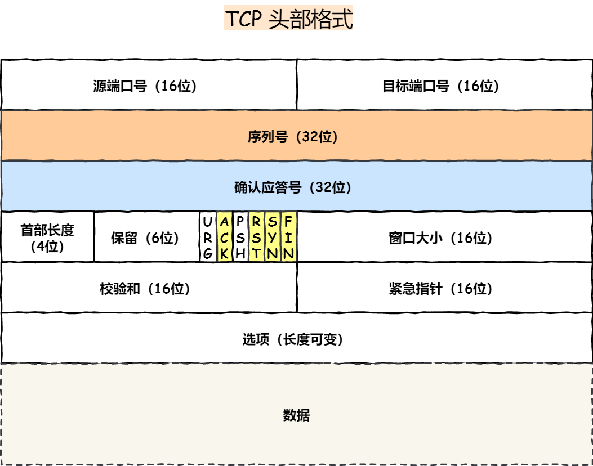

#  OSI与TCP/IP


>  图片来源：https://blog.csdn.net/yaopeng_2005/article/details/7064869

**五层协议** **报文-数据段-数据包-数据帧-数据位**

- **应用层** ：为特定应用程序提供数据传输服务，例如 HTTP、DNS 等协议。数据单位为报文。
- **传输层** ：为进程提供通用数据传输服务。由于应用层协议很多，定义通用的传输层协议就可以支持不断增多的应用层协议。传输层包括两种协议：传输控制协议 TCP，提供面向连接、可靠的数据传输服务，数据单位为报文段；用户数据报协议 UDP，提供无连接、尽最大努力的数据传输服务，数据单位为用户数据报。TCP 主要提供完整性服务，UDP 主要提供及时性服务。
- **网络层** ：为主机提供数据传输服务，而传输层协议是为主机中的进程提供数据传输服务。网络层把传输层传递下来的报文段或者用户数据报封装成分组。
- **数据链路层** ：网络层针对的还是主机之间的数据传输服务，而主机之间可以有很多链路，链路层协议就是为同一链路的主机提供数据传输服务。数据链路层把网络层传下来的分组封装成帧。
- **物理层** ：考虑的是怎样在传输媒体上传输数据比特流，而不是指具体的传输媒体。物理层的作用是尽可能屏蔽传输媒体和通信手段的差异，使数据链路层感觉不到这些差异。

**OSI比五层协议多两层**

其中表示层和会话层用途如下：

- **表示层** ：数据压缩、加密以及数据描述，这使得应用程序不必关心在各台主机中数据内部格式不同的问题。
- **会话层** ：建立及管理会话。

五层协议没有表示层和会话层，而是将这些功能留给应用程序开发者处理。

**TCP/IP**

在互联网使用的各种协中最重要和最著名的就是 TCP/IP 两个协议。现在人们经常提到的TCP/IP并不一定单指TCP和IP这两个具体的协议，而往往表示互联网所使用的整个TCP/IP协议族。

它只有四层，**相当于五层协议中数据链路层和物理层合并为网络接口层。**五层协议的体系结构只是为了介绍网络原理而设计的，实际应用还是 TCP/IP 四层体系结构。

TCP/IP 体系结构不严格遵循 OSI 分层概念，应用层可能会直接使用 IP 层或者网络接口层。

**数据在各层之间的传递过程**

在向下的过程中，需要添加下层协议所需要的首部或者尾部，而在向上的过程中不断拆开首部和尾部。

路由器只有下面三层协议，因为路由器位于网络核心中，不需要为进程或者应用程序提供服务，因此也就不需要传输层和应用层。


# 应用层

**应用层(application-layer）的任务是通过应用进程间的交互来完成特定网络应用。**应用层协议定义的是应用进程（进程：主机中正在运行的程序）间的通信和交互的规则。对于不同的网络应用需要不同的应用层协议。在互联网中应用层协议很多，如**域名系统DNS**，支持万维网应用的 **HTTP协议**，支持电子邮件的 **SMTP协议**等等。数据单位为报文。

**域名系统**

> 域名系统(Domain Name System缩写 DNS，Domain Name被译为域名)是因特网的一项核心服务，它作为可以将域名和IP地址相互映射的一个分布式数据库，能够使人更方便的访问互联网，而不用去记住能够被机器直接读取的IP数串。（百度百科）例如：一个公司的 Web 网站可看作是它在网上的门户，而域名就相当于其门牌地址，通常域名都使用该公司的名称或简称。例如上面提到的微软公司的域名，类似的还有：IBM 公司的域名是 www.ibm.com、Oracle 公司的域名是 www.oracle.com、Cisco公司的域名是 www.cisco.com 等。

**HTTP协议**

> 超文本传输协议（HTTP，HyperText Transfer Protocol)是互联网上应用最为广泛的一种网络协议。所有的 WWW（万维网） 文件都必须遵守这个标准。设计 HTTP 最初的目的是为了提供一种发布和接收 HTML 页面的方法。（百度百科）


# 传输层

**传输层(transport layer)：为两台主机进程之间的通信提供通用的数据传输服务（端到端）**。应用进程利用该服务传送应用层报文。“通用的”是指并不针对某一个特定的网络应用，而是多种应用可以使用同一个运输层服务。由于一台主机可同时运行多个线程，因此传输层有复用和分用的功能。所谓复用就是指多个应用层进程可同时使用下面运输层的服务，分用和复用相反，是传输层把收到的信息分别交付上面应用层中的相应进程。

**运输层主要使用以下两种协议:**

1. **传输控制协议 TCP**（Transmission Control Protocol）--提供**面向连接**的，**可靠的**数据传输服务。
2. **用户数据协议 UDP**（User Datagram Protocol）--提供**无连接**的，尽最大努力的数据传输服务（**不保证数据传输的可靠性**）。

### ⭐TCP,UDP 协议对比


## TCP

传输控制协议 TCP（Transmission Control Protocol）**是面向连接的，提供可靠交付，有流量控制，拥塞控制，提供全双工通信，面向字节流（把应用层传下来的报文看成字节流，把字节流组织成大小不等的数据块）**的传输层通信协议。

- **面向连接**：一定是「一对一」才能连接，不能像 UDP 协议可以一个主机同时向多个主机发送消息，也就是一对多是无法做到的；
- **可靠的**：无论的网络链路中出现了怎样的链路变化，TCP 都可以保证一个报文一定能够到达接收端；
- **字节流**：消息是「没有边界」的，所以无论我们消息有多大都可以进行传输。并且消息是「有序的」，当「前一个」消息没有收到的时候，即使它先收到了后面的字节，那么也不能扔给应用层去处理，同时对「重复」的报文会自动丢弃。


### TCP头部格式

**TCP首部20-60字节** 

**固定：源端口目的端口(4) 序号(4) 确认号(4)  窗口(2)  校验和(2) 首部长度(4b) 标记位(6b) 紧急指针(2) **

**可变： 选项   填充**



**序列号**：在建立连接时由计算机生成的随机数作为其初始值，通过 SYN 包传给接收端主机，每发送一次数据，就「累加」一次该「数据字节数」的大小。**用来解决网络包乱序、重复等问题。**

**确认应答号**：指下一次「期望」收到的数据的序列号，发送端收到这个确认应答以后可以认为在这个序号以前的数据都已经被正常接收。**用来解决不丢包的问题。**

只有ACK标志位为1时，确认序号字段才有效，ack=seq+1。

窗口大小：**接收端告诉发送端自己还有多少缓冲区可以接收数据。于是发送端就可以根据这个接收端的处理能力来发送数据，而不会导致接收端处理不过来。——进行流量控制**

**控制位：**

- ACK：**确认序号有效。**TCP 规定除了最初建立连接时的 SYN 包之外该位必须设置为 1 。
- RST：TCP 连接中出现异常必须强制断开连接。**记忆：RESET**
- SYN：**发起一个新连接**。
- FIN：**释放一个连接。**当通信结束希望断开连接时，通信双方的主机之间就可以相互交换 FIN 位为 1 的 TCP 段。
- **PSH：接收方应该尽快将这个报文交给应用层。**
- **URG：紧急指针（urgent pointer）有效。**


**紧急指针什么用？**

有时一些应用程序在某些紧急情况下（如在某些连接中进行强制中断）要求在接收方在没有处理完数据之前就能够发送一些紧急数据，这就使得发送方将CODE字段的URG置为1 即紧急指针字段有效，这样可以不必考虑你发送的紧急数据在数据流中的位置，也就是相当于**优先级最高**。**紧急指针指出的是紧急数据在报文段中结束的位置**


### ⭐TCP协议如何保证可靠传输


## UDP

用户数据报协议 UDP（User Datagram Protocol）**是无连接的，尽最大可能交付，没有拥塞控制，面向报文（对于应用程序传下来的报文不合并也不拆分，只是添加 UDP 首部）**，支持一对一、一对多、多对一和多对多的交互通信。  

### UDP头部格式

UDP 协议真的非常简单，头部只有 8 个字节（ 64 位），UDP 的头部格式如下：


- 目标和源端口：主要是告诉 UDP 协议从哪个进程来，应该把报文发给哪个进程。
- 包长度：该字段保存了 UDP 首部的长度跟数据的长度之和。
- 校验和：校验和是为了提供可靠的 UDP 首部和数据而设计。

**为什么 UDP 头部没有「首部长度」字段，而 TCP 头部有「首部长度」字段呢？**

TCP 有**可变长**的「选项」字段，而 UDP 头部长度则是**不会变化**的，无需多一个字段去记录 UDP 的首部长度。


**为什么 UDP 头部有「包长度」字段，而 TCP 头部则没有「包长度」字段呢？**

```sh
TCP数据长度=IP总长度-IP首部长度-TCP首部长度
```

其中 IP 总长度 和 IP 首部长度，在 IP 首部格式是已知的。TCP 首部长度，则是在 TCP 首部格式已知的，所以就可以求得 TCP 数据的长度。

大家这时就奇怪了问：“ UDP 也是基于 IP 层的呀，那 UDP 的数据长度也可以通过这个公式计算呀？ 为何还要有「包长度」呢？”

这么一问，确实感觉 UDP 「包长度」是冗余的。

**因为为了网络设备硬件设计和处理方便，首部长度需要是4字节的整数倍。**

如果去掉 UDP 「包长度」字段，那 UDP 首部长度就不是 4 字节的整数倍了，所以这可能是为了补全 UDP 首部长度是 4 字节的整数倍，才补充了「包长度」字段。


## 🔥TCP三次握手和四次挥手

> 面试常客

一个TCP连接通常分为三个阶段：连接、数据传输、退出（关闭）。**通过三次握手建立一个链接，通过四次挥手来关闭一个连接。当一个连接被建立或被终止时，交换的报文段只包含TCP头部，而没有数据。**

TCP是一种面向连接的、可靠的、基于字节流的传输层通信协议，在发送数据前，通信双方必须在彼此间建立一条**连接**。

那么什么是 TCP 连接？

> RFC 793 是如何定义「连接」的：
>
> Connections: The reliability and flow control mechanisms described above require that TCPs initialize and maintain certain status information for each data stream. The combination of this information, including sockets, sequence numbers, and window sizes, is called a connection.

简单来说就是，**用于保证可靠性和流量控制维护的某些状态信息，这些信息的组合，包括Socket、序列号和窗口大小称为连接。**

所以我们可以知道，建立一个 TCP 连接是需要客户端与服务器端达成上述三个信息的共识。

- **Socket**：由 IP 地址和端口号组成
- **序列号**：用来解决乱序问题等
- **窗口大小**：用来做流量控制

**如何唯一确定一个 TCP 连接呢？**

TCP 四元组可以唯一的确定一个连接：**源地址，源端口，目的地址，目的端口。地址即IP地址，存在IP头部**

### TCP建立连接——三次握手


最开始，客户端和服务端都处于 CLOSED 状态。首先，服务端主动监听某个端口，处于 LISTEN 状态，等待客户的连接请求。

- 第一次握手：客户端–发送带有 SYN 标志的数据包。
  - 调用connect方法，客户端向服务端发送连接请求报文，SYN=1，ACK=0，随机初始化序号-x。 客户端处于SYN-SENT状态。connect阻塞
- 第二次握手：服务端–发送带有 SYN/ACK 标志的数据包。
  - 服务端收到连接请求报文，如果同意建立连接，调用accept()方法。则向客户端发送连接确认报文，SYN=1，ACK=1，确认号为 x+1，同时也随机初始化序号-y。服务端进入 SYN-RCVD 状态。 accept阻塞
- 第三次握手：客户端–发送带有带有 ACK 标志的数据包。
  - 客户端收到服务端的连接确认报文-后，connect返回，还要向服务端发出确认ACK = 1，SYN = 0，确认号为 y+1，序号为 x+1，客户端处于ESTABLISHED状态。 send() --- receive() 建立了连接 -->互相都可以send()，receive()

服务端收到客户端的确认后，accept返回，连接建立，服务端进入ESTABLISHED状态。

注意：第三次握手是可以携带数据的，前两次握手是不可以携带数据的。


#### 为什么TCP连接的时候是3次？2次不可以吗？

TCP 建立连接时，通过三次握手**能防止历史连接的建立，能减少双方不必要的资源开销，能帮助双方同步初始化序列号**。序列号能够保证数据包不重复、不丢弃和按序传输。

**1. 依靠第三次握手才可以阻止重复连接（主要原因）**

在**网络拥堵**情况下，客户端可能连续发送多次 SYN 建立连接的报文，服务端会**建立多个冗余的无效链接，造成不必要的资源浪费。**

为了避免这种情况，需要第三次握手来只确认建立最后发送的连接。如果不是最新的连接，则第三次握手发送的报文是**RST**报文，以此中止这个冗余连接；如果是最新的，则第三次发送的报文是**ACK**报文，通信双方就会成功建立连接。

**2. 同步双方的初始序列号，双方都确认自己与对方的发送与接收是正常的**

三次握手才能**确保双方**的初始序列号能被可靠的同步。

第一次握手：Client 什么都不能确认；Server 确认了对方发送正常，自己接收正常；

第二次握手：Client 确认了：自己发送、接收正常，对方发送、接收正常；

第三次握手：Server 确认了：自己发送、对方接收正常。

所以三次握手就能确认双发收发功能都正常，缺一不可。


#### 第2次握手传回了ACK，为什么还要传回SYN？

接收端传回发送端所发送的ACK是为了告诉客户端，我接收到的信息确实就是你所发送的信号了，这表明从客户端到服务端的通信是正常的。而回传SYN则是为了建立并确认从服务端到客户端的通信。”

>  SYN 同步序列编号(Synchronize Sequence Numbers) 是 TCP/IP 建立连接时使用的握手信号。在客户机和服务器之间建立正常的 TCP 网络连接时，客户机首先发出一个 SYN 消息，服务器使用 SYN-ACK 应答表示接收到了这个消息，最后客户机再以 ACK(Acknowledgement）消息响应。这样在客户机和服务器之间才能建立起可靠的 TCP 连接，数据才可以在客户机和服务器之间传递。


### 四次挥手

#### 为什么要四次挥手


# 网络层

**网络层：选择合适的网间路由和交换结点（核心：转发和路由）， 确保数据及时传送。实现主机与主机之间的通信，也叫点对点（end to end）通信。** 在发送数据时，网络层把运输层产生的报文段或用户数据报封装成分组和包进行传送。在 TCP/IP 体系结构中，由于网络层使用 **IP 协议**，因此分组也叫 **IP 数据报** ，简称**数据报**。 IP+ARP+ICMP  

这里要注意：**不要把运输层的“用户数据报 UDP ”和网络层的“ IP 数据报”弄混**。另外，无论是哪一层的数据单元，都可笼统地用“分组”来表示。网络层中的“网络”二字已经不是我们通常谈到的具体网络，而是指计算机网络体系结构模型中第三层的名称。

互联网是由大量的异构（heterogeneous）网络通过路由器（router）相互连接起来的。互联网使用的网络层协议是无连接的网际协议（Intert Protocol）和许多路由选择协议，因此互联网的网络层也叫做**网际层**或**IP层**。

## IP

IP 层是「不可靠」的，它不保证网络包的交付、不保证网络包的按序交付、也不保证网络包中的数据的完整性。

如果需要保障网络数据包的可靠性，那么就需要由上层（传输层）的 TCP 协议来负责。

因为 TCP 提供**面向连接的，可靠的**数据传输服务，它能确保接收端接收的网络包是**无损坏、无间隔、非冗余和按序的。**


# 数据链路层

**两台主机之间的数据传输，总是在一段一段的链路上传送的，这就需要使用专门的链路层的协议。** 在两个相邻节点之间传送数据时，**数据链路层将网络层交下来的 IP 数据报组装成帧**，在两个相邻节点间的链路上传送帧。每一帧包括数据和必要的控制信息（如同步信息，地址信息，差错控制等）。

在接收数据时，控制信息使接收端能够知道一个帧从哪个比特开始和到哪个比特结束。这样，数据链路层在收到一个帧后，就可从中提出数据部分，上交给网络层。
控制信息还使接收端能够检测到所收到的帧中有无差错。如果发现差错，数据链路层就简单地丢弃这个出了差错的帧，以避免继续在网络中传送下去白白浪费网络资源。如果需要改正数据在链路层传输时出现差错（这就是说，数据链路层不仅要检错，而且还要纠错），那么就要采用可靠性传输协议来纠正出现的差错。这种方法会使链路层的协议复杂些。

**数据链路层广泛使用了循环冗余检验（CRC）来检查比特差错。--左移，求余**


# 物理层

在物理层上所传送的数据单位是比特。

 **物理层(physical layer)的作用是实现相邻计算机节点之间比特流的透明传送，尽可能屏蔽掉具体传输介质和物理设备的差异，** 使其上面的数据链路层不必考虑网络的具体传输介质是什么。“透明传送比特流”表示经实际电路传送后的比特流没有发生变化，对传送的比特流来说，这个电路好像是看不见的。


# 其他常见面试题

## 🔥在浏览器中输入url地址 ->> 显示主页的过程(面试常客)