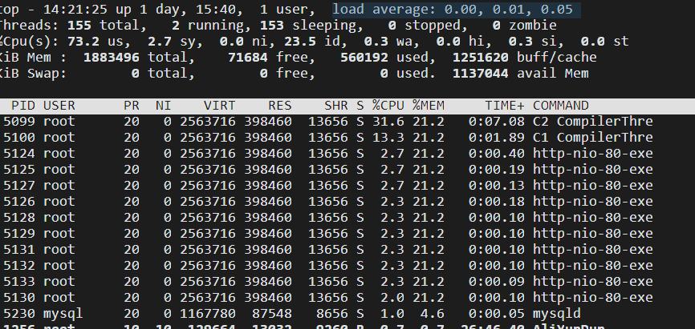
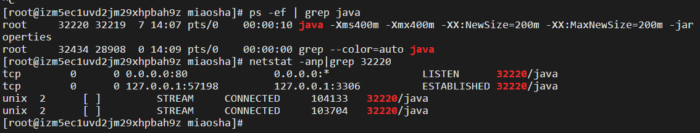

# 常用命令

```sh
#查看机器性能 CPU使用率，内存使用
top -H 
>>>load average: 0.06, 0.03, 0.05 最近1分钟，5分钟，15分钟  单核cpu不能超过1
>>>0.7 us,  0.7 sy  us代表用户对cpu占用率  sy代表内核

while死循环 us会很高，但load不高。load很高表示耗时操作很多，比如ioread，send，文件读写。
```



```sh
#查看进程 比如查看mysql是否启动了： 
ps -ef | grep mysql
#或者
ps -aux | grep mysql

#查看一下3306端口：
netstat -anp | grep 3306
#结果：
tcp   0  0 0.0.0.0:3306   0.0.0.0:*   LISTEN   2343/mysqld  
```

查看某个进程下的线程数量

```sh
查看java线程中的线程数量：
ps -ef | grep java
>>>5088

pstree -p 5088 | wc -l
>>>28   有28个
```


```sh
#添加环境变量
vim .bash_profile

#插入：
JAVA_HOME=//usr/java/jdk1.8.0_65
PATH=$PATH:$JAVA_HOME/bin  //在PATH的基础上拼接JAVA_HOME/bin

#刷新
source ~/.bash_profile

#通过jar包启动java程序  jar包可以用maven打包
java -jar xxx.jar
```

**外挂配置文件方式启动springboot：** 这样可以优先选择deploy脚本的配置，覆盖jar包中的application.proporties的配置。

```sh
#首先在项目文件夹下新建application proporties文件
vim application.properties
server.port=80   //修改服务端口为80端口

ls
>>>application.properties  xxx.jar

启动的时候选择配置文件
java -jar xxx.jar --spring.config.addition-location=application.properties的路径
#这样启动的java程序就要通过配置文件中的配置80端口--HTTP端口进行访问了
```

后台启动 用nohp + &

```sh
vim deploy.sh

#//启动一个守护线程：不退出应用程序
nohup java -Xms400m -Xmx400m -XX:NewSize=200m -XX:MaxNewSize=200m -jar 
xxx.jar --spring.config.addition-location=application.properties的路径

chmod -R 777 *

#启动：deploy脚本中的jar  后台启动 并且会把原本打印到控制台上的信息追加到nohup.out
./deploy.sh &

#查看最后200行
tail -200f nohup.out
```



80窗口正在监听，并且建立了TCP连接。

关闭后台运行的进程：

```sh
kill -9 32220(后台运行的java程序的进程号)
```


OpenResty® 是一个基于 [Nginx](http://openresty.org/cn/nginx.html) 与 Lua 的高性能 Web 平台，其内部集成了大量精良的 Lua 库、第三方模块以及大多数的依赖项。用于方便地搭建能够处理超高并发、扩展性极高的动态 Web 应用、Web 服务和动态网关。

```sh
openResty部署nginx
#解压
tar -xvzf openResty.tar.gz

#openResty安装前需要先安装几个东西
yum install pcre-devel openssl-devel gcc curl

#编译
./configure

#编译完成之后，安装  会安装到user/local目录下
make install

#启动nginx  在openresty/nginx/目录下
sbin/nginx -c conf/nginx.conf    #以conf/nginx.conf配置文件，启动nginx

默认在后台启动80端口
```

**nginx前端资源部署**
把前端的资源文件全部发送到openresty/nginx/html/文件夹下

```sh
scp -r * root@ip地址://usr/local/openresty/nginx/html

#查看nginx的配置
vim //usr/localopenresty/nginx/conf/nginx.conf 
```


