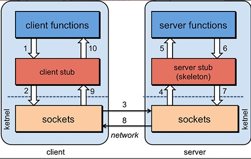
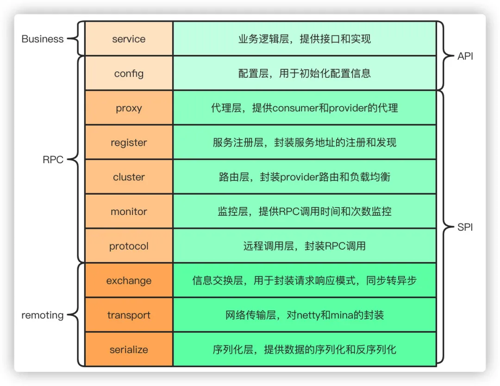
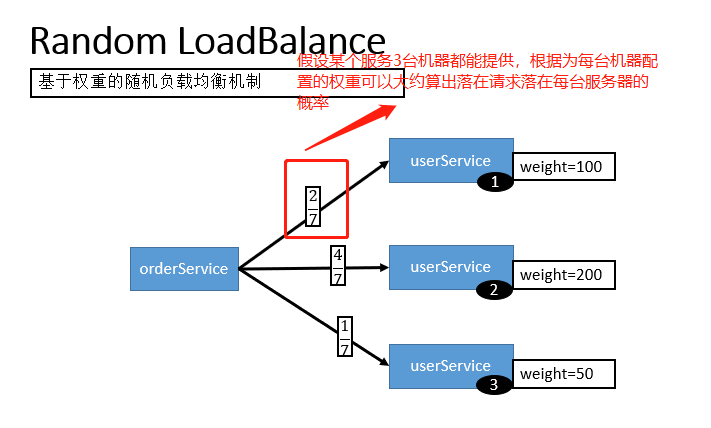
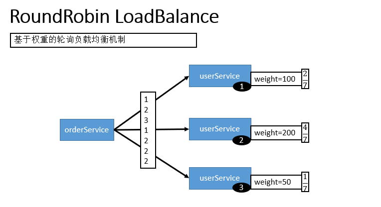

[《超详细，新手都能看懂 ！使用SpringBoot+Dubbo 搭建一个简单的分布式服务》](https://mp.weixin.qq.com/s?__biz=MzU4NDQ4MzU5OA==&mid=2247484706&idx=1&sn=d413fc17023482f67ca17cb6756b9ff8&chksm=fd985343caefda555969568fdf4734536e0a1745f9de337d434a7dbd04e893bd2d75f3641aab&token=1902169190&lang=zh_CN#rd)

[Dubbo 一篇文章就够了：从入门到实战](https://segmentfault.com/a/1190000019896723)

# RPC基础

### 如果让你实现一个RPC框架怎么设计？

1. 首先需要一个服务注册中心，这样consumer和provider才能去注册和订阅服务
2. 需要负载均衡的机制来决定consumer如何调用客户端，这其中还当然要包含容错和重试的机制
3. 需要通信协议和工具框架，比如通过http或者rmi的协议通信，然后再根据协议选择使用什么框架和工具来进行通信，当然，数据的传输序列化要考虑
4. 除了基本的要素之外，像一些监控、配置管理页面、日志是额外的优化考虑因素。

那么，本质上，只要熟悉一两个RPC框架，就很容易想明白我们自己要怎么实现一个RPC框架。


### 什么是 RPC?RPC原理是什么?

**什么是 RPC？**

RPC（Remote Procedure Call）—远程过程调用，它是一种通过网络从远程计算机程序上请求服务，而不需要了解底层网络技术的协议。比如两个不同的服务 A、B 部署在两台不同的机器上，那么服务 A 如果想要调用服务 B 中的某个方法该怎么办呢？使用 HTTP请求当然可以，但是可能会比较麻烦。 RPC 的出现就是为了让你调用远程方法像调用本地方法一样简单。

**RPC原理是什么？**

详细内容可以查看下面这篇文章：

[http://www.importnew.com/22003.html](http://www.importnew.com/22003.html)




1. 服务消费方（client）调用以本地调用方式调用服务；
2. client stub接收到调用后负责将方法、参数等组装成能够进行网络传输的消息体；
3. client stub找到服务地址，并将消息发送到服务端；
4. server stub收到消息后进行解码；
5. server stub根据解码结果调用本地的服务；
6. 本地服务执行并将结果返回给server stub；
7. server stub将返回结果打包成消息并发送至消费方；
8. client stub接收到消息，并进行解码；
9. 服务消费方得到最终结果。

下面再贴一个网上的时序图：


### RPC 解决了什么问题？

从上面对 RPC 介绍的内容中，概括来讲RPC 主要解决了：**让分布式或者微服务系统中不同服务之间的调用像本地调用一样简单。**

### 常见的 RPC 框架总结?

- **RMI（JDK自带）：** JDK自带的RPC，有很多局限性，不推荐使用。
- **Dubbo:** Dubbo是 阿里巴巴公司开源的一个高性能优秀的服务框架，使得应用可通过高性能的 RPC 实现服务的输出和输入功能，可以和 Spring框架无缝集成。目前 Dubbo 已经成为 Spring Cloud Alibaba 中的官方组件。
- **gRPC** ：gRPC是可以在任何环境中运行的现代开源高性能RPC框架。它可以通过可插拔的支持来有效地连接数据中心内和跨数据中心的服务，以实现负载平衡，跟踪，运行状况检查和身份验证。它也适用于分布式计算的最后一英里，以将设备，移动应用程序和浏览器连接到后端服务。
- **Hessian：** Hessian是一个轻量级的remotingonhttp工具，使用简单的方法提供了RMI的功能。 相比WebService，Hessian更简单、快捷。采用的是二进制RPC协议，因为采用的是二进制协议，所以它很适合于发送二进制数据。
- **Thrift：**  Apache Thrift是Facebook开源的跨语言的RPC通信框架，目前已经捐献给Apache基金会管理，由于其跨语言特性和出色的性能，在很多互联网公司得到应用，有能力的公司甚至会基于thrift研发一套分布式服务框架，增加诸如服务注册、服务发现等功能。 **字节实习的时候用的这个。**


## 既然有 HTTP ,为啥用 RPC 进行服务调用?

### RPC 只是一种设计而已

RPC 只是一种概念、一种设计，就是为了解决 **不同服务之间的调用问题**, 它一般会包含有 **传输协议** 和 **序列化协议** 这两个。

但是，HTTP  是一种协议，RPC框架可以使用 HTTP协议作为传输协议或者直接使用TCP作为传输协议，使用不同的协议一般也是为了适应不同的场景。

### RPC框架功能更齐全

成熟的 RPC框架还提供好了**“服务自动注册与发现”、"智能负载均衡"、“可视化的服务治理和运维”、“运行期流量调度”**等等功能，这些也算是选择
RPC 进行服务注册和发现的一方面原因吧！


# Dubbo

> Dubbo 官网：http://dubbo.apache.org/zh-cn/index.html
>
> Dubbo 中文文档： **http://dubbo.apache.org/zh-cn/index.html**

面试中dubbo的问题一般不会很多，从分层到工作原理、负载均衡策略、容错机制、SPI机制基本就差不多了，最大的一道大题一般就是怎么设计一个RPC框架了，但是如果你工作原理分层都搞明白了这个问题其实也就相当于回答了不是吗。

Apache Dubbo (incubating) 是一款高性能、轻量级的开源Java RPC 框架，它提供了三大核心能力：**面向接口的远程方法调用，智能容错和负载均衡，以及服务自动注册和发现。**简单来说 Dubbo 是一个分布式服务框架，致力于提供高性能和透明化的RPC远程服务调用方案，以及SOA服务治理方案。

Dubbo 目前已经有接近 23k 的 Star ，Dubbo的Github 地址：[https://github.com/apache/incubator-dubbo](https://github.com/apache/incubator-dubbo) 。 另外，在开源中国举行的2018年度最受欢迎中国开源软件这个活动的评选中，Dubbo 更是凭借其超高人气仅次于 vue.js 和 ECharts 获得第三名的好成绩。

Dubbo 是由阿里开源，后来加入了 Apache 。正式由于 Dubbo 的出现，才使得越来越多的公司开始使用以及接受分布式架构。


## 为什么要用 Dubbo?

Dubbo 的诞生和 SOA 分布式架构的流行有着莫大的关系。SOA 面向服务的架构（Service Oriented Architecture），也就是把工程按照业务逻辑拆分成服务层、表现层两个工程。服务层中包含业务逻辑，只需要对外提供服务即可。表现层只需要处理和页面的交互，业务逻辑都是调用服务层的服务来实现。SOA架构中有两个主要角色：服务提供者（Provider）和服务使用者（Consumer）。


**如果你要开发分布式程序，你也可以直接基于 HTTP 接口进行通信，但是为什么要用 Dubbo呢？**

我觉得主要可以从 Dubbo 提供的下面四点特性来说为什么要用 Dubbo：

1. **负载均衡**——同一个服务部署在不同的机器时该调用那一台机器上的服务。
2. **服务调用链路生成**——随着系统的发展，服务越来越多，服务间依赖关系变得错踪复杂，甚至分不清哪个应用要在哪个应用之前启动，架构师都不能完整的描述应用的架构关系。Dubbo 可以为我们解决服务之间互相是如何调用的。
3. **服务访问压力以及时长统计、资源调度和治理**——基于访问压力实时管理集群容量，提高集群利用率。
4. **服务降级**——某个服务挂掉之后调用备用服务。

另外，Dubbo 除了能够应用在分布式系统中，也可以应用在现在比较火的微服务系统中。不过，由于 Spring Cloud 在微服务中应用更加广泛，所以，我觉得一般我们提 Dubbo 的话，大部分是分布式系统的情况。

**我们刚刚提到了分布式这个概念，下面再给大家介绍一下什么是分布式？为什么要分布式？**

### 什么是分布式?

分布式或者说 SOA 分布式重要的就是面向服务，说简单的分布式就是我们把整个系统拆分成不同的服务然后将这些服务放在不同的服务器上减轻单体服务的压力提高并发量和性能。比如电商系统可以简单地拆分成订单系统、商品系统、登录系统等等，拆分之后的每个服务可以部署在不同的机器上，如果某一个服务的访问量比较大的话也可以将这个服务同时部署在多台机器上。

### 为什么要分布式?

从开发角度来讲单体应用的代码都集中在一起，而分布式系统的代码根据业务被拆分。所以，每个团队可以负责一个服务的开发，这样提升了开发效率。另外，代码根据业务拆分之后更加便于维护和扩展。

另外，我觉得将系统拆分成分布式之后不光便于系统扩展和维护，更能提高整个系统的性能。你想一想嘛？把整个系统拆分成不同的服务/系统，然后每个服务/系统 单独部署在一台服务器上，是不是很大程度上提高了系统性能呢？


## Dubbo 的架构

### Dubbo 的架构图解


**上述节点简单说明：**

- **Provider：**    暴露服务的服务提供方
- **Consumer：**    调用远程服务的服务消费方
- **Registry：**    服务注册与发现的注册中心
- **Monitor：**     统计服务的调用次数和调用时间的监控中心
- **Container：**   服务运行容器

**调用关系说明：**

1. 服务容器负责启动，加载，运行服务提供者。
2. 服务提供者在启动时，向注册中心注册自己提供的服务。
3. 服务消费者在启动时，向注册中心订阅自己所需的服务。
4. 注册中心返回服务提供者地址列表给消费者，同时consumer会把provider信息缓存到本地。如果有变更，注册中心将基于长连接推送变更数据给消费者。
5. 服务消费者，生成代理对象。从提供者地址列表中，基于软负载均衡算法，选一台provider。拿到代理对象之后，consumer通过代理对象发起接口调用。进行调用，如果调用失败，再选另一台调用。
6. provider收到请求后对数据进行反序列化，然后通过代理调用具体的接口实现
7. 服务消费者和提供者，在内存中累计调用次数和调用时间，定时每分钟发送一次统计数据到监控中心。

**重要知识点总结：**

- **注册中心Register负责服务地址的注册与查找，相当于目录服务，服务提供者和消费者只在启动时与注册中心交互，注册中心不转发请求，压力较小**
- **监控中心Monitor负责统计各服务调用次数，调用时间等，统计先在内存汇总后每分钟一次发送到监控中心服务器，并以报表展示**
- **注册中心，服务提供者，服务消费者三者之间均为长连接，监控中心除外**
- **注册中心通过长连接感知服务提供者的存在，服务提供者宕机，注册中心将立即推送事件通知消费者**
- **注册中心和监控中心全部宕机，不影响已运行的提供者和消费者，消费者在本地缓存了提供者列表**
- **注册中心和监控中心都是可选的，服务消费者可以直连服务提供者**
- **服务提供者无状态，任意一台宕掉后，不影响使用**
- **服务提供者全部宕掉后，服务消费者应用将无法使用，并无限次重连等待服务提供者恢复**

### 为什么要通过代理对象通信？

主要是为了实现接口的透明代理，封装调用细节，让用户可以像调用本地方法一样调用远程方法，同时还可以通过代理实现一些其他的策略，比如：

1、调用的负载均衡策略

2、调用失败、超时、降级和容错机制

3、做一些过滤操作，比如加入缓存、mock数据

4、接口调用数据统计

### Dubbo 工作原理




图中从下至上分为十层，各层均为单向依赖，右边的黑色箭头代表层之间的依赖关系，每一层都可以剥离上层被复用，其中，Service 和 Config 层为 API，其它各层均为 SPI。

**各层说明**：

- 第一层：**service层**，接口层，给服务提供者和消费者来实现的
- 第二层：**config层**，配置层，主要是对dubbo进行各种配置的
- 第三层：**proxy层**，服务接口透明代理，生成服务的客户端 Stub 和服务器端 Skeleton
- 第四层：**registry层**，服务注册层，负责服务的注册与发现
- 第五层：**cluster层**，集群层，封装多个服务提供者的路由以及负载均衡，将多个实例组合成一个服务
- 第六层：**monitor层**，监控层，对rpc接口的调用次数和调用时间进行监控
- 第七层：**protocol层**，远程调用层，封装rpc调用
- 第八层：**exchange层**，信息交换层，封装请求响应模式，同步转异步
- 第九层：**transport层**，网络传输层，抽象mina和netty为统一接口
- 第十层：**serialize层**，数据序列化层，网络传输需要

### 说说服务暴露的流程？

1. 在容器启动的时候，通过ServiceConfig解析标签，创建dubbo标签解析器来解析dubbo的标签，容器创建完成之后，触发ContextRefreshEvent事件回调开始暴露服务
2. 通过ProxyFactory获取到invoker，invoker包含了需要执行的方法的对象信息和具体的URL地址
3. 再通过DubboProtocol的实现把包装后的invoker转换成exporter，然后启动服务器server，监听端口
4. 最后RegistryProtocol保存URL地址和invoker的映射关系，同时注册到服务中心


### 说说服务引用的流程？

服务暴露之后，客户端就要引用服务，然后才是调用的过程。

1. 首先客户端根据配置文件信息从注册中心订阅服务

2. 之后DubboProtocol根据订阅的得到provider地址和接口信息连接到服务端server，开启客户端client，然后创建invoker

3. invoker创建完成之后，通过invoker为服务接口生成代理对象，这个代理对象用于远程调用provider，服务的引用就完成了

   

## Dubbo 的负载均衡策略

### 先来解释一下什么是负载均衡

**先来个官方的解释。**

> 维基百科对负载均衡的定义：负载均衡改善了跨多个计算资源（例如计算机，计算机集群，网络链接，中央处理单元或磁盘驱动的的工作负载分布。负载平衡旨在优化资源使用，最大化吞吐量，最小化响应时间，并避免任何单个资源的过载。使用具有负载平衡而不是单个组件的多个组件可以通过冗余提高可靠性和可用性。负载平衡通常涉及专用软件或硬件。

**上面讲的大家可能不太好理解，再用通俗的话给大家说一下。**

比如我们的系统中的某个服务的访问量特别大，我们将这个服务部署在了多台服务器上，当客户端发起请求的时候，多台服务器都可以处理这个请求。那么，如何正确选择处理该请求的服务器就很关键。假如，你就要一台服务器来处理该服务的请求，那该服务部署在多台服务器的意义就不复存在了。负载均衡就是为了避免单个服务器响应同一请求，容易造成服务器宕机、崩溃等问题，我们从负载均衡的这四个字就能明显感受到它的意义。

### 再来看看 Dubbo 提供的负载均衡策略

在集群负载均衡时，Dubbo 提供了多种均衡策略，默认为 `random` 随机调用。可以自行扩展负载均衡策略，参见：[负载均衡扩展](https://dubbo.gitbooks.io/dubbo-dev-book/content/impls/load-balance.html)。

####  Random LoadBalance(默认，加权随机)

假设我们有一组服务器 servers = [A, B, C]，他们对应的权重为 weights = [5, 3, 2]，权重总和为10。现在把这些权重值平铺在一维坐标值上，[0, 5) 区间属于服务器 A，[5, 8) 区间属于服务器 B，[8, 10) 区间属于服务器 C。接下来通过随机数生成器生成一个范围在 [0, 10) 之间的随机数，然后计算这个随机数会落到哪个区间上就可以了。

- **随机，按权重设置随机概率。**
- 在一个截面上碰撞的概率高，但调用量越大分布越均匀，而且按概率使用权重后也比较均匀，有利于动态调整提供者权重。




####   RoundRobin LoadBalance(不推荐，加权轮询)

加权轮询：比如服务器 A、B、C 权重比为 5:2:1，那么在8次请求中，服务器 A 将收到其中的5次请求，服务器 B 会收到其中的2次请求，服务器 C 则收到其中的1次请求。

- 轮循，按公约后的权重设置轮循比率。
- 存在慢的提供者累积请求的问题，比如：第二台机器很慢，但没挂，当请求调到第二台时就卡在那，久而久之，所有请求都卡在调到第二台上。



####  LeastActive LoadBalance 最小活跃数

最小活跃数：每个服务提供者对应一个活跃数 active，初始情况下，所有服务提供者活跃数均为0。每收到一个请求，活跃数加1，完成请求后则将活跃数减1。在服务运行一段时间后，**性能好的服务提供者处理请求的速度更快，因此活跃数下降的也越快，此时这样的服务提供者能够优先获取到新的服务请求。**

- 最少活跃调用数，相同活跃数的随机，活跃数指调用前后计数差。
- 使慢的提供者收到更少请求，因为越慢的提供者的调用前后计数差会越大。

####  ConsistentHash LoadBalance

通过hash算法，把provider的invoke和随机节点生成hash，并将这个 hash 投射到 [0, 2^32 - 1] 的圆环上，查询的时候根据key进行md5然后进行hash，得到第一个节点的值大于等于当前hash的invoker。

- **一致性 Hash，相同参数的请求总是发到同一提供者。(如果你需要的不是随机负载均衡，是要一类请求都到一个节点，那就走这个一致性hash策略。)**
- 当某一台提供者挂时，原本发往该提供者的请求，基于虚拟节点，平摊到其它提供者，不会引起剧烈变动。
- 算法参见：http://en.wikipedia.org/wiki/Consistent_hashing
- 缺省只对第一个参数 Hash，如果要修改，请配置 `<dubbo:parameter key="hash.arguments" value="0,1" />`
- 缺省用 160 份虚拟节点，如果要修改，请配置 `<dubbo:parameter key="hash.nodes" value="320" />`

### 配置方式

**xml 配置方式**

服务端服务级别

```java
<dubbo:service interface="..." loadbalance="roundrobin" />
```

客户端服务级别

```java
<dubbo:reference interface="..." loadbalance="roundrobin" />
```

服务端方法级别

```java
<dubbo:service interface="...">
    <dubbo:method name="..." loadbalance="roundrobin"/>
</dubbo:service>
```

客户端方法级别

```java
<dubbo:reference interface="...">
    <dubbo:method name="..." loadbalance="roundrobin"/>
</dubbo:reference>
```

**注解配置方式：**

消费方基于基于注解的服务级别配置方式：

```java
@Reference(loadbalance = "roundrobin")
HelloService helloService;
```

### 了解Dubbo SPI机制吗？

SPI 全称为 Service Provider Interface，是一种服务发现机制，本质是将接口实现类的全限定名配置在文件中，并由服务加载器读取配置文件，加载实现类，这样可以在运行时，动态为接口替换实现类。

Dubbo也正是通过SPI机制实现了众多的扩展功能，而且dubbo没有使用java原生的SPI机制，而是对齐进行了增强和改进。

SPI在dubbo应用很多，包括协议扩展、集群扩展、路由扩展、序列化扩展等等。

使用方式可以在META-INF/dubbo目录下配置：

```
key=com.xxx.value
```

然后通过dubbo的ExtensionLoader按照指定的key加载对应的实现类，这样做的好处就是可以按需加载，性能上得到优化。

## 集群容错方式有哪些？

1. Failover Cluster失败自动切换：dubbo的默认容错方案，当调用失败时自动切换到其他可用的节点，具体的重试次数和间隔时间可用通过引用服务的时候配置，默认重试次数为1也就是只调用一次。
2. Failback Cluster失败自动恢复：在调用失败，记录日志和调用信息，然后返回空结果给consumer，并且通过定时任务每隔5秒对失败的调用进行重试
3. Failfast Cluster快速失败：只会调用一次，失败后立刻抛出异常
4. Failsafe Cluster失败安全：调用出现异常，记录日志不抛出，返回空结果
5. Forking Cluster并行调用多个服务提供者：通过线程池创建多个线程，并发调用多个provider，结果保存到阻塞队列，只要有一个provider成功返回了结果，就会立刻返回结果
6. Broadcast Cluster广播模式：逐个调用每个provider，如果其中一台报错，在循环调用结束后，抛出异常。


## zookeeper宕机与dubbo直连的情况

zookeeper宕机与dubbo直连的情况在面试中可能会被经常问到，所以要引起重视。

在实际生产中，假如zookeeper注册中心宕掉，一段时间内服务消费方还是能够调用提供方的服务的，实际上**它使用的本地缓存进行通讯**，这只是dubbo健壮性的一种体现。

**dubbo的健壮性表现：**

1. 监控中心宕掉不影响使用，只是丢失部分采样数据
2. 数据库宕掉后，注册中心仍能通过缓存提供服务列表查询，但不能注册新服务
3. 注册中心对等集群，任意一台宕掉后，将自动切换到另一台
4. 注册中心全部宕掉后，服务提供者和服务消费者仍能通过本地缓存通讯
5. 服务提供者无状态，任意一台宕掉后，不影响使用
6. 服务提供者全部宕掉后，服务消费者应用将无法使用，并无限次重连等待服务提供者恢复

我们前面提到过：注册中心负责服务地址的注册与查找，相当于目录服务，服务提供者和消费者只在启动时与注册中心交互，注册中心不转发请求，压力较小。所以，我们可以完全可以绕过注册中心——采用 **dubbo 直连** ，即在服务消费方配置服务提供方的位置信息。


**xml配置方式：**

```xml
<dubbo:reference id="userService" interface="com.zang.gmall.service.UserService" url="dubbo://localhost:20880" />
```

**注解方式：**

```java
 @Reference(url = "127.0.0.1:20880")   
 HelloService helloService;
```


