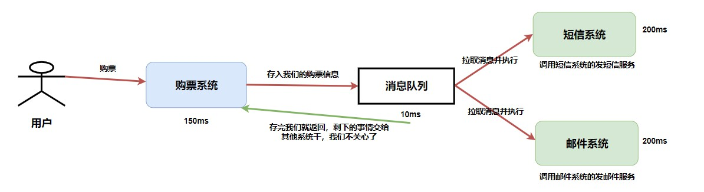
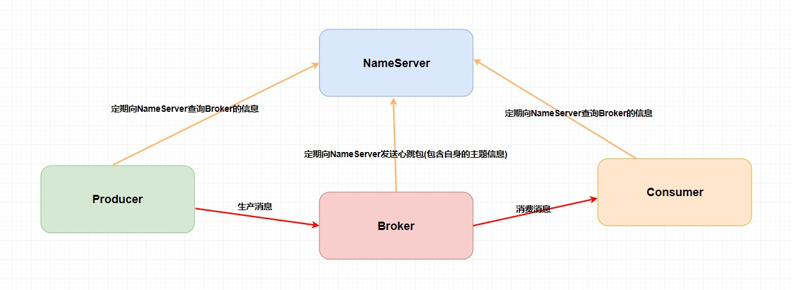
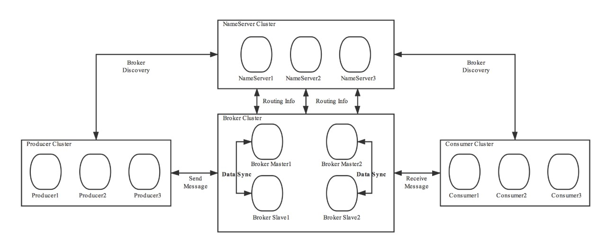
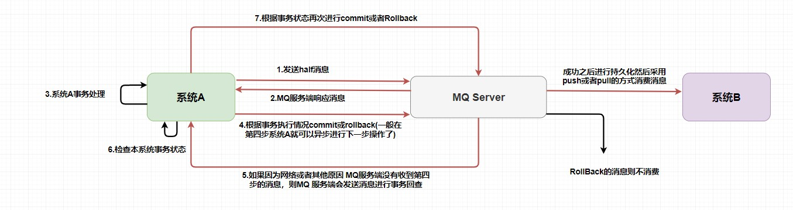
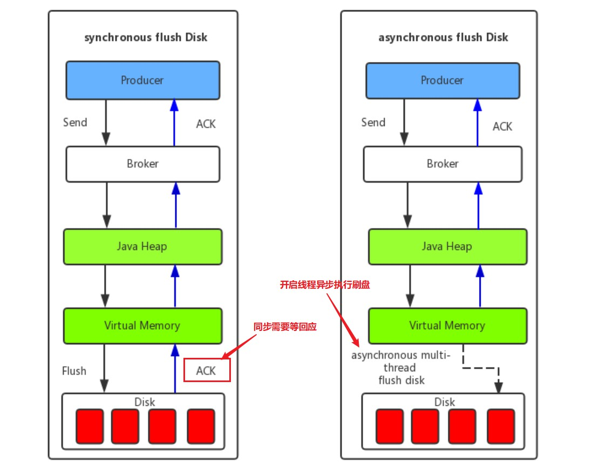
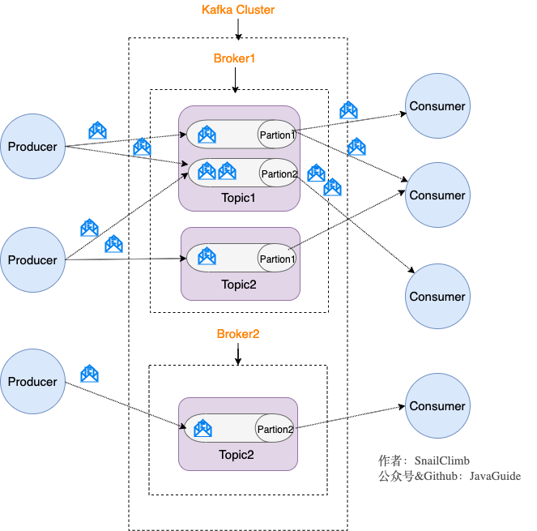

# 基础

消息队列算是作为后端程序员的一个必备技能吧，因为**分布式应用必定涉及到各个系统之间的通信问题**，这个时候消息队列也应运而生了。可以说分布式的产生是消息队列的基础，而分布式怕是一个很古老的概念了吧，所以消息队列也是一个很古老的中间件了。

我们可以把消息队列比作是一个存放消息的容器，当我们需要使用消息的时候可以取出消息供自己使用。消息队列是分布式系统中重要的组件，使用消息队列主要是**为了通过异步处理提高系统性能和削峰、降低系统耦合性。**目前使用较多的消息队列有ActiveMQ，RabbitMQ，Kafka，RocketMQ。


## 为什么要用消息队列

**<font color=red>异步、削峰、解耦</font>**

1. **通过异步处理提高系统性能（减少响应所需时间）。**
2. **削峰/限流**
3. **降低系统耦合性。**

如果在面试的时候你被面试官问到这个问题的话，一般情况是你在你的简历上涉及到消息队列这方面的内容，这个时候推荐你结合你自己的项目来回答。


## 异步

==**核心：无需等待。**==

**同步**：必须等对方回应我之后，我才会继续做下一件事情。现在业界使用比较多的 `Dubbo` 就是一个适用于各个系统之间同步通信的 `RPC` 框架。

**异步**：不必等对方回应我，我继续做我的其他事情。

**异步举例：**

**用户的请求数据发送给消息队列之后立即返回**，再由消息队列的**消费者进程**从消息队列中获取数据，**异步写入数据库。**由于消息队列服务器处理速度快于数据库（消息队列也比数据库有更好的伸缩性），因此**响应速度得到大幅改善。**

使用消息队列进行异步处理之后，需要**适当修改业务流程进行配合**，比如用户在提交订单之后，订单数据写入消息队列，不能立即返回用户订单提交成功，需要在消息队列的订单消费者进程真正处理完该订单之后，甚至出库后，再通过电子邮件或短信通知用户订单成功，以免交易纠纷。这就类似我们平时手机订火车票和电影票。

## 削峰

先将**短时间高并发产生的事务消息**存储在消息队列中，然后处理速度比较慢的服务再慢慢**根据自己的能力去消费**这些消息，这样就避免直接把后端服务打垮掉。

压力转嫁到MQ，消息可以海量堆积在MQ。

在电子商务一些秒杀、促销活动中，合理使用消息队列可以有效抵御促销活动刚开始大量订单涌入对系统的冲击。

## 解耦

**微服务开发。分布式通信** 基于事件（消息对象）驱动的业务架构

消息队列使利用发布-订阅模式工作，消息发送者（生产者）发布消息，一个或多个消息接受者（消费者）订阅消息。 消息发送者（生产者）和消息接受者（消费者）之间没有直接耦合，消息发送者将消息发送至分布式消息队列即结束对消息的处理，消息接受者从分布式消息队列获取该消息后进行后续处理，并不需要知道该消息从何而来。**对新增业务，只要对该类消息感兴趣，即可订阅该消息，对原有系统和业务没有任何影响，从而实现网站业务的可扩展性设计**。

如果没有消息队列，每当一个新的业务接入，我们都要在主系统调用新接口、或者当我们取消某些业务，我们也得在主系统删除某些接口调用。有了消息队列，我们只需要关心消息是否送达了队列，至于谁希望订阅，接下来收到消息如何处理，是下游的事情，无疑极大地减少了开发和联调的工作量。

**备注：**在解耦这个特定业务环境下是使用发布-订阅模式的。**除了发布-订阅模式，还有点对点订阅模式（一个消息只有一个消费者），我们比较常用的是发布-订阅模式。** 另外，这两种消息模型是 JMS 提供的，AMQP 协议还提供了 5 种消息模型。


## 副作用

- **系统可用性降低：** 系统可用性在某种程度上降低，为什么这样说呢？在加入MQ之前，你不用考虑消息丢失或者说MQ挂掉等等的情况，但是，引入MQ之后你就需要去考虑了！
- **系统复杂性提高：** 加入MQ之后，你需要保证消息没有被重复消费、处理消息丢失的情况、保证消息传递的顺序性等等问题！
- **一致性问题：** 比如写数据库的场景：万一消息的真正消费者并没有正确消费消息怎么办？这样就会导致数据不一致的情况了!
  - 在同一个系统中我们一般会使用事务来进行解决，如果用 `Spring` 的话我们在上面伪代码中加入 `@Transactional` 注解就好了。但是在不同系统中如何保证事务呢？总不能这个系统我扣钱成功了你那积分系统积分没加吧？或者说我这扣钱明明失败了，你那积分系统给我加了积分。
- **重复消息消费。**发送方发送失败了，然后执行重试，这样就可能产生重复的消息。
- **如何解决消息的顺序消费问题**
- **解决消息堆积的问题** 


JMS（JAVA Message Service,java消息服务）是java的消息服务，JMS的客户端之间可以通过JMS服务进行异步的消息传输。**JMS（JAVA Message Service，Java消息服务）API是一个消息服务的标准或者说是规范**，允许应用程序组件基于JavaEE平台创建、发送、接收和读取消息。它使分布式通信耦合度更低，消息服务更加可靠以及异步性。

**ActiveMQ 就是基于 JMS 规范实现的。**


AMQP，即Advanced Message Queuing Protocol，一个提供统一消息服务的应用层标准 **高级消息队列协议**（二进制应用层协议），是应用层协议的一个开放标准，为面向消息的中间件设计，兼容 JMS。基于此协议的客户端与消息中间件可传递消息，并**不受客户端/中间件同产品，不同的开发语言等条件的限制。**

**RabbitMQ 就是基于 AMQP 协议实现的。**


# 常用消息队列

| 对比方向 | 概要                                                         |
| -------- | ------------------------------------------------------------ |
| 吞吐量   | 万级： ActiveMQ 和 RabbitMQ 的吞吐量（ActiveMQ 的性能最差）十万级：Kafka和RocketMQ |
| 可用性   | 都可以实现高可用。**ActiveMQ 和 RabbitMQ 都是基于主从架构**实现高可用性。**RocketMQ 和kafka 是分布式架构**，一个数据多个副本，少数机器宕机，不会丢失数据，不会导致不可用 |
| 时效性   | RabbitMQ 基于erlang开发，所以并发能力很强，性能极其好，延时很低，达到微秒级。其他三个都是 ms 级。 |
| 功能支持 | 除了 Kafka，其他三个功能都较为完备。 Kafka 功能较为简单，主要支持简单的MQ功能，**Kafka在大数据领域的实时计算以及日志采集被大规模使用，是事实上的标准** |
| 消息丢失 | ActiveMQ 和 RabbitMQ 丢失的可能性非常低， RocketMQ 和 Kafka 理论上不会丢失。 |

**性能对比**

Kafka的吞吐量高达17.3w/s。这主要取决于它的队列模式**保证了写磁盘的过程是顺序IO。**此时broker磁盘IO已达瓶颈。

RocketMQ吞吐量在11.6w/s，磁盘IO %util已接近100%。RocketMQ的消息**写入内存后即返回ack，由单独的线程专门做刷盘操作，所有的消息均是顺序写文件。**

RabbitMQ的吞吐量5.95w/s，CPU资源消耗较高。它支持AMQP协议，实现非常重量级，为了保证消息的可靠性而降低了吞吐量。RabbitMQ在消息持久化场景下，吞吐量在2.6w/s左右


**总结：**

- ActiveMQ 的社区算是比较成熟，但是较目前来说，**ActiveMQ 的性能比较差，而且版本迭代很慢，不推荐使用。**
- RabbitMQ 在吞吐量方面虽然稍逊于 Kafka 和 RocketMQ ，但是由于它基于 erlang 开发，所以**并发能力很强，性能极其好，延时很低，达到微秒级。**但是也因为 RabbitMQ 基于 erlang 开发，所以国内很少有公司有实力做erlang源码级别的研究和定制。如果业务场景对并发量要求不是太高（十万级、百万级），那这四种消息队列中，RabbitMQ 一定是你的首选。如果是大数据领域的实时计算、日志采集等场景，用 Kafka 是业内标准的，绝对没问题，社区活跃度很高，绝对不会黄，何况几乎是全世界这个领域的事实性规范。
- RocketMQ 具有**高性能、高可靠、高实时、分布式** 的特点。它是一个采用 Java 语言开发的分布式的消息系统，由阿里巴巴团队开发，在2016年底贡献给 Apache，成为了 Apache 的一个顶级项目。 在阿里内部，RocketMQ 很好地服务了集团大大小小上千个应用，在每年的双十一当天，更有不可思议的万亿级消息通过 RocketMQ 流转。只要知道 RocketMQ 很快、很牛、而且经历过双十一的实践就行了。源代码我们可以直接阅读，然后可以定制自己公司的MQ
- kafka 的特点其实很明显，就是仅仅提供较少的核心功能，但是提供超高的吞吐量，ms 级的延迟，极高的可用性以及可靠性，而且分布式可以任意扩展。同时 kafka 最好是支撑较少的 topic 数量即可，保证其超高吞吐量。kafka 唯一的一点劣势是有可能消息重复消费，那么对数据准确性会造成极其轻微的影响，在大数据领域中以及日志采集中，这点轻微影响可以忽略。这个特性天然适合大数据实时计算以及日志收集。


# RocketMQ原理

为了避免消息队列服务器宕机造成消息丢失，**会将成功发送到消息队列的消息存储在消息生产者服务器上，等消息真正被消费者服务器处理后才删除消息。**在消息队列服务器宕机后，生产者服务器会选择分布式消息队列服务器集群中的其他服务器发布消息。   


## 主题模型

> 结合观察者模式

**主题模型/发布订阅模型** 。

在主题模型中，消息的生产者称为 **发布者(Publisher)** ，消息的消费者称为**订阅者(Subscriber)** ，存放消息的容器称为 **主题(Topic)** 。

其中，发布者将消息发送到指定主题中，订阅者需要 **提前订阅主题** 才能接受特定主题的消息。

`RocketMQ` 通过**使用在一个 `Topic` 中配置多个队列并且每个队列维护每个消费者组的消费位置**提高并发能力，实现了**主题模式/发布订阅模式** 。

`RocketMQ` 技术架构中有四大角色 `NameServer` 、`Broker` 、`Producer` 、`Consumer` 。



- `Broker`： 主要负责消息的存储、投递和查询以及服务高可用保证。说白了就是消息队列服务器嘛，生产者生产消息到 `Broker` ，消费者从 `Broker` 拉取消息并消费。

  **一个 `Topic` 分布在多个 `Broker`上，一个 `Broker` 可以配置多个 `Topic` ，它们是多对多的关系**。

  如果某个 `Topic` 消息量很大，应该给它多配置几个队列(提高并发能力)，并且 **尽量多分布在不同 `Broker` 上，以减轻某个 `Broker` 的压力** 。

  `Topic` 消息量都比较均匀的情况下，如果某个 `broker` 上的队列越多，则该 `broker` 压力越大。

- `NameServer`： **不知道你们有没有接触过 `ZooKeeper` 和 `Spring Cloud` 中的 `Eureka` ，它其实也是一个 注册中心** ，主要提供两个功能：**Broker管理** 和 **路由信息管理** 。说白了就是 `Broker` 会将自己的信息注册到 `NameServer` 中，此时 `NameServer` 就存放了很多 `Broker` 的信息(Broker的路由表)，消费者和生产者就从 `NameServer` 中获取路由表然后照着路由表的信息和对应的 `Broker` 进行通信(生产者和消费者定期会向 `NameServer` 去查询相关的 `Broker` 的信息)。
- `Producer`： 消息发布的角色，支持分布式集群方式部署。说白了就是生产者。
- `Consumer`： 消息消费的角色，支持分布式集群方式部署。支持以push推，pull拉两种模式对消息进行消费。同时也支持集群方式和广播方式的消费，它提供实时消息订阅机制。


`NameServer` 干啥用的，这不多余吗？直接 `Producer` 、`Consumer` 和 `Broker` 直接进行生产消息，消费消息不就好了么？

 `Broker` 是需要保证高可用的，如果整个系统仅仅靠着一个 `Broker` 来维持的话，那么这个 `Broker` 的压力会不会很大？所以我们需要使用多个 `Broker` 来保证 **负载均衡** 。

如果说，我们的消费者和生产者直接和多个 `Broker` 相连，那么当 `Broker` 修改的时候必定会牵连着每个生产者和消费者，这样就会产生耦合问题，而 `NameServer` 注册中心就是用来解决这个问题的。


当然，`RocketMQ` 中的技术架构肯定不止前面那么简单，因为上面图中的四个角色都是需要做集群的。我给出一张官网的架构图，大家尝试理解一下。



其实和我们最开始画的那张乞丐版的架构图也没什么区别，主要是一些细节上的差别。听我细细道来🤨。

第一、我们的 `Broker` **做了集群并且还进行了主从部署** ，由于消息分布在各个 `Broker` 上，一旦某个 `Broker` 宕机，则该`Broker` 上的消息读写都会受到影响。所以 `Rocketmq` 提供了 `master/slave` 的结构，` salve` 定时从 `master` 同步数据(同步刷盘或者异步刷盘)，如果 `master` 宕机，**则 `slave` 提供消费服务，但是不能写入消息** (后面我还会提到哦)。

第二、为了保证 `HA` ，我们的 `NameServer` 也做了集群部署，但是请注意它是 **去中心化** 的。也就意味着它没有主节点，你可以很明显地看出 `NameServer` 的所有节点是没有进行 `Info Replicate` 的，在 `RocketMQ` 中是通过 **单个Broker和所有NameServer保持长连接** ，并且在每隔30秒 `Broker` 会向所有 `Nameserver` 发送心跳，心跳包含了自身的 `Topic` 配置信息，这个步骤就对应这上面的 `Routing Info` 。

第三、在生产者需要向 `Broker` 发送消息的时候，**需要先从 `NameServer` 获取关于 `Broker` 的路由信息**，然后通过 **轮询** 的方法去向每个队列中生产数据以达到 **负载均衡** 的效果。

第四、消费者通过 `NameServer` 获取所有 `Broker` 的路由信息后，向 `Broker` 发送 `Pull` 请求来获取消息数据。`Consumer` 可以以两种模式启动—— **广播（Broadcast）和集群（Cluster）**。广播模式下，一条消息会发送给 **同一个消费组中的所有消费者** ，集群模式下消息只会发送给一个消费者。


## 顺序消费

在上面的技术架构介绍中，我们已经知道了 **`RocketMQ` 在主题上是无序的、它只有在队列层面才是保证有序** 的。

这又扯到两个概念——**普通顺序** 和 **严格顺序** 。

所谓普通顺序是指 消费者通过 **同一个消费队列收到的消息是有顺序的** ，不同消息队列收到的消息则可能是无顺序的。普通顺序消息在 `Broker` **重启情况下不会保证消息顺序性** (短暂时间) 。

所谓严格顺序是指 消费者收到的 **所有消息** 均是有顺序的。严格顺序消息 **即使在异常情况下也会保证消息的顺序性** 。

但是，严格顺序看起来虽好，实现它可会付出巨大的代价。如果你使用严格顺序模式，`Broker` 集群中只要有一台机器不可用，则整个集群都不可用。你还用啥？现在主要场景也就在 `binlog` 同步。

一般而言，我们的 `MQ` 都是能容忍短暂的乱序，所以推荐使用普通顺序模式。

那么，我们现在使用了 **普通顺序模式** ，我们从上面学习知道了在 `Producer` 生产消息的时候会进行轮询(取决你的负载均衡策略)来向同一主题的不同消息队列发送消息。那么如果此时我有几个消息分别是同一个订单的创建、支付、发货，在轮询的策略下这 **三个消息会被发送到不同队列** ，因为在不同的队列此时就无法使用 `RocketMQ` 带来的队列有序特性来保证消息有序性了。

那么，怎么解决呢？

其实很简单，我们需要处理的仅仅是将同一语义下的消息放入同一个队列(比如这里是同一个订单)，那我们就可以使用 **Hash取模法** 来保证同一个订单在同一个队列中就行了。


## 重复消费

emmm，就两个字—— **幂等** 。

在编程中一个*幂等* 操作的特点是其任意多次执行所产生的影响均与一次执行的影响相同。比如说，这个时候我们有一个订单的处理积分的系统，每当来一个消息的时候它就负责为创建这个订单的用户的积分加上相应的数值。可是有一次，消息队列发送给订单系统 FrancisQ 的订单信息，其要求是给 FrancisQ 的积分加上 500。但是积分系统在收到 FrancisQ 的订单信息处理完成之后返回给消息队列处理成功的信息的时候出现了网络波动(当然还有很多种情况，比如Broker意外重启等等)，这条回应没有发送成功。

那么，消息队列没收到积分系统的回应会不会尝试重发这个消息？问题就来了，我再发这个消息，万一它又给 FrancisQ 的账户加上 500 积分怎么办呢？

所以我们需要给我们的消费者实现 **幂等** ，也就是对同一个消息的处理结果，执行多少次都不变。

那么如何给业务实现幂等呢？这个还是需要结合具体的业务的。你可以使用 **写入 `Redis`** 来保证，因为 `Redis` 的 `key` 和 `value` 就是天然支持幂等的。当然还有使用 **数据库插入法** ，基于数据库的唯一键来保证重复数据不会被插入多条。

不过最主要的还是需要 **根据特定场景使用特定的解决方案** ，你要知道你的消息消费是否是完全不可重复消费还是可以忍受重复消费的，然后再选择强校验和弱校验的方式。毕竟在 CS 领域还是很少有技术银弹的说法。

而在整个互联网领域，幂等不仅仅适用于消息队列的重复消费问题，这些实现幂等的方法，也同样适用于，**在其他场景中来解决重复请求或者重复调用的问题** 。比如将HTTP服务设计成幂等的，**解决前端或者APP重复提交表单数据的问题** ，也可以将一个微服务设计成幂等的，解决 `RPC` 框架自动重试导致的 **重复调用问题** 。


## 分布式事务

如何解释分布式事务呢？事务大家都知道吧？**要么都执行要么都不执行** 。在同一个系统中我们可以轻松地实现事务，但是在分布式架构中，我们有很多服务是部署在不同系统之间的，而不同服务之间又需要进行调用。比如此时我下订单然后增加积分，如果保证不了分布式事务的话，就会出现A系统下了订单，但是B系统增加积分失败或者A系统没有下订单，B系统却增加了积分。前者对用户不友好，后者对运营商不利，这是我们都不愿意见到的。

那么，如何去解决这个问题呢？

如今比较常见的分布式事务实现有 2PC、TCC 和事务消息(half 半消息机制)。每一种实现都有其特定的使用场景，但是也有各自的问题，**都不是完美的解决方案**。

在 `RocketMQ` 中使用的是 **事务消息加上事务反查机制** 来解决分布式事务问题的。我画了张图，大家可以对照着图进行理解。



在第一步发送的 half 消息 ，它的意思是 **在事务提交之前，对于消费者来说，这个消息是不可见的** 。

> 那么，如何做到写入消息但是对用户不可见呢？RocketMQ事务消息的做法是：如果消息是half消息，将备份原消息的主题与消息消费队列，然后 **改变主题** 为RMQ_SYS_TRANS_HALF_TOPIC。由于消费组未订阅该主题，故消费端无法消费half类型的消息，**然后RocketMQ会开启一个定时任务，从Topic为RMQ_SYS_TRANS_HALF_TOPIC中拉取消息进行消费**，根据生产者组获取一个服务提供者发送回查事务状态请求，根据事务状态来决定是提交或回滚消息。

你可以试想一下，如果没有从第5步开始的 **事务反查机制** ，如果出现网路波动第4步没有发送成功，这样就会产生 MQ 不知道是不是需要给消费者消费的问题，他就像一个无头苍蝇一样。在 `RocketMQ` 中就是使用的上述的事务反查来解决的，而在 `Kafka` 中通常是直接抛出一个异常让用户来自行解决。

你还需要注意的是，在 `MQ Server` 指向系统B的操作已经和系统A不相关了，也就是说在消息队列中的分布式事务是——**本地事务和存储消息到消息队列才是同一个事务**。这样也就产生了事务的**最终一致性**，因为整个过程是异步的，**每个系统只要保证它自己那一部分的事务就行了**。


## 消息堆积问题

在上面我们提到了消息队列一个很重要的功能——**削峰** 。那么如果这个峰值太大了导致消息堆积在队列中怎么办呢？

其实这个问题可以将它广义化，因为产生消息堆积的根源其实就只有两个——生产者生产太快或者消费者消费太慢。

我们可以从多个角度去思考解决这个问题，当流量到峰值的时候是因为生产者生产太快，我们可以使用一些 **限流降级** 的方法，当然你也可以增加多个消费者实例去水平扩展增加消费能力来匹配生产的激增。如果消费者消费过慢的话，我们可以先检查 **是否是消费者出现了大量的消费错误** ，或者打印一下日志查看是否是哪一个线程卡死，出现了锁资源不释放等等的问题。

> 当然，最快速解决消息堆积问题的方法还是增加消费者实例，不过**同时你还需要增加每个主题的队列数量** 。
>
> 别忘了在 `RocketMQ` 中，**一个队列只会被一个消费者消费** ，如果你仅仅是增加消费者实例就会出现我一开始给你画架构图的那种情况。


## 回溯消费

回溯消费是指 `Consumer` 已经消费成功的消息，由于业务上需求需要重新消费，在`RocketMQ` 中， `Broker` 在向`Consumer` 投递成功消息后，**消息仍然需要保留** 。并且重新消费一般是按照时间维度，例如由于 `Consumer` 系统故障，恢复后需要重新消费1小时前的数据，那么 `Broker` 要提供一种机制，可以按照时间维度来回退消费进度。`RocketMQ` 支持按照时间回溯消费，时间维度精确到毫秒。

这是官方文档的解释，我直接照搬过来就当科普了😁😁😁。


## RocketMQ 的刷盘机制

上面我讲了那么多的 `RocketMQ` 的架构和设计原理，你有没有好奇

在 `Topic` 中的 **队列是以什么样的形式存在的？**

**队列中的消息又是如何进行存储持久化的呢？**

我在上文中提到的 **同步刷盘** 和 **异步刷盘** 又是什么呢？它们会给持久化带来什么样的影响呢？

下面我将给你们一一解释。

### 同步刷盘和异步刷盘



如上图所示，在同步刷盘中需要等待一个刷盘成功的 `ACK` ，同步刷盘对 `MQ` 消息可靠性来说是一种不错的保障，但是 **性能上会有较大影响** ，一般地适用于金融等特定业务场景。

而异步刷盘往往是开启一个线程去异步地执行刷盘操作。消息刷盘采用后台异步线程提交的方式进行， **降低了读写延迟** ，提高了 `MQ` 的性能和吞吐量，一般适用于如发验证码等对于消息保证要求不太高的业务场景。

一般地，**异步刷盘只有在 `Broker` 意外宕机的时候会丢失部分数据**，你可以设置 `Broker` 的参数 `FlushDiskType` 来调整你的刷盘策略(ASYNC_FLUSH 或者 SYNC_FLUSH)。

### 同步复制和异步复制

上面的同步刷盘和异步刷盘是在单个结点层面的，而同步复制和异步复制主要是指的 `Borker` 主从模式下，主节点返回消息给客户端的时候是否需要同步从节点。

- 同步复制： 也叫 “同步双写”，也就是说，**只有消息同步双写到主从结点上时才返回写入成功** 。
- 异步复制： **消息写入主节点之后就直接返回写入成功** 。

然而，很多事情是没有完美的方案的，就比如我们进行消息写入的节点越多就更能保证消息的可靠性，但是随之的性能也会下降，所以需要程序员根据特定业务场景去选择适应的主从复制方案。

那么，**异步复制会不会也像异步刷盘那样影响消息的可靠性呢？**

答案是不会的，因为两者就是不同的概念，对于消息可靠性是通过不同的刷盘策略保证的，而像异步同步复制策略仅仅是影响到了 **可用性** 。为什么呢？其主要原因**是 `RocketMQ` 是不支持自动主从切换的，当主节点挂掉之后，生产者就不能再给这个主节点生产消息了**。

比如这个时候采用异步复制的方式，在主节点还未发送完需要同步的消息的时候主节点挂掉了，这个时候从节点就少了一部分消息。但是此时生产者无法再给主节点生产消息了，**消费者可以自动切换到从节点进行消费**(仅仅是消费)，所以在主节点挂掉的时间只会产生主从结点短暂的消息不一致的情况，降低了可用性，而当主节点重启之后，从节点那部分未来得及复制的消息还会继续复制。

在单主从架构中，如果一个主节点挂掉了，那么也就意味着整个系统不能再生产了。那么这个可用性的问题能否解决呢？**一个主从不行那就多个主从的呗**，别忘了在我们最初的架构图中，每个 `Topic` 是分布在不同 `Broker` 中的。

但是这种复制方式同样也会带来一个问题，那就是无法保证 **严格顺序** 。在上文中我们提到了如何保证的消息顺序性是通过将一个语义的消息发送在同一个队列中，使用 `Topic` 下的队列来保证顺序性的。如果此时我们主节点A负责的是订单A的一系列语义消息，然后它挂了，这样其他节点是无法代替主节点A的，如果我们任意节点都可以存入任何消息，那就没有顺序性可言了。

而在 `RocketMQ` 中采用了 `Dledger` 解决这个问题。他要求在写入消息的时候，要求**至少消息复制到半数以上的节点之后**，才给客⼾端返回写⼊成功，并且它是⽀持通过选举来动态切换主节点的。这里我就不展开说明了，读者可以自己去了解。

> 也不是说 `Dledger` 是个完美的方案，至少在 `Dledger` 选举过程中是无法提供服务的，而且他必须要使用三个节点或以上，如果多数节点同时挂掉他也是无法保证可用性的，而且要求消息复制板书以上节点的效率和直接异步复制还是有一定的差距的。


### 存储机制

还记得上面我们一开始的三个问题吗？到这里第三个问题已经解决了。

但是，在 `Topic` 中的 **队列是以什么样的形式存在的？队列中的消息又是如何进行存储持久化的呢？** 还未解决，其实这里涉及到了 `RocketMQ` 是如何设计它的存储结构了。我首先想大家介绍 `RocketMQ` 消息存储架构中的三大角色——`CommitLog` 、`ConsumeQueue` 和 `IndexFile` 。

- `CommitLog`： **消息主体以及元数据的存储主体**，存储 `Producer` 端写入的消息主体内容,消息内容不是定长的。单个文件大小默认1G ，文件名长度为20位，左边补零，剩余为起始偏移量，比如00000000000000000000代表了第一个文件，起始偏移量为0，文件大小为1G=1073741824；当第一个文件写满了，第二个文件为00000000001073741824，起始偏移量为1073741824，以此类推。消息主要是**顺序写入日志文件**，当文件满了，写入下一个文件。
- `ConsumeQueue`： 消息消费队列，**引入的目的主要是提高消息消费的性能**(我们再前面也讲了)，由于`RocketMQ` 是基于主题 `Topic` 的订阅模式，消息消费是针对主题进行的，如果要遍历 `commitlog` 文件中根据 `Topic` 检索消息是非常低效的。`Consumer` 即可根据 `ConsumeQueue` 来查找待消费的消息。其中，`ConsumeQueue`（逻辑消费队列）**作为消费消息的索引**，保存了指定 `Topic` 下的队列消息在 `CommitLog` 中的**起始物理偏移量 `offset` \**，消息大小 `size` 和消息 `Tag` 的 `HashCode` 值。**`consumequeue` 文件可以看成是基于 `topic` 的 `commitlog` 索引文件**，故 `consumequeue` 文件夹的组织方式如下：topic/queue/file三层组织结构，具体存储路径为：$HOME/store/consumequeue/{topic}/{queueId}/{fileName}。同样 `consumequeue` 文件采取定长设计，每一个条目共20个字节，分别为8字节的 `commitlog` 物理偏移量、4字节的消息长度、8字节tag `hashcode`，单个文件由30W个条目组成，可以像数组一样随机访问每一个条目，每个 `ConsumeQueue`文件大小约5.72M；
- `IndexFile`： `IndexFile`（索引文件）提供了一种可以通过key或时间区间来查询消息的方法。这里只做科普不做详细介绍。

总结来说，整个消息存储的结构，最主要的就是 `CommitLoq` 和 `ConsumeQueue` 。而 `ConsumeQueue` 你可以大概理解为 `Topic` 中的队列。


`RocketMQ` 采用的是 **混合型的存储结构** ，即为 `Broker` 单个实例下所有的队列共用一个日志数据文件来存储消息。有意思的是在同样高并发的 `Kafka` 中会为每个 `Topic` 分配一个存储文件。这就有点类似于我们有一大堆书需要装上书架，`RockeMQ` 是不分书的种类直接成批的塞上去的，而 `Kafka` 是将书本放入指定的分类区域的。

而 `RocketMQ` 为什么要这么做呢？原因是 **提高数据的写入效率** ，不分 `Topic` 意味着我们有更大的几率获取 **成批** 的消息进行数据写入，但也会带来一个麻烦就是读取消息的时候需要遍历整个大文件，这是非常耗时的。

所以，在 `RocketMQ` 中又使用了 `ConsumeQueue` 作为每个队列的索引文件来 **提升读取消息的效率**。我们可以直接根据队列的消息序号，计算出索引的全局位置（索引序号*索引固定⻓度20），然后直接读取这条索引，再根据索引中记录的消息的全局位置，找到消息。

讲到这里，你可能对 `RockeMQ` 的存储架构还有些模糊，没事，我们结合着图来理解一下。


本文来自读者 [PR](https://github.com/Snailclimb/JavaGuide/pull/291)。
<!-- TOC -->

- [1 单机版消息中心](#1-%E5%8D%95%E6%9C%BA%E7%89%88%E6%B6%88%E6%81%AF%E4%B8%AD%E5%BF%83)
- [2 分布式消息中心](#2-%E5%88%86%E5%B8%83%E5%BC%8F%E6%B6%88%E6%81%AF%E4%B8%AD%E5%BF%83)
  - [2.1 问题与解决](#21-%E9%97%AE%E9%A2%98%E4%B8%8E%E8%A7%A3%E5%86%B3)
    - [2.1.1 消息丢失的问题](#211-%E6%B6%88%E6%81%AF%E4%B8%A2%E5%A4%B1%E7%9A%84%E9%97%AE%E9%A2%98)
    - [2.1.2 同步落盘怎么才能快](#212-%E5%90%8C%E6%AD%A5%E8%90%BD%E7%9B%98%E6%80%8E%E4%B9%88%E6%89%8D%E8%83%BD%E5%BF%AB)
    - [2.1.3 消息堆积的问题](#213-%E6%B6%88%E6%81%AF%E5%A0%86%E7%A7%AF%E7%9A%84%E9%97%AE%E9%A2%98)
    - [2.1.4 定时消息的实现](#214-%E5%AE%9A%E6%97%B6%E6%B6%88%E6%81%AF%E7%9A%84%E5%AE%9E%E7%8E%B0)
    - [2.1.5 顺序消息的实现](#215-%E9%A1%BA%E5%BA%8F%E6%B6%88%E6%81%AF%E7%9A%84%E5%AE%9E%E7%8E%B0)
    - [2.1.6 分布式消息的实现](#216-%E5%88%86%E5%B8%83%E5%BC%8F%E6%B6%88%E6%81%AF%E7%9A%84%E5%AE%9E%E7%8E%B0)
    - [2.1.7 消息的 push 实现](#217-%E6%B6%88%E6%81%AF%E7%9A%84-push-%E5%AE%9E%E7%8E%B0)
    - [2.1.8 消息重复发送的避免](#218-%E6%B6%88%E6%81%AF%E9%87%8D%E5%A4%8D%E5%8F%91%E9%80%81%E7%9A%84%E9%81%BF%E5%85%8D)
    - [2.1.9 广播消费与集群消费](#219-%E5%B9%BF%E6%92%AD%E6%B6%88%E8%B4%B9%E4%B8%8E%E9%9B%86%E7%BE%A4%E6%B6%88%E8%B4%B9)
    - [2.1.10 RocketMQ 不使用 ZooKeeper 作为注册中心的原因，以及自制的 NameServer 优缺点？](#2110-rocketmq-%E4%B8%8D%E4%BD%BF%E7%94%A8-zookeeper-%E4%BD%9C%E4%B8%BA%E6%B3%A8%E5%86%8C%E4%B8%AD%E5%BF%83%E7%9A%84%E5%8E%9F%E5%9B%A0%E4%BB%A5%E5%8F%8A%E8%87%AA%E5%88%B6%E7%9A%84-nameserver-%E4%BC%98%E7%BC%BA%E7%82%B9)
    - [2.1.11 其它](#2111-%E5%85%B6%E5%AE%83)
- [3 参考](#3-%E5%8F%82%E8%80%83)

<!-- TOC -->

# 1 单机版消息中心

一个消息中心，最基本的需要支持多生产者、多消费者，例如下：

```java
class Scratch {

    public static void main(String[] args) {
        // 实际中会有 nameserver 服务来找到 broker 具体位置以及 broker 主从信息
        Broker broker = new Broker();
        Producer producer1 = new Producer();
        producer1.connectBroker(broker);
        Producer producer2 = new Producer();
        producer2.connectBroker(broker);

        Consumer consumer1 = new Consumer();
        consumer1.connectBroker(broker);
        Consumer consumer2 = new Consumer();
        consumer2.connectBroker(broker);

        for (int i = 0; i < 2; i++) {
            producer1.asyncSendMsg("producer1 send msg" + i);
            producer2.asyncSendMsg("producer2 send msg" + i);
        }
        System.out.println("broker has msg:" + broker.getAllMagByDisk());

        for (int i = 0; i < 1; i++) {
            System.out.println("consumer1 consume msg：" + consumer1.syncPullMsg());
        }
        for (int i = 0; i < 3; i++) {
            System.out.println("consumer2 consume msg：" + consumer2.syncPullMsg());
        }
    }

}

class Producer {

    private Broker broker;

    public void connectBroker(Broker broker) {
        this.broker = broker;
    }

    public void asyncSendMsg(String msg) {
        if (broker == null) {
            throw new RuntimeException("please connect broker first");
        }
        new Thread(() -> {
            broker.sendMsg(msg);
        }).start();
    }
}

class Consumer {
    private Broker broker;

    public void connectBroker(Broker broker) {
        this.broker = broker;
    }

    public String syncPullMsg() {
        return broker.getMsg();
    }

}

class Broker {

    // 对应 RocketMQ 中 MessageQueue，默认情况下 1 个 Topic 包含 4 个 MessageQueue
    private LinkedBlockingQueue<String> messageQueue = new LinkedBlockingQueue(Integer.MAX_VALUE);

    // 实际发送消息到 broker 服务器使用 Netty 发送
    public void sendMsg(String msg) {
        try {
            messageQueue.put(msg);
            // 实际会同步或异步落盘，异步落盘使用的定时任务定时扫描落盘
        } catch (InterruptedException e) {

        }
    }

    public String getMsg() {
        try {
            return messageQueue.take();
        } catch (InterruptedException e) {

        }
        return null;
    }

    public String getAllMagByDisk() {
        StringBuilder sb = new StringBuilder("\n");
        messageQueue.iterator().forEachRemaining((msg) -> {
            sb.append(msg + "\n");
        });
        return sb.toString();
    }
}
```

问题：  

1. 没有实现真正执行消息存储落盘
2. 没有实现 NameServer 去作为注册中心，定位服务
3. 使用 LinkedBlockingQueue 作为消息队列，注意，参数是无限大，在真正 RocketMQ 也是如此是无限大，理论上不会出现对进来的数据进行抛弃，但是会有内存泄漏问题（阿里巴巴开发手册也因为这个问题，建议我们使用自制线程池）  
4. 没有使用多个队列（即多个 LinkedBlockingQueue），RocketMQ 的顺序消息是通过生产者和消费者同时使用同一个 MessageQueue 来实现，但是如果我们只有一个 MessageQueue，那我们天然就支持顺序消息
5. 没有使用 MappedByteBuffer 来实现文件映射从而使消息数据落盘非常的快（实际 RocketMQ 使用的是 FileChannel+DirectBuffer）


## 2.1 问题与解决

### 2.1.1 消息丢失的问题

1. 当你系统需要保证百分百消息不丢失，你可以使用生产者每发送一个消息，Broker 同步返回一个消息发送成功的反馈消息
2. 即每发送一个消息，同步落盘后才返回生产者消息发送成功，这样只要生产者得到了消息发送生成的返回，事后除了硬盘损坏，都可以保证不会消息丢失
3. 但是这同时引入了一个问题，同步落盘怎么才能快？

### 2.1.2 同步落盘怎么才能快

1. 使用 FileChannel + DirectBuffer 池，使用堆外内存，加快内存拷贝  
2. 使用数据和索引分离，当消息需要写入时，使用 commitlog 文件顺序写，当需要定位某个消息时，查询index 文件来定位，从而减少文件IO随机读写的性能损耗

### 2.1.3 消息堆积的问题

1. 后台定时任务每隔72小时，删除旧的没有使用过的消息信息  
2. 根据不同的业务实现不同的丢弃任务，具体参考线程池的 AbortPolicy，例如FIFO/LRU等（RocketMQ没有此策略）  
3. 消息定时转移，或者对某些重要的 TAG 型（支付型）消息真正落库

### 2.1.4 定时消息的实现

1. 实际 RocketMQ 没有实现任意精度的定时消息，它只支持某些特定的时间精度的定时消息
2. 实现定时消息的原理是：创建特定时间精度的 MessageQueue，例如生产者需要定时1s之后被消费者消费，你只需要将此消息发送到特定的 Topic，例如：MessageQueue-1 表示这个 MessageQueue 里面的消息都会延迟一秒被消费，然后 Broker 会在 1s 后发送到消费者消费此消息，使用 newSingleThreadScheduledExecutor 实现

### 2.1.5 顺序消息的实现

1. 与定时消息同原理，生产者生产消息时指定特定的 MessageQueue ，消费者消费消息时，消费特定的 MessageQueue，其实单机版的消息中心在一个 MessageQueue 就天然支持了顺序消息
2. 注意：同一个 MessageQueue 保证里面的消息是顺序消费的前提是：消费者是串行的消费该 MessageQueue，因为就算 MessageQueue 是顺序的，但是当并行消费时，还是会有顺序问题，但是串行消费也同时引入了两个问题：

>1. 引入锁来实现串行
>2. 前一个消费阻塞时后面都会被阻塞

### 2.1.6 分布式消息的实现

1. 需要前置知识：2PC  
2. RocketMQ4.3 起支持，原理为2PC，即两阶段提交，prepared->commit/rollback
3. 生产者发送事务消息，假设该事务消息 Topic 为 Topic1-Trans，Broker 得到后首先更改该消息的 Topic 为 Topic1-Prepared，该 Topic1-Prepared 对消费者不可见。然后定时回调生产者的本地事务A执行状态，根据本地事务A执行状态，来是否将该消息修改为 Topic1-Commit 或 Topic1-Rollback，消费者就可以正常找到该事务消息或者不执行等

>注意，就算是事务消息最后回滚了也不会物理删除，只会逻辑删除该消息

### 2.1.7 消息的 push 实现

1. 注意，RocketMQ 已经说了自己会有低延迟问题，其中就包括这个消息的 push 延迟问题
2. 因为这并不是真正的将消息主动的推送到消费者，而是 Broker 定时任务每5s将消息推送到消费者

### 2.1.8 消息重复发送的避免

1. RocketMQ 会出现消息重复发送的问题，因为在网络延迟的情况下，这种问题不可避免的发生，如果非要实现消息不可重复发送，那基本太难，因为网络环境无法预知，还会使程序复杂度加大，因此默认允许消息重复发送
2. RocketMQ 让使用者在消费者端去解决该问题，即需要消费者端在消费消息时支持幂等性的去消费消息
3. 最简单的解决方案是每条消费记录有个消费状态字段，根据这个消费状态字段来是否消费或者使用一个集中式的表，来存储所有消息的消费状态，从而避免重复消费
4. 具体实现可以查询关于消息幂等消费的解决方案

### 2.1.9 广播消费与集群消费

1. 消息消费区别：广播消费，订阅该 Topic 的消息者们都会消费**每个**消息。集群消费，订阅该 Topic 的消息者们只会有一个去消费**某个**消息
2. 消息落盘区别：具体表现在消息消费进度的保存上。广播消费，由于每个消费者都独立的去消费每个消息，因此每个消费者各自保存自己的消息消费进度。而集群消费下，订阅了某个 Topic，而旗下又有多个 MessageQueue，每个消费者都可能会去消费不同的 MessageQueue，因此总体的消费进度保存在 Broker 上集中的管理

### 2.1.10 RocketMQ 不使用 ZooKeeper 作为注册中心的原因，以及自制的 NameServer 优缺点？

1. ZooKeeper 作为支持顺序一致性的中间件，在某些情况下，它为了满足一致性，会丢失一定时间内的可用性，RocketMQ 需要注册中心只是为了发现组件地址，在某些情况下，RocketMQ 的注册中心可以出现数据不一致性，这同时也是 NameServer 的缺点，因为 NameServer 集群间互不通信，它们之间的注册信息可能会不一致
2. 另外，当有新的服务器加入时，NameServer 并不会立马通知到 Produer，而是由 Produer 定时去请求 NameServer 获取最新的 Broker/Consumer 信息（这种情况是通过 Producer 发送消息时，负载均衡解决）

### 2.1.11 其它

![][1]

加分项咯 

1. 包括组件通信间使用 Netty 的自定义协议
2. 消息重试负载均衡策略（具体参考 Dubbo 负载均衡策略）
3. 消息过滤器（Producer 发送消息到 Broker，Broker 存储消息信息，Consumer 消费时请求 Broker 端从磁盘文件查询消息文件时,在 Broker 端就使用过滤服务器进行过滤）  
4. Broker 同步双写和异步双写中 Master 和 Slave 的交互
5. Broker 在 4.5.0 版本更新中引入了基于 Raft 协议的多副本选举，之前这是商业版才有的特性 [ISSUE-1046][2]

### 3 参考

1. 《RocketMQ技术内幕》：https://blog.csdn.net/prestigeding/article/details/85233529
2. 关于 RocketMQ 对 MappedByteBuffer 的一点优化：https://lishoubo.github.io/2017/09/27/MappedByteBuffer%E7%9A%84%E4%B8%80%E7%82%B9%E4%BC%98%E5%8C%96/
3. 阿里中间件团队博客-十分钟入门RocketMQ：http://jm.taobao.org/2017/01/12/rocketmq-quick-start-in-10-minutes/
4. 分布式事务的种类以及 RocketMQ 支持的分布式消息：https://www.infoq.cn/article/2018/08/rocketmq-4.3-release
5. 滴滴出行基于RocketMQ构建企业级消息队列服务的实践：https://yq.aliyun.com/articles/664608
6. 基于《RocketMQ技术内幕》源码注释：https://github.com/LiWenGu/awesome-rocketmq

[1]: https://leran2deeplearnjavawebtech.oss-cn-beijing.aliyuncs.com/somephoto/RocketMQ%E6%B5%81%E7%A8%8B.png
[2]: http://rocketmq.apache.org/release_notes/release-notes-4.5.0/


## 那你们使用什么mq？基于什么做的选型？

我们主要调研了几个主流的mq，kafka、rabbitmq、rocketmq、activemq，选型我们主要基于以下几个点去考虑：

1. 由于我们系统的qps压力比较大，所以性能是首要考虑的要素。
2. 开发语言，由于我们的开发语言是java，主要是为了方便二次开发。
3. 对于高并发的业务场景是必须的，所以需要支持分布式架构的设计。
4. 功能全面，由于不同的业务场景，可能会用到顺序消息、事务消息等。

基于以上几个考虑，我们最终选择了RocketMQ。

|            | Kafka              | RocketMQ                     | RabbitMQ               | ActiveMQ                 |
| :--------- | :----------------- | :--------------------------- | :--------------------- | :----------------------- |
| 单机吞吐量 | 10万级             | 10万级                       | 万级                   | 万级                     |
| 开发语言   | Scala              | Java                         | Erlang                 | Java                     |
| 高可用     | 分布式架构         | 分布式架构                   | 主从架构               | 主从架构                 |
| 性能       | ms级               | ms级                         | us级                   | ms级                     |
| 功能       | 只支持主要的MQ功能 | 顺序消息、事务消息等功能完善 | 并发强、性能好、延时低 | 成熟的社区产品、文档丰富 |

### 你上面提到异步发送，那消息可靠性怎么保证？

消息丢失可能发生在生产者发送消息、MQ本身丢失消息、消费者丢失消息3个方面。

#### 生产者丢失

生产者丢失消息的可能点在于程序发送失败抛异常了没有重试处理，或者发送的过程成功但是过程中网络闪断MQ没收到，消息就丢失了。

由于同步发送的一般不会出现这样使用方式，所以我们就不考虑同步发送的问题，我们基于异步发送的场景来说。

异步发送分为两个方式：**异步有回调和异步无回调**，无回调的方式，生产者发送完后不管结果可能就会造成消息丢失，而通过异步发送+回调通知+本地消息表的形式我们就可以做出一个解决方案。以下单的场景举例。

1. 下单后先保存本地数据和MQ消息表，这时候消息的状态是发送中，如果本地事务失败，那么下单失败，事务回滚。
2. 下单成功，直接返回客户端成功，异步发送MQ消息
3. MQ回调通知消息发送结果，对应更新数据库MQ发送状态
4. JOB轮询超过一定时间（时间根据业务配置）还未发送成功的消息去重试
5. 在监控平台配置或者JOB程序处理超过一定次数一直发送不成功的消息，告警，人工介入。


一般而言，对于大部分场景来说异步回调的形式就可以了，只有那种需要完全保证不能丢失消息的场景我们做一套完整的解决方案。

#### MQ丢失

如果生产者保证消息发送到MQ，而MQ收到消息后还在内存中，这时候宕机了又没来得及同步给从节点，就有可能导致消息丢失。

比如RocketMQ：

RocketMQ分为同步刷盘和异步刷盘两种方式，默认的是异步刷盘，就有可能导致消息还未刷到硬盘上就丢失了，可以通过设置为同步刷盘的方式来保证消息可靠性，这样即使MQ挂了，恢复的时候也可以从磁盘中去恢复消息。

比如Kafka也可以通过配置做到：

```
acks=all 只有参与复制的所有节点全部收到消息，才返回生产者成功。这样的话除非所有的节点都挂了，消息才会丢失。
replication.factor=N,设置大于1的数，这会要求每个partion至少有2个副本
min.insync.replicas=N，设置大于1的数，这会要求leader至少感知到一个follower还保持着连接
retries=N，设置一个非常大的值，让生产者发送失败一直重试
```

虽然我们可以通过配置的方式来达到MQ本身高可用的目的，但是都对性能有损耗，怎样配置需要根据业务做出权衡。

#### 消费者丢失

消费者丢失消息的场景：消费者刚收到消息，此时服务器宕机，MQ认为消费者已经消费，不会重复发送消息，消息丢失。

RocketMQ默认是需要消费者回复ack确认，而kafka需要手动开启配置关闭自动offset。

消费方不返回ack确认，重发的机制根据MQ类型的不同发送时间间隔、次数都不尽相同，如果重试超过次数之后会进入死信队列，需要手工来处理了。（Kafka没有这些）


#### 你说到消费者消费失败的问题，那么如果一直消费失败导致消息积压怎么处理？

因为考虑到时消费者消费一直出错的问题，那么我们可以从以下几个角度来考虑：

1. 消费者出错，肯定是程序或者其他问题导致的，如果容易修复，先把问题修复，让consumer恢复正常消费
2. 如果时间来不及处理很麻烦，做转发处理，写一个临时的consumer消费方案，先把消息消费，然后再转发到一个新的topic和MQ资源，这个新的topic的机器资源单独申请，要能承载住当前积压的消息
3. 处理完积压数据后，修复consumer，去消费新的MQ和现有的MQ数据，新MQ消费完成后恢复原状


#### 那如果消息积压达到磁盘上限，消息被删除了怎么办？

最初，我们发送的消息记录是落库保存了的，而转发发送的数据也保存了，那么我们就可以通过这部分数据来找到丢失的那部分数据，再单独跑个脚本重发就可以了。如果转发的程序没有落库，那就和消费方的记录去做对比，只是过程会更艰难一点。

### 说了这么多，那你说说RocketMQ实现原理吧？

RocketMQ由NameServer注册中心集群、Producer生产者集群、Consumer消费者集群和若干Broker（RocketMQ进程）组成，它的架构原理是这样的：

1. Broker在启动的时候去向所有的NameServer注册，并保持长连接，每30s发送一次心跳
2. Producer在发送消息的时候从NameServer获取Broker服务器地址，根据负载均衡算法选择一台服务器来发送消息
3. Conusmer消费消息的时候同样从NameServer获取Broker地址，然后主动拉取消息来消费

### 为什么RocketMQ不使用Zookeeper作为注册中心呢？

我认为有以下几个点是不使用zookeeper的原因：

1. 根据CAP理论，同时最多只能满足两个点，而zookeeper满足的是CP，也就是说zookeeper并不能保证服务的可用性，zookeeper在进行选举的时候，整个选举的时间太长，期间整个集群都处于不可用的状态，而这对于一个注册中心来说肯定是不能接受的，作为服务发现来说就应该是为可用性而设计。
2. 基于性能的考虑，NameServer本身的实现非常轻量，而且可以通过增加机器的方式水平扩展，增加集群的抗压能力，而zookeeper的写是不可扩展的，而zookeeper要解决这个问题只能通过划分领域，划分多个zookeeper集群来解决，首先操作起来太复杂，其次这样还是又违反了CAP中的A的设计，导致服务之间是不连通的。
3. 持久化的机制来带的问题，ZooKeeper 的 ZAB 协议对每一个写请求，会在每个 ZooKeeper 节点上保持写一个事务日志，同时再加上定期的将内存数据镜像（Snapshot）到磁盘来保证数据的一致性和持久性，而对于一个简单的服务发现的场景来说，这其实没有太大的必要，这个实现方案太重了。而且本身存储的数据应该是高度定制化的。
4. 消息发送应该弱依赖注册中心，而RocketMQ的设计理念也正是基于此，生产者在第一次发送消息的时候从NameServer获取到Broker地址后缓存到本地，如果NameServer整个集群不可用，短时间内对于生产者和消费者并不会产生太大影响。

### 那Broker是怎么保存数据的呢？

RocketMQ主要的存储文件包括commitlog文件、consumequeue文件、indexfile文件。

Broker在收到消息之后，会把消息保存到commitlog的文件当中，而同时在分布式的存储当中，每个broker都会保存一部分topic的数据，同时，每个topic对应的messagequeue下都会生成consumequeue文件用于保存commitlog的物理位置偏移量offset，indexfile中会保存key和offset的对应关系。

CommitLog文件保存于${Rocket_Home}/store/commitlog目录中，从图中我们可以明显看出来文件名的偏移量，每个文件默认1G，写满后自动生成一个新的文件。

由于同一个topic的消息并不是连续的存储在commitlog中，消费者如果直接从commitlog获取消息效率非常低，所以通过consumequeue保存commitlog中消息的偏移量的物理地址，这样消费者在消费的时候先从consumequeue中根据偏移量定位到具体的commitlog物理文件，然后根据一定的规则（offset和文件大小取模）在commitlog中快速定位。

#### Master和Slave之间是怎么同步数据的呢？

而消息在master和slave之间的同步是根据raft协议来进行的：

1. 在broker收到消息后，会被标记为uncommitted状态
2. 然后会把消息发送给所有的slave
3. slave在收到消息之后返回ack响应给master
4. master在收到超过半数的ack之后，把消息标记为committed
5. 发送committed消息给所有slave，slave也修改状态为committed

#### 你知道RocketMQ为什么速度快吗？

是因为使用了顺序存储、Page Cache和异步刷盘。

1. 我们在写入commitlog的时候是顺序写入的，这样比随机写入的性能就会提高很多
2. 写入commitlog的时候并不是直接写入磁盘，而是先写入操作系统的PageCache
3. 最后由操作系统异步将缓存中的数据刷到磁盘

### 什么是事务、半事务消息？怎么实现的？

事务消息就是MQ提供的类似XA的分布式事务能力，通过事务消息可以达到分布式事务的最终一致性。

半事务消息就是MQ收到了生产者的消息，但是没有收到二次确认，不能投递的消息。

实现原理如下：

1. 生产者先发送一条半事务消息到MQ
2. MQ收到消息后返回ack确认
3. 生产者开始执行本地事务
4. 如果事务执行成功发送commit到MQ，失败发送rollback
5. 如果MQ长时间未收到生产者的二次确认commit或者rollback，MQ对生产者发起消息回查
6. 生产者查询事务执行最终状态
7. 根据查询事务状态再次提交二次确认

最终，如果MQ收到二次确认commit，就可以把消息投递给消费者，反之如果是rollback，消息会保存下来并且在3天后被删除。


# Kafka原理

### 什么是Producer、Consumer、Broker、Topic、Partition

Kafka 将生产者发布的消息发送到 **Topic（主题）** 中，需要这些消息的消费者可以订阅这些 **Topic（主题）**，如下图所示：



上面这张图也为我们引出了，Kafka 比较重要的几个概念：

1. **Producer（生产者）** : 产生消息的一方。
2. **Consumer（消费者）** : 消费消息的一方。
3. **Broker（代理）** : 可以看作是一个独立的 Kafka 实例。多个 Kafka Broker 组成一个 Kafka Cluster。

同时，你一定也注意到每个 Broker 中又包含了 Topic 以及 Partition 这两个重要的概念：

- **Topic（主题）** : Producer 将消息发送到特定的主题，Consumer 通过订阅特定的 Topic(主题) 来消费消息。
- **Partition（分区）** : Partition 属于 Topic 的一部分。一个 Topic 可以有多个 Partition ，并且同一 Topic 下的 Partition 可以分布在不同的 Broker 上，这也就表明一个 Topic 可以横跨多个 Broker 。这正如我上面所画的图一样。

> 划重点：**Kafka 中的 Partition（分区） 实际上可以对应成为消息队列中的队列。这样是不是更好理解一点？**


### Kafka 的多副本机制了解吗？带来了什么好处

还有一点我觉得比较重要的是 Kafka 为分区（Partition）引入了多副本（Replica）机制。分区（Partition）中的多个副本之间会有一个叫做 leader 的家伙，其他副本称为 follower。我们发送的消息会被发送到 leader 副本，然后 follower 副本才能从 leader 副本中拉取消息进行同步。

> 生产者和消费者只与 leader 副本交互。你可以理解为其他副本只是 leader 副本的拷贝，它们的存在只是为了保证消息存储的安全性。当 leader 副本发生故障时会从 follower 中选举出一个 leader,但是 follower 中如果有和 leader 同步程度达不到要求的参加不了 leader 的竞选。

**Kafka 的多分区（Partition）以及多副本（Replica）机制有什么好处呢？**

1. Kafka 通过给特定 Topic 指定多个 Partition, 而各个 Partition 可以分布在不同的 Broker 上, 这样便能提供比较好的并发能力（负载均衡）。
2. Partition 可以指定对应的 Replica 数, 这也极大地提高了消息存储的安全性, 提高了容灾能力，不过也相应的增加了所需要的存储空间。


### Zookeeper 在 Kafka 中的作用知道吗？

1. **Broker 注册** ：在 Zookeeper 上会有一个专门**用来进行 Broker 服务器列表记录**的节点。每个 Broker 在启动时，都会到 Zookeeper 上进行注册，即到/brokers/ids 下创建属于自己的节点。每个 Broker 就会将自己的 IP 地址和端口等信息记录到该节点中去
2. **Topic 注册** ： 在 Kafka 中，同一个**Topic 的消息会被分成多个分区**并将其分布在多个 Broker 上，**这些分区信息及与 Broker 的对应关系**也都是由 Zookeeper 在维护。比如我创建了一个名字为 my-topic 的主题并且它有两个分区，对应到 zookeeper 中会创建这些文件夹：`/brokers/topics/my-topic/Partitions/0`、`/brokers/topics/my-topic/Partitions/1`
3. **负载均衡** ：上面也说过了 Kafka 通过给特定 Topic 指定多个 Partition, 而各个 Partition 可以分布在不同的 Broker 上, 这样便能提供比较好的并发能力。 对于同一个 Topic 的不同 Partition，Kafka 会尽力将这些 Partition 分布到不同的 Broker 服务器上。当生产者产生消息后也会尽量投递到不同 Broker 的 Partition 里面。当 Consumer 消费的时候，Zookeeper 可以根据当前的 Partition 数量以及 Consumer 数量来实现动态负载均衡。
4. ......