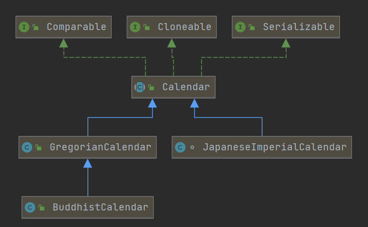
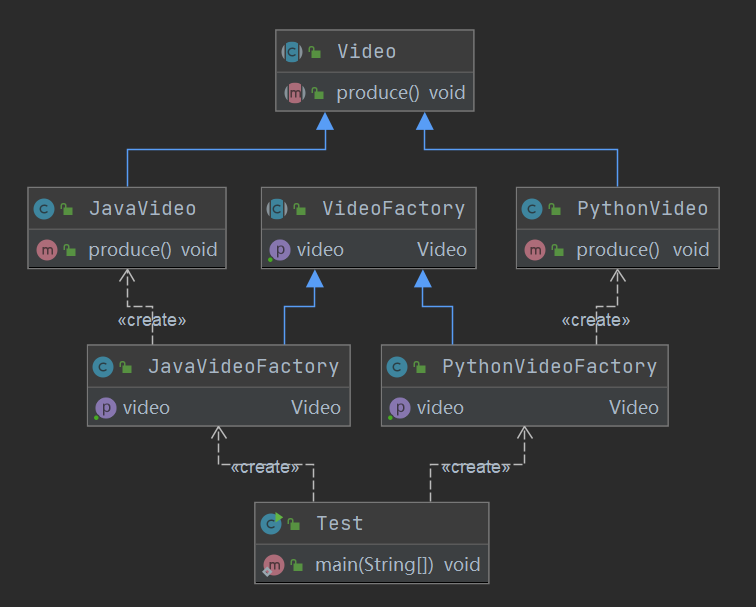

# 创建型模式

创建型模式的主要关注点是“怎样创建对象”，它的主要特点是“将对象的创建与使用分离”。这样可以降低系统的耦合度，使用者不需要关注对象的创建细节，对象的创建由相关的工厂来完成。就像我们去商场购买商品时，不需要知道商品是怎么生产出来一样，因为它们由专门的厂商生产。

创建型模式分为以下几种。

- 单例（Singleton）模式：某个类只能生成一个实例，该类提供了一个全局访问点供外部获取该实例，其拓展是有限多例模式。
- 原型（Prototype）模式：将一个对象作为原型，通过对其进行复制而克隆出多个和原型类似的新实例。
- 工厂方法（FactoryMethod）模式：定义一个用于创建产品的接口，由子类决定生产什么产品。
- 抽象工厂（AbstractFactory）模式：提供一个创建产品族的接口，其每个子类可以生产一系列相关的产品。
- 建造者（Builder）模式：将一个复杂对象分解成多个相对简单的部分，然后根据不同需要分别创建它们，最后构建成该复杂对象。


以上 5 种创建型模式，除了工厂方法模式属于类创建型模式，其他的全部属于对象创建型模式。


## 简单工厂模式

### 简单工厂模式概述

简单工厂模式不在 GoF 23 种设计模式之列。

**简单工厂把实例化的操作单独放到一个类中，这个类就成为简单工厂类，让简单工厂对象来决定创建出哪一类产品的实例。**很多情况下，是父类作为简单工厂，根据传入参数的不同创建不同的子类对象。

**目的：在创建一个对象时不向客户暴露内部细节，并提供一个创建对象的通用接口。**

客户类往往有多个，如果不使用简单工厂，那么所有的客户类都要知道所有产品的细节。而且一旦这些产品发生改变，例如增加产品/修改创建产品的判断逻辑，那么所有的客户类都要进行修改。

**适用场景：**

- 客户端（应用层）只知道传入工厂的参数，对于如何创建对象（逻辑）不关心。
- **产品种类相对较少的情况**

**优点：**

- 只需要传入一个正确的参数，就可以获取所需要的对象，无需知道其创建细节。 
- 客户端可以免除直接创建产品对象的职责，很方便的创建出相应的产品。工厂和产品的职责区分明确。

**缺点：**

- 增加新的产品需要修改工厂类的逻辑判断，**违背开闭原则。**
- 使用简单工厂模式会增加系统中类的个数（引入新的工厂类），增加系统的复杂度和理解难度。
- 简单工厂模式使用了 static 工厂方法，造成工厂角色无法形成基于继承的等级结构。


### Coding实例

一般常见于这种`if else`或者`switch`结构，根据传入的不同参数返回不同的生成的对象。

```java
public class VideoFactory {
	public Video getVideo(String type) {
        if ("java".equalsIgnoreCase(type)) {
            return new JavaVideo();
        } else if ("python".equalsIgnoreCase(type)) {
            return new PythonVideo();
        }
        return null;
    }
}
public abstract class Video {
    public abstract void produce();
}
public class JavaVideo extends Video {
    @Override
    public void produce() {
        System.out.println("录制Java课程视频");
    }
}
public class PythonVideo extends Video {
    @Override
    public void produce() {
        System.out.println("录制Python课程视频");
    }
}
```

对于没有继承重写需求的Factory，一般把创建写成静态方法，不需要创建factory对象直接就可以调用工厂方法。


还有一种写法，传入参数为clazz，类似于JDBC的加载驱动，用Class.forName()方法。

```java
public class VideoFactory {
	public Video getVideo(Class c) {
        Video video = null;
        try {
            video = (Video) Class.forName(c.getName()).newInstance();
        } catch (InstantiationException e) {
            e.printStackTrace();
        } catch (IllegalAccessException e) {
            e.printStackTrace();
        } catch (ClassNotFoundException e) {
            e.printStackTrace();
        }
        return video;
    }
}

public class Test {
    public static void main(String[] args) {
        VideoFactory videoFactory = new VideoFactory();
        Video video = videoFactory.getVideo(JavaVideo.class);
        if (video == null) {
            return;
        }
        video.produce();
    }
}
```

**这种方法在一定程度上满足开闭原则，**如果新增课程Video类，不需要修改简单工厂的创建代码，传新的类对象就可以了。


### 简单工厂模式在JDK中的应用

`java.util.Calendar`类创建Calendar时，使用了简单工厂模式。



static createCalendar方法根据传入的参数，返回不同的Calendar对象。只不过与我们的例子相比，这个创建方法的判断逻辑更复杂（所以更不应该放在应用层！）。

```java
	private static Calendar createCalendar(TimeZone zone,
                                           Locale aLocale){
        CalendarProvider provider =
            LocaleProviderAdapter.getAdapter(CalendarProvider.class, aLocale)
                                 .getCalendarProvider();
        if (provider != null) {
            try {
                return provider.getInstance(zone, aLocale);
            } catch (IllegalArgumentException iae) {
                // fall back to the default instantiation
            }
        }

        Calendar cal = null;

        if (aLocale.hasExtensions()) {
            String caltype = aLocale.getUnicodeLocaleType("ca");
            if (caltype != null) {
                switch (caltype) {
                case "buddhist":
                cal = new BuddhistCalendar(zone, aLocale);
                    break;
                case "japanese":
                    cal = new JapaneseImperialCalendar(zone, aLocale);
                    break;
                case "gregory":
                    cal = new GregorianCalendar(zone, aLocale);
                    break;
                }
            }
        }
        if (cal == null) {
            // If no known calendar type is explicitly specified,
            // perform the traditional way to create a Calendar:
            // create a BuddhistCalendar for th_TH locale,
            // a JapaneseImperialCalendar for ja_JP_JP locale, or
            // a GregorianCalendar for any other locales.
            // NOTE: The language, country and variant strings are interned.
            if (aLocale.getLanguage() == "th" && aLocale.getCountry() == "TH") {
                cal = new BuddhistCalendar(zone, aLocale);
            } else if (aLocale.getVariant() == "JP" && aLocale.getLanguage() == "ja"
                       && aLocale.getCountry() == "JP") {
                cal = new JapaneseImperialCalendar(zone, aLocale);
            } else {
                cal = new GregorianCalendar(zone, aLocale);
            }
        }
        return cal;
    }
```


## 工厂方法模式

### 概述

> 工厂方法模式是对简单工厂模式的进一步抽象化，其好处是可以使系统在不修改原来代码的情况下引进新的产品，即**满足开闭原则。**

**定义了一个创建对象的接口，但由实现这个接口的类决定要实例化哪个类。工厂方法把类的实例化操作推迟到子类中进行。**

**核心：工厂+方法 工厂接口中的一个方法**

**应用场景：**

- 客户端（应用层）只知道创建产品的工厂名，而不知道具体的产品名。**如 TCL 电视工厂、海信电视工厂等。**
- 创建对象的任务由多个具体子工厂中的某一个完成，而抽象工厂只提供创建产品的接口。
- 客户不关心产品如何创建，实现等细节，只关心产品的品牌。

**优点：**

- 用户只需要关心所需产品对应的具体工厂的名称，无须知道产品的具体创建过程。
- **拓展性强，对于新产品的创建，满足开闭原则，只需多写一个相应的工厂类。**
- 典型的解耦框架。高层模块只需要知道产品的抽象类，无须关心其他实现类，满足迪米特法则、依赖倒置原则和里氏替换原则。

**缺点：**

- 类的个数容易过多，增加复杂度。
- 增加了系统的抽象性和理解难度。
- 抽象产品只能生产一种产品，此弊端可使用抽象工厂模式解决。


### Coding实例



```java
//将简单工厂模中的VideoFactory改成抽象类或接口
public abstract class VideoFactory {
    public abstract Video getVideo();
}

//由子类去实现VideoFactory，由具体的工厂子类创建对象。
public class JavaVideoFactory extends VideoFactory {
    @Override
    public Video getVideo() {
        return new JavaVideo();
    }
}
public class PythonVideoFactory extends VideoFactory {
    @Override
    public Video getVideo() {
        return new PythonVideo();
    }
}
//抽象产品
public abstract class Video {
    public abstract void produce();
}
//实际生产出来的产品JavaVideo
public class JavaVideo extends Video {
    @Override
    public void produce() {
        System.out.println("录制Java课程视频");
    }
}
//实际生产出来的产品PythonVideo
public class PythonVideo extends Video {
    @Override
    public void produce() {
        System.out.println("录制Python课程视频");
    }
}
```

这样如果再要增加一个新的课程类，只需要添加一个新的工厂子类。比如要添加Golang课程，只需要添加一个GolangVideoFactory extends VideoFactory。

### 工厂方法模式在JDK中的应用

#### 1. URLStreamHandlerFactory

```java
//工厂 URLStreamHandlerFactory主要用于解决URL协议扩展
public interface URLStreamHandlerFactory {
    //工厂方法 具体的实现交给子类：Launcher中的内部类Factory实现
	URLStreamHandler createURLStreamHandler(String protocol);
}


public class Launcher {
     ...
     //工厂的子类去实现工厂方法，创建对象 
     private static class Factory implements URLStreamHandlerFactory {
        private static String PREFIX = "sun.net.www.protocol";

        private Factory() {
        }

        public URLStreamHandler createURLStreamHandler(String var1) {
            String var2 = PREFIX + "." + var1 + ".Handler";

            try {
                //这里用了Class.forName的方式创建对象，在简单工厂模式中介绍过，
                //应用层传入clazz对象来创建具体的实现类。
                Class var3 = Class.forName(var2);
                return (URLStreamHandler)var3.newInstance();
            } catch (ReflectiveOperationException var4) {
                throw new InternalError("could not load " + var1 + "system protocol handler", var4);
            }
        }
    }   
}

//抽象产品，有很多的产品比如http协议的、ftp协议的等等。 相当于上例中的Video
public abstract class URLStreamHandler {...}
 
//具体的产品 http包下的Handler
package sun.net.www.protocol.http;
public class Handler extends URLStreamHandler {...}

//具体的产品 ftp包下的Handler
package sun.net.www.protocol.ftp;
public class Handler extends URLStreamHandler {...}
```

#### 2. Collection中的iterator();

Collection中的`iterator();`是一个工厂方法，Collection相当于上例中的VideoFactory，ArrayList相当于具体的实现工厂JavaVideoFactory，抽象产品是Iterator相当于Vedio抽象类，实际生产出的具体产品是ArrayList当中的内部类Itr的对象相当于JavaVideo。

```java
//Collection相当于上例中的VideoFactory
public interface Collection<E> extends Iterable<E> {
    ....
    //这是一个工厂方法 工厂方法可以理解为作为工厂中的方法    
	Iterator<E> iterator();
    ....
}

//抽象产品
public interface Iterator<E> {
    boolean hasNext();
    E next();
    default void remove() {...}
	default void forEachRemaining(Consumer<? super E> action) {...}
}

//ArrayList相当于具体的实现工厂
public class ArrayList<E> extends AbstractList<E>
        implements List<E>, RandomAccess, Cloneable, java.io.Serializable{
    //生产出的产品
	public Iterator<E> iterator() {
        return new Itr();
    }
    private class Itr implements Iterator<E> {
        ...
        public boolean hasNext() {
            return cursor != size;
        }
        public E next() {
            ...
        }
		...
    }
}
```


## 抽象工厂模式

