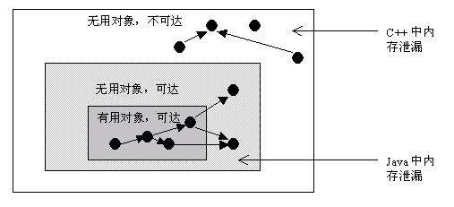

## 内存泄漏

在Java中，内存泄漏就是存在一些被分配的对象，这些对象有下面两个特点，**首先，这些对象是可达的，即在有向图中，存在通路可以与其相连；其次，这些对象是无用的，即程序以后不会再使用这些对象。**如果对象满足这两个条件，这些对象就可以判定为Java中的内存泄漏，**这些对象不会被GC所回收，然而它却占用内存。**

在C++中，内存泄漏的范围更大一些。有些对象被分配了内存空间，然后却不可达，由于C++中没有GC，这些内存将永远收不回来。在Java中，这些不可达的对象都由GC负责回收，因此程序员不需要考虑这部分的内存泄露。

通过分析，我们得知，对于C++，程序员需要自己管理边和顶点，而对于Java程序员只需要管理边就可以了(不需要管理顶点的释放)。通过这种方式，Java提高了编程的效率。



因此，通过以上分析，我们知道在Java中也有内存泄漏，但范围比C++要小一些。因为Java从语言上保证，任何对象都是可达的，所有的不可达对象都由GC管理。

### 内存泄漏和内存溢出的区别

内存泄漏memory leak：是指程序在申请内存后，无法释放已申请的内存空间，一次内存泄漏似乎不会有大的影响，但内存泄漏堆积后的后果就是内存溢出。

内存溢出 out of memory：指程序申请内存时，没有足够的内存供申请者使用，或者说，给了你一块存储int类型数据的存储空间，但是你却存储long类型的数据，那么结果就是内存不够用，此时就会报错OOM,即所谓的内存溢出。

**二者的关系：内存泄漏的堆积最终会导致内存溢出**

内存溢出就是你要的内存空间超过了系统实际分配给你的空间，此时系统相当于没法满足你的需求，就会报内存溢出的错误。


**常见内存溢出的原因及解决方法：**

内存溢出原因：
1.内存中加载的数据量过于庞大，如一次从数据库取出过多数据；
2.集合类中有对对象的引用，使用完后未清空，使得JVM不能回收；
3.代码中存在死循环或循环产生过多重复的对象实体；
4.使用的第三方软件中的BUG；
5.启动参数内存值设定的过小

**内存溢出的解决方案：**

第一步，修改JVM启动参数，直接增加内存。(-Xms，-Xmx参数一定不要忘记加。)

第二步，检查错误日志，查看“OutOfMemory”错误前是否有其 它异常或错误。

第三步，对代码进行走查和分析，找出可能发生内存溢出的位置。

重点排查以下几点：
1.检查对数据库查询中，是否有一次获得全部数据的查询。一般来说，如果一次取十万条记录到内存，就可能引起内存溢出。这个问题比较隐蔽，在上线前，数据库中数据较少，不容易出问题，上线后，数据库中数据多了，一次查询就有可能引起内存溢出。因此对于数据库查询尽量采用分页的方式查询。

2.检查代码中是否有死循环或递归调用。

3.检查是否有大循环重复产生新对象实体。

4.检查对数据库查询中，是否有一次获得全部数据的查询。一般来说，如果一次取十万条记录到内存，就可能引起内存溢出。这个问题比较隐蔽，在上线前，数据库中数据较少，不容易出问题，上线后，数据库中数据多了，一次查询就有可能引起内存溢出。因此对于数据库查询尽量采用分页的方式查询。

5.检查List、MAP等集合对象是否有使用完后，未清除的问题。List、MAP等集合对象会始终存有对对象的引用，使得这些对象不能被GC回收。

第四步，使用内存查看工具动态查看内存使用情况


### 有哪些常见的内存泄漏

#### 1、静态变量

静态变量存储在方法区，它的生命周期从类加载开始，到整个进程结束，拥有与整个应用程序相匹配的生命周期。一旦静态变量初始化之后，它所持有的引用只有等到进程结束才会释放。

静态字段通常在开发中一个特别常用的静态字段修饰的是单例对象！！

```java
public class Singleton {
    //禁止 JVM 的指令重排，防止对象还未初始化就被获取到
    private volatile static Singleton uniqueInstance;
    private Singleton() {
    }
    public static Singleton getUniqueInstance() {
        //避免 uniqueInstance 已经被实例化之后的加锁操作
        if (uniqueInstance == null) {
            synchronized (Singleton.class) {
                //防止多个线程同时进入if，一个获取到锁，释放后另一个获取后又创建对象。
                if (uniqueInstance == null) {
                    uniqueInstance = new Singleton();
                }
            }
        }
        return uniqueInstance;
    }
}
```

解决办法：最大限度的减少静态变量的使用；单例模式时，依赖于延迟加载对象而不是立即加载方式。

#### 2、非静态内部类

非静态内部类（包括匿名内部类）默认持有外部类的隐式引用。如果我们在应用程序中使用这个内部类对象，那么即使在我们的外部对象超出作用范围后，它也不会被垃圾收集。

**解决办法：如果内部类不需要访问包含的类成员，考虑转换为静态类。**

#### 3、未关闭的资源导致内存泄露

每当创建连接或者打开流时，JVM都会为这些资源分配内存。如果没有关闭连接，会导致持续占有内存。在任意情况下，资源留下的开放连接都会消耗内存，如果我们不处理，就会降低性能，甚至OOM。

解决办法：使用finally块关闭资源；关闭资源的代码，不应该有异常；jdk1.7后，可以使用try-with-resource块。

#### 4、不正确的equals()和hashCode()

在HashMap和HashSet这种集合中，常常用到equal()和hashCode()来比较对象，如果重写不合理，将会成为潜在的内存泄露问题。

举例：由于Hash没写好，当集合里面的对象属性被修改后，hashcode发生变化，再调用remove()方法时不起作用。

```java
public static void main(String[] args) {
    Set<Person> set = new HashSet<Person>();
    Person p1 = new Person("唐僧","pwd1",25);
    Person p2 = new Person("孙悟空","pwd2",26);
    Person p3 = new Person("猪八戒","pwd3",27);
    set.add(p1);
    set.add(p2);
    set.add(p3);
    System.out.println("总共有:"+set.size()+" 个元素!"); //结果：总共有:3 个元素!
    p3.setAge(2); //修改p3的年龄,此时p3元素对应的hashcode值发生改变
    set.remove(p3); //此时remove不掉，造成内存泄漏
    set.add(p3); //重新添加，居然添加成功
    System.out.println("总共有:"+set.size()+" 个元素!"); //结果：总共有:4 个元素!
    for (Person person : set){
        System.out.println(person);
    }
}
```

解决办法：用最佳的方式重写equals()和hashCode。

#### 5、finalize()方法造成的内存泄露

重写finalize()方法时，该类的对象不会立即被垃圾收集器收集，如果finalize()方法的代码有问题，那么会潜在的引发OOM；

解决办法：避免重写finalize()。

#### 6、常量字符串造成的内存泄露

如果我们读取一个很大的String对象，并调用了intern(），那么它将放到字符串池中，位于PermGen中，只要应用程序运行，该字符串就会保留，这就会占用内存，可能造成OOM。

解决办法：增加PermGen的大小，-XX:MaxPermSize=512m；升级Java版本，JDK1.7后字符串池转移到了堆中。

#### 7、使用ThreadLocal造成内存泄露

https://zhuanlan.zhihu.com/p/102571059

ThreadLocalMap 中使用的 key 为 ThreadLocal 的弱引用，而 value 是强引用。**所以，如果 ThreadLocal 没有被外部强引用的情况下**，在垃圾回收的时候，key 会被GC回收，而 value 不会被回收。

而现在线程的创建都是使用线程池，线程池有线程重用的功能，因此线程就不会被垃圾回收器回收。所以使用到ThreadLocals来保留线程池中线程的变量副本时，ThreadLocals没有显示的删除时，就会一直保留在内存中，不会被垃圾回收。

##### 既然如此，为什么key用使用弱引用呢？

若threadLocalMap的key为强引用，回收ThreadLocal时，因为**ThreadLocalMap还持有ThreadLocal的强引用**，如果没有手动删除，ThreadLocal不会被回收，导致Entry内存泄漏。

若ThreadLocalMap的key为弱引用，回收ThreadLocal时，由于ThreadLocalMap持有ThreadLocal的弱引用，即使没有手动删除，ThreadLocal也会被回收。当key为null，在下一次ThreadLocalMap调用set()，get()，remove()方法的时候会被清除value值。

因此，ThreadLocal内存泄漏的根源是：**由于ThreadLocalMap的生命周期跟Thread一样长，如果没有手动删除对应key就会导致内存泄漏，而不是因为弱引用。**

**解决办法：不再使用ThreadLocal时，调用remove()方法，该方法删除了此变量的当前线程值。**不要使用ThreadLocal.set(null)，它只是查找与当前线程关联的Map并将键值对设置为当前线程为null。

### 如何排查内存泄漏

https://blog.csdn.net/fishinhouse/article/details/80781673

可以使用Java VisualVM工具检测JVM内存。https://www.cnblogs.com/liululee/p/11056779.html


## Java常用性能优化命令

top -H 查看整个机器CPU使用率，内存使用率

top -Hp pid 查看某个进程下的线程CPU使用率，内存使用率

```sh
#5表示每5秒采集一次服务器状态，10表示 采集10次
vmstat 5 10
```

`jstack pid` 查看线程的堆栈信息，排除死锁。

执行 `printf '%x' 32826` 获取16进制的线程id，用于`dump`信息查询，结果为 `803a`。最后我们执行`jstack 32805 |grep -A 20 803a `来查看下详细的`dump`信息，能分析出CPU占满的原因。

**`jstat -gc pid`** 命令查看程序的GC情况，来发现是不是有内存泄漏问题-很多次 Full Gc都清除不掉。

```sh
java -jar -Xms500m -Xmx500m -XX:+HeapDumpOnOutOfMemoryError -XX:HeapDumpPath=/tmp/heapdump.hprof  -XX:+PrintGCTimeStamps -XX:+PrintGCDetails -Xloggc:/tmp/heaplog.log analysis-demo-0.0.1-SNAPSHOT.jar
```

保存dump文件之后，用MAT工具分析，可以可视化相关信息，分析内存泄漏。

vmstat是一个指定周期和采集次数的虚拟内存检测工具，可以统计内存，CPU，swap的使用情况，它还有一个重要的常用功能，**用来观察进程的上下文切换。**


## GC优化实例

## Spring生命周期

## Spring循环依赖

## 如何保证高可用

## 异步非阻塞I/O了解吗？设计一个如何实现，操作系统用户态和内核态怎么做的。

## JWT

https://zhuanlan.zhihu.com/p/86937325


## rocketmq原理


## springcloud体系