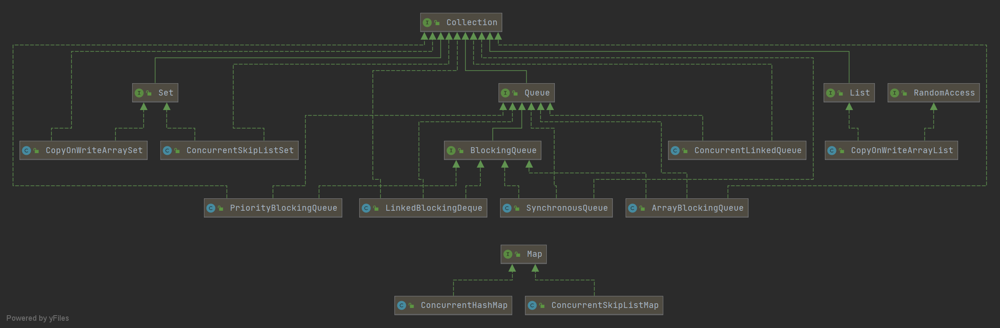

# Java

## Collection

### HashMap

**重写 `equals` 时必须重写 `hashCode` 方法？**

**保证如果两个对象相等，则 hashcode 一定也是相同的。这是规定。**否则当把这个对象放入`HashMap`，有可能添加重复key。


当两个不同的键对象的hashcode相同时，它们会储存在同一个bucket位置的链表中。键对象的equals()方法用来找到键值对。

**创建HashMap对象默认情况下，数组大小为16。**

开始扩容的大小=原来的数组大小*loadFactor   16*0.75=12 超过12个元素，进行扩容

扩容是一个非常消耗性能的操作，所以如果我们已经预知HashMap中元素的个数，那么预设元素的个数能够有效的提高HashMap的性能

扩容后大小是原来的2倍，其中加载因子loadFactor的默认值为0.75，这个参数可以再创建对象时在构造方法中指定。

**转换为红黑树的条件：链表的长度达到8个或数组的长度达到64个**


## 多线程

### JUC中的容器



#### ConcurrentHashMap 🔥

线程安全的HashMap

JDK1.7  分段的数组+链表。JDK1.8之后，数组+链表/红黑二叉树，与HashMap1.8相同。

实现：从不同段没有竞争到不hash冲突就没有锁竞争。JDK1.7 分段锁，Segment 实现了 `ReentrantLock`。JDK1.8 并发控制使用 `synchronized` 和 CAS 来操作，`synchronized` 只锁定当前链表或红黑二叉树的首节点。   

1.8之后底层原理：

- get方法无锁实现，原因：Node的value，next都用volatile修饰。table[]也用volatile修饰，保证了修改的可见性。 
- put方法，先读tabAt，若bucket为空，for循环+CAS。若不为空，如果正在扩容，当前线程帮助一起扩容。如果没有扩容，用synchronized锁，锁的粒度是结点锁，锁住这个bucket的操作。其余bucket可以并发执行。
- remove方法，先读tabAt，若bucket为空退出for循环。若不为空，如果正在扩容，当前线程帮助一起扩容。如果没有扩容，用synchronized锁，锁的粒度是结点锁，锁住这个bucket的操作。其余bucket可以并发执行。

读读互不影响，写写互斥。读写也不互斥，不过在某些情况下读取是弱一致性的，如线程A调用putAll写入大量数据，期间线程B调用get，则只能get到目前为止已经顺利插入的部分数据。这也是为什么ConcurrentHashMap不能完全替代HashTable。

#### CopyOnWriteArrayList/CopyOnWriteArraySet

线程安全的ArrayList/Set

`CopyOnWriteArrayList` 支持读写分离，读取是快照读，与MVCC原理一样，完全不用加锁。写入操作不会修改原数组，而是拷贝一个数组，对副本进行修改，写完之后再将内部维护的数组指向新的数组。因此读写互不影响，只有写写才会互斥。适合于多读，少写场景（不断创建副本/写操作要加锁），小对象场景。

缺点：大对象内存占用严重。读操作与使用迭代器是弱一致性的，读不到新写入的数据。

`CopyOnWriteArraySet`底层使用`CopyOnWriteArrayList` ，性质相同。

#### ConcurrentLinkedQueue

线程安全的LinkedList，线程安全的非阻塞队列。

线程安全的队列分为阻塞队列和非阻塞队列，阻塞队列通过加锁来实现，非阻塞队列通过 CAS 操作实现。`ConcurrentLinkedQueue` 用CAS+volatile实现了非阻塞的链表队列，适用于高并发追求高性能的场景。与阻塞队列相比的优缺点和CAS与锁的优缺点分析一样。

`ConcurrentLinkedDeque`与它类似，是线程安全的 `Deque`。

#### BlockingQueue

常用的三个实现类：`ArrayBlockingQueue`、`LinkedBlockingQueue`、`PriorityBlockingQueue`。都使用`ReentrantLock`。

`ArrayBlockingQueue`有界，采用经典的双Condition实现，默认非公平，可选择公平锁。

`LinkedBlockingQueue`单向链表，默认无界，初始化可以指定边界，不支持公平锁。

`PriorityBlockingQueue`无界，可以指定初始化大小，但会动态扩容。要么是Comparable的，要么传入Comparator。

还有一种：`SynchronousQueue`，在`CachedThreadPool`会用到。虽说是队列，但不会为队列中元素维护存储空间。是同步队列，读线程和写线程需要同步，一个读线程匹配一个写线程。数据必须从某个写线程交给某个读线程，而不是写到某个队列中等待被消费。

#### ConcurrentSkipListMap

依靠CAS实现线程安全，底层是跳表结构，用空间换时间。有序场景下比CurrentHashMap效率高。


# 设计模式

## 七大设计原则

[链接](./docs/system-design/设计模式/设计原则.md)

| **设计原则**     | **一句话归纳**                                               | **目的**                                       |
| ---------------- | ------------------------------------------------------------ | ---------------------------------------------- |
| **开闭原则**     | **对扩展开放，对修改关闭**                                   | **降低维护带来的新风险**                       |
| **依赖倒置原则** | **高层不应该依赖低层，要面向接口编程**                       | **更利于代码结构的升级扩展**                   |
| **单一职责原则** | **一个类只干一件事，实现类要单一**                           | **便于理解，提高代码的可读性**                 |
| **接口隔离原则** | **一个接口只干一件事，接口要精简单一**                       | **功能解耦，高聚合、低耦合**                   |
| **迪米特法则**   | **不该知道的不要知道，一个类应该保持对其它对象最少的了解，降低耦合度** | **只和朋友交流，不和陌生人说话，减少代码臃肿** |
| **里氏替换原则** | **不要破坏继承体系，子类重写方法功能发生改变，不应该影响父类方法的含义** | **防止继承泛滥**                               |
| **合成复用原则** | **尽量使用组合或者聚合关系实现代码复用，少使用继承**         | **降低代码耦合**                               |

## 结构型设计模式

### 代理模式 🔥

**核心：使用代理对象来代替对真实对象(real object)的访问，这样就可以在不修改原目标对象的前提下，扩展目标对象的功能。**

#### 静态代理和动态代理的对比

1. **灵活性** ：动态代理更加灵活，不需要必须实现接口，可以直接代理实现类，并且可以不需要针对每个目标类都创建一个代理类。另外，静态代理中，接口一旦新增加方法，目标对象和代理对象都要进行修改，这是非常麻烦的！
2. **JVM 层面** ：静态代理在编译时就将接口、实现类、代理类这些都变成了一个个实际的 class 文件。而动态代理是在运行时动态生成类字节码，并加载到 JVM 中的。

#### 静态代理

代理对象和目标对象共同实现一个抽象接口，客户通过代理对象来访问目标对象的方法，代理对象控制访问，并且做增强。相当于在目标对象上面包了一层，做一些公共的事情，并且控制对目标对象的访问。

**静态代理中，我们对目标对象的每个方法的增强都是手动完成的，非常不灵活（_比如接口一旦新增加方法，目标对象和代理对象都要进行修改_）且麻烦(_需要对每个目标类都单独写一个代理类_)。**

#### 动态代理——AOP的核心！

**推荐阅读：[知乎-动态代理的作用是什么](https://www.zhihu.com/question/20794107/answer/23330381)**

**通过反射，在代码运行期间动态生成代理类，代理的是接口，一个动态代理可以代理很多类！为所有目标类提供一些通用的增强方法，比如插入日志-AOP。**

##### JDK 动态代理和 CGLIB 动态代理对比

1. **一个基于接口实现，一个基于类的继承实现** 

   JDK动态代理只能对实现了接口的类生成代理，而不能针对类。

   CGLIB是针对类实现代理，主要是对指定的类生成一个子类，覆盖其中的方法。因此对于final类或方法，是无法继承的。

2. **JDK效率更高**

   JDK 和 CGLib 都是在运行期生成字节码，JDK 是直接写 Class 字节码，CGLib 使用 ASM 框架写 Class 字节码，Cglib 代理实现更复杂，生成代理类比 JDK 效率低。每一次jdk版本升级，jdk代理效率都得到提升，而CGLIB代理消息确有点跟不上步伐。

**Spring 中的 AOP 模块中：如果目标对象实现了接口，则默认采用 JDK 动态代理，否则采用 CGLIB 动态代理。**

##### JDK动态代理

**在 Java 动态代理机制中 `InvocationHandler` 接口和 `Proxy` 类是核心。**都在`java.lang.reflect`包下面。

步骤一：定义一个接口及其实现类；也就是被代理对象。

步骤二：自定义 `InvocationHandler` 并重写`invoke`方法，在 `invoke` 方法中我们会调用原生方法（被代理类的方法）并自定义一些处理逻辑；

实现`InvocationHandler` 来自定义处理逻辑。 当我们的动态代理对象调用一个方法时候，这个方法的调用就会被转发到实现`InvocationHandler` 接口类的 `invoke` 方法来调用。

```java
public interface InvocationHandler {
    //当你使用代理对象调用方法的时候实际会调用到这个方法
    public Object invoke(Object proxy, Method method, Object[] args) throws Throwable;
}
```

`invoke()` 方法有下面三个参数：

1. **proxy** :动态生成的代理类
2. **method** : 与代理类对象调用的方法相对应
3. **args** : 当前 method 方法的参数

也就是说：**你通过`Proxy` 类的 `newProxyInstance()` 创建的代理对象在调用方法的时候，实际会调用到实现`InvocationHandler` 接口的类的 `invoke()`方法。**在invoke方法中调用代理对象的同名方法，并且做一些增强：比如在方法执行前后做什么事情。

步骤三：通过 `Proxy.newProxyInstance(ClassLoader loader,Class<?>[] interfaces,InvocationHandler h)` 方法创建代理对象；

`Proxy` 类中使用频率最高的方法是：`newProxyInstance()` ，这个方法主要用来生成一个代理对象。传入目标对象的Classloader，接口，代理对象的`InvocationHandler`，就可以动态生成代理对象。

```java
public static Object newProxyInstance(ClassLoader loader,
                                      Class<?>[] interfaces,
                                      InvocationHandler h)
    throws IllegalArgumentException
```

这个方法一共有 3 个参数：

1. **loader** :类加载器，用于加载代理对象。
2. **interfaces** : 被代理类实现的一些接口；
3. **h** : 实现了 `InvocationHandler` 接口的对象；

**动态生成代理类过程**

复制传入的接口，通过接口和类加载器，直接拼接生成字节数组class文件，然后调用native方法defineclass生成clazz对象，创建出了代理的类clazz。然后通过反射获取到代理类clazz的构造函数，通过这个构造函数new一个代理对象，构造函数的参数是InvocationHandler。当代理对象的方法被调用时，会调用InvocationHandler的invoke方法，调用目标对象的方法，并实现增强。

**举例：**

一般会把步骤二和步骤三写到一起：

```java
public class ProxyInvocationHandler implements InvocationHandler {
   private Object target;

   public void setTarget(Object target) {
       this.target = target;
  }

   //生成代理类
   public Object getProxy(){
       return Proxy.newProxyInstance(this.getClass().getClassLoader(),
               target.getClass().getInterfaces(),this);
  }

   // proxy : 代理类
   // method : 代理类的调用处理程序的方法对象.
   public Object invoke(Object proxy, Method method, Object[] args) throws Throwable {
       log(method.getName());
       Object result = method.invoke(target, args);
       return result;
  }

   public void log(String methodName){
       System.out.println("执行了"+methodName+"方法");
  }
}
```

```java
public class Test {
   public static void main(String[] args) {
       //真实对象
       UserServiceImpl userService = new UserServiceImpl();
       //代理对象的调用处理程序
       ProxyInvocationHandler pih = new ProxyInvocationHandler();
       //设置要代理的对象 可以是任意对象！！
       pih.setTarget(userService);
       UserService proxy = (UserService)pih.getProxy(); //动态生成代理类！
       //可以换成接口中的任意方法！！！
       proxy.delete();  
  }
}
```

##### CGLIB 动态代理

**在 CGLIB 动态代理机制中 `MethodInterceptor` 接口和 `Enhancer` 类是核心。**

通过 `Enhancer`类来动态获取被代理类，当代理类调用方法的时候，实际调用的是 `MethodInterceptor` 中的 `intercept` 方法。

步骤一：自定义 `MethodInterceptor` 并重写 `intercept` 方法，`intercept` 用于拦截增强被代理类的方法，和 JDK 动态代理中的 `invoke` 方法类似；

```java
public interface MethodInterceptor extends Callback{
    // 拦截被代理类中的方法
    public Object intercept(Object obj, java.lang.reflect.Method method, Object[] 	
                            args,MethodProxy proxy) throws Throwable;
}
```

1. **obj** :目标对象（需要增强的对象）
2. **method** :被拦截的方法（需要增强的方法）
3. **args** :方法入参
4. **methodProxy** :用于调用原始方法

步骤二：通过 `Enhancer` 类的`setSuperclass`设置目标对象，`setCallback`传入`MethodInterceptor` 设置回调对象，然后 `create()`创建代理对象；

```java
net.sf.cglib.proxy.Enhancer;
Enhancer enhancer = new Enhancer();
// 设置enhancer对象的父类  也就是被代理的对象
enhancer.setSuperclass(HelloService.class);
// 设置enhancer的回调对象
enhancer.setCallback(new MyMethodInterceptor());
//创建代理对象！
HelloService proxy= (HelloService)enhancer.create();
```


# SSM框架

## MyBatis

**ResultMap 结果映射——解决属性名和字段名不一致的问题**

```xml
<!-- mybatis-config.xml 中 -->
<typeAlias type="com.mkx.pojo.User" alias="User"/>

<!--结果集映射 把UserMap映射为User——映射的关系 -->
<resultMap id="UserMap" type="User">
    <!--column数据库中的字段，property实体类中的属性-->
    <result column="id" property="id"/>
    <result column="name" property="name"/>
    <result column="pwd" property="password"/>
</resultMap>

			<!--这里去掉了resultType属性，用了resultMap之后不需要了-->
<select id="getUserById" resultMap="UserMap">
    select * from mybatis.user where id = #{id}
</select>
```


# Git

```sh
#移除文件的追踪
git rm --cached file名 #把文件从版本库里移除   -r folder名
vim .gitignore #然后把文件添加到gitignore中，再次commit，push的时候就没有了
```


# tips

- 写程序应该80%的时间在思考，20%的时间敲代码。不应该反过来